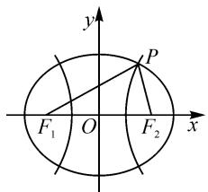
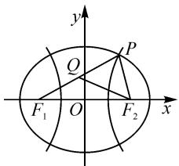

# 一道解析几何陈题的探究与反思

# ● 浙江省湖州市南浔区教育教学研究中心、南浔高级中学 范宗标

摘要:对一道解析几何陈题进行探究教学,发现了多种不同的解题思路,最后揭示了问题的一般背景.从这个案例中获得反思,即教学应该“慢”“细”“活”.

关键词: 陈题; 探究; 反思; 慢教学

# 1 陈题重现

(2014年湖北高考理科卷第9题)已知 $F_{1}, F_{2}$ 是椭圆和双曲线的公共焦点，P是它们的一个公共点，且 $\angle F_{1}PF_{2}=\frac{\pi}{3}$ ，则椭圆和双曲线的离心率的倒数之和的最大值为().

A. $\frac{4\sqrt{3}}{3}$ B. $\frac{4\sqrt{3}}{3}$ C.3 D.2

最近和学生一起对这道陈题进行了讨论,得到了很多意想不到的结果,现整理成文与同行分享,并谈点反思.

# 2 探究过程

# 2.1 解法

分析:如图1所示,建系,并设椭圆方程为 $\frac{x^{2}}{a_{1}^{2}}+\frac{y^{2}}{b_{1}^{2}}=1(a_{1}>b_{1}>0)$ ,双曲线方程为 $\frac{x^{2}}{a_{2}^{2}}-\frac{y^{2}}{b_{2}^{2}}=1(a_{2}>b_{2}>0)$ ,由于椭圆和双曲线的焦点相同,故可记 $c_{1}=c_{2}=c$ .由两曲线的对称性,不妨设点 P 在第一象限,并设 $\left|PF_{1}\right|=r_{1},\left|PF_{2}\right|=r_{2}$ , 根据两曲线的定义可得 $\left\{\begin{aligned}r_{1}+r_{2}&=2a_{1},\\ r_{1}-r_{2}&=2a_{2}\end{aligned}\right.$ 解得 $\left\{\begin{aligned}r_{1}&=a_{1}+a_{2},\\ r_{2}&=a_{1}-a_{2}.\end{aligned}\right.$ 再来看目标, 即求 $\frac{1}{e_{1}}+\frac{1}{e_{2}}=\frac{a_{1}+a_{2}}{c}=\frac{r_{1}}{c}$ 的最大值.

text_image

y
P
F₁ O F₂ x

图1

解法 1: 用余弦定理.

由余弦定理，得

$$
4 c ^ {2} = r _ {1} ^ {2} + r _ {2} ^ {2} - r _ {1} r _ {2}. \tag {①}
$$

两边同时除以 $r_{1}^{2}$ ，得

$$
\frac {4 c ^ {2}}{r _ {1} ^ {2}} = 1 + \left(\frac {r _ {2}}{r _ {1}}\right) ^ {2} - \frac {r _ {2}}{r _ {1}} = \left(\frac {r _ {2}}{r _ {1}} - \frac {1}{2}\right) ^ {2} + \frac {3}{4},
$$

当 $\frac{r_{2}}{r_{1}}=\frac{1}{2}$ ，即 $r_{1}=2r_{2}$ 时， $\frac{4c^{2}}{r_{1}^{2}}$ 有最小值 $\frac{3}{4}$ ，从而 $\frac{r_{1}}{c}$ 有最大值 $\frac{4\sqrt{3}}{3}$ .

点评:用余弦定理揭示出 $r_{1}, c$ 之间的关系,然后把 $\frac{r_{2}}{r_{1}}$ 当整体,利用函数思想求解.

解法 2: 应用“主元法”, 把①式看成是关于 $r_{2}$ 的一元二次方程, 此方程有正数解.

由①式整理,得

$$
r _ {2} ^ {2} - r _ {1} r _ {2} + r _ {1} ^ {2} - 4 c ^ {2} = 0, \tag {②}
$$

则 $\Delta = r_1^2 - 4(r_1^2 - 4c^2) \geqslant 0$ ，解得 $0 < \frac{r_1}{c} \leqslant \frac{4\sqrt{3}}{3}$ .

把 $r_1 = \frac{4\sqrt{3}}{3} c$ 代回②式，得 $r_2^2 -\frac{4\sqrt{3}}{3} cr_2 + \frac{4}{3} c^2 = 0,$ 即 $\left(r_2 - \frac{2\sqrt{3}}{3} c\right)^2 = 0$ ，所以 $r_2 = \frac{2\sqrt{3}}{3} c > 0$ ，此时 $r_2 = 2r_1$

点评:这是把①式看成了二次方程,利用方程思想来解决.此法也说明不等式也可以用来求最值.

解法 3: 用正弦定理求解.

设 $\angle PF_{2}F_{1} = \alpha$ .在 $\triangle PF_{1}F_{2}$ 中，由正弦定理可得 $\frac{r_1}{\sin\alpha} = \frac{2c}{\sin\frac{\pi}{3}}$ ，则 $\frac{r_1}{c} = \frac{4\sqrt{3}}{3}\sin \alpha$ ，故当 $\alpha = \frac{\pi}{2}$ 时， $\frac{r_1}{c}$ 有最大值 $\frac{4\sqrt{3}}{3}$ ，此时 $\triangle PF_{1}F_{2}$ 的另一个锐角为 $\frac{\pi}{6},r_2 = 2r_1.$

点评: 把 $r_{1}$ 和 $c\left(\frac{1}{2}\left|F_{1}F_{2}\right|\right)$ 联系起来是关键, 这样就能想到正弦定理, 于是只要引入一个内角作为变量就可以了, 这个方法比较简单. 容易发现, 这时的焦点三角形是一个特殊的直角三角形, 有一个内角为 $\frac{\pi}{6}$ , 且 $PF_{2} \perp F_{1}F_{2}$ .

解法 4: 等面积法.

根据焦点三角形的面积公式, 可得 $b_{1}^{2}\tan\frac{\pi}{6}=b_{2}^{2}\cot\frac{\pi}{6}$ ，即 $b_{1}^{2}=3b_{2}^{2}$ ，所以 $\frac{1}{e_{1}^{2}}+\frac{3}{e_{2}^{2}}=4$ .

视角 1: 由柯西不等式, 得

$$
\left[ 1 ^ {2} + \left(\frac {1}{\sqrt {3}}\right) ^ {2} \right] \left(\frac {1}{e _ {1} ^ {2}} + \frac {3}{e _ {2} ^ {2}}\right) \geqslant \left(\frac {1}{e _ {1}} + \frac {1}{e _ {2}}\right) ^ {2},
$$

当且仅当 $3e_{1}=e_{2}$ 时，等号成立，故 $\frac{1}{e_{1}}+\frac{1}{e_{2}}$ 的最大值为 $\frac{4\sqrt{3}}{3}$ .

视角2:用三角代换.令 $\frac{1}{e_{1}}=2\cos\alpha,\frac{\sqrt{3}}{e_{2}}=2\sin\alpha,0<\alpha<\frac{\pi}{2}$ ，则 $\frac{1}{e_{1}}+\frac{1}{e_{2}}=2\cos\alpha+\frac{2}{\sqrt{3}}\sin\alpha=\frac{4\sqrt{3}}{3}\sin\left(\alpha+\frac{\pi}{3}\right)$ ，故 $\alpha=\frac{\pi}{6}$ 时， $\frac{1}{e_{1}}+\frac{1}{e_{2}}$ 的最大值为 $\frac{4\sqrt{3}}{3}$ ，此时 $3e_{1}=e_{2}$ .

点评:面积法是重要的解题方法,此法通过对同一个三角形面积“算两次”得到 $\frac{1}{e_{1}^{2}}+\frac{3}{e_{2}^{2}}=4$ ,这个定值可能更接近问题本质.

解法 5: 把目标式写成 $\frac{2a_{1}+2a_{2}}{2c}$ 的形式, 寻找 $2a_{2}, 2a_{1}$ 和 2c 的几何意义来解决.

如图2, 在线段 $PF_{1}$ 上取点 Q, 使 $|PQ| = |PF_{2}|$ , 由双曲线定义, 得 $|QF_{1}| = |PF_{1}| - |PQ| = |PF_{1}| - |PF_{2}| = 2a_{2}$ , 又因为 $\angle F_{1}PF_{2} = \frac{\pi}{3}$ , 所以 $\triangle PQF_{2}$ 为正三角形, 则有 $|PQ| = |PF_{2}| =$ $|QF_{2}|$ ，因而 $2a_{1}+2a_{2}=|PF_{1}|+|PF_{2}|+|QF_{1}|=(|PQ|+|QF_{1}|)+|QF_{2}|+|QF_{1}|=(|QF_{2}|+|QF_{1}|)+|QF_{2}|+|QF_{1}|=2(|QF_{1}|+|QF_{2}|)$ .

text_image

y
Q
P
F₁ O F₂ x

图2

所以， $\frac{1}{e_{1}}+\frac{1}{e_{2}}=\frac{2a_{1}+2a_{2}}{2c}=\frac{2(|QF_{1}|+|QF_{2}|)}{2c}.$

注意到 $\angle F_{1}QF_{2} = \frac{2\pi}{3}$ ，考虑 $\triangle F_{1}QF_{2}$ 的外接圆，因而猜想，当点 $Q$ 在 $\widehat{F_1F_2}$ 上运动到使 $|QF_1| = |QF_2|$ 时， $\frac{2(|QF_1| + |QF_2|)}{2c}$ 达到最大，此时该三角形是底角为 $\frac{\pi}{6}$ 的等腰三角形， $|QF_{1}| = |QF_{2}| = \frac{2\sqrt{3}}{3} c$ ，所以 $\frac{1}{e_1} +\frac{1}{e_2}$ 的最大值为 $\frac{4\sqrt{3}}{3}$

证明猜想: 当点 Q 在 $\widehat{F_{1}F_{2}}$ 上变运动时, $\angle QF_{1}F_{2}$ 是变化的, $\angle F_{1}QF_{2}=\frac{2\pi}{3}$ 不变, 则可以把 $\angle QF_{1}F_{2}$ 当成变量, 用正弦定理, 化成三角函数来解决.

设 $\angle QF_{1}F_{2} = \alpha, 0 < \alpha < \frac{\pi}{3}$ . 由正弦定理，得

$$
\frac {\left| Q F _ {1} \right|}{\sin \left(\frac {\pi}{3} - \alpha\right)} = \frac {2 c}{\sin \frac {2 \pi}{3}}, \frac {\left| Q F _ {2} \right|}{\sin \alpha} = \frac {2 c}{\sin \frac {2 \pi}{3}}.
$$

所以 $\frac{1}{e_1} +\frac{1}{e_2} = \frac{2(|QF_1| + |QF_2|)}{2c} = \frac{4\sqrt{3}}{3}\times$ $\left[\sin \alpha +\sin \left(\frac{\pi}{3} -\alpha\right)\right] = \frac{4\sqrt{3}}{3}\sin \left(\alpha +\frac{\pi}{3}\right)$ ，余略.

点评: 点 Q 在劣弧 $\widehat{F_{1}F_{2}}$ 上每运动到一个位置, 我们都以 $QF_{2}$ 为一边向外作一个正三角形, 正三角形的第三个顶点 P 就是两曲线的一个公共点, 由于焦点 $F_{1}, F_{2}$ 是确定的, 所以两曲线也就确定了, 也就是说点 Q 的运动位置唯一决定了椭圆和双曲线, 当点 Q 运动到使 $\left|QF_{1}\right| = \left|QF_{2}\right|$ 时, $\frac{1}{e_{1}} + \frac{1}{e_{2}}$ 就取得了最大值, 此时恰好有 $PF_{2} \perp F_{1}F_{2}$ .

# 2.2 推广

追问 1: 能否把问题推广到 $\angle F_{1}PF_{2} = \theta, \theta \in (0, \pi)$ 的一般情形?

解析 1: 模仿解法 4.

由 $b_{1}^{2}\tan \frac{\theta}{2} = b_{2}^{2}\cot \frac{\theta}{2}$ ，可得 $\frac{\tan^2\frac{\theta}{2}}{e_1^2} +\frac{1}{e_2^2} = 1+$ $\tan^2\frac{\theta}{2}$ ，再由柯西不等式，得

$$
\left(\frac {1}{\tan^ {2} \frac {\theta}{2}} + 1 ^ {2}\right) \left(\frac {\tan^ {2} \frac {\theta}{2}}{e _ {1} ^ {2}} + \frac {1}{e _ {2} ^ {2}}\right) \geqslant \left(\frac {1}{e _ {1}} + \frac {1}{e _ {2}}\right) ^ {2},
$$

解得 $\frac{1}{e_1} +\frac{1}{e_2}\leqslant \sqrt{\left(1 + \cot^2\frac{\theta}{2}\right)\left(1 + \tan^2\frac{\theta}{2}\right)}.$

整理，得 $\frac{1}{e_1} +\frac{1}{e_2}\leqslant \frac{2}{\sin\theta}.$

点评:由 $\frac{1}{e_{1}}+\frac{1}{e_{2}}\leqslant\frac{1}{\sin\theta}$ 变形,得 $\frac{2}{\frac{1}{e_{1}}+\frac{1}{e_{2}}}\geqslant\sin\theta$ ,原来题目本质上是求 $e_{1},e_{2}$ 的调和平均数的最小值,恰好是 $\sin\theta$ ,这个结论非常优美.原题中 $\theta=\frac{\pi}{3}$ ,所以 $\frac{2}{\frac{1}{e_{1}}+\frac{1}{e_{2}}}\geqslant\frac{\sqrt{3}}{2}$ ,由此立得答案.

解析 2: 用正弦定理.

设 $\angle PF_{2}F_{1} = \alpha$ .在 $\triangle PF_{1}F_{2}$ 中，由正弦定理，得 $\frac{r_1}{\sin\alpha} = \frac{2c}{\sin\theta}$ 即 $\frac{r_1}{c} = \frac{2}{\sin\theta}\sin \alpha$ ，故当 $\alpha = \frac{\pi}{2}$ 时， $\frac{r_1}{c}$ 取得最大值且最大值为 $\frac{2}{\sin\theta}$

点评:通过上述解析,容易发现无论 $\theta$ 取何值, $\frac{r_{1}}{c}$ 都是在 $PF_{2} \perp F_{1}F_{2}$ 时取最大值.

追问 2: 上述结论有漏洞吗?

解析: 不一定始终都能做到 $PF_{2} \perp F_{1}F_{2}$ ！这还要看 $\theta$ 的取值情况。如果 $\theta$ 取直角或钝角， $\alpha$ 就取不到 $\frac{\pi}{2}$ ，因此追问 1 的结论和点评不全面。

讨论:(1)当 $\theta\in\left(0,\frac{\pi}{2}\right)$ 时,前面已讨论.(2)当 $\theta\in$ $\left[\frac{\pi}{2}, \pi\right)$ 时，设 $\angle PF_{2}F_{1} = \alpha, \angle PF_{1}F_{2} = \beta$ ，则 $\alpha + \beta = \pi - \theta$ ，由于 $r_{1} > r_{2}$ ，于是 $\alpha > \beta$ ，故 $\frac{\pi - \theta}{2} < \alpha < \pi - \theta$ 。由 $\frac{r_{1}}{c} = \frac{2}{\sin \theta} \cdot \sin \alpha$ ，得 $\frac{1}{e_1} + \frac{1}{e_2}$ 的取值范围是 $\left(\frac{1}{\sin \frac{\theta}{2}}, 2\right)$ ，此时 $\frac{1}{e_1} + \frac{1}{e_2}$ 无最大值。

# 3 教学反思

在这道题的教学中,我们慢下了脚步,耐心地去倾听学生的想法.他们想到了余弦定理,想到了正弦定理,想到了二次函数,想到了面积法,想到了三角代换,想到了柯西不等式,想到了回归图形,想到了推广到一般……在合作交流中,生生、师生之间的思维不断碰撞,新的想法不断涌出,课堂里闪耀着智慧的光芒.这也许就是课堂该有的样子吧.

怎样上课才能达到这个状态,让课堂充满灵动?笔者觉得有三点很紧要:

第一,教学要慢一点,因为这样学生才能反应过来,参与到教学中,我们才能把问题讨论清楚.时下,“快”教学横行,“来不及”成了口头禅,机械的重复日复一日.学生基本上都是被牵着鼻子走,哪里还能体会到数学的美妙.我们赞成“慢”教学,赞成突出重点难点的反复,因为问题一旦一个一个地被学生所掌握,“慢”便成了“快”.

第二,教学要细一点,这样我们才能把问题研究透,才能促使学生全方位地去感悟数学,不断接近问题的本真.教师可能有这样的体会,某个考题或者它的解决思路我们教师是知道的,而且在平常评讲题目时差一点就讲出来了,可惜当时没有把问题研究透和讲透,导致学生仍然不会.这就要求教师在备课时要对问题进行深入细致的研究,同时还要深入学生当中和学生一起讨论,这样才能促使学生全面细致地掌握解决问题的方法.而要达到这个全面细致的目标,我们的教学就又要回到第一点上,就是要进行“慢教学”,“慢”才能“细”.

第三,教学要活一点,解题的方法是多样的,思考的角度是多方向的,遇到困难,要激励学生大胆地想办法,鼓励他们“办法总比困难多”.教学中,要启发学生灵活思考问题,并在思考的基础上进行合作交流,让思维在交流中碰撞,活化学生的思维,形成智慧的火花.而做到这一点,同样也要舍得花时间,所以我们又得回到了第一点上,就是要进行“慢教学”,“慢”才能“活”,慢工出细活嘛.Z

# (上接第81页)

试题解答略,可扫码查看具体解答过程.

# 4 试题实际测试情况

为了检测试题的效果,笔者把该试题作为2023届高三2月17日的理科周考试题考查学生,具体情况如下:

  
扫码看解题过程

该试题放置在理科周考卷的第19题,第(1)问5分,第(2)问7分,共764人参考,年级均分为1.68分,最高得分11分,得6分及以上的同学共30人.从得分情况来看,作答效果不好,极大地出乎笔者的意料,甚至有点不敢相信,大多数学生第(1)问都没有处理好.经过分析思考后,发现原因是多方面的.本次周考试卷整体难度较大,选择填空题花费了学生较多时间,导致学生后面解答题时间不够;学生运算求解能力较弱,数学运算素养较低;审题不明,错误理解题意,把第(1)问错看成求解切线方程.

本题由笔者独自完成阅卷，从批阅情况来看，学生不能正确选择运算策略，无法快速准确完成运算求解.第(1)问在设直线 $l$ 的方程时，大部分同学设成 $y = k(x + 4) - 4$ 的形式，个别同学设成 $x = m(y + 4) - 4$ 的形式，导致和椭圆方程联立时运算量大，在计算方程判别式 $\Delta$ 时望而却步，不敢继续运算.圆锥曲线试题涉及字母运算与数值运算时，直线方程形式的选择对运算量有着很大的影响,合理选择方程形式能充分体现学生的数学运算素养.

个别学生直接使用二级结论(椭圆切点弦方程或椭圆切线方程)作答,但也只是少数学生,这充分说明进行圆锥曲线复习教学时,对双切线问题没有很好地深入拓展,导致学生无法得出答案,使用常规方法硬算更是无从谈起.

# 5 命题体会

通过参加本次命题比赛,笔者有很大的收获.命制一道高质量的试题并非易事,稍有不慎,命制的试题就会出问题.命题是一次由内而外的工作,需要站在更高的视角,然后从“接地气”的角度去解答试题,要符合学生的思考方式和习惯.命题的过程不仅仅是出题和解题的过程,更是将问题指向深入研究的过程.因此,命制高质量的试题需要深厚的数学功底,良好的思维品质,要求命题者不断学习,不断提升自身的数学素养.

研究高考真题,感悟高考命题人的命题思路,感悟各种命题手法,更能促进一线教师的成长.一线教师在日常教学中,要注重积累经典试题,灵活地在课堂教学中加以改编应用,既要善于收集素材,也要善于加工和应用素材.总之,命题工作,任重道远,我们一直在路上.Z