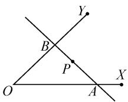
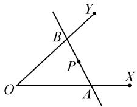
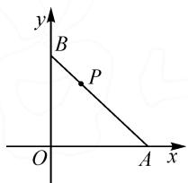
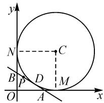
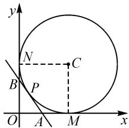
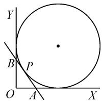
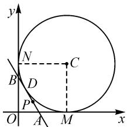
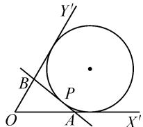
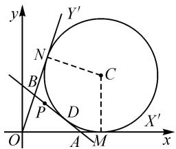
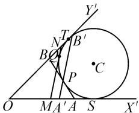

# 一道课堂习题的再探究

# 上海市嘉定区第二中学 秦 昊

# 1 问题的提出

文[1]对如下习题作了拓展研究,并给出了如下两个结论:

习题 过点 $P(1,2)$ 的直线 l 与 x 轴的正半轴、y 轴的正半轴分别交于 A, B 两点，当 $\triangle AOB$ 的面积最小时，求直线 l 的方程.

结论 1 如图 1, 设定点 P 在定角 $\angle XOY$ 内, 过点 P 的直线分别交 OX, OY 于 A, B 两点, 当且仅当 P 为 AB 中点时, $\triangle OAB$ 的面积最小.

结论 2 如图 2, 设定点 P 在定角 $\angle XOY$ 内, 过点 P 的直线分别交 OX, OY 于 A, B 两点, 当且仅当 OA = OB 时, $PA \cdot PB$ 最小.

  
图1

text_image

Y
B
P
O
A
X

图 2

文[1]末提到可以进一步探究 $|AB|$ 以及 $\triangle AOB$ 周长的最小值,本文对 $\triangle AOB$ 周长的最小值进行再探究.

变式题 过点 $P(1,2)$ 的直线 l 与 x 轴的正半轴，y 轴的正半轴分别交于 A, B 两点，当 $\triangle AOB$ 的周长最小时，求直线 l 的方程.

# 2 问题探究

解法1:如图3,直线l的斜率必存在,不妨设直线l的斜率为k(k<0),则直线l的方程为 $y=k(x-1)+2$ ,求得 $A\left(1-\frac{2}{k},0\right)$ , $B(0,-k+2)$ ,则 $\triangle AOB$ 的周长为

text_image

y
B
P
O
A x

图3

$$
\begin{array}{c} C (k) = | O A | + | O B | + | A B | = \left(1 - \frac {2}{k}\right) + \\ (- k + 2) + \sqrt {\left(1 - \frac {2}{k}\right) ^ {2} + (- k + 2) ^ {2}} (k <   0). \end{array}
$$

对上述函数求导,得

$$
C ^ {\prime} (k) = \frac {2}{k ^ {2}} + \frac {(k - 2) (k ^ {3} + 2)}{k ^ {3} \cdot \sqrt {\frac {(k - 2) ^ {2} (k ^ {2} + 1)}{k ^ {2}}}} - 1.
$$

令 $C'(k)=0$ ，解得函数的驻点为 $k=-\frac{4}{3}$ 。当 $k<-\frac{4}{3}$ 时， $C'(k)<0$ ，函数 $y=C(k)$ 严格递减；当 $-\frac{4}{3}<k<0$ 时， $C'(k)>0$ ，函数 $y=C(k)$ 严格递增。因此，当 $k=-\frac{4}{3}$ 时， $\triangle AOB$ 的周长 $C(k)$ 取得最小值，直线 l 的方程为 $y=-\frac{4}{3}(x-1)+2$ ，即 $4x+3y-10=0$ 。

解法 2: 如图 4, 作 $\triangle OAB$ 中 $\angle O$ 所对的旁切圆 C, 旁切圆 C 与 OA, OB 的延长线及 AB 分别相切于点 M, N, D. 不妨设旁切圆 C 的半径为 r. 此时 $\triangle AOB$ 的周长为

text_image

y
N
C
B
P
D
M
O
A
x

图4

$$
\begin{array}{l} y = | O B | + | O A | + | D B | + | D A | \\ = | O B | + | O A | + | B N | + | A M | \\ = | O M | + | O N | \\ = 2 r. \\ \end{array}
$$

$$
\begin{array}{l} y = | O B | + | O A | + | D B | + | D A | \\ = | O B | + | O A | + | B N | + | A M | \\ = | O M | + | O N | \\ = 2 r. \\ \end{array}
$$

求 $\triangle AOB$ 的周长最小值等价于求旁切圆C的半径r的最小值.

设 $l: y - 2 = k(x - 1)$ ，旁切圆 $C: (x - r)^{2} + (y - r)^{2} = r^{2}$ .

因为直线 l 与圆 C 相切, 所以 $\frac{|kr-r-k+2|}{\sqrt{k^{2}+1}}=r$ .

整理,可得关于 k 的一元二次方程

$$
(2 r - 1) k ^ {2} + 2 (r - 1) (r - 2) k + 4 r - 4 = 0,
$$

其判别式 $\Delta=\left[2(r-1)(r-2)\right]^{2}-4(2r-1)\cdot(4r-4)\geqslant0$ , 即 $r^{2}(r-1)(r-5)\geqslant0$ .

解得 $r \geqslant 5 (r \leqslant 1$ 时，圆 C 为内切圆，舍去).

当 $r = 5$ 时，可得 $k = -\frac{4}{3}$ ，此时直线 $l$ 的方程为

$$
4 x + 3 y - 1 0 = 0.
$$

如图 5 所示, 旁切圆的方程为 $(x-5)^{2}+(y-5)^{2}=5^{2}$ , 圆 C 恰过点 $P(1,2)$ .

变式题的结论显示,当 $\triangle AOB$ 的周长最小时, $\triangle OAB$ 中 $\angle O$ 所对的旁切圆恰过点P.这是偶然的吗?让我们进一步探究.

text_image

y
N
C
B
P
O
A
M
x

图5

结论 1 如图 6, 设定点 P 在直角 $\angle XOY$ 内, 作过点 P 的直线分别交 OX, OY 于 A, B 两点, 当 $\triangle OAB$ 的周长最小时, $\triangle OAB$ 中 $\angle O$ 所对的旁切圆恰过点 P.

证明: 如图 7, 以 O 为坐标原点, OX 为 x 轴, OY 为 y 轴, 建立平面直角坐标系. 作 $\triangle OAB$ 中 $\angle O$ 所对的旁切圆 C, 旁切圆 C 与 OA, OB 的延长线及 AB 分别相切于点 M, N, D. 不妨设旁切圆 C 的半径为 r. 此时 $\triangle AOB$ 的周长为

$$
y = | O B | + | O A | + | D B | + | D A | =
$$

$$
\vert O B \vert + \vert O A \vert + \vert B N \vert + \vert A M \vert = \vert O M \vert + \vert O N \vert = 2 r.
$$

求 $\triangle AOB$ 的周长最小值等价于求旁切圆C的半径r的最小值.

设点 $P(a,b)$ ，直线 $l:y-b=k(x-a)$ ，旁切圆 $C:(x-r)^{2}+(y-r)^{2}=r^{2}$ .

因为直线 l 与圆 C 相切, 所以 $\frac{|kr-r+b-ka|}{\sqrt{k^{2}+1}}=r$ .

整理,可得关于 k 的一元二次方程

$$
a (2 r - a) k ^ {2} + 2 (r - a) (r - b) k + 2 b r - b ^ {2} = 0,
$$

其判别式 $\Delta = [2(r - a)(r - b)]^2 - 4a(2r - a) \cdot (2br - b^2) \geqslant 0$ ，即 $r^2 - 2(a + b)r + a^2 + b^2 \geqslant 0$ .

解得 $r \geqslant a + b + \sqrt{2ab}$ ( $r \leqslant a + b - \sqrt{2ab}$ 时，圆 C 为内切圆，舍去).

当 $r = a + b + \sqrt{2ab}$ 时， $\triangle OAB$ 的周长取得最小值 $2(a + b + \sqrt{2ab})$ 。

故旁切圆 C 的方程为 $\left[x-\left(a+b+\sqrt{2ab}\right)\right]^{2}+\left[y-\left(a+b+\sqrt{2ab}\right)\right]^{2}=\left(a+b+\sqrt{2ab}\right)^{2}$ .

将点 $P(a,b)$ 代入圆 C 方程的左边, 化简得

$$
\begin{array}{l} (b + \sqrt {2 a b}) ^ {2} + (a + \sqrt {2 a b}) ^ {2} = a ^ {2} + b ^ {2} + 4 a b + \\ 2 \sqrt {2 a b} (a + b) = (a + b + \sqrt {2 a b}) ^ {2}. \\ \end{array}
$$

故旁切圆恰好过点 P.

不难发现变式题为结论 1 的特殊情况,由此可见变式题的结论并非偶然.

其实,对结论1还可以作进一步推广:

结论 2 如图 8, 设定点 P 在定角 $\angle X^{\prime}OY^{\prime}$ 内, 作过点 P 的直线分别交 $OX^{\prime}, OY^{\prime}$ 于 A, B 两点, 当 $\triangle OAB$ 的周长最小时, $\triangle OAB$ 中 $\angle O$ 所对的旁切圆恰过点 P.

证法 1: 如图 9, 以 O 为坐标原

text_image

Y
B
P
O
A
X

图6

text_image

y
N
C
B
D
P
O
A
M
x

图7

  
图8

点， $OX^{\prime}$ 为 $x$ 轴， $OX^{\prime}$ 的垂线为 $y$ 轴，建立平面直角坐标系.作 $\triangle OAB$ 中 $\angle O$ 所对的旁切圆 $C$ ，切点分别为 $D,M,N.$ 设旁切圆 $C$ 的半径为 $r$ ，定角 $\angle X^{\prime}OY^{\prime} = 2\theta$ ，此时 $\triangle AOB$ 的周长为

text_image

y
Y'
N
B
P
D
C
O
A
M
X'
x

图9

$$
\begin{array}{c} y = | O B | + | O A | + | D B | + | D A | = | O B | + \\ | O A | + | B N | + | A M | = | O M | + | O N | = 2 r \cot \theta . \end{array}
$$

求 $\triangle AOB$ 的周长最小值等价于求旁切圆C的半径r的最小值.

设点 $P(a,b)$ ，直线 $l:y-b=k(x-a)$ ，旁切圆 $C:(x-r\cot\theta)^{2}+(y-r)^{2}=r^{2}$ 。因为直线 l 与圆 C 相

切，所以 $\frac{\left|\frac{kr}{\tan\theta} - r + b - ka\right|}{\sqrt{k^2 + 1}} = r$ ，整理得关于 $k$ 的一元二次方程

$$
\begin{array}{c} \left(r ^ {2} \cot^ {2} \theta - 2 r a \cot \theta + a ^ {2} - r ^ {2}\right) k ^ {2} + (2 b r \cot \theta - \\ 2 r ^ {2} \cot \theta + 2 a r - 2 a b) k - 2 b r + b ^ {2} = 0, \end{array}
$$

其判别式

$$
\Delta = \left[ 2 b r \cot \theta - 2 r ^ {2} \cot \theta + 2 a r - 2 a b \right] ^ {2} - 4 (r ^ {2} \cot^ {2} \theta - 2 r a \cot \theta + a ^ {2} - r ^ {2}) (- 2 b r + b ^ {2}) \geqslant 0.
$$

由此可解得 $r \geqslant a \tan \theta + b \tan^2 \theta + \tan^2 \theta \cdot \sqrt{b^2 (1 - \cot^2 \theta) + 2ab \cot \theta} (r \leqslant a \tan \theta + b \tan^2 \theta - \tan^2 \theta \sqrt{b^2 (1 - \cot^2 \theta) + 2ab \cot \theta}$ 时，圆 $C$ 为内切圆，故舍去).

由此可知，当 $r = a\tan \theta +b\tan^2\theta +\tan^2\theta$ · $\sqrt{b^2(1 - \cot^2\theta) + 2ab\cot\theta}$ 时，△OAB的周长取得最小值 $2(a + b\tan \theta +\tan \theta \sqrt{b^2(1 - \cot^2\theta) + 2ab\cot\theta})$ ，易得此时的旁切圆 $C$ 的方程.

由于将点 $P(a,b)$ 代入圆 C 方程的计算难度一般,但篇幅较大,此处省略.经过笔者验证,点 $P(a,b)$ 满足旁切圆方程,结论得证.

证法 2: 如图 10 所示, 已知 P 为定点, $\angle X'OY'$ 为定角, 当 $\triangle OAB$ 中 $\angle O$ 所对的旁切圆恰过点 P 时, 旁切圆为定圆, 切点 S, T 也为定点. 过点 P 作异于 AB 的直线分别交 $OX', OY'$ 于$A', B'$ 两点. 此时，在劣弧ST上必存在一点Q，过点Q可作圆C的切线分别交 $OX', OY'$ 于M，N两点，且满足 $MN // A'B'$ . 此时 $\triangle OAB$ 的周长= $\triangle OMN$ 的周长= $|OS| + |OT| = 2|OT|$ ，显然， $\triangle OMN$ 的周长小于 $\triangle OA'B'$ 的周长，即 $\triangle OAB$ 的周长小于 $\triangle OA'B'$ 的周长，结论得证.

text_image

Y'
N
T
B'
B
P
C
O
MA'A
S
X'

图10

# 参考文献：

[1] 黄振浩. 一道课本例题的多方位探究 [J]. 中学数学杂志, 2019(1): 33-34. Z