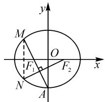
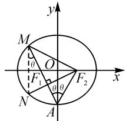
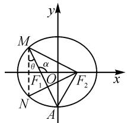
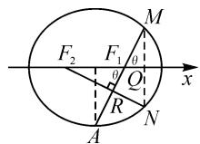

# 一道高三二模试题的解法探究

# ● 新疆实验中学 周文建 古丽鲜·依斯拉木

摘要: 圆锥曲线一直是高考中的重点、难点与热点, 在高考中所占分值大概在 22 分左右, 试题类型通常是一个主观解答题和两个客观选填题, 试题难度中等偏高甚至较难, 一直是命题教师比较重视的一个命题点, 也是学生常见的失分点. 作为命题教师, 从命题和题解两个角度解析一道模考压轴客观题, 以助高三师生更好地把握此章节内容的考查.

关键词: 圆锥曲线; 高考; 核心素养

# 1 题目呈现

(2023年乌鲁木齐地区第二次质量检测·15) $F_{1},F_{2}$ 分别为椭圆 $\frac{x^{2}}{a^{2}}+\frac{y^{2}}{b^{2}}=1(a>b>0)$ 的左、右焦点，A为下顶点，M，N为椭圆上关于x轴对称的两点，若点 $M,F_{1},A$ 在一条直线上， $NF_{2}\perp AM$ ，则此椭圆的离心率是\_\_\_\_.

# 2 命题思路

作为高中知识体系里难度较高的一个章节,圆锥曲线问题理所当然成为高三模考命题的压轴题选择.在命题中圆锥曲线三种曲线类型一般都会涉及到,其中椭圆的内容是必考点之一,考虑到解答题使用抛物线作为考查背景,就将椭圆作为客观题压轴题背景,出现在模考的第15题位置.椭圆试题命制的出发点和背景比较广泛,但是立脚点一般都是椭圆的定义、焦点三角形、焦点弦、离心率等较为常见的形式,考查模式也多是垂直、平行、比例、等角、正弦定理、余弦定理、内切或外接三角形等相融合.一般会设计多个角度和视角的解决思路,包括通解通法、注重定义、构建三角形、三角代换、极坐标等方法.

本题从学生非常熟悉的焦点弦、焦点三角形以及定义的融合出发，设计的考查形式也是学生喜闻乐见的垂直关系，给学生留下的思考空间也就比较广泛。学生既可以使用通解通法，也可以使用极坐标焦点弦长公式，或者使用椭圆定义结合正弦定理与余弦定理来解决问题。综合考查了学生发现问题、分析问题、提出问题与解决问题的能力，本题也体现出对数学抽象、逻辑推理、数学运算、数学建模等数学核心素养的综合要求。

# 3 解法探究

思路一: 直译通解通法——万法之根本.

解析: 设 $F_{1}(-c,0)$ , $F_{2}(c,0)$ , $A(0,-b)$ ，如图1，则 $k_{AM}=k_{AF_{1}}=-\frac{b}{c}$ ，直线 AM 的方程为 $y=-\frac{b}{c}x-b$ .

联立 $\left\{\begin{aligned}y&=-\frac{b}{c}x-b,\\ \frac{x^{2}}{a^{2}}+\frac{y^{2}}{b^{2}}&=1,\end{aligned}\right.$ 消 y，得

$$
\left(b ^ {2} + \frac {a ^ {2} b ^ {2}}{c ^ {2}}\right) x ^ {2} + \frac {2 a ^ {2} b ^ {2}}{c} x = 0,
$$

text_image

y
M
O
F₁
F₂
x
N
A

图1

于是可得 $x_{M}=-\frac{2a^{2}c}{a^{2}+c^{2}}$ ，则 $y_{M}=$

$\frac{b(a^2 - c^2)}{a^2 + c^2}$ , 因此可得 $N\left(-\frac{2a^2c}{a^2 + c^2}, -\frac{b(a^2 - c^2)}{a^2 + c^2}\right)$ , 所以 $k_{NF_{2}}=\frac{b(a^{2}-c^{2})}{c(3a^{2}+c^{2})}$ .

由 $NF_{2} \perp AM$ ，得 $k_{NF_2} k_{AM} = -1$ ，即

$$
\frac {b \left(a ^ {2} - c ^ {2}\right)}{c \left(3 a ^ {2} + c ^ {2}\right)} = \frac {c}{b}.
$$

化简，得 $a^{2}=5c^{2}$ ，所以 $e=\frac{c}{a}=\frac{\sqrt{5}}{5}$ .

评注:通解通法一直是学生解决高考圆锥曲线问题的最常用方法,也是最有效的方法,优点是思维要求较低,准入门槛低,容易上手,但缺点就是运算较为复杂,多数学生不能通过运算有效解决问题.

思路二:巧用垂直关系、椭圆定义解决问题.

解析：设 $\angle MF_2F_1 = \theta$ ，则 $\angle NF_2F_1 = \angle NMA = \angle MAO =$ $\angle F_{2}AO = \theta$ ，如图2.

由 $NF_{2} \perp AM$ ，得 $\angle AF_{2}N + 2\theta = 90^{\circ}$ ，所以可知 $\angle MF_{2}A = 90^{\circ}$ .

于是，有 $|F_{2}M|^{2}+|F_{2}A|^{2}=|MA|^{2}$ ，即 $(2a-|MF_{1}|)^{2}+a^{2}=$ $(a+|MF_{1}|)^{2}$ ，得 $|MF_{1}|=\frac{2}{3}a$ .

text_image

y
M
θ
O
F₁
θ
θ
F₂
x
N
A

图2

所以 $\left|MF_{2}\right|=\frac{4}{3}a.$

在 $\mathrm{Rt}\triangle MF_2A$ 中， $\cos 2\theta = \frac{a}{|AM|} = \frac{a}{a + \frac{2}{3}a} = \frac{3}{5}$ .

又因为 $\cos 2\theta = 1 - 2\sin^2\theta = 1 - 2\left(\frac{c}{a}\right)^2$ ，所以 $1 - 2\left(\frac{c}{a}\right)^2 = \frac{3}{5}$ ，解得 $e = \frac{\sqrt{5}}{5}.$

评注:圆锥曲线的定义在解决圆锥曲线客观题中往往可以起到意想不到的简便作用,“有困难先找定义”应该是解决此类问题的首要反应.

思路三:巧用椭圆定义、正弦定理解决问题.

解析: 设 $\angle MF_{2}F_{1}=\theta$ ，则 $\angle NMA=\angle MAO=\theta$ .

于是 $\angle F_{1}MF_{2} = 90^{\circ} - 2\theta, \angle MF_{1}F_{2} = 90^{\circ} + \theta.$

在 $\triangle MF_{1}F_{2}$ 中，可得 $\frac{|F_1F_2|}{\sin(90^\circ - 2\theta)} = \frac{|MF_1|}{\sin\theta} = \frac{|MF_2|}{\sin(90^\circ + \theta)}$ 即

$$
\begin{array}{r l} & \frac {2 c}{\cos 2 \theta} = \frac {| M F _ {1} |}{\sin \theta} = \frac {| M F _ {2} |}{\cos \theta} = \frac {| M F _ {1} | + | M F _ {2} |}{\sin \theta + \cos \theta} = \\ & \frac {2 a}{\sin \theta + \cos \theta}. \end{array}
$$

所以 $\frac{c}{a} = \frac{\cos 2\theta}{\sin \theta + \cos \theta} = \cos \theta - \sin \theta = \frac{b}{a} - \frac{c}{a}$ , 即 $b = 2c$ , 解得 $e = \frac{\sqrt{5}}{5}$ .

评注: 圆锥曲线中边角关系的考查往往都会建立三角形背景, 而三角形中处理边角关系最常用的手段就是正余弦定理, 故在解决此类问题时要注重观察是否可以构建三角形中的正余弦定理.

思路四: 直角三角形中巧用焦点弦长公式.

解析:焦点在 x 轴上的椭圆的焦点弦长公式为 $\left|AM\right|=\frac{2ep}{1-e^{2}\cos^{2}\alpha}$ ，其中 $p=\frac{b^{2}}{c}$ .

设 $\angle MF_{2}F_{1} = \angle NF_{2}F_{1} = \angle NMA = \angle MAO = \angle F_{2}AO = \theta,$ 如图3，直线MA的倾斜角为 $\alpha$ .

由 $NF_{2} \perp AM$ ，得 $\angle AF_{2}N + 2\theta = 90^{\circ}$ ，即 $\angle MF_{2}A = 90^{\circ}$ .

text_image

y
M
θ α
F₁ O F₂ x
N
A

图3

由 $\alpha=\frac{\pi}{2}+\theta$ , 得

$$
\cos^ {2} \alpha = \sin^ {2} \theta = \frac {c ^ {2}}{a ^ {2}} = e ^ {2}.
$$

于是 $|AM|=\frac{2\frac{c}{a}\cdot\frac{b^{2}}{c}}{1-e^{2}\cdot e^{2}}=\frac{2b^{2}}{a(1-e^{4})}$ .

在 Rt△MF₂A 中，cos 2θ = $\frac{a}{|AM|}$ ，即

$$
a = | A M | (1 - 2 \sin^ {2} \theta) = \frac {2 b ^ {2}}{a (1 - e ^ {4})} (1 - 2 e ^ {2}).
$$

整理，得 $\frac{a^2}{2(a^2 - c^2)} = \frac{1 - 2e^2}{1 - e^4}$ 即 $5e^{4} - 6e^{2} + 1 = 0$ 又 $0 < e < 1$ ，所以解得 $e = \frac{\sqrt{5}}{5}$

评注:椭圆和双曲线的第二定义及焦点弦公式,虽然现在教材中没有直接体现,只是作为例题出现,但还是建议把它讲解清楚,因为在高考中还是会经常遇到.

思路五:极坐标的灵活使用.

解析: 以 $F_{1}$ 为极点, $F_{1}x$ 为极轴建立极坐标系, 如图4.作 MQ 垂直极轴于点 Q, $F_{2}N$ 交 AM 于点 R.

  
图4

由 $\rho=\frac{ep}{1+e\cos\theta}, p=\frac{b^{2}}{c}$ ，得

$$
\mid F _ {1} M \mid = \rho = \frac {\frac {c}{a} \cdot \frac {b ^ {2}}{c}}{1 + \frac {c}{a} \cdot \frac {c}{a}} = \frac {a b ^ {2}}{a ^ {2} + c ^ {2}},
$$

所以 $|MQ| = \rho \sin \theta = \frac{ab^2}{a^2 + c^2} \cdot \frac{b}{a} = \frac{b^3}{a^2 + c^2}, |F_1Q| = \rho \cos \theta = \frac{ab^2}{a^2 + c^2} \cdot \frac{c}{a} = \frac{b^2c}{a^2 + c^2}, |F_2Q| = 2c + \frac{b^2c}{a^2 + c^2}.$

又 $\frac{|F_2Q|}{|MQ|} = \frac{|F_2Q|}{|NQ|} = \frac{|F_2R|}{|RF_1|} = \tan \theta = \frac{b}{c}$ ，即 $\frac{2c + \frac{b^2c}{a^2 + c^2}}{\frac{b^3}{a^2 + c^2}} = \frac{b}{c}$ ，化简得 $a^2 = 5c^2$ ，所以 $e = \frac{c}{a} = \frac{\sqrt{5}}{5}$ .

评注:新教材中虽然已经删除极坐标的内容,但是作为一个经典的知识内容,它对于平面解析几何的作用还是非常明显的.因此,还是建议基础好的学生对此有深入了解,因为它在解决很多平面解析几何问题中有其独到的优势.

# 4 反思与启示

高考题是立足基础而又充满创新,绝不是孤立的知识点的考查,也不是单纯对某个知识点的简单考查,高考题往往是由教材的基础知识、数学思想、经典的基本方法和数学核心素养深度整合而成的.这就要求师生在平时要多维度、多视角地深入研究,强化思考能力,真正进入深度学习,很多时候甚至可以引入一些高等数学的数学思想和方法;需要感悟教材的编写意图、挖掘数学知识本质、搭建数学知识脉络、探根寻本,然后从不同的视角思考问题,从而提升学生的关键能力和数学核心素养,以在高考中取得“先手”.Z