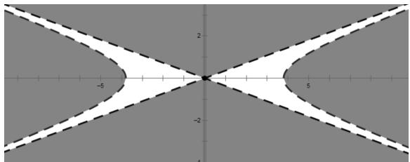

# 从高考题到课本习题的回归与推广

——以 2023 年全国乙卷第 11 题为例

# 贵州省贵阳市第二中学 吴小凤

摘要:解析几何问题是高考中考查学生思维与运算能力的主要载体.本文中从一道高考试题的解法入手,回归教材习题,分析学生解答时常见的错误,从特殊到一般对习题进行探究,得到双曲线中点弦的一般性结论.

关键词: 高考数学; 回归教材; 双曲线; 中点弦

# 1 试题呈现

(2023年全国乙卷理科数学第11题)设 A, B 为双曲线 $x^{2}-\frac{y^{2}}{9}=1$ 上两点, 下列四个点中, 可为线段 AB 中点的是().

A.(1,1)

B. $(-1,2)$

C.(1,3)

D. $(-1,-4)$

# 1.1 试题解析

这道高考试题是典型的双曲线中点弦问题,常用点差法去解决,若 M 是线段 AB 的中点,就等价于过点 M 的直线 l 交双曲线于 A,B 两点.解决这个问题,应联立直线与双曲线的方程,用判别式 $\Delta$ 的值是否大于 0 来对选项进行排除.

# 1.2 试题解答

设 $A(x_{1},y_{1}), B(x_{2},y_{2}), M$ 是线段 AB 的中点， $M(x_{0},y_{0})$ .

将 A, B 两点坐标分别代入双曲线方程, 两式作差, 得 $x_{1}^{2}-x_{2}^{2}-\frac{y_{1}^{2}-y_{2}^{2}}{9}=0$ .

记 $k_{AB}=\frac{y_{1}-y_{2}}{x_{1}-x_{2}}, k=\frac{y_{0}}{x_{0}}=\frac{y_{1}+y_{2}}{x_{1}+x_{2}}$ ，则

$$
k _ {A B} \cdot k = \frac {y _ {1} ^ {2} - y _ {2} ^ {2}}{x _ {1} ^ {2} - x _ {2} ^ {2}} = 9.
$$

对于选项 A, 因为 $k=1, k_{AB}=9$ , 则直线 AB 的方程是 y=9x-8, 与双曲线方程联立并消去 y, 得 $72x^{2}-2\times72x+73=0$ , 计算得 $\Delta=-288<0$ , 所以直线 AB 与双曲线无公共点, 故选项 A 错误.

同理,对于选项 B,判别式 $\Delta = -2\ 880 < 0$ ,所以直线 AB 与双曲线无公共点,故选项 B 错误.

对于选项 C, 求出直线 AB 的方程为 y = -3x, 而双曲线的渐近线方程为 $y = \pm 3x$ , 所以直线 AB 与双曲线无公共点, 故选项 C 错误.

对于选项 D, 经计算判别式 $\Delta = 64512 > 0$ , 所以直线 AB 与双曲线有两个公共点, 故正确答案为选项 D.

# 2 教材原型

人教 A 版数学选择性必修(第一册)第 128 页第 13 题: 已知双曲线 $x^{2}-\frac{y^{2}}{2}=1$ , 过点 $P(1,1)$ 的直线 l 与双曲线相交于 A, B 两点, P 能否是线段 AB 的中点?

先看一下学生常见的解答过程：

设 $A(x_{1},y_{1}), B(x_{2},y_{2})$ ，则

$$
\left\{ \begin{array}{l} x _ {1} ^ {2} - \frac {y _ {1} ^ {2}}{2} = 1, \\ x _ {2} ^ {2} - \frac {y _ {2} ^ {2}}{2} = 1. \end{array} \right.
$$

显然 $x_{1} \neq x_{2}$ , 两式作差, 得

$$
(x _ {2} - x _ {1}) (x _ {2} + x _ {1}) - \frac {(y _ {2} - y _ {1}) (y _ {2} + y _ {1})}{2} = 0.
$$

又 $x_{1} + x_{2} = 2, y_{1} + y_{2} = 2$ ，所以可得

$$
k _ {A B} = \frac {y _ {2} - y _ {1}}{x _ {2} - x _ {1}} = \frac {2 (x _ {2} + x _ {1})}{y _ {2} + y _ {1}} = 2.
$$

故直线 AB 的方程是 $y-1=2(x-1)$ ，即 y=2x-1。

这是一个中点弦问题,以上解法运用了“点差法”,减少了运算量,但忽略了直线与曲线相交于两点的大前提,从而产生错误.因此,在求出直线方程后还应判断所求直线与曲线是否相交,即应在前面解答的基础上加以检验:将直线AB的方程y=2x-1代入双曲线方程 $x^{2}-\frac{y^{2}}{2}=1$ 中消去y,得 $2x^{2}-4x+3=0$ ,其判别式 $\Delta=16-24=-8<0$ ,故直线与双曲线无交点,所以,过点 $P(1,1)$ 不能作出符合题意的直线l.

# 3 试题推广

如何才能避免错误的发生？通过以上解答过程可以发现，中点弦是否存在与弦中点的位置有关，那么,能否通过判断弦中点的位置来确定中点弦是否存在?推广到一般情况:已知双曲线 $\frac{x^{2}}{a^{2}}-\frac{y^{2}}{b^{2}}=1(a>0,b>0)$ ,若过点 $P(x_{0},y_{0})$ 的直线l与双曲线交于A,B两点,P是线段AB的中点,此时点P有何特征?

设 $A(x_{1},y_{1}), B(x_{2},y_{2})(x_{1}\neq x_{2})$ ，分别代入双曲线方程，两式作差，得

$$
\frac {(x _ {2} - x _ {1}) (x _ {2} + x _ {1})}{a ^ {2}} - \frac {(y _ {2} - y _ {1}) (y _ {2} + y _ {1})}{b ^ {2}} = 0.
$$

当 $y_0 \neq 0$ 时， $k_{AB} = \frac{y_2 - y_1}{x_2 - x_1} = \frac{b^2(x_2 + x_1)}{a^2(y_2 + y_1)} = \frac{b^2x_0}{a^2y_0}$ .

所以,直线 AB 的方程是

$$
y - y _ {0} = \frac {b ^ {2} x _ {0}}{a ^ {2} y _ {0}} (x - x _ {0}). \tag {①}
$$

将①式与双曲线方程联立消去 y 并化简整理, 得

$$
\begin{array}{c} b ^ {2} \left(a ^ {2} y _ {0} ^ {2} - b ^ {2} x _ {0} ^ {2}\right) x ^ {2} - 2 b ^ {2} x _ {0} \left(a ^ {2} y _ {0} ^ {2} - b ^ {2} x _ {0} ^ {2}\right) x - \\ \left(a ^ {2} y _ {0} ^ {2} - b ^ {2} x _ {0} ^ {2}\right) ^ {2} - a ^ {4} b ^ {2} y _ {0} ^ {2} = 0. \end{array}
$$

过点 $P(x_0, y_0)$ 的中点弦存在等价于

$$
\begin{array}{l} \Delta = 4 b ^ {4} x _ {0} ^ {2} \left(a ^ {2} y _ {0} ^ {2} - b ^ {2} x _ {0} ^ {2}\right) ^ {2} + 4 b ^ {2} \left(a ^ {2} y _ {0} ^ {2} - b ^ {2} x _ {0} ^ {2}\right) \cdot \\ \left[ \left(a ^ {2} y _ {0} ^ {2} - b ^ {2} x _ {0} ^ {2}\right) ^ {2} + a ^ {4} b ^ {2} y _ {0} ^ {2} \right] > 0, \\ \end{array}
$$

即 $a^2 b^2 y_0^2 (a^2 y_0^2 - b^2 x_0^2)(a^2 y_0^2 - b^2 x_0^2 + a^2 b^2) > 0.$

所以 $a^2 y_0^2 - b^2 x_0^2 > 0$ ，或 $a^2 y_0^2 - b^2 x_0^2 < -a^2 b^2$ ，也即

$$
\frac {x _ {0} ^ {2}}{a ^ {2}} - \frac {y _ {0} ^ {2}}{b ^ {2}} <   0, \tag {②}
$$

或者

$$
\frac {x _ {0} ^ {2}}{a ^ {2}} - \frac {y _ {0} ^ {2}}{b ^ {2}} > 1. \tag {③}
$$

当 $y_{0}=0, x_{0}\neq0$ 时，点 $P(x_{0},y_{0})$ 在 x 轴上，若 $x_{0}>a$ 或 $x_{0}<-a$ ，则过点 $P(x_{0},y_{0})$ 的中点弦存在，直线方程为 $x=x_{0}$ 。此时点 $P(x_{0},y_{0})$ 满足③式。

当 $y_{0}=0, x_{0}=0$ 时，点 $P(x_{0}, y_{0})$ 与坐标原点重合，过点 $P(x_{0}, y_{0})$ 的中点弦有无数条.

综上所述，当点 $P(x_{0}, y_{0})$ 满足 $\frac{x_{0}^{2}}{a^{2}} - \frac{y_{0}^{2}}{b^{2}} < 0$ 或 $\frac{x_{0}^{2}}{a^{2}} - \frac{y_{0}^{2}}{b^{2}} > 1$ 或与原点重合时，过点 $P(x_{0}, y_{0})$ 的中点弦存在。所以点 $P(x_{0}, y_{0})$ 位于阴影部分区域（如图 1）时（包含原点，不包含边界），过点 $P(x_{0}, y_{0})$ 的中点弦存在。

line

| x    | y    |
| ---- | ---- |
| -5   | 0    |
| 0    | 2    |
| 5    | 0    |
| 0    | -2   |
| -5   | -2   |
| 0    | 0    |
| 5    | 0    |
| 0    | 2    |

图1

在上题(教材第13题)中,点 $P(1,1)$ 不在阴影部分区域,所以被点 $P(1,1)$ 平分的中点弦不存在.双曲线的中点弦存在性问题,运用上述结论,既可以避免错误的发生,又能使问题得以迅速解决.

# 4 高考试题秒杀

将上述高考试题中 A, B, C, D 四个选项的点 $(x, y)$ 代入 $x^{2}-\frac{y^{2}}{9}$ 中，计算出四个值分别为 $\frac{8}{9}, \frac{5}{9}, 0, -\frac{7}{9}$ ，只有选项 D 符合 $x^{2}-\frac{y^{2}}{9}<0$ ，故选：D.

# 5 变式与拓展

已知双曲线 $x^{2}-\frac{y^{2}}{3}=1$ 上存在关于直线 y=kx+4 的对称点，求 k 的取值范围.

解: 易知 $k \neq 0$ ，设对称点分别为 $A(x_{1}, y_{1})$ ， $B(x_{2}, y_{2})$ ，将两点坐标分别代入双曲线方程，作差，得

$$
\begin{array}{l} \left(x _ {2} - x _ {1}\right) \left(x _ {2} + x _ {1}\right) - \frac {\left(y _ {2} - y _ {1}\right) \left(y _ {2} + y _ {1}\right)}{3} = 0, \\ x _ {1} \neq x _ {2}. \\ \end{array}
$$

设线段 AB 中点为 $P(x_{0}, y_{0})$ ，得

$$
x _ {0} + \frac {y _ {0}}{3 k} = 0. \tag {④}
$$

因为线段 $AB$ 的中点在直线 $y = kx + 4$ 上，所以

$$
y _ {0} = k x _ {0} + 4. \tag {⑤}
$$

由④⑤，解得 $x_0 = -\frac{1}{k}, y_0 = 3.$

双曲线上存在关于直线 $y=kx+4$ 的对称点等价于过点 $P(x_{0},y_{0})$ 的中点弦存在，所以

$$
x _ {0} ^ {2} - \frac {y _ {0} ^ {2}}{3} <   0 \text {或} x _ {0} ^ {2} - \frac {y _ {0} ^ {2}}{3} > 1,
$$

即 $\frac{1}{k^2} - 3 < 0$ 或 $\frac{1}{k^2} - 3 > 1$ .

解得 $k$ 的取值范围为 $\left(-\infty, -\frac{\sqrt{3}}{3}\right) \cup \left(-\frac{1}{2}, 0\right) \cup \left(0, \frac{1}{2}\right) \cup \left(\frac{\sqrt{3}}{3}, +\infty\right)$ .

# 6 感悟与反思

通过高考试题的研究可以发现,高考试题很多都可以在教材中找到原型,这也提示教师要重视教材的使用.高三复习时虽常常强调回归教材,但常见的做法是把课后有难度的题目重新刷一遍,而忽视了对数学问题本质的理解,对学生数学思维水平的提高是无效的.教师应带领学生挖掘题目本质,引导学生进行拓展与延伸,潜移默化地培养学生的数学核心素养.Z