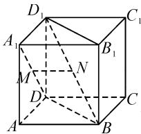

# 借助高考真题,提升思维品质

# ● 江苏省泗洪中学 陈达文

思维品质是一个人智力水平高低的标志,而数学思维品质是学习数学的过程中必不可少的基本素养.对于学生个体发展而言,数学思维品质存在着个体思维发展的年龄特征和个体差异,是数学基础知识、数学思想方法和数学能力等各方面综合体现的一种特殊标志,影响着对数学的理解与学习.下面笔者结合往年高考数学真题中的客观题教学,就提升学生数学思维品质加以实例剖析.

# 1 思维的严谨性

思维的严谨性是指考虑问题时要全面、严密、有理有据。提升学生思维品质的严谨性，必须严格要求，按部就班，按照一定的逻辑顺序进行全面、周密的思考，以充分的理由进行推理论证，加强训练。

例 1 已知集合 $S=\{s \mid s=2n+1, n \in Z\}$ ， $T=\{t \mid t=4n+1, n \in Z\}$ ，则 $S \cap T = (\quad)$ .

A. $\varnothing$

B.S

C.T

D.Z

分析:从集合 S 入手,讨论当 n 分别是偶数、奇数时的集合元素情况,与集合 T 中的元素加以比较,结合集合的基本运算进行判断,即可得到答案 C.

点评:通过对集合 S 中的变量 n 分偶数、奇数这两种不同的取值情况进行分类讨论,进而比较两个集合中对应元素之间的关系,得以确定两个集合的关系.解题过程严密有据,无懈可击,充分体现了数学思维的严谨性.

# 2 思维的广阔性

思维的广阔性是指站在更高的层面上去处理问题,增加问题的切入视角,扩大范围,把研究对象放在更大的环境中去考察,从而更大可能地发现更多的属性,得到更加广泛的结论,为研究性学习提供保障,创新开辟新的道路.

例 2 设函数 $f(x)=\frac{1-x}{1+x}$ ，则下列函数中为奇函数的是（）.

A. $f(x-1)-1$

B. $f(x-1)+1$

C. $f(x+1)-1$

D. $f(x+1)+1$

分析:先根据函数 $f(x)$ 的解析式进行变形与转化处理,确定函数 $f(x)$ 的对称中心,然后通过函数图象的平移变换,使得变换后的函数图象的对称中心为 $(0,0)$ ,吻合奇函数的基本性质,从而得到答案 B.

点评:根据以上问题及其破解,进一步深入研究,总结规律,提升思维品质的广阔性,可以得到一般性的结论——若函数 $y=f(x)$ 的图象关于点 $(m,n)$ $(m,n\in\mathbf{R})$ 中心对称,则函数 $y+n=f(x+m)$ 的图象关于坐标原点 $O(0,0)$ 中心对称,即函数 $y=f(x+m)-n$ 为奇函数.

# 3 思维的深刻性

思维的深刻性是指深入钻研与思考问题,深刻认识事物,善于挖掘复杂事物的内涵,把握问题的本质属性,努力克服思维的表面性与绝对化,不被表面现象所迷惑,从而得到新看法、新结论等,深层研究.

例 3 如图 1 所示, 已知正方体 $ABCD-A_{1}B_{1}C_{1}D_{1}, M, N$ 分别是 $A_{1}D, D_{1}B$ 的中点, 则().

A. $A_{1}D$ 与 $D_{1}B$ 垂直, MN // 平面 ABCD

B. $A_{1}D$ 与 $D_{1}B$ 平行, $MN \perp$ 平面 $BDD_{1}B_{1}$

C.AD 与 $D_{1}B$ 相交, MN // 平面 ABCD

D. $A_{1}D$ 与 $D_{1}B$ 异面， $MN \perp$ 平面 $BDD_{1}B_{1}$

分析:通过证明 $A_{1}D \perp$ 平面 $ABD_{1}$ ，以及 MN 是 $\triangle ABD_{1}$ 的中位线，可判断选项 A 正确；根据异面直线的判定可知 $A_{1}D$ 与直线 $D_{1}B$ 是异面直线，可判断选项 B 错误；根据异面直线的判定可知 AD 与 $D_{1}B$ 是异面直线，可判断选项 C 错误；由 $MN \parallel AB$ ，可知 MN 不与平面 $BDD_{1}B_{1}$ 垂直，可判断选项 D 错误.

点评:借助空间线面位置关系的判定定理与“性质”定理来分析,考查逻辑推理与空间想象能力,对数学思维的深刻性有很好的培养与提升,尽显思维的深刻性其能,顺利解决问题.

# 4 思维的灵活性

思维的灵活性是指思维活动在选择知识、切入角度、运用方法、开展过程等方面的灵活程度.在教学过程中,克服思维定式,往往通过“一题多解”“一题多变”“多题一解”“多题一法”等形式加以展开,多侧面进行分析与思考,提高创新性与灵活性.

  
图1

例 4 已知 $F_{1}, F_{2}$ 是椭圆 $C: \frac{x^{2}}{9} + \frac{y^{2}}{4} = 1$ 的两个焦点，点 M 在 C 上，则 $\left|MF_{1}\right| \cdot \left|MF_{2}\right|$ 的最大值为（）.

A.13

B.12

C.9

D.6

分析:根据题目条件,结合两个焦半径的乘积,在基本不等式背景、函数背景以及焦半径公式等背景下,从不同的思维视角来切入,利用不同的知识来确定对应的最值问题,实现数学思维的灵活性,达到一题多解的目的.

解法 1: 基本不等式法.

由椭圆 C 的方程 $\frac{x^{2}}{9} + \frac{y^{2}}{4} = 1$ ，可知 a = 3，而点 M 在 C 上，利用椭圆的定义可得

$$
\left| M F _ {1} \right| + \left| M F _ {2} \right| = 2 a = 6.
$$

利用基本不等式,可得

$$
\mid M F _ {1} \mid \bullet \mid M F _ {2} \mid \leqslant \left(\frac {\mid M F _ {1} \mid + \mid M F _ {2} \mid}{2}\right) ^ {2} = 9,
$$

当且仅当 $|MF_{1}|=|MF_{2}|=3$ 时，等号成立.

所以 $\left|MF_{1}\right|\cdot\left|MF_{2}\right|$ 的最大值为 9.

故选：C.

解法 2: 距离公式法.

由于 $F_{1}, F_{2}$ 是椭圆 $C: \frac{x^{2}}{9} + \frac{y^{2}}{4} = 1$ 的两个焦点，则 $a = 3, b = 2, c = \sqrt{5}$ ，可得 $F_{1}(-\sqrt{5}, 0), F_{2}(\sqrt{5}, 0)$ . 设 $M(x, y)$ ，其中 $-3 \leqslant x \leqslant 3$ ，则有

$$
y ^ {2} = 4 \left(1 - \frac {x ^ {2}}{9}\right),
$$

于是可得

$$
\begin{array}{l} \left| M F _ {1} \right| \cdot \left| M F _ {2} \right| \\ = \sqrt {(x + \sqrt {5}) ^ {2} + y ^ {2}} \cdot \sqrt {(x - \sqrt {5}) ^ {2} + y ^ {2}} \\ = \left| \frac {5}{9} x ^ {2} - 9 \right| = 9 - \frac {5}{9} x ^ {2} \leqslant 9, \\ \end{array}
$$

当且仅当 x=0 时，等号成立.

所以 $\left|MF_{1}\right|\cdot\left|MF_{2}\right|$ 的最大值为 9.

故选：C.

解法 3: 焦半径公式法.

由于 $F_{1}, F_{2}$ 是椭圆 $C: \frac{x^{2}}{9} + \frac{y^{2}}{4} = 1$ 的两个焦点，则知 a = 3, b = 2, $c = \sqrt{5}$ ，可得椭圆 C 的离心率 e =

$$
\frac {c}{a} = \frac {\sqrt {5}}{3}.
$$

设 $M(x,y)$ ，其中 $-3 \leqslant x \leqslant 3$ ，结合椭圆的焦半径公式，有

$$
\mid M F _ {1} \mid = a + e x = 3 + \frac {\sqrt {5}}{3} x,
$$

$$
\mid M F _ {2} \mid = a - e x = 3 - \frac {\sqrt {5}}{3} x.
$$

于是 $\left|MF_{1}\right|\cdot\left|MF_{2}\right|=9-\frac{5}{9}x^{2}\leqslant9$ ，当且仅当x=0时，等号成立.

所以 $\left|MF_{1}\right|\cdot\left|MF_{2}\right|$ 的最大值为 9.

故选：C.

点评:从以上问题所对应的三种思维视角切入,借助不同的数学知识与数学方法来破解,殊途同归,消除学生思维定势的消极影响,进行“一题多解”训练,充分展示数学思维的灵活性.

# 5 思维的批判性

思维的批判性是指有主见地评价事物,严格地估计思维材料,精确地检查思维过程,是思维过程中自我意识作用的结果.在数学解题过程中,对一些问题进行深入研究,自我鉴别,深层挖掘,发现问题,辨析真假,培养学生思维的批判性.

例 5 已知 $f(x)=3\sin x+2$ ，对任意的 $x_{1}\in\left[0,\frac{\pi}{2}\right]$ ，都存在 $x_{2}\in\left[0,\frac{\pi}{2}\right]$ ，使得 $f(x_{1})=2f(x_{2}+\theta)+2$ 成立，则下列选项中， $\theta$ 可能的值是（）.

A. $\frac{3\pi}{5}$

B. $\frac{4\pi}{5}$

C. $\frac{6\pi}{5}$

D. $\frac{7\pi}{5}$

分析: 结合题目条件, 利用逻辑关系确定三角函数的最大值与最小值, 对 $\theta$ 的可能取值进行分类讨论, 分别确定在不同背景下三角函数的取值情况, 进而得以分析与判断, 实现批判性思维的发展.

点评:巧妙综合逻辑推理与三角函数的图象和性质,借助题目创新情境确定三角函数的最值情况,再通过三角函数的图象与性质确定限制条件下的最值情况,对比分析、判断,深层挖掘,辩误驳谬,有效破解综合应用问题,培养学生思维的批判性.

有意识地借助一些高考典型真题实例,合理引入课堂教学与学生学习,巧妙引导,加强督促,结合学生的参与和训练,能够很好地提升数学的思维品味,提高数学能力,受益终生.合理培养学生的思维品质,使学生真正学有所得,真正实现教学相长.Z