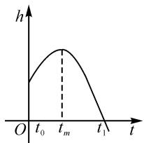
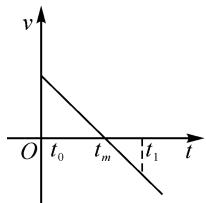

# 函数与导数主题教学设计案例分析\*

# 甘肃省景泰县第二中学 刘化刚

摘要:通过主题教学设计案例分析的方式,明确函数与导数主题教学设计的内容为函数单调性和导数,经过提出问题、探究分析问题到解决问题,以及在解决问题过程中关于主题教学设计的计划、实施、检验和优化等流程,论证了运用导数法可以简便、快捷地判断函数的单调性及求其单调区间.

关键词: 函数; 导数; 主题教学设计; 案例分析

函数单调性的判断,主要有定义法和图象法.然而,相比一次、二次函数而言,运用定义法和图象法判断三次及以上,或者图象难画的函数的单调性,会比较复杂、困难.例如,函数 $f(x)=-5x^{3}+5x+10$ , 图象复杂,利用定义法通过作差、变形和判断符号来判断其单调性的过程也很繁琐.那么,运用什么方法可以简便、快捷地判断上述复杂函数的单调性呢?本文中采用主题教学设计的方式对利用导数解决函数的单调性问题进行案例探究和分析.

# 1 主题教学说明

主题教学是一种关于交叉内容的教学方式.教学主题的确定在于教学设计内容的选择.主题教学内容的选择策略主要有两种:一是根据相关概念进行迁移选择,二是根据相关性质进行比较选择.

函数与导数的关联性,在于运用导函数能简捷地判断函数的单调性.由此,函数与导数主题教学设计的内容为函数的单调性和导数.主题教学设计的步骤主要包括主题教学设计的准备和计划、实施和检验,以及总结和完善3个环节.

本文中通过函数与导数主题教学设计的方式,对运用导数方法简便、快捷地判断函数的单调性及求其单调区间进行案例分析.该案例分析主要包括主题教学设计的准备和计划、实施和检验,以及总结和完善3个环节.

# 2 主题教学设计的准备和计划

主题教学设计的准备和计划主要包括如下 4 步. 首先, 明确教学设计的主题. 其次, 分析教材以及教学内容和课程标准. 再次, 了解学生的学习基础情况. 最后, 结合学情和教情, 设计教学目标、重点和难点, 以及教学方式等.

# 2.1 明确教学设计主题

教学主题的确定在于主题教学设计内容的选择. 主题教学设计的内容主要有两种选择策略: 一是根据相关概念进行迁移选择, 二是根据相关性质进行比较选择.

# 2.2 分析教材及教学内容和课程标准

函数单调性与导数是教材教学内容中导数的应用,是在导数基本概念和计算等学习的基础上,进一步对导数应用的教学,是研究函数极值和最值的基础.

# 2.3 了解学生学习基础情况

函数单调性与导数是导数应用的学习内容.学生的学习基础在于关于导数基本概念、计算和几何意义的学习情况.

# 2.4 设计教学目标、重难点和教学方式

结合学情和教情,设计关于函数单调性与导数的主题教学目标,重点和难点以及教学方式.

(1) 教学目标: 探索可导函数的单调性与其导数的关系, 掌握运用导数的正负判断函数单调性以及求解函数单调区间的方法.  
(2) 教学重点: 通过分组合作, 探究并掌握导数与函数单调性的关系.  
(3) 教学难点: 运用导数法判断函数的单调性及求其单调区间.  
(4)教学方式:主要采取如下2种类型的教学方式.一是设置生活教学情境,例如高台跳水情境,引入跳水运动轨迹函数单调性问题,激发学生学习函数的兴趣.二是将学生分组,通过学习小组的方式,合作探究跳水运动轨迹可导函数的单调性与其运动速度函数的关系.

# 3 主题教学设计的实施和检验

函数与导数主题教学设计的实施和检验,在引入实际生活情境的基础上,结合课堂分组教学互动的实际反馈,按照主题教学设计的计划,分步骤地实施和检验.

# 3.1 主题教学设计的实施

围绕函数单调性的概念和性质,主题教学设计的实施步骤主要包括如下3个方面:一是引入生活情境,通过分组教学的方式,让学生体验从直观图形—抽象导函数—判断函数单调性—求其单调区间的演变.二是结合图形解决函数单调性问题,让学生体验运用导函数求解函数单调性问题的本质.三是结合函数单调性在实际生活中的应用,让学生深刻理解所构建的函数模型的单调性可以更清晰、严谨地表达现实生活.

主题教学设计的具体实施步骤,如下所述:

例题 跳水运动员小华在 10 米高台跳水项目中,从高台跳板起跳,在跳板的作用下反弹到最高点,再从最高点下落入水的过程中,若运动员小华的重心相对于水面的高度为 h,运动速度为 v,运动时间为 t,则 h 与 t 的函数关系为 $h(t) = -5t^{2} + 5t + 10$ ,速度 v 与运动时间 t 的关系为 $v(t) = -10t + 5$ .试比较运动员小华从跳台起跳到最高点与从最高点到落水的两段时间内的运动状态的区别.

具体的主题教学设计实施的分析,主要包括如下4步:

首先,明确运动员小华高台跳水的运动轨迹是一条开口向下的抛物线,定义域为运动员小华从跳台起跳时间 $t_{0}$ 到落水时间 $t_{1}$ ,记作 $[t_{0}, t_{1}]$ .

其次，将抛物线的定义域分为2个区间，分别为运动员小华从跳台起跳时间 $t_{0}$ 到最高点时间 $t_{m}$ ，记作 $[t_{0},t_{m}]$ ，从最高点时间 $t_{m}$ 到落水时间 $t_{1}$ ，记作 $[t_{m},t_{1}]$ 。

再次,比较运动员小华从跳台起跳到最高点,以及从最高点到落水的两段时间内的运动状态的区别,转化为判断运动员小华高台跳水运动轨迹在2个定义域区间上的单调性.

最后,将学生分为 2 个学习小组,分别合作探究利用图象法和导数法判断跳水运动轨迹可导函数的单调性,以及跳水运动轨迹可导函数的单调性与运动速度函数的关系.

# 3.2 主题教学设计的检验

主题教学设计的检验过程主要包括如下 3 步：

首先,分组合作运用图象法判断运动员小华高台跳水运动轨迹在2个定义域区间上的单调性.画出运动员小华跳水高度h与运动时间t的关系为 $h(t)=-5t^{2}+5t+10$ 的图象,如图1所示.

从图 1 可以看出,运动员小华从跳台起跳时间 $t_{0}$ 到最高点时间 $t_{m}$ 的运动轨迹在区间 $[t_{0}, t_{m}]$ 上的单调性为单调递增状态,从最高点时间 $t_{m}$ 到落水时间 $t_{1}$ 的运动轨迹在区间 $[t_{m}, t_{1}]$ 上的单调性为单调递减状态.

line

| t     | h     |
|-------|-------|
| 0     | O     |
| t₀    | h     |
| t_m   | h     |
| t₁    | h     |

图1

其次,分组合作探究跳水运动轨迹可导函数的单

调性与其运动速度函数的关系.从图2所示来看,运动员小华从跳台起跳时间 $t_{0}$ 到最高点时间 $t_{m}$ 的运动速度 $v(t)>0$ ,从最高点时间 $t_{m}$ 到落水时间 $t_{1}$ 的运动速度 $v(t)<0$ .通过比较运动员小华跳水高度h与运动时间t的关系和运动速度v与运动时间 t 的关系,不难发现如下规律:

line

| t     | v     |
|-------|-------|
| 0     | v     |
| t₀    | t_m   |
| t₁    | t     |

图2

运动员小华在 $\left[t_{0},t_{m}\right]$ 区间内，运动轨迹的导函数与运动速度函数一致，记作 $h^{\prime}(t)=v(t)>0$ ，运动轨迹为单调递增状态。同理，在 $\left[t_{m},t_{1}\right]$ 区间内，运动轨迹的导函数与运动速度函数也一致，记作 $h^{\prime}(t)=v(t)<0$ ，运动轨迹为单调递减状态。由此，结合图形判断函数单调性，让学生体验到运用导函数判断函数单调性的本质在于函数切线斜率的正负。

最后,通过跳水运动员小华运动轨迹函数的导数或者切线斜率的正负来判断上述函数的单调性以及求其单调区间在实际生活中的应用,学生能够深刻地理解所构建的函数模型的单调性可以更清晰、严谨、便捷地表达现实生活.

# 4 主题教学设计的总结和完善

# 4.1 主题教学设计的总结

主题教学设计的流程可以总结为从提出问题、探究分析问题到解决问题，以及在解决问题过程中，关于主题教学设计的计划、实施、检验和优化等环节.

# 4.2 主题教学设计的完善

对实施后的主题教学设计进行优缺点总结,提出进一步完善主题教学设计内容的措施.例如,增加利用定义法和导数法判断函数单调性及求其单调区间的主体教学设计,并且在后期教学计划的设计和实施中不断进行优化.

通过主题教学设计案例分析的方式,明确教学设计内容的主题为函数单调性和导数,论证了运用导数法可以简便、快捷地判断函数单调性及求其单调区间.其中,主题教学设计流程主要包括计划,实施和检验,以及优化3个环节.利用导数法求函数单调区间的主要步骤为:确定函数的定义域,求函数的导函数,求解导函数大于0的解集,定义域在该解集内的区间为函数的增区间,求解导函数小于0的解集,定义域在该解集内的区间为函数的减区间.Z