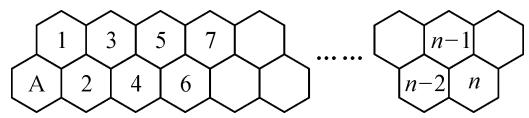

# 数列的创新与综合应用

# 广东省广州市南沙东涌中学 许琼

在“三新”背景下，数列模块作为“主力”知识，是创新意识与创新应用的一个重要载体，能够更加合理有效地考查考生数列知识的“三基”和数学关键能力，充分体现高考的选拔性与区分度。本文中结合2024届最新的模拟题，就数列模块中的创新综合应用，通过几类典型的特色问题加以合理剖析，抛砖引玉。

# 1 创新变换

创新变换对数列推递关系式的变形与转化起到至关重要的作用,特别是涉及数列不等式、数列通项与数列求和等相关问题中的变换与应用等.

例 1 （2024 届合肥市高三第二次质检数学试卷·8）
已知数列 $\{a_{n}\}$ 的前n项和为 $S_{n}$ ，且 $\frac{1}{a_{n}}=4+\frac{4}{\sqrt{a_{n-1}}}+\frac{n}{2a_{n-1}}(n\geqslant2$ 且 $n\in N^{*}$ ，若 $a_{1}=1$ ，则（）.

A. $S_{2024}\in\left(1,\frac{3}{2}\right)$

B. $S_{2024} \in \left(\frac{3}{2}, 2\right)$

C. $S_{2024} \in \left(2, \frac{5}{2}\right)$

D. $S_{2024} \in \left(\frac{5}{2}, 3\right)$

解析：依题可得 $\frac{1}{a_n} = 4 + \frac{4}{\sqrt{a_{n - 1}}} +\frac{n}{2a_{n - 1}}\geqslant 4+$ $\frac{4}{\sqrt{a_{n - 1}}} +\frac{1}{a_{n - 1}} = \left(\frac{1}{\sqrt{a_{n - 1}}} +2\right)^2 >0$ ，故 $\frac{1}{\sqrt{a_n}}\geqslant \frac{1}{\sqrt{a_{n - 1}}} +2,$ 则有 $\frac{1}{\sqrt{a_{n - 1}}}\geqslant \frac{1}{\sqrt{a_{n - 2}}} +2,\frac{1}{\sqrt{a_{n - 2}}}\geqslant \frac{1}{\sqrt{a_{n - 3}}} +2,\dots ,$ $\frac{1}{\sqrt{a_2}}\geqslant \frac{1}{\sqrt{a_1}} +2$ ，将以上 $(n - 1)$ 个不等式同向相加，整理可得 $\frac{1}{\sqrt{a_n}}\geqslant \frac{1}{\sqrt{a_1}} +2(n - 1) = 2n - 1.$

所以 $a_{n}\leqslant \frac{1}{(2n - 1)^{2}},n\in \mathbf{N}^{*}$

又 $a_{n} \leqslant \frac{1}{(2n - 1)^{2}} < \frac{1}{4n^{2} - 4n} = \frac{1}{4}\left(\frac{1}{n - 1} -\frac{1}{n}\right),$ 所以 $S_{2024} <   1 + \frac{1}{4}\left(1 - \frac{1}{2}\right) + \frac{1}{4}\left(\frac{1}{2} -\frac{1}{3}\right) + \dots +$ $\frac{1}{4}\left(\frac{1}{n - 1} -\frac{1}{n}\right) = 1 + \frac{1}{4}\left(1 - \frac{1}{n}\right) <   1 + \frac{1}{4} <  \frac{3}{2}.$

又 $a_{n}>0$ ，所以 $S_{2024}>a_{1}=1$ ，则有 $S_{2024}\in\left(1,\frac{3}{2}\right)$ ，故选：A.

# 2 创新分析

创新分析对于含参的数列不等式、数列递推关系式等问题的解决有奇效,合理借助参数值的取值情况,联系数列自身的特色加以分析与处理.

例 2 （2024 届江苏省百校联考高三第二次考试数学试卷·8）设数列 $\{a_{n}\}$ 的前 n 项和为 $S_{n}$ ，且 $S_{n} + a_{n} = 1$ ，记 $b_{m}$ 为数列 $\{a_{n}\}$ 中能使 $a_{n} \geqslant \frac{1}{2m+1} (m \in \mathbb{N}^{*})$ 成立的最小项，则数列 $\{b_{m}\}$ 的前 2023 项和为（）.

A.2 023×2 024

B. $2^{2024}-1$

C. $6-\frac{3}{2^{7}}$

D. $\frac{11}{2}-\frac{3}{2^{8}}$

解析: 当 n=1 时, 由题意可得 $a_{1}=\frac{1}{2}$ . 又由 $S_{n}+a_{n}=1$ , 可得 $S_{n+1}+a_{n+1}=1$ , 两式相减可得 $2a_{n+1}-a_{n}=0$ , 即 $a_{n+1}=\frac{1}{2}a_{n}$ , 则 $\{a_{n}\}$ 是以首项 $a_{1}=\frac{1}{2}$ , 公比为 $q=\frac{1}{2}$ 的等比数列, 故 $a_{n}=\frac{1}{2^{n}}$ .

令 $a_{n} = \frac{1}{2^{n}}\geqslant \frac{1}{2m + 1}$ ，可得 $2^{n}\leqslant 2m + 1$

若 m=1，则 $n \leqslant 1$ ，此时 $b_{1}=a_{1}=\frac{1}{2}$ ；若 $2 \leqslant m \leqslant 3$ ，则 $n \leqslant 2$ ，此时 $b_{m}=a_{2}=\frac{1}{4}$ ；若 $4 \leqslant m \leqslant 7$ ，则 $n \leqslant 3$ ，此时 $b_{m}=a_{3}=\frac{1}{8}$ ；若 $8 \leqslant m \leqslant 15$ ，则 $n \leqslant 4$ ，此时 $b_{m}=a_{4}=\frac{1}{16}$ ；……；若 $1024 \leqslant m \leqslant 2047$ ，则 $n \leqslant 11$ ，此时 $b_{m}=a_{11}=\frac{1}{2^{11}}$ 。设数列 $\{b_{n}\}$ 的前 n 项和为 $T_{n}$ ，则 $T_{1}=b_{1}=\frac{1}{2}$ ， $T_{3}=b_{1}+(b_{2}+b_{3})=1$ ， $T_{7}=b_{1}+(b_{2}+b_{3})+(b_{4}+b_{5}+b_{6}+b_{7})=\frac{3}{2}$ ，……， $T_{2047}=b_{1}+(b_{2}+b_{3})+\cdots+(b_{1024}+b_{1025}+\cdots+b_{2047})=11\times\frac{1}{2}=\frac{11}{2}$ 。所以 $T_{2023}=\frac{11}{2}-\frac{24}{2^{11}}=$

$\frac{11}{2}-\frac{3}{2^{8}}$ ，故选择：D.

# 3 创新场景

创新场景往往是依托一些现实生活中的应用场景,结合一些典型的数列模型加以设置,进而从应用场景中归纳并总结相应的数列递推关系式,为问题的进一步分析与求解提供条件.

例 3 [2024 届高三第一次学业质量评价(T8 联考)数学试题·8]一只蜜蜂从蜂房 A 出发向右爬,每次只能爬向右侧相邻的两个蜂房(如图 1),例如:从蜂房 A 只能爬到 1 号或 2 号蜂房,从 1 号蜂房只能爬到 2 号或 3 号蜂……以此类推,用 $a_{n}$ 表示蜜蜂爬到 $n$ 号蜂房的方法数,则 $a_{2022}a_{2024}-a_{2023}^{2}=(\quad)$ .

chemical

Hexagonal molecular structure diagram showing carbon atoms and electron shells with labeled positions

图1

A.1

B.-1

C.2

D.-2

解析:由题意可得 $a_{1}=1, a_{2}=2, a_{3}=3, a_{4}=5$ ，归纳可知， $a_{n+1}=a_{n}+a_{n-1}(n\in\mathbf{N}^{*}, n\geqslant2)$ ，所以当 $n\geqslant2$ 时， $a_{n}a_{n+2}-a_{n+1}^{2}=a_{n}(a_{n+1}+a_{n})-a_{n+1}^{2}=a_{n}a_{n+1}+a_{n}^{2}-a_{n+1}^{2}=a_{n}^{2}+a_{n+1}(a_{n}-a_{n+1})=a_{n}^{2}-a_{n+1}a_{n-1}=-(a_{n-1}a_{n+1}-a_{n}^{2})$ ，而 $a_{1}a_{3}-a_{2}^{2}=-1$ ，所以数列 $\{a_{n}a_{n+2}-a_{n+1}^{2}\}$ 是以 $a_{1}a_{3}-a_{2}^{2}=-1$ 为首项，公比为 -1 的等比数列。所以 $a_{2022}a_{2024}-a_{2023}^{2}=-1\times(-1)^{2021}=1$ 。故选：A.

# 4 创新定义

创新定义成为数列中最为常见的一类创新应用问题,或创新定义数列模型,或创新定义与数列的通项、求和等公式有关的问题等,依托创新定义加以综合,结合数列的基础知识进行分析与求解.

例 4 [2024 届高三第一次学业质量评价(T8 联考)数学试题·21]已知数列 $\{a_{n}\}$ 为等差数列, 公差 d>0, 等比数列 $\{b_{n}\}$ 满足: $b_{1}=2a_{1}=2$ , $b_{2}=a_{1}+a_{3}$ , $b_{1}b_{3}=5a_{3}+1$ .

(1)求数列 $\{a_{n}\},\{b_{n}\}$ 的通项公式；

(2)若将数列 $\{a_{n}\}$ 中的所有项按原顺序依次插入数列 $\{b_{n}\}$ 中，组成一个新数列： $b_{1},a_{1},b_{2},a_{2},a_{3},b_{3},a_{4},a_{5},a_{6},a_{7},b_{4},\cdots\cdots$ ，在 $b_{k}$ 与 $b_{k+1}$ 之间插入 $2^{k-1}$ 项 $\{a_{n}\}$ 中的项，新数列中 $b_{n+1}$ 之前（不包括 $b_{n+1}$ ）所有项

的和记为 $T_{n}$ ，若 $d_{n}=\frac{a_{n}^{2}}{a_{n+1}}\left(\frac{2^{n-1}}{T_{n}+2}+2\right)$ ，求使得 $[d_{1}]+[d_{2}]+[d_{3}]+\cdots+[d_{n}]\leqslant2023$ 成立的最大正整数 n 的值。（其中符号 [x] 表示不超过 x 的最大整数。）

解析:(1)设等比数列 $\{b_{n}\}$ 的公比为 $q(q\neq0)$ ，依题意可以得到 $a_{1}=1,b_{1}=2$ ，则有 $\left\{\begin{aligned}&2q=1+1+2d,\\ &2\times2q^{2}=5(1+2d)+1,\end{aligned}\right.$ 解得 $\left\{\begin{aligned}d=1,\\ q=2,\end{aligned}\right.$ 或 $\left\{\begin{aligned}d&=-\frac{1}{2},\\ q&=\frac{1}{2}\end{aligned}\right.$ （舍去），所以 $a_{n}=n,b_{n}=2^{n}$ .

(2)新数列中 $b_{n + 1}$ 之前的所有项中，含有 $\{a_n\}$ 中的项共有 $2^0 +2^1 +2^2 +\dots +2^{n - 1} = 2^n -1$ 项，所以 $T_{n} = \frac{(1 + 2^{n} - 1)(2^{n} - 1)}{2} +\frac{2(1 - 2^{n})}{1 - 2} = 2^{2n - 1} + 3\cdot$ $2^{n - 1} - 2$ ，所以 $d_{n} = \frac{a_{n}^{2}}{a_{n + 1}}\Big(\frac{2^{n - 1}}{T_n + 2} +2\Big) = \frac{n^2}{(n + 1)(2^n + 3)}+$ $\frac{2n^2}{n + 1} = \frac{n^2}{(n + 1)(2^n + 3)} +\frac{2}{n + 1} +2(n - 1) =$ $\frac{n^2 + 2(2^n + 3)}{(n + 1)(2^n + 3)} +2(n - 1).$

下证当 $n \geqslant 2$ 时， $0 < \frac{n^2 + 2(2^n + 3)}{(n + 1)(2^n + 3)} < 1$ .

由于 $(n+1)(2^{n}+3)-n^{2}-2(2^{n}+3)=(n-1)2^{n}-n^{2}+3n-3$ ，而结合二项式定理有 $2^{n}=C_{n}^{0}+C_{n}^{1}+C_{n}^{2}+\cdots\cdots+C_{n}^{n}$ ，则当 $n\geqslant2$ 时， $2^{n}\geqslant n+2$ ，所以 $(n-1)2^{n}-n^{2}+3n-3\geqslant(n-1)(n+2)-n^{2}+3n-3=4n-5>0$ ，
所以当 $n \geqslant 2$ 时， $0 < \frac{n^{2} + 2(2^{n} + 3)}{(n + 1)(2^{n} + 3)} < 1$ ，于是有 $[d_{n}] = 2(n-1)$ . 当 n = 1 时， $d_{1} = \frac{11}{10}$ ，故 $[d_{1}] = 1$ .

所以 $[d_1] + [d_2] + [d_3] + \dots + [d_n] = 1 + 2[1 + 2 + \dots + (n - 1)] = n^2 - n + 1 \leqslant 2023$ ，即 $n^2 - n = n(n - 1) \leqslant 2022$ ，则满足不等式的最大正整数 $n = 45$ .

涉及数列模块知识中的创新综合问题,往往依托数列的基本概念、基本类型、基本公式以及基本性质等,融入相应的创新元素与创新场景,成为每年高考中考查学生的创新意识与创新应用的一个重要载体.此类创新综合问题,以数列基础知识为问题背景,融入各种相应的创新元素与创新意识,使得数学应用、综合应用、创新应用在数学基础、数学思维、技巧方法等层面得以真正发酵、发生、反映等,引导学生合理关注现实生活中无处不在的数学与应用.Z