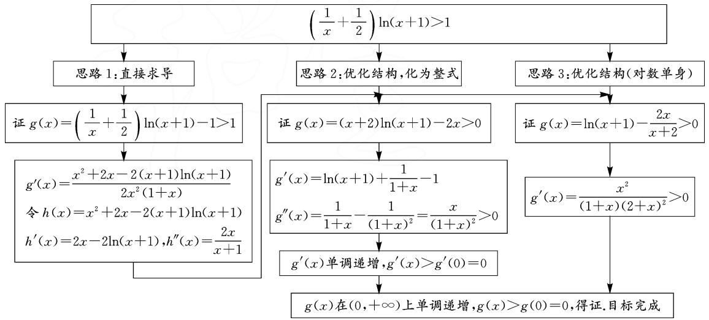
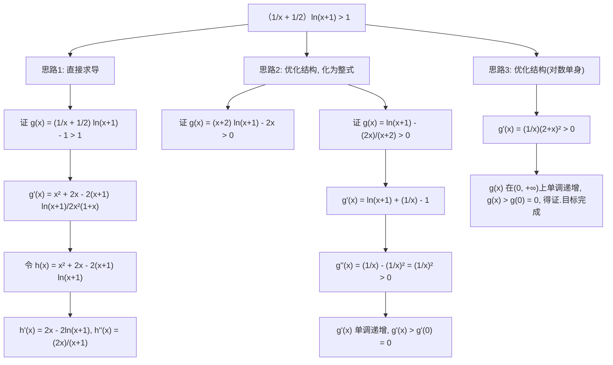
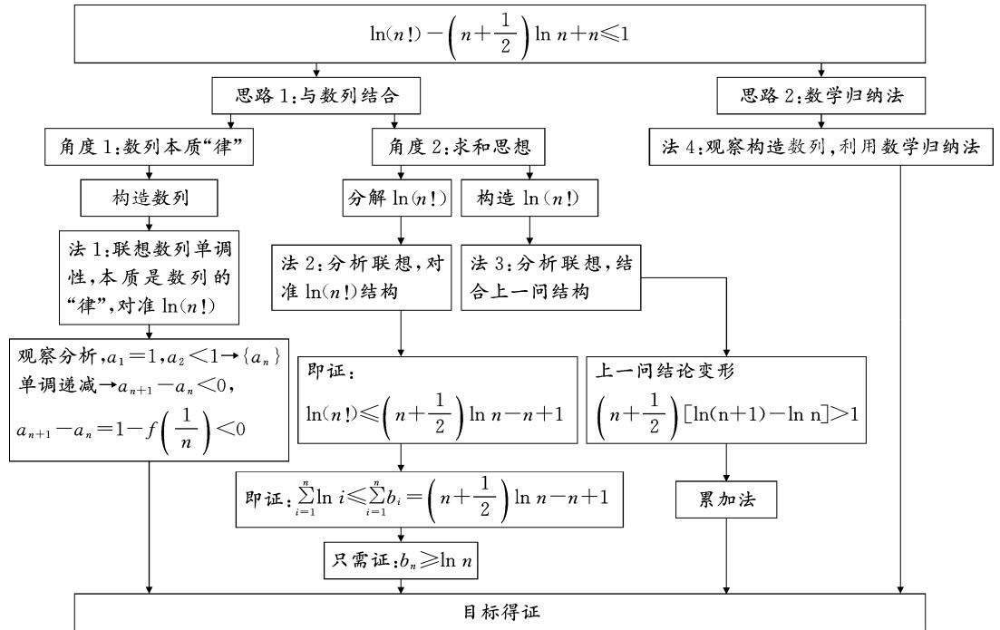
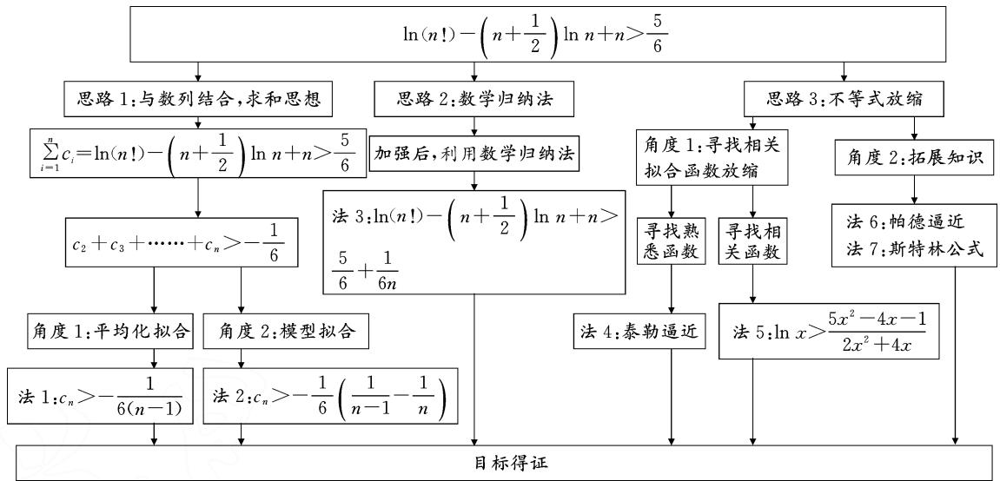
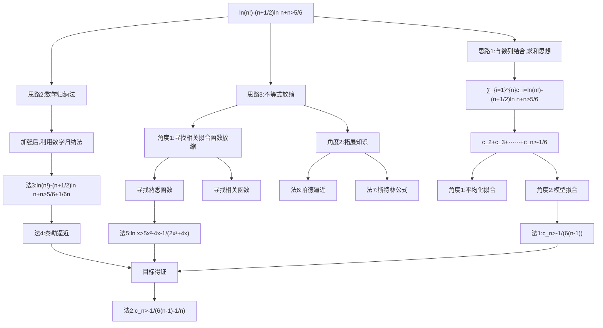

# 2023年讲题比赛获奖论文之九：

# 用思维分析揭示 2023 年天津卷第 20 题

# 山东省胶州市第二中学 高文娟

2023 年天津卷第 20 题考查数列与不等式结构关系,运用函数思想解决问题.题目解法多样,思维开源,充分考查学生的数学素养和思维分析能力.

# 1 题目:2023 年天津卷第 20 题

已知函数 $f(x) = \left(\frac{1}{x} + \frac{1}{2}\right)\ln (x + 1)$ .

(1) 求 $y = f(x)$ 在 x = 2 处切线的斜率；  
(2) 当 x > 0 时, 证明: $f(x) > 1$ ;  
(3) 证明: $\frac{5}{6} < \ln(n!) - \left(n + \frac{1}{2}\right) \ln n + n \leqslant 1, n \in \mathbf{N}^*$ .

# 2 分析与思维导图

# 2.1 思路分析

第(1)问简单,本文从略.

第(2)问证明要观察结构,化简到合适结构再运算,也就是对构造函数的能力有较高要求.若令 $g(x)=\left(\frac{1}{x}+\frac{1}{2}\right)\ln(x+1)-1$ 或 $g(x)=(x+2)\cdot\ln(x+1)-2x$ , 则其导数中含有“ $\ln(x+1)$ ”, 不如选择变形为 $g(x)=\ln(x+1)-\frac{2x}{x+2}$ , 这就是本题化简的本质 (“对数单身”)! 这一点在以往高考题中经常出现.

本题第(3)问的命题背景源自大学数学专业《数学分析》的“斯特林公式”，但是该公式只是它的命题背景,我们无需知道,即可用高中知识解决它.当然,本题也深刻考查了学生的数学核心素养和思维分析能力.对于第(3)问:(指向最简单与最本质的方法)观察发现本题属于数列型不等式,所以解答时可以结合数列知识.先看右边不等式,要证 $\ln(n!)-\left(n+\frac{1}{2}\right)\cdot\ln n+n\leqslant1$ ,设该不等式左侧为 $a_{n}$ ,即证 $a_{n}\leqslant1$ ,不难发现 $a_{1}=1$ ,则即证 $a_{n}\leqslant a_{1}$ ,猜想 $a_{n+1}-a_{n}\leqslant0$ ,因此解题思路就出来了,证明过程用到第(2)问的结论.再看左边不等式,不等号方向决定需要构造 $f(x)<1+h(x)$ ,因为要证

$$
a _ {n} - a _ {1} = (a _ {2} - 1) + (a _ {3} - a _ {2}) + \dots + (a _ {n} -
$$

$$
\left. a _ {n - 1}\right) = \sum_ {i = 1} ^ {n - 1} \left[ 1 - f \left(\frac {1}{i}\right) \right] > - \frac {1}{6},
$$

可联想 $\sum_{i=1}^{n-1} \frac{1}{6} \left[ \frac{1}{i+1} - \frac{1}{i} \right] > -\frac{1}{6}$ , 等等, 也可联想泰勒展开、帕德逼近、斯特林公式等拓展知识结论, 但是都需要具体运算后才能发现是否可行. 相对来讲, 后面给出的利用数列知识、求和思想的方法, 对分析能力的要求更低, 但是运算量较大. 拓展知识对于培优生可以使用, 但是对绝大部分学生而言, 拓展知识的解法并不能让其看到解题本质即思维的分析, 所以建议教学中以初等数学知识方法为主.

# 2.2 思维导图

第(2)问的思维导图(如图1):



<details>
<summary>flowchart</summary>


</details>

图1

第(3)问需证明的是数列型不等式,解题时可根据结构特征选择适当的数列知识解决问题,也可采用

证明不等式问题常用的数学归纳法及放缩法.

第(3)问证明右边不等式的思维导图(如图2):



<details>
<summary>flowchart</summary>

```mermaid
graph TD
    A["ln(n!)-(n+1/2) ln n+n≤1"] --> B["思路1:与数列结合"]
    A --> C["思路2:数学归纳法"]
    B --> D["角度1:数列本质“律”"]
    B --> E["角度2:求和思想"]
    C --> F["法4:观察构造数列,利用数学归纳法"]
    D --> G["构造数列"]
    E --> H["分解ln(n!)"]
    E --> I["构造ln(n!)"]
    G --> J["法1:联想数列单调性,本质是数列的“律”,对准ln(n!)"]
    H --> K["法2:分析联想,对准ln(n!)结构"]
    I --> L["法3:分析联想,结合上一问结构"]
    J --> M["观察分析,a₁=1,a₂<1→{aₙ}"]
    K --> N["即证: ln(n!≤(n+1/2) ln n-n+1)"]
    L --> O["上一问结论变形 (n+1/2)[ln(n+1)-ln n"]>1]
    M --> P["观察分析,a₁=1,a₂<1→{aₙ}"]
    N --> Q["即证: ∑i=1^n i≤∑i=1^n b_i = (n+1/2) ln n-n+1"]
    O --> R["累加法"]
    P --> S["只需证: b_n≥ln n"]
    Q --> T["目标得证"]
    R --> T
    S --> T
    T --> U["目标得证"]
```
</details>

图2

第(3)问证明左边不等式的思维导图(如图3):



<details>
<summary>flowchart</summary>


</details>

图3

# 3 试题解答与解析

# 3.1 第(2)问

第(2)问有三种思路,这里只给出思路3的证明.

证明: 要证 $f(x)=\left(\frac{1}{x}+\frac{1}{2}\right)\ln(x+1)>1, x\in(0,+\infty)$ ，即证 $\ln(x+1)>\frac{2x}{x+2}, x\in(0,+\infty)$ （提示：这一步转化化简恰好是(1,1)阶帕德逼近，重要且必要）.

设函数 $g(x) = \ln (x + 1) - \frac{2x}{x + 2}, x > 0$ ，则

$$
g ^ {\prime} (x) = \frac {1}{1 + x} - \frac {4}{(2 + x) ^ {2}} = \frac {x ^ {2}}{(1 + x) (2 + x) ^ {2}} > 0,
$$

所以 $g(x)$ 在 $(0, +\infty)$ 上单调递增，有 $g(x) > g(0) = 0$ .

故当 x>0 时， $f(x)>1$ ，得证。

评析:化简本质“对数单身”.

# 3.2 第(3)问右边不等式

因为右边不等式带有等号,肯定是不完全放缩.

# 3.2.1 法 1: 观察联想, 构造数列

证明：设 $a_{n} = \ln (n!) - \left(n + \frac{1}{2}\right)\ln n + n$ ，则

$$
a _ {n + 1} - a _ {n} = 1 - \left(n + \frac {1}{2}\right) \ln \left(1 + \frac {1}{n}\right) = 1 - f \left(\frac {1}{n}\right).
$$

由(2)知 $f\left(\frac{1}{n}\right) > 1$ ，所以

$$
a _ {n + 1} - a _ {n} = 1 - f \left(\frac {1}{n}\right) <   0.
$$

所以，数列 $\{a_{n}\}$ 为单调递减数列，则 $a_{n} \leqslant a_{1} = 1$ .

故 $\ln (n!) - \left(n + \frac{1}{2}\right)\ln n + n\leqslant 1$ ，得证.

评析:本质是数列的“律”,对准“ $\ln(n!)$ ”,如何消掉?作差.

# 3.2.2 法 2: 分析联想, 求和思想, 消掉 $\ln(n!)$

证明: 要证 $\ln(n!)-\left(n+\frac{1}{2}\right)\ln n+n\leqslant1$ , 即证

$$
\ln (n!) \leqslant \left(n + \frac {1}{2}\right) \ln n - n + 1.
$$

联想 $\sum_{i=1}^{n}\ln i\leqslant\sum_{i=1}^{n}b_{i}=\left(n+\frac{1}{2}\right)\ln n-n+1.$

设 $a_{n} = \left(n + \frac{1}{2}\right)\ln n - n + 1$ ，则当 $n = 1$ 时， $b_{1} = a_{1} = 0$ .

当 $n \geqslant 2$ 时， $b_n = a_n - a_{n-1} = \left(n + \frac{1}{2}\right) \ln n - \left(n - \frac{1}{2}\right) \ln (n-1) - 1$ .

故 $b_{n}=\left\{\begin{aligned}&0,n=1,\\ &\left(n+\frac{1}{2}\right)\ln n-\left(n-\frac{1}{2}\right)\ln(n-1)-1,n\geqslant2.\end{aligned}\right.$

只需证 $b_{n}\geqslant \ln n$

因为 $b_{1} \geqslant \ln 1$ 显然成立, 所以即证

$$
\left(n + \frac {1}{2}\right) \ln n - \left(n - \frac {1}{2}\right) \ln (n - 1) - 1 \geqslant \ln n, n \geqslant 2.
$$

只需证 $n \geqslant 2$ 时，有

$$
\left(n - \frac {1}{2}\right) \ln n - \left(n - \frac {1}{2}\right) \ln (n - 1) \geqslant 1.
$$

只需证 $n \geqslant 2$ 时， $\left(n - \frac{1}{2}\right) \ln \frac{n}{n-1} \geqslant 1$ .

只需证 $n \geqslant 2$ 时， $\left(n - 1 + \frac{1}{2}\right) \ln \left(\frac{n - 1 + 1}{n - 1}\right) \geqslant 1.$

即证 $n \geqslant 2$ 时， $f\left(\frac{1}{n-1}\right) \geqslant 1$ .

由(2)知,不等式 $f\left(\frac{1}{n-1}\right)\geqslant1$ 显然成立,所以有 $\ln(n!)-\left(n+\frac{1}{2}\right)\ln n+n\leqslant1$ ,得证.

评析: 观察联想数列前 n 项和, 利用求和思想, 求出通项公式, 消掉 $\ln(n!)$ .

# 3.2.3 法 3: 求和思想, 结合(2)的结论构造 $\ln(n!)$

证明：由(2)知 $f(x) = \left(\frac{1}{x} +\frac{1}{2}\right)\ln (x + 1) > 1$ ，则

$$
\left(n + \frac {1}{2}\right) \ln \left(\frac {1}{n} + 1\right) = \left(n + \frac {1}{2}\right) [ \ln (n + 1) - \ln n ] > 1.
$$

当 $n \geqslant 2$ 时， $\left(1 + \frac{1}{2}\right) (\ln 2 - \ln 1) > 1$

$$
\left(2 + \frac {1}{2}\right) (\ln 3 - \ln 2) > 1,
$$

$$
\dots \dots
$$

$$
\left(n - 2 + \frac {1}{2}\right) [ \ln (n - 1) - \ln (n - 2) ] > 1,
$$

$$
\left(n - 1 + \frac {1}{2}\right) \left[ \ln n - \ln (n - 1) \right] > 1.
$$

由累加法可得 $\left(n-1+\frac{1}{2}\right)\ln n-\left[\ln(n-1)+\ln(n-2)+\cdots+\ln 2\right]>n-1.$

所以当 $n \geqslant 2$ 时， $\left(n + \frac{1}{2}\right) \ln n - \ln (n!) > n - 1$ 即 $\ln (n!) - \left(n + \frac{1}{2}\right) \ln n + n < 1.$

又当 $n = 1$ 时， $\ln (n!) - \left(n + \frac{1}{2}\right)\ln n + n = 1$ ，所以 $\ln (n!) - \left(n + \frac{1}{2}\right)\ln n + n\leqslant 1$ ，得证.

# 3.2.4 法 4: 观察构造数列, 利用“数学归纳法”

具体过程略,可扫后面的二维码查看.

# 3.3 第(3)问左边不等式

# 3.3.1 法 1: 求和思想, 平均化拟合

证明：设 $a_{n} = \ln (n!) - \left(n + \frac{1}{2}\right)\ln n + n.$

猜想 $\sum_{i=1}^{n} c_i = \ln(n!) - \left(n + \frac{1}{2}\right) \ln n + n > \frac{5}{6}$ , 即 $c_1 + c_2 + \cdots + c_n > \frac{5}{6}$ . 因为 $c_1 = 1$ , 所以即证 $n \geqslant 2$ ,

$$
c _ {2} + c _ {3} + \dots + c _ {n} > - \frac {1}{6}.
$$

只需证 $n \geqslant 2$ 时， $a_{n} - a_{n-1} = c_{n} > -\frac{1}{6(n-1)}$ .

只需证 $c_{n} = 1 - \left(n - 1 + \frac{1}{2}\right)\ln \left(1 + \frac{1}{n - 1}\right)>$ $-\frac{1}{6(n - 1)} (n\geqslant 2).$

只需证 $n \geqslant 2$ 时，有

$$
\left(n - 1 + \frac {1}{2}\right) \ln \left(1 + \frac {1}{n - 1}\right) - \frac {1}{6 (n - 1)} - 1 <   0.
$$

令 $t = \frac{1}{n - 1} \in (0,1]$ , 则只需证

$$
\ln (1 + t) <   \frac {\frac {1}{6} t + 1}{\frac {1}{t} + \frac {1}{2}} = \frac {t (t + 6)}{3 (t + 2)}.
$$

只需证 $F(t) = \ln (1 + t) - \frac{t(t + 6)}{3(t + 2)} < 0, t \in (0,1]$ .

因为 $t \in [0,1]$ 时， $F'(t) = \frac{-t[(t+1)^{2} + 3]}{3(t+2)^{2}(t+1)} < 0$ （运算量大！）且 $F(0) = 0$ ，所以 $F(t)$ 在 $(0,1]$ 上单调递减，则 $F(t) < F(0) = 0$ ，得证.

评析:本方法关键是联想到平均化拟合,将 $c_{2} + c_{3} + \cdots + c_{n} > -\frac{1}{6}$ 转化为通项 $c_{n} > -\frac{1}{6(n-1)}$ , 化简过程中使用了“对数单身”的化简本质和“整体代换”的化简技巧.

3.3.2 法 2: 求和思想, 拟合熟悉的较简单模型

证明: 设 $a_{n}=\ln(n!)-\left(n+\frac{1}{2}\right)\ln n+n$ .

猜想 $\sum_{i=1}^{n} c_i = \ln(n!) - \left(n + \frac{1}{2}\right) \ln n + n > \frac{5}{6}$ , 即 $c_1 + c_2 + \cdots + c_n > \frac{5}{6}$ .

因为 $c_{1}=1$ ，联想 $n \geqslant 2$ 时，

$$
\begin{array}{l} c _ {2} + c _ {3} + \dots \dots + c _ {n} > - \frac {1}{6} \left(1 - \frac {1}{2} + \frac {1}{2} - \frac {1}{3} + \right. \\ \dots + \frac {1}{n - 1} - \frac {1}{n}) = - \frac {1}{6} \left(1 - \frac {1}{n}\right) > - \frac {1}{6}. \\ \end{array}
$$

只需证 $n \geqslant 2$ 时, $a_{n} - a_{n-1} = c_{n} > -\frac{1}{6}\left(\frac{1}{n-1} - \frac{1}{n}\right)$ .

只需证 $c_{n} = 1 - \left(n - 1 + \frac{1}{2}\right)\ln \left(1 + \frac{1}{n - 1}\right)>$ $-\frac{1}{6(n - 1)n}, n \geqslant 2.$

接下来整理与转化方式同法1,略.

评析:关键是联想到简单熟悉模型进行拟合.

3.3.3 法 3: 加强后, 利用数学归纳法

具体过程略,可扫码查看.

3.3.4 法 4: 分析放缩 + 泰勒逼近

秒杀法,具体过程略,可扫码查看.

其他拓展性解法,如寻找拟合函数、帕德逼近、斯特林公式等解法不再细述,可扫码看附录.

  
扫码看附录

# 4 方法延伸

解决问题的一种放缩方式:根据学生储备知识 $\frac{1}{2}\left(x-\frac{1}{x}\right)<\ln x<\frac{2(x-1)}{x+1},x\in(0,1)$ [不等式左侧为飘带函数,右侧恰好是(1,1)阶帕德逼近],若用 $\ln x>\frac{1}{2}\left(x-\frac{1}{x}\right)$ 进行放缩,最终的结果是 $a_{n}>\frac{3}{4}$ 不够大,进一步通过 $\frac{1}{2}\left(x-\frac{1}{x}\right)$ 与 $\frac{2(x-1)}{x+1}$ 的加权值调整一下,让左侧放缩结果大一点,如取 $\frac{1}{2}\cdot\frac{2(x-1)}{x+1}+$

$\frac{1}{4}\left(x-\frac{1}{x}\right)$ ，构造函数 $g(x)=\ln x-\frac{1}{2}\cdot\frac{2(x-1)}{x+1}-\frac{1}{4}\left(x-\frac{1}{x}\right),x\in(0,1)$ ，经过运算可得 $g(x)>0$ ，即 $\ln x>\frac{1}{2}\cdot\frac{2(x-1)}{x+1}+\frac{1}{4}\left(x-\frac{1}{x}\right)$ ，再用累加法即可得到 $a_{n}>\frac{7}{8}>\frac{5}{6}$ ，得证。若取 $\frac{2}{3}\cdot\frac{2(x-1)}{x+1}+\frac{1}{6}\left(x-\frac{1}{x}\right)$ ，同理可证 $a_{n}>\frac{11}{12}>\frac{5}{6}$ 。这种构造方法学生可以掌握。

# 5 溯源与新题练习

# 5.1 溯源

(1)2022年新高考Ⅱ卷第22题：

已知函数 $f(x)=xe^{ax}-e^{x}$ .

(i) 当 a=1 时, 讨论 $f(x)$ 的单调性;

(ii) 当 x > 0 时, $f(x) < -1$ , 求 a 的取值范围;

(iii) 设 $n \in N^{*}$ ，证明： $\frac{1}{\sqrt{1^{2}+1}} + \frac{1}{\sqrt{2^{2}+2}} + \cdots +$

$$
\frac {1}{\sqrt {n ^ {2} + n}} > \ln (n + 1).
$$

(2)2018年全国Ⅲ卷理科卷第21题：

已知函数 $f(x)=(2+x+ax^{2})\ln(1+x)-2x$ .

(i) 若 a=0，证明：当 -1<x<0 时， $f(x)<0$ ；当 x>0 时， $f(x)>0$ 。

(ii) 若 x=0 是 $f(x)$ 的极大值点，求 a.

# 5.2 新题练习

(1)原创命题练习

已知函数 $f(x)=x-a\ln(x+1)$ .

（i）当 $a = 1$ 时，求 $y = f(x)$ 在 $x = 2$ 处的切线斜率；  
（ii）若 $\forall x\in (0, + \infty),f(x) > 0$ 恒成立，求 $a$ 的取值范围；

(iii) 证明: $\forall n \in \mathbf{N}_{+}, \ln(n!) - n \ln(n + 1) + n > 0$ .

(2)2019年调研试题改编

已知函数 $f(x)=\frac{7+x}{1+x}(x>0)$ .

(i) 讨论 $g(x)=x[f(x)]^{2}$ 的单调性；

(ii) 设 $a_{1}=1, a_{n+1}=f(a_{n}) (n \in \mathbf{N}^{*})$ ，试证明 $2^{n-2} \left| \ln a_{n}-\ln 7 \right| < 1$ .

# 6 结语

本题难点在第(3)问,它充分突出了数学学科的选拔性功能,深刻地考查了学生的数学核心素养和思维分析能力.具备泰勒展开等拓展知识的学生可以利用拓展知识解决问题,充分体现了数学教学的基本理念:以学生发展为本,立德树人,提升素养,实现人人都能获得良好的数学教育,不同的人在数学上得到不同的发展.Z