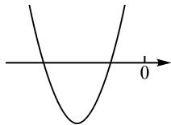
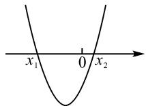
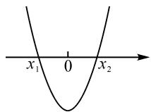
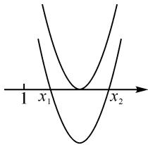

# 着眼“数形结合”，引发探究式学习

# ● 甘肃省天水市第二中学 侯丽洁

数形结合思想是在数与形互相补充的基础上，紧扣数形之间的本质联系，用“形”的直观来表达抽象的“数”，或以“数”的精确性来描绘直观的“形”的思想方法[1].探究性学习也可称为研究性学习，是在确立学习主题的情况下，学习者通过“做中学”的方式，搜集、处理相关的信息，在交流与探索中获得相应的知识与能力.这种学习方式不仅能发展学习者的情感态度与价值观，还能有效地培养其学科核心素养，形成良好的创造力.

一元二次方程实根分布与不等式、导数以及函数的零点等都有联系，该部分知识在高考试题中虽然出现的频次不高，但其对高中数学学习的基础作用不容小觑。究竟该从什么角度引发学生的自主探究，让学生建构完整的认知结构呢？为此，笔者以“一元二次方程实根分布”的教学为例，具体谈谈着眼“数形结合”，引发探究式学习的具体过程与方法。实践证明，将数形结合思想应用到本章节的教学中，配合探究式学习模式的开展，收效良好。

# 1 问题提出,诱发思考

问题 若不画图,请大家说说在什么条件下,方程 $ax^{2}+bx+c=0(a>0)$ 存在两个负根?

生1:由题意可知,假设方程的两个根分别为 $x_{1}$ , $x_{2}$ ，则有 $\left\{\begin{aligned}x_{1}+x_{2}<0,\\ x_{1}x_{2}>0,\\ \Delta\geqslant0.\end{aligned}\right.$

设计意图:通过问题情境的创设,引导学生的思考,可以引发学生产生探究行为.此问的设计建立在学生的“最近发展区”内,有利于学生结合初中阶段所接触过的一元二次方程根的情况进行分析,低起点易于激起学生的兴趣.

此问的关键在于引导学生撇开图形,从数的角度来分析,并运用一元二次方程根的情况与韦达定理获得限制条件.笔者也曾尝试过在本节课引导学生从“形”着手,让学生通过图象探究问题的本质,但过程明显不够流畅,而且不少学生提出了疑惑:为什么不能用初中所学过的知识解决呢？经实践探索，笔者发现引导学生从数的角度出发，获得限制条件更符合学生的认知规律.

# 2 不同方法,有效探究

数学是一门集灵活性与严谨性于一体的基础学科,在解决问题时,从不同的角度分析,常有不同的解题方法.为了激发学生的探究欲,教师可鼓励学生发散思维,尝试从多维度去思考,以发现更多解决问题的办法.

师:刚才大家是从“数”的角度分析了上述问题的限制条件,除此之外,还有其他办法吗?

设计意图: 在学生对从“数”的角度解决问题有所突破后, 再引导学生换个角度来看待问题, 以“形”为思维的起点, 充分体现了函数与方程思想、数形结合思想在解题中的应用. 教师鼓励学生将方程的根转化成函数的零点, 也就是利用函数图象与 x 轴的交点来解决问题, 此过程彰显了数学中重要的数形结合思想.

生2:还可以用“求根公式”解决问题.不妨记 $x_{1}=\frac{-b+\sqrt{b^{2}-4ac}}{2a},x_{2}=\frac{-b-\sqrt{b^{2}-4ac}}{2a}$ ，只要让两根均小于0即可，也就是 $\left\{\begin{aligned}x_{1}<0,\\ x_{2}<0.\end{aligned}\right.$

师:说说你们对这种解题方式的看法.

生 3: 这种方法是可行, 若根不容易求的时候, 计算会很烦琐.

师:不错,虽然这种方式从理论上来看没有问题,但可能会出现无理不等式,导致解题过程非常麻烦.大家还有其他解决办法吗?

生 4: 可以通过作简略图观察

(见图1)，应满足 $\left\{\begin{aligned}\Delta&\geqslant0,\\ -\frac{b}{2a}<0.\end{aligned}\right.$

  
图1

师:这个想法不错,从直观的

图形着手,可以准确地找出满足本题条件的图象,其他同学对此有没有什么意见?

生 5: 如图 2 所示, 只满足 $\Delta \geqslant 0$ 且 $-\frac{b}{2a} < 0$ 还不够. 若令 $f(x) = ax^{2} + bx + c$ , 还需添上 $f(0) > 0$ 的条件.

  
图2

师:是不是添上 $f(0)>0$ 的条件,就全面了呢?请大家检验一下,满足这三个条件的情况下,方程是否存在两个负根呢?

设计意图: 引导学生从多个角度分析与解决问题, 不仅给予了学生展示自己的机会, 还增进了课堂探究的实效性. 随着教师的启发, 学生自主画图着手探究问题的本质, 并在互相补充与检验中确保了答案的准确性. 这不仅体现了学生的主体性, 还彰显了“数”“形”转化的重要作用.

# 3 变式拓展,建构新知

变式拓展训练,通过一题多用或多题重组的方式从各个角度揭露问题的本质,不仅带给学生耳目一新之感,还能让学生在探究中对知识产生更为深刻的理解.同时,科学、合理的变式为学生的思维发展提供了明确的支架,此支架作为学生思维发展的台阶,能帮助学生建构新知,形成完整的认知体系 $^{[2]}$ .

变式 1 在什么条件下, 方程 $ax^{2} + bx + c = 0$ (a > 0) 存在一个正根和一个负根?

生 6:从“数”的角来看,设方程的两个根分别为 $x_{1}$ 和 $x_{2}$ , 则有 $\left\{\begin{aligned}\Delta&>0,\\ x_{1}&x_{2}<0.\end{aligned}\right.$

生7:从“形”的角度来看,令 $f(x)=ax^{2}+bx+c$ ,
则有 $\left\{\begin{aligned}\Delta&>0,\\ f(0)&<0.\end{aligned}\right.$

师:非常好! 大家能根据上一个问题的解题方法,从“数”与“形”两个角度来剖析问题,现学现用的做法值得鼓励与赞扬.现在我们一起来看,从“形”的角度解决此题的方法是否可以更加简单一些呢?

生 8: 如图 3 所示, 函数图象的开口向上, 当 $f(0) < 0$ 时方程有两个根, 那么 $\Delta > 0$ 可以省略.

  
图3

师: 不错, 我们只需要思考 $f(0) < 0$ 即可.

设计意图: 观察两个问题, 会发现教师都是引导学生从“数”与“形”两个角度来剖析问题的, 且两题的实质并没有差别, 只是出发点稍有区别. 此设计除了强化学生对数形结合思想的应用以外, 还在于培养学生的探究精神, 让学生感知、体会、领悟到从不同角度,运用不同的方法,都能解决问题.

变式 2 在什么条件下, 方程 $ax^{2} + bx + c = 0$ (a > 0) 存在两个大于 1 的根?

生 9: 设方程的两个根分别为 $x_{1}$ 和 $x_{2}$ ，则有

$$
\left\{ \begin{array}{l} \Delta \geqslant 0, \\ x _ {1} + x _ {2} > 2. \end{array} \right.
$$

师:这是从“数”的角度分析所得出的条件,但这个条件是否正确呢?还有也是通过“数”的角度来分析的同学吗?你们的想法是怎样的呢?

学生虽然对这个答案持有怀疑态度,但是很大一部分学生又无法独立找出准确答案,因此组织学生展开小组讨论,这样使大部分学生能从“数”的视角获得正确结论,同时也发挥了小组讨论在课堂探究中的重要作用.

生 10: 由 $x_{1}>1, x_{2}>1$ ，得 $x_{1}-1>0, x_{2}-1>0$ ，

且 $(x_{1}-1)(x_{2}-1)>0$ ，即 $\left\{\begin{aligned}\Delta&\geqslant0,\\ (x_{1}-1)+(x_{2}-1)&>0,\\ (x_{1}-1)(x_{2}-1)&>0.\end{aligned}\right.$

师:从“形”的角度分析,得到的条件又是什么呢?

生 11: 如图 4 所示, 方程需满

足条件 $\left\{\begin{aligned}\Delta&\geqslant0,\\ -\frac{b}{2a}&>1,\\ f(1)&>0.\end{aligned}\right.$

text_image

1 x₁ x₂

图4

设计意图: 探究式学习的关键

是探究的过程.变式的应用,为学生的探究提供了明确的方向.以上两个变式,由浅入深地体现了“一元二次方程实根分布”的本质,学生的思维随着探究的逐渐深入,对知识产生了更为深刻的理解.

总之，不论一节课的教学主题是什么，在教学设计时都应结合学生的认知特征与最近发展区，组织学生在层次清晰的问题中进行探索与研究，以不断优化思维，形成良好的数学思想。数形结合作为解题的一大法宝，可贯穿于整个教学过程，让学生在数与形的转化中，不断挖掘、联想，获得利于其终身可持续性发展的探究能力 $^{[3]}$ 。

# 参考文献：

[1] 徐慈平. 重视数形结合 培养学生能力 [J]. 初中数学教与学, 2014(6): 21-23.  
[2] 张宏. 从一道试题的多解性看思维的探究策略 [J]. 中学数学研究, 2004(2): 41-42.  
[3]施良方,崔允漷.教学理论:课堂教学的原理、策略与研究[M].上海:华东师范大学出版社,1999.Z