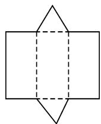
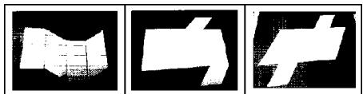

# 结构化教学在高中数学教学中的应用

# 山东省菏泽市第三中学 韩杰

摘要: 结构化是指引导学生将积累起来的知识、学习方法、数学思想等进行归纳整理, 让它们变得更具结构化与条理性, 达到纲举目张之效. 本文中以“立体几何中的棱柱”教学为例, 说明在教学过程中如何运用概念的结构化、教学过程的结构化与思维的结构化进行教学.

关键词: 结构化; 立体几何; 教学

数学是一门研究结构的基础学科,如知识间的联系构成了知识结构,学习者掌握的教学内容组成了认知结构,课堂有序的教学设计形成了教学结构 $^{[1]}$ .棱柱是高中阶段的基础知识之一,对培养学生的应用能力与核心素养具有重要作用,它还是探索立体几何不可或缺的工具.究竟该如何将结构化教学模式有机地融合在立体几何的棱柱教学中呢?这是个值得探索的话题,现从概念结构化、教学过程结构化、思维结构化几方面展开分析,供参考.

# 1 概念结构化

概念的结构化要经过如下几个环节.

# 1.1 抽象概念

借助多媒体向学生展示不同类型的几何体,要求学生观察它们的特征,用自己的方法进行分类,为获得概念的本质奠定基础(此为认识立体几何的第一层).经交流,形成了如下几种分类方法:①根据几何体组成的基本元素来分,可得多面体与旋转体;②按照几何体组成的基本元素的位置关系来分,可得棱柱与棱锥.关于棱柱的探索,可借助实验操作,引导学生根据棱柱的共性特征明确棱柱的概念.

# 1.2 判断概念

分析由哪些几何图形组成了三维几何体,思考这些图形间的形状与位置具有怎样的关系(第二层).答案分别为:组成要素有底面与侧面(二维)、棱(一维);从形状与位置上来说,分别是平面多边形与平行关系.借助实操活动,从三维的视角理解棱柱.

# 1.3 理解概念

对概念的理解,首先要确定如何用图形语言(文字语言)对几何体进行描述,同时,学会用反例辨析概念,深化学生对概念(第三层)的认识.具体从如下几方面理解概念:①用文字对定义进行描述,用实物进行样例的表征,用直观的图形进行图的表征;②从反例的角度分析,如能否将棱柱的概念进行随意地更改?

# 1.4 概念的功能

分别结合几何图形的形状与位置进行探索,以进一步强化对概念外延的认识,并将所获得的结论灵活应用到相应的几何体中(第四层).从棱柱底面的多边形、侧棱与底面关系、底面是不是正多边形等角度出发进行分类,可获得三棱柱、四棱柱等,直棱柱(包含正棱柱)、斜棱柱等,再基于例题在几何公理体系下对问题作出判断与推理,充分彰显概念的功能.

从以上四个环节来看,对于棱柱这样一个小概念就能从多个维度展开探索,该探索过程属于教学的明线,除此之外还可以遵循如下探索路径:情境—分析—变式—应用.整个教学过程,除了要关注学生对知识的掌握程度之外,还要关注概念的应用、知识体系的建构等.实践证明,探索立体几何同类概念,可遵循类似的研究方法,此为教学的暗线.

# 2 教学过程结构化

教学过程的结构化主要蕴含了两层含义,第一层为教材所展示的逻辑结构顺序,第二层为学生学习过程的结构 $^{[2]}$ .事实证明,教材结构是处于静止的状态,因此对教材的研究一般展现出平铺直叙的状态,而真正意义上的学习过程却是动态且充满朝气的,无时无刻不凸显出学生的思维与探索过程.将二者有机地结合在一起实现教学的结构化,是发展学习能力的主要渠道.根据棱柱的特点,教师可借助实验操作法实施结构化教学.

活动一: 实操激趣, 初步感知.

师:大家在之前的学习中,已经接触过“棱柱”这一立体图形,现在给大家一点时间,请以小组为单位,借助你们身边现有的材料制作一个棱柱,并说说制作过程.

生 1: 将卡纸分别剪裁出三个长方形与两个三角形, 再拼接在一起就形成了一个棱柱.

生 2: 将六本书拼搭在一起形成长方体, 长方体属于四棱柱.

生 3: 将长度一样的笔作为棱……

各组展示出不一样的操作方法,可见学生思维的开放性与灵活性,课堂也因这样一个活动而变得充满趣味.虽然学生的参与热情很高,但拼接出来的图形精确度却不够.为了凸显数学的严谨与周密性,教师将教学方案进行如下调整,以促进学生结构化思维的发展,发展理性精神.

活动二:调整方案,精益求精.

师:请将一张卡纸剪裁、折叠,令其形成棱柱.

活动要求:折叠成棱柱的卡纸在展开之后,还是一张完整的纸张.

生 4: 如图 1, 通过画图、剪裁、折叠, 可形成一个完整的三棱柱, 而且将图形展开之后, 不会散落.

师:很好！这个图大家熟悉吗？

生 5: 初中阶段我们学过的三棱柱侧面展开图就是这样的.

  
图 1

生 6: 我认为制作棱柱不需要这么复杂, 比如将讲台上的粉笔盒拆开再折叠一下, 就形成了一个四棱柱.

对于该生的说法,班级同学一致认同.在这位学生的启发下,其他学生很快打开了思维,并提出了匪夷所思的一些建议.为了增强学生思维的结构性,让学生构建完整、精确的知识结构,教师又提出新的要求.

活动三:深度思考,知识建构.

与上一个活动要求类似,要求学生将一张卡纸剪裁、折叠,形成斜五棱柱,并确保展开之后的纸张完整不散落.

小组合作学习,学生积极开动脑筋讨论与交流,提出各种各样的剪裁与折叠方法.教师选择一些典型折法进行投影展示(如图2),以凸显学生思维的灵活性.学生在此过程中,不仅进一步感知了棱柱概念的抽象过程,也体会到数学学习的乐趣所在.

natural_image

Three abstract geometric shapes in white on black background, no text or symbols present

图2

实操活动的开展,让学生对立体几何中的棱柱有了更加直观的认识,为构建完整的知识架构、形成结构化的思维夯实了基础.同时,该教学过程引导学生与之前学过的内容进行类比,促使学生自主交流与思考,凸显了教育的“生本”理念,此为发展学力的根本.

# 3 思维结构化

思维结构化关乎如下几个重要问题：“怎么发现”“怎么思考”“几何性质是什么”等，这是一种具有逻辑特征的思考[3].如认识立体几何，则需思考怎样观察与总结，怎样概括概念的内涵与外延等.究竟如何研究空间图形点、线、面之间的性质呢？怎么想到类似于垂直、平行的关系呢？这些都属于本源性问题，对发展学生的思维具有重要价值.以“线面平行”的性质定理教学为例.

假设直线 l 和平面 $\alpha$ 平行, 将二者固定住, 已知 m 为平面 $\alpha$ 内任意一条直线, 分析直线 l 与 m 之间具有怎样的位直关系. 若让直线 m 动起来, 很容易获得直线 l 与 m 为平行或异面关系.

若 $l \parallel m$ ，那么根据直线 $l, m$ 可确定一个平面 $\beta$ ，则有 $a \cap \beta = m$ ，根据 $l \parallel m$ 可抽象出线面平行的性质；若直线 $l$ 与 $m$ 异面，可过直线 $l$ 作平面 $\gamma$ ，假设 $a \cap \gamma = n$ ，根据 $l \parallel n$ ，则直线 $n$ 和 $m$ 的夹角是异面直线 $l$ 与 $m$ 所成的角。

接下来则需分析关于“面面平行”相关的性质,假设 $\alpha$ 与 $\beta$ 是互为平行的两个平面,固定住它们,并让位于这两个平面内的直线进行运动,此时不难看出两个平行平面内的直线仅有异面与平行两种情况.

总之，结构化教学是新课标对一线教师提出的要求，我们应不打折扣地将它落到实处。以立体几何来说，它作为数学的一个分支，具有深刻的内涵。作为教师，应充分关注结构化教学的优势，带领学生在探索中发现并建构新知，这是发展学生整体思想，形成良好认知结构的基础。

# 参考文献：

[1]霍华德·加德纳.智能的结构[M].兰金仁,译.北京:光明日报出版社,1990.  
[2]席爱勇,吴玉国.指向数学素养生长的三维结构化加工[J].教学与管理,2019(5):42-44.  
[3]吴晗清,宋超,吴涵挚.化学课堂提问结构化的实践探索[J].教育理论与实践,2020,40(14):55-58.Z