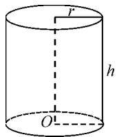
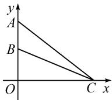

# 例析运用不等式求最值的五种方法

# 湖北省大悟县第一中学 周庆

摘要:运用不等式求最值,要求学生具有扎实的数学基础知识,以及严谨、全面地分析问题和灵活地解决问题的能力.运用不等式求最值时,通常要将待求式变形以构造函数,并且要满足使用不等式求最值的3个条件,还要注意判断函数的定义域.

关键词: 变形转化; 构造法; 运用消元; 配凑定值; 函数单调性

“不等式”是人教 A 版高中数学必修五第三章的内容, 是高考必考的重要内容之一. 不等式的最值问题可涉及代数、三角、立体几何及解析几何各个部分知识, 在实际生活实践中也有广泛的应用. 运用不等式法求最值, 就是通过代数式的变形, 将函数解析式化为具有基本不等式或均值不等式的结构特征, 从而利用基本不等式或均值不等式求最值. 运用不等式法求最值时, 要做到“三个确保”: 一确保等号成立的条件; 二确保和或者积为定值 (常数), 有时需要配凑出定值; 三确保两数都是正数, 或者当两数都为负数时可提取负号.

运用不等式法求最值,要根据代数式的特征灵活变形,配凑出积或和为常数的形式,然后再利用基本(均值)不等式求解.下面介绍五种最常用的方法.

# 1 变形转化法

使用基本不等式求最值时,应先将待求式变形,使之满足使用基本不等式求最值的条件.例如,当求形如 $\frac{f(x)}{g(x)}$ 的函数最值时,若 $f(x)$ 的次数高于 $g(x)$ 的次数,可以首先考虑将其转化为用基本不等式或函数单调性求最值.

例 1 求函数 $y=\frac{(x+5)(x+2)}{x+1}(x\neq-1)$ 的值域.

解:由题意得 $y=\frac{(x+5)(x+2)}{x+1}=\frac{x^{2}+7x+10}{x+1}=$ $\frac{(x+1)^{2}+5(x+1)+4}{x+1}=x+1+\frac{4}{x+1}+5.$

当 $x + 1 > 0$ ，即 $x > -1$ 时，

$$
y \geqslant 2 \sqrt {(x + 1) \cdot \frac {4}{x + 1}} + 5 = 9,
$$

当且仅当 x=1 时, 等号成立.

当 $x + 1 < 0$ ，即 $x < -1$ 时，

$$
y \leqslant 5 - 2 \sqrt {(x + 1) \cdot \frac {4}{x + 1}} = 1,
$$

当且仅当 x = -3 时，等号成立。

所以函数的值域为 $y \in (-\infty, 1] \cup [9, +\infty)$ .

方法与技巧: 因为本题中函数式分母的次数低于分子的次数, 所以首先要将其变为形如 $f(x)=Ax+\frac{B}{x}+C$ 的式子, 再运用基本不等式求最值. 由此可得出这类题型的求解规律. 当分子次数低时, 可分子分母同除以分子; 当分子次数高时, 可直接用分母除分子, 从而变形为 $y=m+\frac{k}{m}$ 的形式.

# 2 运用构造法

在利用基本不等式求最值时,很多时候需要根据原式的特征进行灵活变形,构造出积或和为常数的形式,然后再利用不等式求解.

例 2 设 x, y, z 是正实数，且 $2x + 4y + 9z = 16$ . 求 $6\sqrt{x} + 4\sqrt{y} + 3\sqrt{z}$ 的最大值.

解: 令 $u = 6\sqrt{x} + 4\sqrt{y} + 3\sqrt{z}$ ，则 $u^{2} = (6\sqrt{x} + 4\sqrt{y} + 3\sqrt{z})^{2} = (3\sqrt{2} \cdot \sqrt{2x} + 2 \cdot \sqrt{4y} + 1 \cdot \sqrt{9z})^{2} \leqslant [(3\sqrt{2})^{2} + 2^{2} + 1^{2}][(\sqrt{2x})^{2} + (\sqrt{4y})^{2} + (\sqrt{9z})^{2}] = (18 + 4 + 1)(2x + 4y + 9z) = 23 \times 16.$

所以 $u \leqslant 4\sqrt{23}$ , 当且仅当 $\frac{9}{x} = \frac{1}{y} = \frac{1}{9z}$ , 即 $x = \frac{144}{23}, y = \frac{16}{23}, z = \frac{16}{207}$ 时, 等号成立.

故 $6\sqrt{x} + 4\sqrt{y} + 3\sqrt{z}$ 的最大值为 $4\sqrt{23}$ .

方法与技巧: 利用基本不等式, 构造关于某个变量的不等式, 解此不等式便可求出该变量的取值范围, 再验证等号是否成立, 便可确定该变量的最值, 这是求最值问题的常用方法. 本题主要应用了柯西不等式, 在应用公式时, 通过敏锐的观察构造出已知条件等式 $2x + 4y + 9z = 16$ 是最关键的一步, 也最具有技巧性和解题意义.

# 3 运用消元法

消元法,就是根据条件建立两个量之间的函数关系,然后代入代数式转化为函数的最值求解.求解过程中有时会出现多元的问题,解决方法是消元后利用基本(均值)不等式求解.

例 3 已知 x>0, y>0, $x+3y+xy=9$ ，求 $x+3y$ 的最小值.

解法 1: 由题意, 可知 0 < y < 3.

因此 $x + 3y = \frac{9 - 3y}{1 + y} + 3y = \frac{12}{1 + y} + 3(y + 1) - 6 \geqslant 2\sqrt{\frac{12}{1 + y} \cdot 3(y + 1)} - 6 = 6$ ，当且仅当 $\frac{12}{1 + y} = 3(y + 1)$ ，即 $y = 1, x = 3$ 时，等号成立。故 $x + 3y$ 的最小值为6。

解法 2: 由 x > 0, y > 0, 得 $9 - (x + 3y) = xy = \frac{1}{3}x \cdot (3y) \leqslant \frac{1}{3}\left(\frac{x + 3y}{2}\right)^{2}$ , 当且仅当 x = 3y 时, 等号成立.

设 $x + 3y = t > 0$ ，则 $t^2 + 12t - 108 \geqslant 0$ ，可化为 $(t - 6)(t + 18) \geqslant 0$ ，又因为 $t > 0$ ，所以 $t \geqslant 6$ .

故当 x=3, y=1 时， $x+3y$ 的最小值为 6.

方法与技巧:本题的解法1采用了代入消元法,体现了函数思想,使代数式转化为含有一个变量的函数,把等式转化为不等式,基本不等式是转化的桥梁;解法2的技巧是利用基本不等式把条件方程转化为关于 $x+3y$ 的不等式.

# 4 配凑定值法

运用基本不等式求最值,必须要有定值,没有定值时要根据已知条件设法配凑定值,同时还要匹配适当的系数.

例 4 市面上常见的食品罐头的形状大多为正圆柱形,如果制造容积一定的罐头,它的尺寸应怎样设计才能做到用料最省?

解法1:所求问题实际上可以转化为求圆柱体的全面积问题.如图1,设罐头的高度为h,底面圆半径为r,则罐头的容积为 $V=\pi r^{2}h$ ,罐头的全面积为 $S=2\pi r^{2}+2\pi rh$ .

  
图1

由 $V = \pi r^2 h$ ，得 $h = \frac{V}{\pi r^2}$

所以 $S = 2\pi r^2 + 2\pi r\left(\frac{V}{\pi r^2}\right) = 2\pi r^2 + \frac{2V}{r}$ .

上式可变形为 $S = 2\pi r^2 + \frac{V}{r} + \frac{V}{r}$ . 因为 $2\pi r^2 \cdot \frac{V}{r} \cdot \frac{V}{r} = 2\pi V^2$ (定值), 所以当 $2\pi r^2 = \frac{V}{r}$ , 即 $r = \sqrt[3]{\frac{V}{2\pi}}$ 时, $S$ 有最小值.

由 $V = 2\pi r^3$ ，得 $h = \frac{V}{\pi r^2} = \frac{2rV}{2\pi r^3} = 2r.$

所以,当罐头的高度等于它的直径时,所用的材料最省.

解法 2: 罐头的全面积 $S = 2\pi r^{2} + 2\pi rh = 2\pi r^{2} + \pi rh + \pi rh$ . 因为 $2\pi r^{2} \cdot \pi rh \cdot \pi rh = 2\pi^{3} r^{4} h^{2} = 2\pi V^{2}$ (是定值), 所以当 $2\pi r^{2} = \pi rh$ , 即 h = 2r 时, S 有最小值.

方法与技巧:本题主要考虑在 V 一定时,高 h 和半径 r 应当具有怎样的比例,从而使 S 有最小值.两种解法中都对原式的某一边进行了变形,目的都是为了凑定值,以便于求最值.

# 5 利用函数的单调性

函数的单调性是函数在一个区间上的性质,它既反映了函数递增或递减的状况,又能帮助我们求解函数的极值.应用均值不等式求函数的最值时,要注意使用不等式的条件,等号成立的条件,等等.

例 5 如图 2, 在平面直角坐标系中, 在 y 轴的正半轴 (坐标原点除外) 上给定两个点 A, B. 试在 x 轴的正半轴 (坐标原点除外) 上求点 C, 使 $\angle ACB$ 取得最大值.

  
图2

解: 设点 A, B 的坐标分别为 $(0, a)$ , $(0, b)$ , 其中 0 < b < a; 又设点 C 的坐标为 $(x, 0)$ , 其中 x > 0.

设 $\angle BCA = \alpha, \angle OCB = \beta$ ，显然 $\alpha \in \left(0, \frac{\pi}{2}\right)$ ，且 $\angle OCA = \alpha + \beta$ .

根据图 2, 可得 $\tan \alpha = \tan[(\alpha + \beta) - \beta] = \frac{\tan(\alpha + \beta) - \tan \beta}{1 + \tan(\alpha + \beta) \tan \beta} = \frac{\frac{a}{x} - \frac{b}{x}}{1 + \frac{ab}{x^{2}}} = \frac{a - b}{x + \frac{ab}{x}}.$

因为 $x > 0, \frac{ab}{x} > 0$ ，又 $x \cdot \frac{ab}{x} = ab$ 为定值，所以 $x + \frac{ab}{x} \geqslant 2\sqrt{x \cdot \frac{ab}{x}} = 2\sqrt{ab}$ ，当且仅当 $x = \frac{ab}{x}$ ，即 $x = \sqrt{ab}$ 时，等号所立。即当 $x = \sqrt{ab}$ 时， $x + \frac{ab}{x}$ 有最小值 $2\sqrt{ab}, \tan \alpha$ 有最大值 $\frac{a - b}{2\sqrt{ab}}$ ，此时点 $C$ 的坐标为 $(\sqrt{ab}, 0)$ 。

方法与技巧:本题灵活地利用正切函数的单调性来求角的最值,其中角的拆变也是值得学习和掌握的一种解题技巧.

从对上述典型例题的方法与技巧分析中可以看出,运用不等式求最值的七种方法既可单独使用,也可几种方法灵活、综合使用,以达到一题多解的目的.运用之妙,存乎一心,随着题型和已知条件的变化,解题的方法也要随之变化.Z