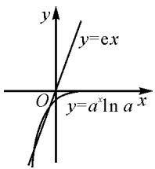

# 利用导数求函数最值的三种方法

# ●甘肃省高台县第一中学 郭惠英

摘要: 新课标要求学生学会并运用转化与分类讨论等思想解决实际问题, 能够利用导数求某些函数的极值、最值. 在教学中, 教师既要让学生熟练掌握实用的解题方法, 更要注重开拓他们的解题思路, 不断提高解题效率和准确率.

关键词: 分类讨论法; 消元转化法; 判断单调性法; 构建新函数

关于求函数最值与极值的问题,近年来在高考全国卷以及各地的自主命题卷中多次出现,多以选择题、填空题的形式出现,也与其他知识交汇在解答题中呈现,“最值与极值”问题逐渐成为高考的高频考点与热点 $^{[1]}$ ,在备考中应予以高度重视.

利用导数求函数的最值是一种十分简捷有效的好方法,具体解题思路是:先构造函数,明确定义域,求导;再求变号零点;最后求原函数的最值(极值).求函数 $f(x)$ 在 $[a,b]$ 上的最大值和最小值的基本步骤是:先求函数 $f(x)$ 在 $(a,b)$ 上的极值;再求函数 $f(x)$ 在区间端点的函数值 $f(a),f(b)$ ;最后将函数 $f(x)$ 的各极值与 $f(a),f(b)$ 作比较,其中最大的一个为最大值,最小的一个为最小值.

下面结合典型例题,探讨运用导数求解函数最值问题的思路与方法.

# 1 分类讨论法

运用分类讨论法求函数最值的基本思路是,把整体问题化为部分问题来解决,化成部分问题后,增加了题设条件.解答这类题型的步骤是:①确定分类讨论的对象,即对哪个参数进行讨论;②对所讨论的对象进行合理分类(要求分类不重复、不遗漏、不越级、标准要统一);③逐类讨论;④归纳总结.

例 1 （2022 年全国乙卷理科数学第 16 题）已知 $x = x_{1}$ 和 $x = x_{2}$ 分别是函数 $f(x) = 2a^{x} - \mathrm{ex}^{2} (a > 0$ 且 $a \neq 1$ 的极小值点和极大值点。若 $x_{1} < x_{2}$ ，则 a 的取值范围是 \_\_\_\_。

解析: $f'(x)=2a^{x}\ln a-2ex$ . 因为 $x_{1}, x_{2}$ 分别是函数 $f(x)=2a^{x}-\mathrm{e}x^{2}$ 的极小值点和极大值点, 所以函数 $f(x)$ 在 $(-∞, x_{1})$ 和 $(x_{2}, +∞)$ 上单调递减, 在 $(x_{1}, x_{2})$ 上单调递增. 故当 $x ∈ (-∞, x_{1}) ∪ (x_{2}, +∞)$ 时, $f'(x) < 0$ ; 当 $x ∈ (x_{1}, x_{2})$ 时, $f'(x) > 0$ .

若 a>1，当 x<0 时， $2a^{x}\ln a>0,2ex<0$ ，则此时$f'(x)>0$ , 与上述矛盾, 故 a>1 不符合题意.

若 0 < a < 1，则方程 $2a^{x} \ln a - 2ex = 0$ 的两个根为 $x_{1}, x_{2}$ ，即方程 $a^{x} \ln a = ex$ 的两个根为 $x_{1}, x_{2}$ ，即函数 $y = a^{x} \ln a$ 与函数 $y = ex$ 的图象有两个不同的交点.

令 $g(x)=a^{x}\ln a$ ，则 $g'(x)=a^{x}\ln^{2}a,0<a<1.$

设过原点的直线与函数 $y=g(x)$ 图象相切于点 $(x_{0},a^{x_{0}}\ln a)$ ，又切线的斜率为 $g'(x_{0})=a^{x_{0}}\ln^{2}a$ ，故过原点的切线方程为 $y-a^{x_{0}}\ln a=a^{x_{0}}\ln^{2}a(x-x_{0})$ ，则有 $-a^{x_{0}}\ln a=-x_{0}a^{x_{0}}\ln^{2}a$ ，解得 $x_{0}=\frac{1}{\ln a}$ ，所以切线的斜率为 $\ln^{2}a\cdot a^{\frac{1}{\ln a}}=\mathrm{e}\ln^{2}a$ 。

因为函数 $y = a^{x}\ln a$ 与函数 $y = \mathrm{e}x$ 的图象有两个不同的交点（如图1），所以 $\mathrm{e}\ln^2 a < \mathrm{e}$ ，解得 $\frac{1}{\mathrm{e}} < a < \mathrm{e}$ .

text_image

y
y=ex
O
y=a^xln a x

图1

又 0 < a < 1，故 $\frac{1}{e} < a < 1$ .

综上所述，a 的取值范围为 $\left(\frac{1}{\mathrm{e}},1\right)$ .

思路与方法:本题主要采用了分类讨论的方法.由 $x_{1},x_{2}$ 分别是函数 $f(x)=2a^{x}-\mathrm{e}x^{2}$ 的极小值点和极大值点,可得当 $x\in(-\infty,x_{1})\cup(x_{2},+\infty)$ 时, $f'(x)<0$ ,当 $x\in(x_{1},x_{2})$ 时, $f'(x)>0$ ;再分a>1和0<a<1两种情况讨论,方程 $2a^{x}\ln a-2\mathrm{e}x=0$ 的两个根为 $x_{1},x_{2}$ ,即函数 $y=a^{x}\ln a$ 与函数 $y=\mathrm{e}x$ 的图象有两个不同的交点,构造函数 $g(x)=a^{x}\ln a$ ;最后根据导数的意义并结合图象即可获解.

# 2 消元转化法

消元转化法求最值是换元法与转化思想的综合运用.其解题思路是,通过设元消参与转化的方法,将不熟悉和难解的求最值问题转化为熟知的、易解的或已经解决的问题,将抽象的问题转化为具体的、直观的问题,将复杂的问题转化为简单的问题,将一般性的问题转化为直观的、特殊的问题,将实际问题转化为数学问题来解决.

例 2 已知函数 $f(x)=\mathrm{e}^{x}, g(x)=\sqrt{2x}$ ，若 $f(m)=g(n)$ 成立，则 n-m 的最小值为（）.

A. $\frac{1}{2}$

B.1

C. $2-\ln2$

D. $2+\ln2$

解法 1: 由 $f(m)=g(n)$ ，得 $e^{m}=\sqrt{2n}$ ，解得 $n=\frac{1}{2}e^{2m}(m\in\mathbf{R})$ .

设 $h(m) = n - m = \frac{1}{2}\mathrm{e}^{2m} - m$ ，则 $h^{\prime}(m) = \mathrm{e}^{2m} - 1.$

由 $h'(m)>0$ ，得 m>0；由 $h'(m)<0$ ，得 m<0 。所以 $h(m)$ 在 $(-∞,0)$ 上单调递减，在 $(0,+∞)$ 上单调递增，从而得到 $(n-m)_{\min}=h(0)=\frac{1}{2}$

故正确答案为:A.

解法2: 令 $f(m)=g(n)=t$ ，即 $e^{m}=\sqrt{2n}=t$ ，则 $m=\ln t, n=\frac{1}{2}t^{2}$ 。设 $h(t)=n-m=\frac{1}{2}t^{2}-\ln t, t>0$ ，则 $h'(t)=t-\frac{1}{t}=\frac{t^{2}-1}{t}$ 。由 $h'(t)>0$ ，得 t>1，由 $h'(t)<0$ ，得 0<t<1，则 $h(t)$ 在 $(0,1)$ 上单调递减，在 $(1,+\infty)$ 上单调递增，所以 $(n-m)_{\min}=h(1)=\frac{1}{2}$ 。

故正确答案为:A.

思路与方法:本题利用 $f(m)=g(n)$ ，对 n-m 消元，将问题转化为单变量函数，再应用导数求函数的最小值。在解题过程中，根据需要可采用多种变形，如
① $m=\ln\sqrt{2n}(n>0)$ ; ② $n=\frac{1}{2}e^{2m}$ ; ③令 $e^{m}=\sqrt{2n}=t$ ，则 $m=\ln t, n=\frac{1}{2}t^{2}$ ; 等等.

# 3 判断单调性法

通过判断函数在某个区间上的单调性或者通过单调性得出函数的图象来求函数的最值,是最常用最简捷的一种方法.利用导数研究函数的单调性,关键在于准确判定导数的符号,当 $f(x)$ 含参数时,需要依据参数取值对不等式解集的影响进行分类讨论.

例 3 已知函数 $f(x)=ax^{3}+x^{2}+bx$ (其中常数 $a, b \in R$ ), $g(x)=f(x)+f'(x)$ 是奇函数.

(1) 求 $f(x)$ 的表达式；  
(2) 讨论 $g(x)$ 的单调性, 并求 $g(x)$ 在区间 $[1,2]$

上的最大值与最小值.

解析:(1)由题意得 $f'(x)=3ax^{2}+2x+b$ ，因此 $g(x)=f(x)+f'(x)=ax^{3}+(3a+1)x^{2}+(b+2)x+b$ 。因为函数 $g(x)$ 是奇函数，所以 $g(-x)=-g(x)$ ，即对任意实数 x，都有 $a(-x)^{3}+(3a+1)(-x)^{2}+(b+2)(-x)+b=-\left[ax^{3}+(3a+1)x^{2}+(b+2)x+b\right]$ ，于是 $3a+1=0, b=0$ ，解得 $a=-\frac{1}{3}, b=0$ 。

故 $f(x)$ 的表达式为 $f(x)=-\frac{1}{3}x^{3}+x^{2}$ .

(2)由(1)知 $g(x)=-\frac{1}{3}x^{3}+2x$ ，所以 $g'(x)=-x^{2}+2$ 。令 $g'(x)=0$ ，解得 $x=-\sqrt{2}$ ，或 $x=\sqrt{2}$ 。

当 $x < -\sqrt{2}$ , 或 $x > \sqrt{2}$ 时, $g'(x) < 0$ , 从而 $g(x)$ 在区间 $(- \infty, -\sqrt{2}]$ , $[\sqrt{2}, + \infty)$ 上是减函数.

当 $-\sqrt{2}<x<\sqrt{2}$ 时， $g'(x)>0$ ，从而 $g(x)$ 在区间 $[- \sqrt{2},\sqrt{2}]$ 上是增函数.

综上可知， $g(x)$ 在区间 $[1,2]$ 上的最大值与最小值只可能在 $x=1,\sqrt{2},2$ 时取得。而 $g(1)=\frac{5}{3},g(\sqrt{2})=\frac{4\sqrt{2}}{3},g(2)=\frac{4}{3}$ ，因此 $g(x)$ 在区间 $[1,2]$ 上的最大值为 $g(\sqrt{2})=\frac{4\sqrt{2}}{3}$ ，最小值为 $g(2)=\frac{4}{3}$ 。

思路与方法:本题的第(2)问是函数在闭区间上的最值问题,关键是判断函数在该区间上的单调性,因为通过单调性即可得出函数的大致图象,进而求出最值,所以就可以避免比较端点值与极值的大小 $^{[2]}$ .由此可见,利用函数的单调性是解决函数极值问题的一个重要方法.

综上所述,利用导数求函数的最值时,首先要确定和判别函数的极大值和极小值,判断函数是否有极大值,就是判断 $f'(x)$ 是否有左正右负的零点,判断是否有极小值,就是判断 $f'(x)$ 是否有左负右正的零点;其次是要掌握求函数最值的常用方法与步骤.在具体解题过程中,有时需要对问题进行转化,构建新的函数,再用导数解决问题.

# 参考文献：

[1] 吴永娇. 聚焦函数与导数中的最值问题 [J]. 中学生数理化 (高考数学), 2021(5): 18-20.  
[2] 李红磊. 突破函数与导数问题的几种策略 [J]. 高中数理化, 2022(15): 60-61. Z