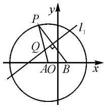

# 构建韦达定理模型求解圆锥曲线问题\*

# ●广东省梅州市虎山中学 张俊畅 杨柳忠

对于韦达定理,学生都很熟悉,但实际解题中,有时却很难想到去运用它.本文就圆锥曲线解题教学中,涉及到以韦达定理的知识为背景的问题,通过数学建模的方法,探寻它在解析几何方面的应用,以期达到对定理加深理解和提高学生数学建模能力的目的.

# 1 解决形如 $|x_{1} - x_{2}|, |y_{1} - y_{2}|$ 的计算问题

# (1)求直线被圆锥曲线所截得的弦长问题

例 1 已知双曲线 C 的方程为 $\frac{x^{2}}{8}-\frac{y^{2}}{6}=1$ ，其左、右顶点分别为 $A_{1}, A_{2}$ ，一条垂直于 x 轴的直线交双曲线 C 于 $P_{1}, P_{2}$ 两点，直线 $A_{1}P_{1}$ 与直线 $A_{2}P_{2}$ 相交于点 P，过点 $Q(\sqrt{2}, 0)$ 的直线 l 与点 P 的轨迹 E 交于 A, B 两点，线段 AB 的垂直平分线交 x 轴于点 M，试探讨 $\frac{|AB|}{|MQ|}$ 是否为定值。说明理由。

解:由题意知 $A_{1}\left(-2\sqrt{2},0\right)$ , $A_{2}\left(2\sqrt{2},0\right)$ . 设直线为 $x=x_{0}$ , $P_{1}\left(x_{0},y_{0}\right)$ , $P_{2}\left(x_{0},-y_{0}\right)$ , $P(x,y)$ .

由 $A_{1}, P_{1}, P$ 三点以及 $A_{2}, P_{2}, P$ 三点共线，得 $\frac{y - 0}{x + 2\sqrt{2}} = \frac{y_0}{x_0 + 2\sqrt{2}}, \frac{y - 0}{x - 2\sqrt{2}} = \frac{-y_0}{x_0 - 2\sqrt{2}}$ ，两式相乘，化简得 $\frac{y^2}{x^2 - 8} = -\frac{y_0^2}{x_0^2 - 8}$ . 又 $\frac{x_0^2}{8} - \frac{y_0^2}{6} = 1$ ，所以可得轨迹 $E$ 的方程为 $\frac{x^2}{8} + \frac{y^2}{6} = 1$ .

显然,直线 l 不垂直于 x 轴.

① 当 k=0 时, 易得 $\frac{|AB|}{|MQ|}=4$ .

②当 $k \neq 0$ 时，设直线 $l$ 的方程为 $y = k(x - \sqrt{2})$ . 联立方程 $y = k(x - \sqrt{2})$ 与 $\frac{x^2}{8} + \frac{y^2}{6} = 1$ ，化简整理，得

$$
(3 + 4 k ^ {2}) x ^ {2} - 8 \sqrt {2} k ^ {2} x + 8 k ^ {2} - 2 4 = 0.
$$

设 $A(x_{1},y_{1})$ , $B(x_{2},y_{2})$ ，则由韦达定理，得

$$
x _ {1} + x _ {2} = \frac {8 \sqrt {2} k ^ {2}}{3 + 4 k ^ {2}}, x _ {1} x _ {2} = \frac {8 k ^ {2} - 2 4}{3 + 4 k ^ {2}}.
$$

故 $|AB| = \sqrt{1 + k^2} |x_1 - x_2| = \frac{12\sqrt{2}(k^2 + 1)}{4k^2 + 3}.$

线段 $AB$ 的中点 $D$ 的坐标为 $\left(\frac{4\sqrt{2}k^2}{3 + 4k^2},\frac{-3\sqrt{2}k}{3 + 4k^2}\right)$ 故 $AB$ 的中垂线为 $y + \frac{3\sqrt{2}k}{3 + 4k^2} = -\frac{1}{k}\left(x - \frac{4\sqrt{2}k^2}{3 + 4k^2}\right).$

令 $y = 0$ ，则 $M\left(\frac{\sqrt{2}k^2}{3 + 4k^2},0\right)$ ，由此可得 $\mid MQ\mid =$ $\left|\sqrt{2} -\frac{\sqrt{2}k^2}{3 + 4k^2}\right| = \frac{3\sqrt{2}(1 + k^2)}{3 + 4k^2}$ 所以 $\frac{|AB|}{|MQ|} = 4.$

综上,可得 $\frac{|AB|}{|MQ|}=4.$

问题模型: 这是一类直线被圆锥曲线所截得的弦长问题.

求解步骤:①分别求出直线方程和曲线方程;②设交点为 A, B, 联立直线方程与曲线方程, 消 y 或 x, 并化简为关于 x 或 y 的一元二次方程; ③由 $\left|AB\right|=\sqrt{1+k^{2}}\left|x_{1}-x_{2}\right|=\sqrt{1+k^{2}}\sqrt{(x_{1}+x_{2})^{2}-4x_{1}x_{2}}$ , 或 $\left|AB\right|=\sqrt{1+\frac{1}{k^{2}}}\sqrt{(y_{1}+y_{2})^{2}-4y_{1}y_{2}}$ 进行运算; ④利用韦达定理求弦长.

# (2) 利用模型求三角形的面积问题

例 2 已知椭圆 C 的两个焦点坐标分别为 $F_{1}(-2,0)$ , $F_{2}(2,0)$ ，并且经过点 $P(\sqrt{3},1)$ ，过椭圆 C 的右焦点 $F_{2}$ 作直线 l，直线 l 与椭圆 C 相交于 A, B 两点，与圆 $O: x^{2} + y^{2} = 6$ 相交于 D, E 两点，当 $\triangle ABO$ 的面积最大时，求弦 DE 的长.

解:由题意易得椭圆 C 的方程为 $\frac{x^{2}}{6} + \frac{y^{2}}{2} = 1$ .

易知直线 l 斜率不为 0，故可设 $l: x = ky + 2$ 。联立方程 $x = ky + 2$ 与 $\frac{x^{2}}{6} + \frac{y^{2}}{2} = 1$ ，消去 x，得

$$
(k ^ {2} + 3) y ^ {2} + 4 k y - 2 = 0.
$$

设 $A(x_{1},y_{1}), B(x_{2},y_{2})$ ，则有

$$
y _ {1} + y _ {2} = \frac {- 4 k}{k ^ {2} + 3}, y _ {1} y _ {2} = \frac {- 2}{k ^ {2} + 3}.
$$

所以 $S_{\triangle AOB} = S_{\triangle AOF_{2}} + S_{\triangle BOF_{2}} = \frac{1}{2} |OF_{2}|$

$$
\mid y _ {1} - y _ {2} \mid = \frac {2 \sqrt {6} \sqrt {k ^ {2} + 1}}{k ^ {2} + 3}.
$$

令 $t = \sqrt{k^2 + 1} (t \geqslant 1)$ ，则 $k^2 = t^2 - 1$ ，故 $S_{\triangle AOB} = \frac{2\sqrt{6}t}{t^2 + 2} = \frac{2\sqrt{6}}{t + \frac{2}{t}} \leqslant \frac{2\sqrt{6}}{2\sqrt{2}} = \sqrt{3}$ ，当且仅当 $t = \sqrt{2}$ 时，等号成立.

所以 $S_{\triangle AOB}$ 取最大值时， $\sqrt{k^{2}+1}=\sqrt{2}$ ，即 $k=\pm1$ ，此时直线 l 的方程为 $x\pm y-2=0$ ，点 O 到直线 l 的距离 $d=\frac{2}{\sqrt{2}}=\sqrt{2}$ .

故 $|DE|=2\sqrt{b^{2}-d^{2}}=4.$

问题模型: 这是一类过圆锥曲线一焦点的直线被曲线截得的线段(设为 AB)与原点 O 构成的三角形面积问题.

以焦点在 x 轴上的圆锥曲线为例,求解步骤如下:

①设出过焦点 $F(c,0)$ 的直线方程 $x=my+c$ (这里注意对 m 是否为 0 进行讨论);  
②设交点为 A, B，联立直线方程与曲线方程，消去 x，并化简为关于 x 的一元二次方程；  
③将 $\triangle AOB$ 分割为两个有相同底边的 $\triangle AOF$ 和 $\triangle BOF$ ，从而可知 $S_{\triangle AOB}=S_{\triangle AOF}+S_{\triangle BOF}=\frac{1}{2}|OF|$ 。

$$
\mid y _ {1} - y _ {2} \mid = \frac {1}{2} \mid O F \mid \sqrt {(y _ {1} + y _ {2}) ^ {2} - 4 y _ {1} y _ {2}};
$$

④利用韦达定理求 $\triangle AOB$ 的面积.

# 2 利用模型求方程的根

例 3 已知抛物线为 $y = -\frac{1}{2}x^{2} + h$ ，点 A, B 及点 P(2,4) 都在该抛物线上，直线 PA 与 PB 的倾斜角互补。证明：直线 AB 的斜率为定值。

证明: 把 $P(2,4)$ 代入 $y=-\frac{1}{2}x^{2}+h$ ，得 h=6，所以抛物线方程为 $y=-\frac{1}{2}x^{2}+6$ 。设直线 AP 的方程为 $y-4=k(x-2)$ ，联立 $y-4=k(x-2)$ 与 $y=-\frac{1}{2}x^{2}+6$ ，消去 y，化简得 $x^{2}+2kx-4k-4=0$ 。

由韦达定理，可得 $x_{A} = \frac{-4k - 4}{2} = -2k - 2, y_{A} = -2k^{2} - 4k + 4.$ 用 $-k$ 代替 $k$ ，得 $x_{B} = 2k - 2, y_{B} = -2k^{2} + 4k + 4$ ，所以 $k_{AB} = \frac{y_B - y_A}{x_B - x_A} = \frac{8k}{4k} = 2.$

上面问题可以归纳为以下问题模型: 过曲线 $f(x,y)=0$ 上一定点 $P(x_{0},y_{0})$ ，作一条直线 l 与该曲线交于两点，求另一交点 M 的坐标.

求解步骤:①设出过点 $P(x_{0},y_{0})$ 的直线 y-$y_{0}=k(x-x_{0})$ ，注意要对直线的斜率 k 是否存在展开讨论，这里不妨假设 k 存在；② 联立方程组 $\left\{\begin{aligned}y-y_{0}&=k(x-x_{0}),\\ f(x,y)&=0,\end{aligned}\right.$ 消去 y 得关于 x 的一元二次方程，化简为 $ax^{2}+bx+c=0$ ；③ 由韦达定理 $x_{M}+x_{0}=-\frac{b}{a}$ 或 $x_{M}x_{0}=\frac{c}{a}$ ，求另一交点的横坐标 $x_{M}=-\frac{b}{a}-x_{0}$ 或 $x_{M}=\frac{b}{ax_{0}}$ .（注： $x_{0}\neq0$ ）

这里说明一下,不管是选择韦达定理中的和式还是积式,求得的结果是一样的.

# 3 解决形如 $x_{1}=\lambda x_{2}$ 或 $y_{1}=\lambda y_{2}$ 的问题

例 4 如图 1, 已知圆 A: $(x+1)^{2} + y^{2} = 16$ , 点 B(1,0) 是圆 A 内一个定点, 点 P 是圆上任意一点, 线段 BP 的垂直平分线 $l_{1}$ 和半径 AP 相交于点 Q. 当点 P 在圆上运动时, 点 Q 的轨迹为曲线 C.

text_image

P
y
l₁
Q
A O B x

图1

设过点 $D(4,0)$ 的直线 $l_{2}$ 与曲线 C 相交于 M, N 两点(点 M 在 D, N 两点之间).
问: 是否存在直线 $l_{2}$ 使得 $\overrightarrow{DN}=2\overrightarrow{DM}$ ? 若存在, 求直线 $l_{2}$ 的方程; 若不存在, 请说明理由.

解: 存在直线 $l_{2}$ 使得 $\overrightarrow{DN}=2\overrightarrow{DM}$ .

由 $l_{1}$ 是线段 AP 的垂直平分线，得 $\left|QP\right|=\left|QB\right|$ ，所以 $\left|AP\right|=\left|AQ\right|+\left|QP\right|=\left|AQ\right|+\left|QB\right|=4.$

因为 $4 > |AB|$ ，所以点 Q 的轨迹是以 $A(-1,0)$ ， $B(1,0)$ 为焦点，长轴长 2a = 4 的椭圆.

所以曲线 C 的方程为 $\frac{x^{2}}{4} + \frac{y^{2}}{3} = 1$ .

当直线 $l_{2}$ 的斜率为 0 时， $M(2,0)$ ， $N(-2,0)$ ，此时 $\overrightarrow{DN}=(-6,0)$ ， $\overrightarrow{DM}=(-2,0)$ ，得 $\overrightarrow{DN}\neq2\overrightarrow{DM}$ .

因此可设直线 $l_{2}$ 的方程为 $x=ty+4$ ，设 $M(x_{1}, y_{1}), N(x_{2}, y_{2}), x_{1}>x_{2}$ .

联立 $\frac{x^{2}}{4}+\frac{y^{2}}{3}=1$ 与x=ty+4，消x化简得

$$
(3 t ^ {2} + 4) y ^ {2} + 2 4 t y + 3 6 = 0.
$$

由题意知 $\Delta=(24t)^{2}-4\times36(3t^{2}+4)>0$ ，解得 t<-2，或 t>2，则

$$
y _ {1} + y _ {2} = - \frac {2 4 t}{3 t ^ {2} + 4}, \tag {①}
$$

$$
y _ {1} y _ {2} = \frac {3 6}{3 t ^ {2} + 4}. \tag {②}
$$

由 $\overrightarrow{DN}=2\overrightarrow{DM}$ ，得 $y_{2}=2y_{1}$ ，所以

$$
\frac {(y _ {1} + y _ {2}) ^ {2}}{y _ {1} y _ {2}} = \frac {(y _ {1} + 2 y _ {1}) ^ {2}}{2 y _ {1} ^ {2}} = \frac {9 y _ {1} ^ {2}}{2 y _ {1} ^ {2}} = \frac {9}{2}. \tag {③}
$$

(下转封三)

(上接第78页)

把①②式代入③式，得 $\frac{24^2t^2}{(3t^2 + 4)^2}\times \frac{3t^2 + 4}{36} = \frac{9}{2},$ 解得 $t^2 = \frac{36}{5}$ ，即 $t = \pm \frac{6}{\sqrt{5}}$ ，满足 $t < -2$ ，或 $t > 2$

所以直线 $l_{2}$ 的方程为 $y = \frac{\sqrt{5}}{6} (x - 4)$ ，或 $y = -\frac{\sqrt{5}}{6} (x - 4)$ .

此题设直线 $l_{2}$ 的方程为 $x=ty+4$ ，联立直线 $l_{2}$ 的方程和椭圆方程，消 x 化简后，写出 $y_{1}+y_{2}$ 和 $y_{1}y_{2}$ ，再由 $\overrightarrow{DN}=2\overrightarrow{DM}$ ，得出两交点纵坐标的关系 $y_{2}=2y_{1}$ ，进而构造出 $\frac{(y_{1}+y_{2})^{2}}{y_{1}y_{2}}=\frac{9}{2}$ ，再整体运用韦达定理求解，显然计算量较少，不易出错，要注意对此法的领会与运用。

问题模型1: 直线 l 交圆锥曲线于 A, B 两点, 交 y 轴于点 $P(0, m)$ , 且 $\overrightarrow{AP} = \lambda \overrightarrow{BP} (\lambda > 0)$ , 求直线 l 的方程(这里以焦点在 x 轴上的椭圆为例).

求解步骤：

① 先检验直线斜率不存在时是否满足题意；  
② 设出直线 l 的方程: $y = kx + m$ , 联立方程;

③由 $\overrightarrow{AP}=\lambda\overrightarrow{BP}$ 寻找 $x_{1},x_{2}$ 的关系；

④求直线方程.

问题模型 2: 直线 l 交圆锥曲线于 A, B 两点, 交 x 轴于点 $P(m,0)$ , 且 $\overrightarrow{AP} = \lambda \overrightarrow{BP} (\lambda > 0)$ , 求直线 l 的方程(这里以焦点在 x 轴上的椭圆为例).

求解步骤：

① 先检验直线斜率为 0 时是否满足题意；  
② 设出直线 l 的方程；  
③由 $\overrightarrow{AP} = \lambda \overrightarrow{BP}$ 寻找 $y_{1}, y_{2}$ 的关系；  
④求直线方程.

在平时的教学中，把分散的、有共性的、有典型代表的问题，通过建模的形式，进行重新构建，重新探索，重新认识，这样不仅可以加深学生对此类问题的理解，同时还可以很好地锻炼学生发现问题、归纳问题、反思问题、解决问题的能力，锤炼学生的创新思维和动手能力。问题模型的构建是数学建模思想在平时教学中落地的一种有效途径，是改善学生学习方式的突破口，是学生学习能力和数学素养提高的一个重要标志，是体现数学解决问题和抽象思维过程的最好载体之一。Z

natural_image

Repeating pattern of red and orange flower-like shapes with no text or symbols

# 现代多元统计分析的奠基人——许宝騄

■复旦大学附属中学 汪杰良

许宝騄（1910-1970），字闲若，生于北京，原籍浙江杭州。中国数学家，教育家。1938年获得英国伦敦大学学院哲学博士学位；1940年又获得科学博士学位。中央研究院首届院士、中国科学院院士、西南联合大学教授、北京大学一级教授，曾任北京大学概率统计教研室首任主任、全国政协委员。

他主要从事概率论和数理统计研究，发表论著四十多篇。在内曼-皮尔逊理论、参数估计理论、次序统计量、统计分析工作、概率论工作、组合数学等方面都作出了开创性的研究，在多元分析、极限分布论、统计推断和线性模型、实验设计和代数编码等方面作出了独特的贡献，得到一系列国际领先的结果。他的工作引起了国际学者广泛深入的研究。

1936年他公费赴英国留学，在伦敦大学、剑桥大学学习，获哲学博士学位后在伦敦大学任讲师。获科学博士学位后，回国受聘为北京大学教授，在西南联大任教。1945-1947年他应邀到美国加州大学伯克利分校、哥伦比亚大学做访问教授，在北卡罗来纳大学任教。他婉拒美国大学继续工作的要求，1947年回国在北京大学任教。他对推动我国概率论和数理统计学科的发展起到了重要作用。

为纪念数学家许宝騄先生的学术贡献，1979年《统计学年鉴》约请国际上著名的专家、他的同事和学生撰文介绍他的生平，高度评价他的杰出成就。德国施普林格出版社出版了《许宝騄选集》。北京大学先后举办纪念会。科学出版社出版了《许宝騄文集》，文集共收集了已发表的、未被发表的论文40篇，并在书评中写道：“许宝騄被公认为在数理统计和概率论方面第一个具有国际声望的中国数学家。”1984年设立了许宝騄统计数学奖。2019年9月9日，许宝騄铜像揭幕仪式在北京大学理科一号楼举行。

数学大师许宝騄的名言：“我不希望自己的文章登在有名的杂志上而出名，我希望杂志因为登了我的文章而出名。”