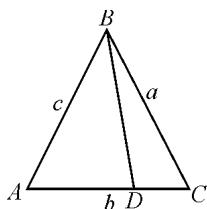
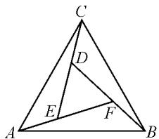
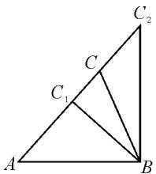

# 由考题定考向,探方法成策略

——以 2021 年新高考全国 I 卷解三角形问题为例

江苏省连云港市城头高级中学 程玲强

# 1 真题呈现,问题解析

考题 （2021 年新高考全国 I 卷第 19 题）记 $\triangle ABC$ 的内角 $A, B, C$ 的对边分别为 $a, b, c$ . 已知 $b^{2} = ac$ ，点 $D$ 在 $AC$ 边长， $BD \sin \angle ABC = a \sin C$ .

(1) 证明: BD = b;   
(2) 若 AD=2DC，求 $\cos\angle ABC$ .

解析:本题为解三角形问题,可先绘制辅助图形,如图1所示.

（1）根据题设可知， $BD = \frac{a \sin C}{\sin \angle ABC}$ . 由正弦定理得 $\frac{c}{\sin C} = \frac{b}{\sin \angle ABC}$ ，即 $\frac{\sin C}{\sin \angle ABC} = \frac{c}{b}$ . 所以 $BD = \frac{ac}{b}$ ，又知 $b^{2} = ac$ ，则推出 $BD = b$ ，得证.

text_image

B
a
c
A
b D
C

图1

(2) 由 AC=b, AD=2DC，可得 $AD=\frac{2b}{3}$ , DC= $\frac{b}{3}$ . 所以，在 $\triangle ABD$ 中， $\cos\angle ADB=\frac{\frac{13b^{2}}{9}-c^{2}}{\frac{4b^{2}}{3}}$ . 同理可

得 $\cos \angle CDB = \frac{\frac{10b^2}{9} - a^2}{\frac{2b^2}{3}}.$

因为 $\angle ADB = \pi -\angle CDB$ ，所以 $\frac{\frac{13b^2}{9} - c^2}{\frac{4b^2}{3}} =$ $\frac{a^2 - \frac{10b^2}{9}}{\frac{2b^2}{3}}$ 整理得 $2a^{2} + c^{2} = \frac{11b^{2}}{3}$

又 $b^{2} = ac$ ，所以 $2a^{2} + \frac{b^{4}}{a^{2}} = \frac{11b^{2}}{3}$ 整理得 $6a^4 -$

$11a^{2}b^{2}+3b^{4}=0$ , 解得 $\frac{a^{2}}{b^{2}}=\frac{1}{3}$ 或 $\frac{a^{2}}{b^{2}}=\frac{3}{2}$ .

在 $\triangle ABC$ 中,由余弦定理,可得

$$
\cos \angle A B C = \frac {a ^ {2} + c ^ {2} - b ^ {2}}{2 a c} = \frac {4}{3} - \frac {a ^ {2}}{2 b ^ {2}}.
$$

当 $\frac{a^{2}}{b^{2}}=\frac{1}{3}$ 时， $\cos\angle ABC=\frac{7}{6}>1$ ，不符合题意；当 $\frac{a^{2}}{b^{2}}=\frac{3}{2}$ 时， $\cos\angle ABC=\frac{7}{12}$ .

综上可知, $\cos\angle ABC=\frac{7}{12}.$

另解:对于第(2)问,还可以从向量视角来解析.已知AD=2DC,则D是三角形边AC的三等分点,则有 $\overrightarrow{BD}=\frac{1}{3}\overrightarrow{BA}+\frac{2}{3}\overrightarrow{BC}$ ,两边平方,可得

$|\overrightarrow{BD}|^2 = \frac{1}{9} |\overrightarrow{BA}|^2 +\frac{4}{9} |\overrightarrow{BA} ||\overrightarrow{BC} |\cos \angle ABC+$ $\frac{4}{9} |BC|^2.$ ①

在 $\triangle ABC$ 中，由余弦定理，可得 $\cos \angle ABC = \frac{a^2 + c^2 - b^2}{2ac}$ . 结合题目条件有 $b^2 = 9DC^2 = ac, BD = b = 3DC$ . 将上述式子代入①式，消去 $BD, \cos \angle ABC$ 和 $b$ 可初步得到 $6a^2 - 11ac + 3c^2 = 0$ ，则 $c = \frac{2}{3} a$ 或 $c = 3a$ . 当 $c = 3a$ 时， $b^2 = ac = 3a^2$ ，由余弦定理，得 $\cos \angle ABC = \frac{7}{6} > 1$ ，不符合题意；当 $c = \frac{2}{3} a$ 时， $b^2 = ac = \frac{2}{3} a^2$ ，可得 $\cos \angle ABC = \frac{7}{12}$ .

# 2 命题揭秘,技巧探究

上述考题为高考常见的解三角形问题,主要考查三角函数的核心知识,如正弦定理、余弦定理,以及利用定理度量三角形,对学生计算分析、利用知识解决实际问题的能力有较高的要求.下面深入解读考题的命题规律,以及常用的解题技巧.

# 2.1 命题规律探究

正弦定理、余弦定理是高考的热点知识，也是解三角形的核心知识，它们常用来求解三角形的相关问题，如已知边求其他角，判断三角形的形状，求三角形的面积，等等。同时，考题中也常将两个定理与和差公式、倍角公式以及三角形的面积公式相结合，转化的技巧性极强。问题解答需要灵活运用正弦定理、余弦定理，并有效结合函数与方程思想、化归转化思想等。

# 2.2 解题技巧探究

正弦定理、余弦定理是解三角形的核心知识，对应变形式的应用也极为广泛，也是需要重点掌握的知识；另外需要掌握以下几个解析技巧.

(1)正弦定理的推广: $\frac{a}{\sin A}=\frac{b}{\sin B}=\frac{c}{\sin C}=2R$ ，其中R为△ABC外接圆的半径.求解△ABC外接圆的面积或周长时,可利用正弦定理的推广式来求外接圆的半径.  
(2)三角形面积公式: $S = \frac{1}{2} ab \sin C = \frac{1}{2} bc \cdot \sin A = \frac{1}{2} ca \sin B$ . 对于上式, 可从三角形内角与边来解读, 即三角形的面积可表示为任意两边及其夹角正弦值乘积的一半.  
(3)正弦知识与三角形个数:利用正弦定理的变形式可判断满足条件的三角形个数.由正弦定理可变形出 $\sin B=\frac{b\sin A}{a}$ . 当 $\sin B=\frac{b\sin A}{a}>1$ , 则满足条件的三角形为 0 个, 即无解; 当 $\sin B=\frac{b\sin A}{a}=1$ , 则满足条件的三角形为 1 个; 当 $\sin B=\frac{b\sin A}{a}<1$ , 则满足条件的三角形为 1 个或 2 个.  
(4)正弦定理的适用问题:已知两角和任意一边,求其他边和角;已知两边和其中一边的对角,求其他边和角.  
(5) 利用正、余弦定理解题常用策略: 利用两个定理解题常结合转化思想, 即将边转化为角, 或将角转化为边, 最终目标是实现角或边的统一. 对于三角形中的不等式问题, 可利用两个定理来适当“放缩”. 对于三角形的取值范围问题, 若以余弦定理为切入点, 则可将问题转化为不等式; 若以正弦定理为切入点, 则可将问题转化为三角函数.

# 3 关联探究,解题分析

解三角形问题的类型十分多样,所涉知识考点也较为众多,结合图形理解条件把握三角形特征,活用定理是解题的关键.下面结合具体问题进行关联探究.

# 3.1 倍角公式转化,破解三角函数值问题

涉及倍角的三角函数问题较为特殊,需用倍角公式构建倍角与三角形内角的关系,然后利用正弦定理、余弦定理加以运算突破.

例 1 如图 2 所示, 用三个全等的 $\triangle ABF, \triangle BCD, \triangle CAE$ 拼成了一个等边三角形 ABC, $\triangle DEF$ 为等边三角形, 且 EF = 2AE, 设 $\angle ACE = \theta$ , 则 $\sin 2\theta$ 的值为 \_\_\_\_.

text_image

Geometric diagram of triangle ABC with internal points D, E, F and connecting line segments

图2

解析: 设 $AE = k (k > 0)$ ，则 EF = 2k。由 $\angle ACE = \theta, \triangle ABF, \triangle BCD, \triangle CAE$ 全等，可得 $\angle FAB = \theta, CD = k, DE = 2k$ 。又 $\triangle ABC$ 为等边三角形，所以 $\angle CAE = \frac{\pi}{3} - \theta$ 。在 $\triangle CAE$ 中，由正弦定理，可得 $\frac{AE}{\sin \angle ACE} = \frac{CE}{\sin \angle CAE}$ ，即 $3\sin \theta = \frac{\sqrt{3}}{2}\cos \theta - \frac{1}{2}\sin \theta$ 。整理得 $\tan \theta = \frac{\sqrt{3}}{7}$ ，则 $\sin 2\theta = \frac{2\tan \theta}{\tan^{2}\theta + 1} = \frac{2 \times \frac{\sqrt{3}}{7}}{\frac{3}{49} + 1} = \frac{7\sqrt{3}}{26}$ 。

评析:例1是关于倍角的三角函数问题,问题涉及了全等三角形和等边三角形,利用正弦定理来求解所涉内角的正弦值是解题的基础,而利用倍角公式构建三角形内角和倍角之间的关系则是解题的关键.

# 3.2 正弦定理转化,破解面积取值问题

三角形面积取值问题十分常见,从三角函数视角分析,可灵活运用正弦定理来求解,对于其中取值范围的分析,则可结合角度和边长的大小关系.

例 2 在锐角三角形 ABC 中, 内角 A, B, C 的对边分别为 a, b, c. 已知 $b \cdot \sin \frac{B + C}{2} = a \cdot \sin B$ , 且 c = 2, 则锐角三角形 ABC 面积的取值范围为 \_\_\_\_.

解析：由 $b \cdot \sin \frac{B + C}{2} = a \cdot \sin B$ ，可得 $b \cdot \cos \frac{A}{2} = a \cdot \sin B$ . 由正弦定理，可得 $\sin B \cdot \cos \frac{A}{2} = \sin A \cdot \sin B$ . 由 $0 < B < \frac{\pi}{2}$ ，可得 $\sin B > 0$ ，故 $\cos \frac{A}{2} = \sin A$ ，即 $\cos \frac{A}{2} = 2\sin \frac{A}{2}\cos \frac{A}{2}$ . 又 $0 < A < \frac{\pi}{2}$ ，所以 $0 < \frac{A}{2} < \frac{\pi}{4}$ ，则 $\cos \frac{A}{2} > 0$ . 故 $\sin \frac{A}{2} = \frac{1}{2}$ ，进而可得 $A = \frac{\pi}{3}$ .

如图3所示，在 $\triangle ABC$ 中 $BC_{1} \perp AC, BC_{2} \perp AB$ ，可知 $AC_{1} = AB \cdot \cos \frac{\pi}{3} = 1, AC_{2} = \frac{AB}{\cos \frac{\pi}{3}} = 4.$ 因为

$\triangle ABC$ 为锐角三角形,所以点 C 在线段 $C_{1}C_{2}$ 上运动,但不包括端点,于是有 $AC_{1} < b < AC_{2}$ ，即 $1 < b < 4$ 。而 $\triangle ABC$ 的面积可表示为 $S_{\triangle ABC} = \frac{1}{2} bc \sin A = \frac{\sqrt{3}}{2} b$ ，结合 $b$ 的取值可得 $\frac{\sqrt{3}}{2} b \in \left(\frac{\sqrt{3}}{2}, 2\sqrt{3}\right)$ 。

text_image

Geometric diagram of triangle ABC with internal points C, C₁, and C₂ labeled

图3

故 $\triangle ABC$ 面积的取值范围为 $\left(\frac{\sqrt{3}}{2}, 2\sqrt{3}\right)$ .

评析:例2是求三角形面积的取值范围问题,解题的关键是构建三角形模型、确定b的取值范围.上述解题分两阶段突破.第一阶段,结合余弦定理确定内角A的大小;第二阶段,结合图形求解b的取值范围,进而由三角形面积公式求面积的取值范围.

# 3.3 两角和差转化,破解三角函数最值问题

对于与两角相关的三角函数值问题,突破的核心是两角和与差的公式,即完成两角的统一化,构建单一变量,将问题转化为简单的函数问题,然后利用函数性质求最值.

例 3 在 $\triangle ABC$ 中, 内角 A, B, C 的对边分别为 a, b, c, 其面积 S 可表示为 $S = \frac{b^{2} + c^{2} - a^{2}}{4}$ , 试回答下列问题.

(1) 如果 $a=\sqrt{6}$ , $b=\sqrt{2}$ , 求 $\cos B$ 的值;  
(2)试求 $\sin(A+B)+\sin B\cos B+\cos(B-A)$ 的最大值.

解析:(1)简答.利用面积公式可得 $A=\frac{\pi}{4}$ ，结合正弦定理可得 $\sin B=\frac{b\sin A}{a}=\frac{\sqrt{6}}{6}$ ，分析可知B为锐角，故 $\cos B=\frac{\sqrt{30}}{6}$ .

(2) 由 (1) 可知 $A = \frac{\pi}{4}$ , 所以 $\sin(A + B) + \sin B \cos B + \cos(B - A) = \frac{\sqrt{2}}{2} \sin B + \frac{\sqrt{2}}{2} \cos B + \sin B \cos B + \frac{\sqrt{2}}{2} \sin B + \frac{\sqrt{2}}{2} \cos B = \sqrt{2} (\sin B + \cos B) + \sin B \cos B$ . 令 $t = \sin B + \cos B = \sqrt{2} \sin\left(B + \frac{\pi}{4}\right)$ , 由 $B \in\left(0, \frac{3\pi}{4}\right)$ , 得 $B + \frac{\pi}{4} \in\left(\frac{\pi}{4}, \pi\right)$ , 则 $\sin\left(B + \frac{\pi}{4}\right) \in$

$(0,1]$ ，所以 $t\in(0,\sqrt{2}]$ .

故 $\sin (A + B) + \sin B\cos B + \cos (B - A) =$ $\sqrt{2} t + \frac{t^2 - 1}{2} = \frac{1}{2} (t + \sqrt{2})^2 -\frac{3}{2},t\in (0,\sqrt{2} ].$

分析可知，当 $t=\sqrt{2}$ ， $B=\frac{\pi}{4}$ 时，原式取得最大值，且最大值为 $\frac{5}{2}$ .

评析:上述第(2)问可视为是两角和差的三角函数最值问题,突破的核心策略是角的转化,即通过内角的变换将问题转化为单一内角的三角函数问题.上述解析过程充分利用了两角和与差的公式、内角的三角函数基本关系等,问题的转化思想和运算技巧体现得极为充分.

# 4 解后反思,教学建议

解三角形问题是高考数学的重要题型,探究命题规律,总结解题技巧是教学探究的重点,下面进一步进行反思教学.

# 4.1 理解定理内涵, 正确认识定理

正弦定理、余弦定理是破解“解三角形”问题的核心定理，充分理解定理内涵、正确认识定理是探究学习的关键。实际上两大定理揭示了三角形边角关系。如余弦定理体现了三角形三边长与一个角余弦值的关系，是对勾股定理的推广；而正弦定理则体现了三角形各边和所对角正弦值之比的关系。教学中要帮助学生理解该知识内涵，同时引导学生体验定理的探究过程，掌握定理的证明方法，强化学生的思辨思维，以从根本上掌握解三角形问题的知识核心。

# 4.2 开展思维训练,总结通性通法

“边化角”和“角化边”是解三角形问题常用的两种思路，总体而言就是为了实现问题条件的“边”或“角”的统一。在教学中要重视学生的思维训练，促使学生充分掌握该类问题的通性通法，正确判断解决问题应选用的方法。

# 4.3 关注类型问题,总结破题技巧

解三角形问题的类型十分多样,问题的综合性、拓展性极强,因此关注问题的多种类型,总结破题技巧十分关键 $^{[1]}$ .实际教学中,教师要帮助学生构建解三角形问题的体系,引导学生合理变式,灵活运用定理、公式来转化突破.同时注意拓展解法,提升学生的思维水平.

# 参考文献：

[1]景君.不畏浮云遮望眼——一道江苏联赛解三角形题的剖析[J].中学数学,2021(7):19-20.Z