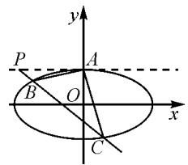
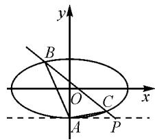
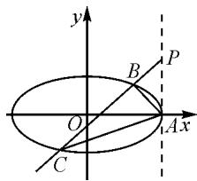
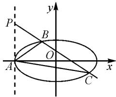

# 莫让“真题”遮望眼，唯有“探究”识真颜

# ● 淞水县第一中学 孔中亚 夏全玲

摘要:高考真题历来是高三学生复习备考的常规资源,是他们日常训练和查漏补缺的重中之重.只有通过对高考真题的深度开发,才能真正深化学生对知识的理解、迁移和应用,提升核心素养.

关键词: 高考真题; 深度开发; 迁移; 探究

# 1 题目呈现

在 2022－2023 学年度武汉市部分学校高三年级九月调研考试中有这样一道题目：

已知椭圆 $E: \frac{x^{2}}{a^{2}} + \frac{y^{2}}{b^{2}} = 1 (a > b > 0)$ ，过点 $P(-1, -1)$ 且与 x 轴平行的直线与椭圆 E 恰有一个公共点，过点 P 且与 y 轴平行的直线被椭圆 E 截得的线段长为 $\sqrt{3}$ .

(1)求椭圆 E 的标准方程；

(2) 设过点 P 的动直线与椭圆 E 交于 M, N 两点, T 为 y 轴上的一点, 设直线 MT 和 NT 的斜率分别为 $k_{1}$ 和 $k_{2}$ , 若 $\frac{1}{k_{1}} + \frac{1}{k_{2}}$ 为定值, 求点 T 的坐标.

从智学网考试结果来看,这道题目笔者所在班的得分高于本年级平均分2分,在课后与学生的座谈中了解到,学生的普遍做法是类比考前训练(2022全国乙卷理)第21题,先猜出 $T(0,1)$ ,然后再进行证明.正所谓“先猜后证是通法,四两能拨千斤重”.因此,教学中教师应重视真题的探究,以提高学生直观分析问题和解决问题的能力.正如教育部考试院刘芃所说:“与其大量刷题,不如抽出时间研究往年的试题,往年的试题都是精雕细磨的产物,研究这些试题,就如同和试题命制者对话 $^{[1]}$ .”

# 2 重温高考经典试题

经典试题 1 （2022·全国乙卷理）已知椭圆 E 的中心为坐标原点，对称轴为 x 轴、y 轴，且过 A(0, -2)， $B\left(\frac{3}{2}, -1\right)$ 两点.

(1) 求 E 的方程；

(2)设过点 $P(1,-2)$ 的直线交 E 于 M, N 两点，过 M 且平行于 x 轴的直线与线段 AB 交于点 T，点 H 满足 $\overrightarrow{MT} = \overrightarrow{TH}$ . 证明：直线 HN 过定点.

解:(1)椭圆 E 的方程为 $\frac{x^{2}}{3}+\frac{y^{2}}{4}=1$ (过程略).

(2) 将坐标原点平移至点 A，建立新的坐标系 $x'Ay'$ ，则 $x' = x, y' = y + 2$ .

于是椭圆 E 和直线 MN 在新坐标系下的方程分别为 $\frac{(y'-2)^{2}}{4} + \frac{x'^{2}}{3} = 1, mx' + ny' = 1.$

点 P 在新的坐标系下的坐标为 $(1,0)$ ，则 m=1。

由 $\frac{(y'-2)^{2}}{4}+\frac{x'^{2}}{3}=1$ ，得 $3y'^{2}-12y'+4x'^{2}=0$ ，
则有 $3y'^{2}-12y'(x'+ny')+4x'^{2}=0.$

即 $(3-12n)\cdot\frac{y^{'2}}{x^{'2}}-12\cdot\frac{y'}{x'}+4=0.$

设直线 AM, AN 的斜率分别为 $k_{1}, k_{2}$ ，则

$$
k _ {1} + k _ {2} = \frac {1 2}{3 - 1 2 n}, k _ {1} k _ {2} = \frac {4}{3 - 1 2 n}.
$$

所以 $\frac{1}{k_1} +\frac{1}{k_2} = \frac{k_1 + k_2}{k_1k_2} = 3.$

在原坐标系下，设 $M(x_{1},y_{1}), N(x_{2},y_{2})$ ，则

$$
\frac {1}{k _ {1}} + \frac {1}{k _ {2}} = \frac {x _ {1}}{y _ {1} + 2} + \frac {x _ {2}}{y _ {2} + 2} = 3. \tag {①}
$$

由 A, B, T 三点共线，得 $T\left(\frac{3}{2}y_{1}+3,y_{1}\right)$ ，则 $H(3y_{1}+6-x_{1},y_{1})$ .

由此可得，

$$
k _ {A H} = \frac {y _ {1} + 2}{3 y _ {1} + 6 - x _ {1}} = \frac {1}{3 - \frac {x _ {1}}{y _ {1} + 2}}, k _ {A N} = \frac {y _ {2} + 2}{x _ {2}}. \tag {②}
$$

由①②可得, $k_{AH}=k_{AN}$ .

故直线 HN 过定点 $(0, -2)$ .

从试题 1 的探究中, 我们发现: 过点 $P(1, -2)$ 的直线交 E 于 M, N 两点, 设直线 AM, AN 的斜率分别为 $k_{1}, k_{2}$ , 则 $\frac{1}{k_{1}} + \frac{1}{k_{2}} = \frac{k_{1} + k_{2}}{k_{1} k_{2}} = 3$ .

经典试题 2 （2022 年北京卷）已知椭圆： $E:\frac{x^{2}}{a^{2}}+\frac{y^{2}}{b^{2}}=1(a>b>0)$ 的一个顶点为 A(0,1)，焦距为 $2\sqrt{3}$ .

(1)求椭圆 E 的方程；

(2) 过点 $P(-2,1)$ 作斜率为 k 的直线与椭圆 E 交于不同的两点 B, C, 直线 AB, AC 分别与 x 轴交于点 M, N, 当 $|MN|=2$ 时, 求 k 的值.

解:(1)椭圆 E 的方程为 $\frac{x^{2}}{4} + y^{2} = 1$ (过程略).

(2) 将坐标原点平移至点 A, 建立新的坐标系 $x'Ay'$ , 则 $x' = x, y' = y - 1$ .

于是椭圆 E 和直线 BC 在新坐标系下的方程分别为 $\frac{x'^{2}}{4} + (y' + 1)^{2} = 1, mx' + ny' = 1.$

点 P 在新的坐标系下的坐标为 $(-2,0)$ ，则 $m=-\frac{1}{2}$ .

由 $\frac{x^{'2}}{4}+(y'+1)^{2}=1$ ，得 $x^{'2}+4y^{'2}+8y'=0$ 。

于是 $x^{\prime 2} + 4y^{\prime 2} + 8y^{\prime}(-\frac{1}{2} x^{\prime} + ny^{\prime}) = 0$ ，即

$$
(4 + 8 n) \left(\frac {y ^ {\prime}}{x ^ {\prime}}\right) ^ {2} - 4 \cdot \frac {y ^ {\prime}}{x ^ {\prime}} + 1 = 0.
$$

设直线 AB, AC 的斜率分别为 $k_{1}, k_{2}$ ，则

$$
k _ {1} + k _ {2} = \frac {4}{4 + 8 n}, k _ {1} k _ {2} = \frac {1}{4 + 8 n}.
$$

所以 $\frac{1}{k_{1}}+\frac{1}{k_{2}}=\frac{k_{1}+k_{2}}{k_{1}k_{2}}=4.$

由直线 $AB: y = k_{1}x + 1$ ，得点 M 的横坐标是 $-\frac{1}{k_{1}}$ ，同理点 N 的横坐标是 $-\frac{1}{k_{2}}$ .

所以 $\left|MN\right|=\left|\frac{1}{k_{1}}-\frac{1}{k_{2}}\right|=2.$

由 $\left(\frac{1}{k_1} +\frac{1}{k_2}\right)^2 -\left(\frac{1}{k_1} -\frac{1}{k_2}\right)^2 = \frac{4}{k_1k_2}$ ，得 $4 + 8n = 3.$

所以 $n = -\frac{1}{8}$ ，则 $-\frac{m}{n} = -4.$

故直线 BC 的斜率是 -4，即 k 的值为 -4。

从试题 2 的探究中, 我们发现: 过点 $P(-2,1)$ 作斜率为 k 的直线与椭圆 E 交于不同的两点 B, C, 设直线 AB, AC 的斜率分别为 $k_{1}, k_{2}$ , 则 $\frac{1}{k_{1}} + \frac{1}{k_{2}} = 4$ .

# 3 深度拓展

正如数学家波利亚指出的,数学中,好的问题就如同雨后的蘑菇,扎堆生长,发现一个后就能在周围发现好多个 $^{[2]}$ .接下来,我们对这个问题进行纵向挖掘,凸显深度并变式拓展.

拓展 已知椭圆 $C: \frac{x^{2}}{a^{2}} + \frac{y^{2}}{b^{2}} = 1 (a > b > 0)$ ，点 P 不在椭圆上，设直线 l 经过点 P 且与 C 相交于 B, C 两点，如图 1, 2, 3, 4.

text_image

y
P
A
B
O
x
C

图1

text_image

y
B
O
C
x
A
P

图2

text_image

y
B
P
O
A x
C

图3

text_image

P
B
O
A
C
x
y

图 4

(1) 设 $P(t, b)$ , $A(0, b)$ , 则 $\frac{1}{k_{AB}} + \frac{1}{k_{AC}} = -\frac{2a^{2}}{bt}$ ;   
(2) 设 $P(t, -b)$ , $A(0, -b)$ , 则 $\frac{1}{k_{AB}} + \frac{1}{k_{AC}} = \frac{2a^{2}}{bt}$ ;   
(3) 设 $P(a, t)$ , $A(a, 0)$ ，则 $k_{AB} + k_{AC} = -\frac{2b^{2}}{at}$ ;  
(4) 设 $P(-a, t), A(-a, 0)$ , 则 $k_{AB} + k_{AC} = \frac{2b^2}{at}$ .

从上面四个结论可以看出: 当直线 PA 平行于 x 轴时, 斜率的倒数和是定值; 当直线 PA 平行于 y 轴时, 斜率的和是定值. 所以上文九月调研考试题中的问题, 直观猜出答案是 $(0,1)$ 也就顺理成章了.

# 4 结语

高考经典真题往往是新一届高考命题的题源库，具有指导教学的示范作用。为了彰显高考真题的核心价值，需要教师精心准备，在深度和广度上下足功夫，实施一题多变，让学生做到做一题、会一类、通一法。这样学生才能将知识内化并迁移到新的情境中，从而提高直观解决问题的能力。总之，高考真题就像璞玉，只要用心雕琢，就一定能够熠熠生辉。

# 参考文献：

[1] 刘芃. 刘芃考试文集 [M]. 北京: 人民教育出版社, 2012.  
[2]史宁中.数学基本思想18讲[M].北京:北京师范大学出版社,2016.Z