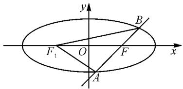
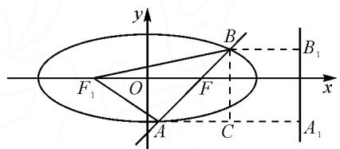

# 融入数学思想 提升数学素养

——以一道解析几何试题的求解为例

湖北省潜江市园林高级中学 胡艳 汪平锐

摘要:通过对一道解析几何题的求解分析,阐述了如何融入消元思想、化归思想、数形结合思想、类比思想来提升数学核心素养,侧面体现了高中数学思想方法运用的重要性和与圆锥曲线教学结合的必要性.

关键词: 低思维; 高思维; 数学思想方法: 数学素养

在一次高二年级期中考试的阅卷中,笔者发现一道平时训练过的题型得分率却很低.学生普遍存在的问题可以概括为“低思维,高运算”,当然还有部分学生尝试着“高思维,低运算”,然而在规定的时间内,想寻求更加简洁的方法似乎不太现实.笔者认为,在平时的教学中如何引导学生分析问题,寻求更优化的方案解决问题,提升学生的数学思维和数学素养,是值得我们探讨和深究的.

# 1 寻考场解答之惑

在平面直角坐标系中, 已知椭圆 $C: \frac{x^2}{a^2} + \frac{y^2}{b^2} = 1 (a > b > 0)$ 的右焦点为 $F$ , 过点 $F$ 的直线 $l$ 与椭圆 $C$ 相交与 $A, B$ 两点, 直线 $l$ 的倾斜角为 $60^\circ$ , $\overrightarrow{AF} = 2 \overrightarrow{FB}$ . 求椭圆 $C$ 的离心率[1].

笔者阅卷时注意到大部分学生的答案如下：

设 $A(x_{1},y_{1}), B(x_{2},y_{2})$ ，依题意知 $F(c,0)$ ，直线 l 的方程为 $y=\sqrt{3}(x-c)$ .

联立 $\left\{\begin{aligned}\frac{x^{2}}{a^{2}}+\frac{y^{2}}{b^{2}}=1,\\ y=\sqrt{3}(x-c),\end{aligned}\right.$ 消去 x，得

$$
\left(3 a ^ {2} + b ^ {2}\right) y ^ {2} + 2 \sqrt {3} b ^ {2} c y - 3 b ^ {4} = 0.
$$

由韦达定理,知

$$
y _ {1} + y _ {2} = - \frac {2 \sqrt {3} b ^ {2} c}{3 a ^ {2} + b ^ {2}}, y _ {1} y _ {2} = \frac {- 3 b ^ {4}}{3 a ^ {2} + b ^ {2}}.
$$

因为 $\overrightarrow{AF} = 2\overrightarrow{FB}$ ，所以 $y_{1} = -2y_{2}$

绝大多数同学都知道联立方程组求解,然而,在考试时未能在规定的时间内找出 a,b,c 的数量关系,少数同学即使得到了的 a,b,c 的关系式,也没有得到正确结果.

本题是一个很常见的焦点弦问题,学生很容易想到通过转化向量关系,然后结合韦达定理求解.但是,这样做运算量极大,大部分同学花了时间,还是没有得出正确结果.大部分学生都是知道如何做,但就是算不出来,很明显的“低思维,高运算”.当然还有部分学生尝试着“高思维,低运算”,可惜也没有在规定时间得出结果.

# 2 研试题讲评之道

通过充分的调研,笔者针对学生出现的几个问题,反思平时的教学,认为在圆锥曲线的教学中应重视数学思想方法的应用,提升学生的数学核心素养.

# 2.1 渗透消元思想, 提升数学素养

本题中,学生都知道要联立方程组,但由于未知参数过多而卡壳了.求解方程问题的基本数学思想是消元,只要学生在学习中体会到这一点,问题就会迎刃而解.

在求解出

$$
y _ {1} + y _ {2} = - \frac {2 \sqrt {3} b ^ {2} c}{3 a ^ {2} + b ^ {2}}, \tag {①}
$$

$$
y _ {1} y _ {2} = \frac {- 3 b ^ {4}}{3 a ^ {2} + b ^ {2}}, \tag {②}
$$

$$
y _ {1} = - 2 y _ {2}, \tag {③}
$$

后,可以先联立①③消去 $y_{1}$ , 得

$$
- y _ {2} = - \frac {2 \sqrt {3} b ^ {2} c}{3 a ^ {2} + b ^ {2}}. \tag {④}
$$

再联立②③消去 $y_{1}$ ，得

$$
- 2 y _ {2} ^ {2} = \frac {- 3 b ^ {4}}{3 a ^ {2} + b ^ {2}}. \tag {⑤}
$$

最后联立④⑤消去 $y_{2}$ ，得 $e=\frac{c}{a}=\frac{2}{3}$ .

# 2.2 应用数形结合思想,提升数学素养

本题中对条件 $\overrightarrow{AF}=2\overrightarrow{FB}$ 的转化,如果从几何角度来考虑,可以有效减少坐标法的大运算量.笔者认为在解析几何的教学中,不仅要重视解析法的教学,也要让学生在学习中体会几何法的妙处及代数与几何的紧密联系.

如图1，设 $F_{1}$ 为椭圆的左焦点，连结 $AF_{1}, BF_{1}$ ，依题意知， $\angle AFF_{1} = 60^{\circ}, \angle BFF_{1} = 120^{\circ}$ . 设 $|BF| = m (m > 0)$ ，则 $|AF| = 2m$ . 由椭圆定义，知 $|AF_{1}| = 2a - 2m, |BF_{1}| = 2a - m$ .

在 $\triangle AFF_{1}$ 和 $\triangle BFF_{1}$ 中，利用余弦定理，可得 $\left\{\begin{aligned}&a^{2}-c^{2}=m(2a-c),\\ &2(a^{2}-c^{2})=m(2a+c),\end{aligned}\right.$ 消去 m，得 $e=\frac{c}{a}=\frac{2}{3}$ .

text_image

y
F₁ O F x
A
B

图1

# 2.3 运用化归思想,提升数学素养

对于圆锥曲线中涉及到焦点弦的问题,如果从定义入手,回归定义本质,有时可以起到简化计算的目的.

如图 2, 分别过点 A, B 作 $AA_{1}$ , $BB_{1}$ 垂直右准线于点 $A_{1}$ , $B_{1}$ , 过 B 作 $BC \perp AA_{1}$ , 交 $AA_{1}$ 于点 C, 则 $\cos \angle BAC = \frac{|AA_{1}| - |BB_{1}|}{|AF| + |BF|} = \frac{|AF| - |BF|}{e(|AF| + |BF|)}$ , 由直线 l 的倾斜角为 $60^{\circ}$ , 可得 $e = \frac{2}{3}$ .

text_image

y
F₁ O F B
x
A C A₁

图 2

# 2.4 融入类比思想,提升数学素养

通过以上讲解,学生逐渐体会到了“高思维、低运算”的好处,有学生联想到了“点差法”在解决中点弦问题时的妙处,本题能否类比“点差法”来简化代数运算呢?

设 $A(x_{1}, y_{1})$ , $B(x_{2}, y_{2})$ ，代入椭圆方程得 $\left\{\begin{aligned}\frac{x_{1}^{2}}{a^{2}}+\frac{y_{1}^{2}}{b^{2}}=1,\\\frac{4x_{2}^{2}}{a^{2}}+\frac{4y_{2}^{2}}{b^{2}}=4,\end{aligned}\right.$ 类比“点差法”，两式相减，可得

$$
\frac {(x _ {1} - 2 x _ {2}) (x _ {1} + 2 x _ {2})}{a ^ {2}} + \frac {(y _ {1} - 2 y _ {2}) (y _ {1} + 2 y _ {2})}{b ^ {2}} = - 3. \textcircled {6}
$$

将 $\left\{\begin{aligned}x_{1}+2x_{2}&=3c,\\ y_{1}+2y_{2}&=0\end{aligned}\right.$ 代入⑥式，得 $x_{1}-2x_{2}=-\frac{a^{2}}{c}$ .联立方程可得 $x_{1}=\frac{3c}{2}-\frac{a^{2}}{2c},y_{1}=-\frac{\sqrt{3}}{2c}b^{2}$ .

将 $A(x_{1},y_{1})$ 代入椭圆方程, 整理得

$$
4 a ^ {2} - 1 3 a ^ {2} c ^ {2} + 9 c ^ {2} = 0.
$$

解得 $e^{2}=\frac{4}{9}$ 或 $e^{2}=1$ (舍去)，即 $e=\frac{2}{3}$ .

# 3 启迪与反思

波利亚认为在解题中培养学生数学思想方法，提高学生数学思维能力，对促进数学核心素养的形成和发展具有重要意义。南京大学郑毓信教授认为数学核心素养的本质内涵在于使学生在教育教学的过程中学会更清晰、更深入、更全面地进行数学思维。他还提出教师在教育教学中的重要任务是逐步渗透数学思想，培养学生数学核心素养，我们的教育教学活动是基于数学思维解决生活实际问题，促进学生学会理性思考，培养创新创造力。

圆锥曲线教学活动的各个环节担负着逻辑推理、数学抽象、直观想象、数学运算等数学核心素养发展的任务。学生经过高中阶段的数学学习，接触过大量的圆锥曲线问题，通常有一个关键的处理手段——“几何条件代数化”。这要求学生能结合圆锥曲线基础知识、基本技能，以数形结合思想、转化与化归思想进行问题情境的探索分析，推理转化，并用数学符号语言进行表述，强调思维的严谨性。

数学思想方法是数学的灵魂,它是在数学内部发展过程中被抽象出来的数学本质观念,有了数学思想方法才让数学这门科学更加具有生命力和创造力.对于教师来说,只有将数学思想方法转换为内在的观点态度来指导数学教学才能产生最大的能量;对于学生来说,数学思想方法的学习不是一蹴而就的,它不同于概念的学习,它是在不断体会知识、调整反思的过程中形成理性思维,逐渐建构数学思想方法的体系,进而领会到数学学科非同一般的价值 $^{[2]}$ .

# 参考文献：

[1]叶超.圆锥曲线焦点弦问题的两个推广[J].中学数学研究（华南师范大学版），2017(5):47-48.  
[2]黄靖婷.数学核心素养视角下的圆锥曲线解题策略研究[D].漳州：闽南师范大学，2021.Z