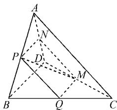

# 高考新题型多选题的解题技巧

# 山东省桓台县渔洋中学 曹润峰

多选题是新高考数学试卷中出现的一种新题型，它作为选择题的一种，答案不唯一，有多个正确选项。此类试题可以从不同角度不同知识点来命题，考查的内容可以多种多样，有效对学生水平进行区分。此类试题可以综合运用直接法、特值法、反证法、数形结合法等对选项逐项分析。

多选题难度大的原因之一就是选项的干扰因素过多,可以分为下列几种:(1)条件疏漏(将容易疏漏的条件所产生的结果设计为干扰选项);(2)实际背景忽视(细心模拟学生演算过程中容易出现的错解,得到迷惑性较强的干扰项);(3)概念混淆(针对学生容易混淆的概念、性质设计干扰项);(4)题意误解(将没有仔细审题或漏看题干的关键信息所导致的错误结论作为干扰选项);(5)推理错乱(将不合逻辑的推理造成的错误结果设计为干扰项);(6)思维定式(熟悉的内容,相似的形式,常会令人产生类比与联想,可能产生负迁移,将由此导致的错误设计为干扰项).

# 1 概念辨析类多选题

典例 1 （多选）下列选项错误的是（ ）.

A. 两个不等式 $a^2 + b^2 \geqslant 2ab$ 与 $\frac{a + b}{2} \geqslant \sqrt{ab}$ 成立的条件是相同的  
B. 函数 $y = x + \frac{1}{x}$ 的最小值是 2  
C. 函数 $f(x)=\sin x+\frac{4}{\sin x}$ 的最小值为 4  
D. $x > 0$ 且 $y > 0$ 是 $\frac{x}{y} +\frac{y}{x}\geqslant 2$ 的充要条件

解题指导:结合基本不等式的性质与充分必要条件的概念对选项逐项分析.

对于选项 A, 不等式 $a^{2} + b^{2} \geqslant 2ab$ 成立的条件是 $a, b \in R$ , 不等式 $\frac{a + b}{2} \geqslant \sqrt{ab}$ 成立的条件是 a > 0, b > 0; 对于选项 B, 函数 $y = x + \frac{1}{x}$ 的值域是 $(-∞, -2] ∪ [2, +∞)$ , 没有最小值; 对于选项 C, 函数 $f(x) = \sin x + \frac{4}{\sin x}$ 没有最小值; 对于选项 D, x > 0 且 y > 0

是 $\frac{x}{y}+\frac{y}{x}\geqslant2$ 的充分不必要条件.故选ABCD.

名师点拨: 正确理解和熟练掌握概念、性质的条件、结论、内涵, 利用它们可以直接判断某些选项的正确性, 也可以采用反证法或举例法排除某个选项. 不同条件不同背景选择不同的方法, 要做到灵活处理.

训练 1 （多选）已知 a>0, b>0，且 $a+b=1$ ，则（）.

A. $a^2 + b^2 \geqslant \frac{1}{2}$

B. $2^{a-b}>\frac{1}{2}$

C. $\log_2a + \log_2b\geqslant -2$

D. $\sqrt{a} +\sqrt{b}\leqslant \sqrt{2}$

解析: 由 a>0, b>0, 且 $a+b=1$ , 可得 $(a+b)^{2}\leqslant2a^{2}+2b^{2}$ , 即 $a^{2}+b^{2}\geqslant\frac{1}{2}$ , 故选项 A 正确.

利用分析法,要证 $2^{a-b} > \frac{1}{2}$ , 只需证 a-b > -1 即可, 即 a > b - 1. 因为 a > 0, b > 0, 且 $a + b = 1$ , 所以 a > 0, b - 1 < 0. 故选项 B 正确.

$\log_2a + \log_2b = \log_2(ab)\leqslant \log_2\left(\frac{a + b}{2}\right)^2 = -2$ ，故选项C错误.

由于 $a > 0, b > 0$ ，且 $a + b = 1$ ，利用分析法，要证 $\sqrt{a} + \sqrt{b} \leqslant \sqrt{2}$ 成立，只需证明 $a + b + 2\sqrt{ab} \leqslant 2$ ，即证 $2\sqrt{ab} \leqslant 1$ 。而 $\sqrt{ab} \leqslant \frac{1}{2} = \frac{a + b}{2}$ ，当且仅当 $a = b = \frac{1}{2}$ 时，等号成立，故选项D正确。

故选: ABD.

训练 2 （多选）下列说法正确的有（ ）.

A. 不等式 $\frac{2x-1}{3x+1}>1$ 的解集是 $\left(-2, \frac{1}{3}\right)$   
B.“a>1,b>1”是“ab>1”成立的充分条件  
C. 命题 $p: \forall x \in \mathbf{R}, x^2 > 0$ ，则 $\neg p: \exists x_0 \in \mathbf{R}, x_0^2 < 0$   
D.“a<5”是“a<3”的必要条件

解析: 由 $\frac{2x-1}{3x+1}>1$ , 得 $\frac{-x-2}{3x+1}>0$ , 则 -2<x< - $\frac{1}{3}$ , 故选项 A 正确.

当 $a > 1, b > 1$ 时，一定有 $ab > 1$ ；但 $ab > 1$ 时不一

定有 a>1, b>1 成立，如 $a=6, b=\frac{1}{2}$ ，满足 ab>1，但 b<1。因此“a>1, b>1”是“ab>1”成立的充分条件，选项 B 正确。

命题 $p: \forall x \in \mathbf{R}, x^2 > 0$ ，则 $\neg p: \exists x_0 \in \mathbf{R}, x_0^2 \leqslant 0$ ，故选项 C 错误.

由 a<5 不能推出 a<3，但 a<3 时一定有 a<5 成立，“a<5”是“a<3”的必要条件，故选项 D 正确.

故选:ABD.

# 2 运算、推理类多选题

典例 2 （多选）公差为 d 的等差数列 $\{a_{n}\}$ 满足 $a_{2}=5, a_{6}+a_{8}=30$ ，则下面结论正确的有（）.

A.d=2   
B. $a_{n} = 2n + 1$   
C. $\frac{1}{a_n^2 - 1} = \frac{1}{4}\left(\frac{1}{n} +\frac{1}{n + 1}\right)$   
D. $\left\{\frac{1}{a_{n}^{2}-1}\right\}$ 的前 n 项和为 $\frac{n}{4(n+1)}$

解题指导: 根据 $a_{2}=5, a_{6}+a_{8}=30$ 可以求出等差数列的公差 d 及通项公式, 再结合选项逐项分析.

由 $\{a_{n}\}$ 是等差数列，可知 $a_6 + a_8 = 2a_7 = 30$ ，即 $a_7 = 15.$ 又由 $a_7 - a_2 = 5d$ ，且 $a_2 = 5$ ，得 $d = 2$ ，于是可得

$$
\begin{array}{l} a _ {n} = a _ {2} + (n - 2) d = 2 n + 1, \\ \frac {1}{a _ {n} ^ {2} - 1} = \frac {1}{4 n (n + 1)} = \frac {1}{4} \left(\frac {1}{n} - \frac {1}{n + 1}\right). \\ \end{array}
$$

所以，数列 $\left\{\frac{1}{a_{n}^{2}-1}\right\}$ 的前n项和为 $\frac{1}{4}\left[\left(1-\frac{1}{2}\right)+\left(\frac{1}{2}-\frac{1}{3}\right)+\cdots+\left(\frac{1}{n}-\frac{1}{n+1}\right)\right]=\frac{1}{4}\left(1-\frac{1}{n+1}\right)=\frac{n}{4(n+1)}.$

故选: ABD.

名师点拨:运算、推理类多选题需要利用数学运算法则、性质、定理或常用的方法对题干中的数学运算问题进行变形或转化,再将计算的结果与选项结合来判断正误,或先确定选项要求计算的内容,再回到题干中寻找已知量进行计算.此类试题运算量较大,难度较高.

训练 3 （2020·菏泽高三模拟）（多选）已知椭圆 $C: \frac{x^{2}}{a^{2}} + \frac{y^{2}}{b^{2}} = 1 (a > b > 0)$ 的离心率为 $\frac{\sqrt{3}}{2}$ ，点 $M(2,1)$ 在椭圆 C 上，直线 l 平行于 OM 且在 y 轴上的截距为 m，直线 l 与椭圆 C 交于 A, B 两个不同的点。下面结论正确的有（）.

A.椭圆 C 的方程为 $\frac{x^{2}}{8} + \frac{y^{2}}{2} = 1$   
B. $k_{OM}=\frac{1}{2}$   
C.-2<m<2   
D. $m \leqslant -2$ , 或 $m \geqslant 2$

解析:由题意,得 $\left\{\begin{aligned}\frac{\sqrt{a^{2}-b^{2}}}{a}&=\frac{\sqrt{3}}{2},\\\frac{4}{a^{2}}+\frac{1}{b^{2}}&=1,\end{aligned}\right.$ 解得 $\left\{\begin{aligned}a^{2}&=8,\\ b^{2}&=2.\end{aligned}\right.$

故椭圆 C 的方程为 $\frac{x^{2}}{8} + \frac{y^{2}}{2} = 1$ ，选项 A 正确.

由 $k_{OM}=\frac{1-0}{2-0}=\frac{1}{2}$ ，可知选项 B 正确.

由题设条件, 得 l 的方程为 $y=\frac{1}{2}x+m$ .

由 $\left\{\begin{aligned}y&=\frac{1}{2}x+m,\\ \frac{x^{2}}{8}&+\frac{y^{2}}{2}=1,\end{aligned}\right.$ 得 $x^{2}+2mx+2m^{2}-4=0.$

由 $\Delta=(2m)^{2}-4(2m^{2}-4)>0$ ，得 -2<m<2 。故选项 C 正确，选项 D 错误。

故选:ABC.

训练 4 （2020 · 江西省萍乡市模拟）（多选）如图 1，在四面体 ABCD 中，截面 PQMN 是正方形，则在下列命题中，正确的为（）.

A. $AC \perp BD$   
B. AC // 截面 PQMN  
C. AC = BD   
D. 异面直线 PM 与 BD 所成的角为 $45^{\circ}$

解析: 因为截面 PQMN 是正方形, 所以 PQ // MN, QM // PN.

于是 $PQ \parallel$ 平面 ACD, QM $\parallel$ 平面 BDA.

所以易得 $PQ \parallel AC, QM \parallel BD.$

由 $PQ \perp QM$ ，可得 $AC \perp BD$ ，故选项 A 正确.

由 $PQ \parallel AC$ ，得 $AC \parallel$ 截面 PQMN，故选项 B 正确.

由于异面直线 PM 与 BD 所成的角等于 PM 与 QM 所成的角, 故选项 D 正确.

由 $\frac{PN}{BD}=\frac{AN}{AD}$ ，得 $\frac{PN\cdot AD}{AN}=BD.$ 由 $\frac{DN}{AD}=\frac{MN}{AC}$ ，得 $AC=\frac{MN\cdot AD}{DN}$ .当N不为AD的中点时， $AC\neq BD$ ，故选项C错误.

故选:ABD.Z

text_image

Geometric diagram of triangle ABC with internal points P, Q, M, N and auxiliary lines forming sub-triangles and segments

图1