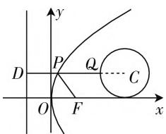

# “动”“静”结合，“数”“形”思维

—— 对一道解析几何试题的探究

江苏省张家港市沙洲中学 王春凤

“双动点”间的距离的最值问题,是解析几何中比较常见的一类“运动”问题,“动”“静”结合,常量与变量融合,有限与无限转化,让问题“动”起来,巧妙把平面几何、平面解析几何以及其他一些相关知识加以交汇与融合,立意新颖,综合性强,可以很好考查学生的数学基础知识、数学思想方法和数学能力等,备受命题者青睐.

# 一、问题呈现

问题 （2021届江苏省扬州市高三第四次模拟考试数学试卷(5月)·14）已知点 P 在抛物线 $y^{2}=4x$ 上，点 Q 在圆 $(x-5)^{2}+y^{2}=1$ 上，则 PQ 长度的最小值为 \_\_\_\_.

此题以“一抛物线”与“抛物线内一圆”为问题背景，以两曲线的位置关系进行合理渗透，通过两曲线上的两“动点”的运动变化来巧妙设置，进而确定“两动点”间的距离的最小值问题.

破解时,可以利用平面解析几何中“数”的关系进行切入,借助函数思维,通过两点间距离公式的应用,结合函数的最值问题的求解来分析与处理;可以利用平面解析几何中“形”的特征进行切入,借助几何思维,通过两曲线的位置关系的确定,结合几何图形的最值问题的求解来分析与处理等.

# 二、问题破解

思维视角(一):抓住“数”的关系——函数思维

解法1:(配方法1)由于点P在抛物线 $y^{2}=4x$ 上,设 $P\left(\frac{1}{4}t^{2},t\right),t>0$ ,而圆 $(x-5)^{2}+y^{2}=1$ 的圆心为C(5,0),半径r=1,可得 $|PC|^{2}=\left(\frac{1}{4}t^{2}-5\right)^{2}+t^{2}=\frac{1}{16}t^{4}-\frac{3}{2}t^{2}+25=\frac{1}{16}(t^{2}-12)^{2}+16$ ,则当 $t^{2}=12$ ,即

$t=2\sqrt{3}$ 时， $|PC|^{2}$ 取得最小值 16，此时 $|PC|$ 的最小值为 4， $|PQ|$ 的最小值为 4-r=4-1=3.

故填答案:3.

解法2:(配方法2): 圆 $(x-5)^{2}+y^{2}=1$ 的圆心为C(5,0)，半径r=1，由于点P在抛物线 $y^{2}=4x$ 上，设 $P(m,2\sqrt{m}),m\geqslant0$ ，则 $|PC|=\sqrt{(m-5)^{2}+(2\sqrt{m})^{2}}=\sqrt{m^{2}-6m+25}=\sqrt{(m-3)^{2}+16}\geqslant4$ ，所以 $|PQ|=|PC|-r\geqslant4-1=3$ ，即 $|PQ|$ 的最小值为3.

故填答案:3.

解法3:(配方法3)圆 $(x-5)^{2}+y^{2}=1$ 的圆心为C(5,0)，半径r=1，则知 $|PQ|=|PC|-|QC|=|PC|-1$ 。设 $P(x,y)$ ，则 $|PC|=\sqrt{(x-5)^{2}+y^{2}}=\sqrt{(x-5)^{2}+4x}=\sqrt{x^{2}-6x+25}=\sqrt{(x-3)^{2}+16}\geqslant4$ ，所以 $|PQ|=|PC|-r\geqslant4-1=3$ ，即 $|PQ|$ 的最小值为3。

故填答案:3.

点评:根据题目条件确定圆的圆心坐标与半径,通过两动点间距离的变换,转化为抛物线上的动点与圆心的距离减去半径,利用两点间的距离公式转化为函数关系式,借助配方处理,结合函数的图像与性质得以确定最值问题.函数思维破解问题的关键是抓住“数”的关系,把解析几何问题转化为对应的函数问题,通过代数运算与转化来应用,结合函数的相关性质来破解.

思维视角(二): 利用“形”的特征——几何思维

解法 4:(切线法)由题知, $\text{圆}(x-5)^{2}+y^{2}=1$ 的圆心为 $C(5,0)$ ,半径 r=1,设 $\text{圆}(x-5)^{2}+y^{2}=R^{2}$ 与抛物线 $y^{2}=4x$ 相切的切点为 $P_{0}(m,n)$ ,根据对称性,设该切点位于 x 轴上方,且该圆与抛物线在切点 $P_{0}$ 处的公切线为直线 l,由 $y^{2}=4x$ ,可得 $y=2\sqrt{x}$ ,求导

有 $y' = \frac{1}{\sqrt{x}}$ ，可得直线 $l$ 的斜率为 $\frac{1}{\sqrt{m}}$ . 由于 $CP_0 \perp l$ ，则有 $\frac{n - 0}{m - 5} \times \frac{1}{\sqrt{m}} = -1$ ，可得 $n = \sqrt{m}(5 - m)$ ，又 $n = 2\sqrt{m}$ ，则有 $2\sqrt{m} = \sqrt{m}(5 - m)$ ，显然 $m \neq 0$ ，可得 $m = 3, n = 2\sqrt{3}$ ，从而 $P_0(3, 2\sqrt{3})$ 在圆 $(x - 5)^2 + y^2 = R^2$ 上，则有 $(3 - 5)^2 + (2\sqrt{3})^2 = R^2$ ，可得 $R = 4$ ，所以 $|PQ|$ 的最小值为 $R - r = 4 - 1 = 3$ .

故填答案:3.

点评:借助与已知圆同圆心的圆与抛物线相切,结合抛物线方程的变形以及求导处理,利用导数的几何意义确定切线的斜率,利用过圆心与切点的直线与切线垂直的几何性质,结合直线的斜率公式以及两直线垂直的关系建立关系式,结合点在抛物线上确定切线的值,进而确定此时与抛物线相切的圆的半径,利用两圆半径的差即为所求线段的最小值.结合平面几何图形,数形结合,从导数的视角来研究切线问题,综合平面几何知识来分析与处理.

# 三、变式拓展

探究 1: 改变抛物线与圆的位置关系, 由“圆在抛物线内”变为“圆在抛物线外”, 为方便运算对相应的系数加以修正处理, 得到以下对应的变式问题.

变式 1: 已知点 P 在抛物线 $y^{2}=x$ 上, 点 Q 在圆 $\left(x+\frac{1}{2}\right)^{2}+(y-4)^{2}=1$ 上, 则 PQ 长度的最小值为 \_\_\_\_.

解析:由题知, $\left(x+\frac{1}{2}\right)^{2}+(y-4)^{2}=1$ 的圆心为 $C\left(-\frac{1}{2},4\right)$ ,半径r=1.设抛物线上点的坐标为 $P(m^{2},m)$ ,则圆心C与抛物线上的点P的距离的平方为 $|PC|^{2}=\left(m^{2}+\frac{1}{2}\right)^{2}+(m-4)^{2}=m^{4}+2m^{2}-8m+\frac{65}{4}$ ,构造函数 $f(m)=m^{4}+2m^{2}-8m+\frac{65}{4}(m>0)$ ,求导 $f'(x)=4m^{3}+4m-8=4(m-1)(m^{2}+m+2)$ ,由 $f'(x)=0$ 可得m=1,则知函数 $f(m)$ 在区间 $(-∞,1)$ 上单调递减,在区间 $(1,+∞)$ 上单调递增,所以函数 $f(m)$ 的最小值为 $f(1)=\frac{45}{4}$ ,结合几何关系,可得 $|PQ|=|PC|-r\geqslant\frac{3\sqrt{5}}{2}-1$ ,即 $|PQ|$ 的最小值为$\frac{3\sqrt{5}}{2}-1.$

故填答案: $\frac{3\sqrt{5}}{2}-1.$

探究 2: 由原来的两动点问题, 引入抛物线的焦点, 变“双动点”型问题为“双动点 + 焦点”型问题, 巧妙将抛物线的本质属性渗透其中, 得到以下对应的变式问题.

变式2:已知点P在抛物线 $y^{2}=4x$ 上,抛物线的焦点为F,点Q在圆 $(x-3)^{2}+(y-1)^{2}=1$ 上,则 $|PQ|+|PF|$ 的最小值为\_\_\_\_.

text_image

y
P
Q
C
O
F
x

图1

解析:由抛物线 $y^{2}=4x$ ，可得焦点 $F(1,0)$ ，准线方程为 x=-1，由题知，圆 $(x-3)^{2}+(y-1)^{2}=1$ 的圆心为 $C(3,1)$ ，半径 r=1，如图1所示，过圆的圆心 C 作抛物线的准线的垂线 CD，交圆于点 Q，交抛物线于点 P，数形结合，可知 $|PQ|+|PF|$ 的最小值为 $|CD|-r=(3+1)-1=3$ .

故填答案:3.

# 四、教学启示

破解解析几何中的“双动点”问题,主要从以下“动”背景中“形”与“数”的不同视角来切入:

1. 从“动”视角切入以“形”来解决“双动点”问题

解决一些解析几何中的“双动点”问题，要按照“双动点”之间的主次关系，从“动”视角切入，把握“主动支配从动”和“从动跟随主动”，在“动”中找规律，在“动”中取“定”，从几何视角角度进行合理回归问题实质与本源，化“双动”为“单动”，化“动”为“静”，从而“动中取静”，结合平面几何的基本性质加以分析、转化、处理与应用.

2. 从“动”视角切入以“数”来解决“双动点”问题

解决一些解析几何中的“双动点”问题，按照“双动点”的变化规律引入合理参数，建立对应的函数、方程、不等式等相关关系，通过函数法、不等式法、导数法等来确定相应的最值问题，化“动”的几何图形问题为“数”的变化规律问题，以代数运算与逻辑推理来分析与处理. W