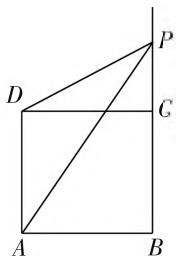
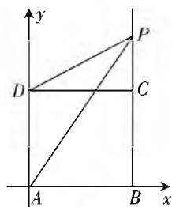

# 一道关于“比值”最小值问题的多视角探究

# ● 甘肃省民乐县第一中学 王维政

本文拟通过多解探究的形式,着重说明:分析、解决有关线段长度的比值的最小值时,我们应该如何巧妙利用所学相关数学知识和数学思想方法,灵活转化目标问题,旨在帮助同学们厘清常用解题思维,进一步拓宽处理此类问题的技能技巧,提高综合运用能力.

# 【好题采撷】

如图 1, 已知正方形 ABCD 的边长为 2, 点 P 在线段 BC 的延长线上, 则 $\frac{PD}{PA}$ 的最小值为 \_\_\_\_.

text_image

Geometric diagram of a square with labeled vertices and internal lines, likely for a math problem or proof.

图1

# 【试题分析】

本题以熟悉的平面图形为载体，图1
侧重考查学生利用“数形结合思想”分析、解决有关线段长度的比值的最小值问题，涉及基本不等式、函数、导数、相关三角函数以及直线与圆等知识在解题中的综合运用，能够较好地培养学生思维的发散性，提高解题能力.

# 【多解探究】

视角一:由于设出相关线段的长度(例如线段 PC 或 PB 的长度),可根据勾股定理得到线段 PD,PA 的长度表示,所以本题可借助函数思想或基本不等式加以求解.

解法 1: 设 $PB = x (x > 2)$ ，则根据正方形 ABCD 的边长为 2 以及 $Rt\triangle PCD, Rt\triangle PBA$ 可得 $PD = \sqrt{(x - 2)^{2} + 4}, PA = \sqrt{x^{2} + 4}$ ,

所以 $\frac{PD}{PA} = \frac{\sqrt{(x - 2)^2 + 4}}{\sqrt{x^2 + 4}} = \sqrt{1 + \frac{4 - 4x}{x^2 + 4}}.$

接下来,给出两种不同的思路,以飨读者.

思路1:设函数 $f(x)=\frac{4-4x}{x^{2}+4}(x>2)$ ，则 $f'(x)=\frac{4(x^{2}-2x-4)}{(x^{2}+4)^{2}}$ 。令 $f'(x)>0$ ，得 $x>\sqrt{5}+1$ ；令 $f'(x)<0$ ，得 $2<x<\sqrt{5}+1$ 。于是，函数 $f(x)$ 在 $(2,\sqrt{5}+1)$ 上单调递减，在 $(\sqrt{5}+1,+\infty)$ 上单调递增，所

以函数 $f(x)$ 的最小值为 $f(\sqrt{5} + 1) = \frac{1 - \sqrt{5}}{2}$ .

故所求 $\frac{PD}{PA}$ 的最小值为 $\sqrt{1 + \frac{1 - \sqrt{5}}{2}} = \frac{\sqrt{5} - 1}{2}$ .

思路2:设 $1-x=t(t<-1)$ ,

则 $\frac{PD}{PA} = \sqrt{1 + \frac{4t}{(1 - t)^2 + 4}} = \sqrt{1 + \frac{4}{t + \frac{5}{t} - 2}}.$

又因为 $t + \frac{5}{t} = -\left[(-t) + \left(-\frac{5}{t}\right)\right] \leqslant -2\sqrt{(-t) \cdot \left(-\frac{5}{t}\right)} = -2\sqrt{5}$ , 当且仅当 $-t = -\frac{5}{t}$ , 即 $t = -\sqrt{5}$ 时, 不等式取等号, 故所求 $\frac{PD}{PA}$ 的最小值为 $\sqrt{1 + \frac{4}{-2\sqrt{5} - 2}} = \frac{\sqrt{5} - 1}{2}$ .

评注:该解法是在灵活“设元”的基础上,借助函数思想(需要构造函数并分析其性质)或基本不等式(需要灵活变形)巧求相关比值的最小值,属于常用解题方法,应熟练掌握.

视角二:由于点 P 在线段 BC 的延长线上运动,所以 $\angle PAB$ 会随点 P 位置的变化而变化,据此可引入单个角参数,由图先得到线段 PD,PA 的长度表示,再借助三角函数知识加以求解.

解法2：设 $\angle PAB = \theta \left(\frac{\pi}{4} < \theta < \frac{\pi}{2}\right)$ ，则根据Rt△PBA得 $PA\cos \theta = 2, PB = 2\tan \theta$ ，再根据Rt△PCD可得 $PD = \sqrt{(2\tan\theta - 2)^2 + 4}$ .

于是，可知 $\frac{PD}{PA} = \cos \theta \sqrt{\tan^2\theta - 2\tan\theta + 2} = \sqrt{1 + \cos^2\theta - 2\sin\theta\cos\theta} = \sqrt{\frac{3}{2} + \frac{1}{2}\cos 2\theta - \sin 2\theta} = \sqrt{\frac{3}{2} + \frac{\sqrt{5}}{2}\cos(2\theta + \alpha)}$ ，其中 $\alpha$ 是锐角且满足 $\tan \alpha = 2$ .

又易知 $\cos (2\theta +\alpha)$ 可取得最小值-1，故所求 $\frac{PD}{PA}$

的最小值为 $\sqrt{\frac{3}{2} - \frac{\sqrt{5}}{2}} = \frac{\sqrt{5} - 1}{2}$ .

评注:该解法是在灵活引入单个“角参数”的基础上,先根据三角恒等变换知识,对目标问题中的比值实施一系列的变形,再灵活运用余弦函数的图像与性质,巧求最小值.

视角三:由于点 P 在线段 BC 的延长线上运动,所以 $\angle PDC$ 和 $\angle PAB$ 会随点 P 位置的变化而变化,据此引入两个角参数,由图先得到它们满足的关系式,再借助三角函数知识求解.

解法 3: 设 $\angle PDC = \alpha, \angle PAB = \beta$ ，则易知 $0 < \alpha < \frac{\pi}{2}, \frac{\pi}{4} < \beta < \frac{\pi}{2}$ .

由图知 $PC=2\tan\alpha, PB=2\tan\beta.$

又因为 $PB - PC = BC = 2$ ，所以可得 $2\tan \beta - 2\tan \alpha = 2$ ，即 $\tan \beta - \tan \alpha = 1.$

由图知 $PD\cos \alpha = 2, PA\cos \beta = 2,$

所以 $\frac{PD}{PA} = \frac{2}{\cos\alpha}\cdot \frac{\cos\beta}{2} = \frac{\cos\beta}{\cos\alpha}.$

设 $\frac{PD}{PA}=t$ ，由图易知PA>PD，所以0<t<1.
注意到 $\frac{1}{t}-t=\frac{\cos\alpha}{\cos\beta}-\frac{\cos\beta}{\cos\alpha}=\frac{\cos^{2}\alpha-\cos^{2}\beta}{\cos\alpha\cos\beta}$

$$
= \frac {\sin^ {2} \beta - \sin^ {2} \alpha}{\cos \alpha \cos \beta} = \frac {\sin (\beta + \alpha) \sin (\beta - \alpha)}{\cos \alpha \cos \beta}
$$

$$
= \sin (\beta + \alpha) \cdot \frac {\sin \beta \cos \alpha - \cos \beta \sin \alpha}{\cos \alpha \cos \beta}
$$

$$
= \sin (\beta + \alpha) \cdot (\tan \beta - \tan \alpha) = \sin (\beta + \alpha) \leqslant 1 (\text {当}
$$

且仅当 $\beta + \alpha = \frac{\pi}{2}$ 时，不等式取等号），所以 $\frac{1}{t} - t \leqslant 1$ 从而结合 $0 < t < 1$ 解得 $\frac{\sqrt{5} - 1}{2} \leqslant t < 1$ .

故所求 $\frac{PD}{PA}$ 的最小值为 $\frac{\sqrt{5}-1}{2}$ .

评注:该解法是在灵活引入两个“角参数”的基础上,先得到 $\tan\beta-\tan\alpha=1$ (转化题设已知条件),再根据三角恒等变换知识得到 $\frac{1}{t}-t=\sin(\beta+\alpha)$ , 进而利用正弦函数的有界性放缩、构建关于“t”的不等式(实现难点突破),最后通过解不等式即得所求最小值.

视角四: 由于点 A, D 均是定点, 而点 P 在线段 BC 的延长线上运动, 又注意到 $0 < \frac{PD}{PA} < 1$ , 所以动点 P 的轨迹为圆, 从而可通过建系, 灵活运用直线与圆知识加以求解.

解法 4: 如图 2, 建立平面直角坐标系 $xAy$ , 则点 $A(0,0)$ , $D(0,2)$ .

设点 $P(x,y)$ ，并设 $\frac{PD}{PA} = \lambda$ ，
则可得 $\frac{PD}{PA}=\frac{\sqrt{x^{2}+(y-2)^{2}}}{\sqrt{x^{2}+y^{2}}}=$ $\lambda$ ，所以两边平方变形得 $x^{2} + (y$ $-2)^{2} = \lambda^{2}(x^{2} + y^{2})$ ，再移项得 $(1 - \lambda^{2})x^{2} + (1 - \lambda^{2})y^{2}$ $4y + 4 = 0$ ，又易知 $0 < \lambda < 1$ ，所以实施除法变形得 $x^{2} + y^{2} - \frac{4}{1 - \lambda^{2}} y + \frac{4}{1 - \lambda^{2}} = 0$ ，进而实施配方变形可得 $x^{2} + \left(y - \frac{2}{1 - \lambda^{2}}\right)^{2} = \left(\frac{2\lambda}{1 - \lambda^{2}}\right)^{2}$ .据此可知，动点 $P$ 的轨迹是以点 $\left(0,\frac{2}{1 - \lambda^2}\right)$ 为圆心，且以 $\frac{2\lambda}{1 - \lambda^2}$ 为半径的圆.

又注意到点 $P$ 是该圆与直线 $x = 2$ 的公共点，所以圆心到直线的距离不大于半径，即 $2 \leqslant \frac{2}{1 - \lambda^2}$ ，结合0 $< \lambda < 1$ 解得 $\frac{\sqrt{5} - 1}{2} \leqslant \lambda < 1$ .

故所求 $\frac{PD}{PA}$ 的最小值为 $\frac{\sqrt{5}-1}{2}$ .

评注:该解法的切入点是注意到 $\frac{PD}{PA}$ 表示动点P到两个定点D,A的距离之比,所以极易想到可借助动点的轨迹巧妙分析,充分体现了“数形结合思想”在解题中的灵活运用.常用结论:一般地,平面内给定线段AB,动点P满足 $\frac{|PA|}{|PB|}=\lambda(\lambda>0)$ ,若 $\lambda=1$ ,则动点P的轨迹是线段AB的垂直平分线;若 $\lambda\neq1$ ,则动点P的轨迹是圆.

综上,求解有关线段长度的比值的最小值时,需要关注以下两点:一是充分关注“数形结合思想”“转化思想”在解题中的灵活运用;二是充分关注求解最值的常用途径(涉及函数的单调性、基本不等式、三角函数的有界性、直线与圆具有公共点的充要条件)在解题中的巧妙利用.显然,通过多解探究,有利于帮助我们拓宽分析、解决此类问题的解题思维视野,同时能够较好地培养直观想象、逻辑推理与数学运算方面的核心素养,且学且悟且提升.F

text_image

y
P
D
C
A
B
x

图2