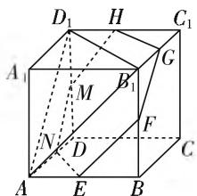
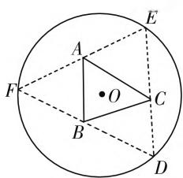

# 例谈解题过程中问题解决的逻辑线索和逻辑关系

# ● 安徽省金寨第一中学 六安市徐道奎名师工作室 徐道奎

# 一、问题的提出

解题是数学教学的重要组成部分，“数学的真正组成部分应该是问题和解，解题才是数学的心脏”（美国数学家哈尔莫斯语），“掌握数学就意味着善于解题”（美籍匈牙利数学家波利亚语），解题在发展学生素养，提升学生能力中的作用不可替代。正因如此，一线教师非常注重解题教学。衡量一个教师的教学水平很大程度上要看他的解题能力和解题教学水平。

数学解题的关键是什么呢？笔者认为：在于找到问题解决的逻辑切入点，打开问题解决的突破口，发现问题解决的逻辑线索，找到问题解决的逻辑关系。为什么呢？第一，解题过程是不断地寻求思路的过程，这个过程本身充满逻辑性。第二，逻辑线索和逻辑关系反映问题的内在联系，决定问题的解决方向，能否找到这个线索和关系，也就决定了解题能否顺利进行。尤其能力要求较高的问题，因其内在逻辑关系更为隐蔽，逻辑跳跃较大，找到问题解决的逻辑线索更为困难，需要综合分析，在探究中发现。

# 二、问题解决的逻辑关系(逻辑线索)寻找路径

# （一）依据概念的内涵和意义寻找逻辑关系

理解概念是厘清逻辑关系、发现逻辑线索的前提,问题解决的逻辑线索很多来自概念,抓住概念反映的数学本质是根本.

例 1 （2018 年全国卷 I 理科第 12 题）已知正方体的棱长为 1，每条棱所在的直线与平面 $\alpha$ 所成的角都相等，则 $\alpha$ 截此正方体所得截面面积的最大值为（）.

A. $\frac{3\sqrt{3}}{4}$

B. $\frac{2\sqrt{3}}{3}$

C. $\frac{3\sqrt{2}}{4}$

D. $\frac{\sqrt{3}}{2}$

分析:线面角的概念是寻求逻辑关系的关键.

(1) 由线面角概念可知, 线面角实为线线角(平面外直线与其在平面内的射影的夹角).   
(2) 线线角中，“平行”不改变夹角，因此，“所有

棱”转化为“三条棱”.

(3)“三条棱”再转化为从同一个顶点出发的三条棱,从而得到一个截面.这样,可以先把满足条件的截面之一找到,考虑棱 $A_{1}B_{1}$ 、 $A_{1}D_{1}$ 、 $A_{1}A$ 的三条棱,如图1,平面 $AB_{1}D_{1}$ 即是一个截面.

text_image

D₁ H C₁
A₁ M B₁ G
N D F C
A E B

图1

(4) 为什么上述三条棱与平面 $AD_{1}B_{1}$ 所成的角相等？因为线面角（不妨设直线为 $l$ ，平面为 $\alpha$ ）的正弦（除直角和零度的角）为 $\sin \alpha = \frac{d}{l_0}$ ，其中 $d$ 表示斜线 $l$ 上任一点 $P$ 到平面 $\alpha$ 的距离， $l_0$ 表示点 $P$ 到斜线与平面的斜足之间的距离（称为“斜距离”），因为三条棱过同一点 $A_{1}$ ，截面 $AD_{1}B_{1}$ 的三条斜线 $A_{1}A, A_{1}D_{1}, A_{1}B_{1}$ 的公共顶点 $A_{1}$ 到平面 $AD_{1}B_{1}$ 的距离 $d$ 相同，又 $A_{1}A = A_{1}D_{1} = A_{1}B_{1}$ ，“斜距离”相等，因此，三个端点 $B_{1}, D_{1}, A$ 即组成满足条件的一个截面，我们记为 $\alpha$ .  
(5) 面积的最大截面应该与截面 $\alpha$ 平行, 那么, 哪一个符合要求呢? 平行移动平面 $\alpha$ , 由对称性可知, 当截面 $\alpha$ 是经过正方体相应的六条棱的中点时截面面积最大.

# （二）在回归问题的数学本质中寻求逻辑关系

数学问题,纷繁复杂,但“万变不离其宗”,问题的数学本质和解决方式不变,通过这些“不变”,挖掘逻辑线索,寻找逻辑规律.

例 2 （2017 年全国卷 I 理科第 16 题）如图 2，圆形纸片的圆心为 O，半径为 5cm，该纸片上的等边三角形 ABC 的中心为 O，D，E，F 为圆 O 上的点， $\triangle DBC, \triangle ECA, \triangle FAB$ 分别是以 BC，CA，AB 为底边的等腰三

text_image

Geometric diagram showing a circle with inscribed triangle ABC and auxiliary points D, E, F, O, including dashed lines for construction.

图2

角形. 沿虚线剪开后, 分别以 $BC, CA, AB$ 为折痕折起 $\triangle DBC, \triangle ECA, \triangle FAB$ , 使得 $D, E, F$ 重合, 得到三棱锥. 当 $\triangle ABC$ 的边长变化时, 所得三棱锥体积 (单位: $\mathrm{cm}^3$ ) 的最大值为 \_\_\_\_.

分析:求解“最值”问题,一般要转化为函数问题处理,这是问题解决的根本,是问题解决的本质.既然是函数最值或值域问题,则需找到函数关系.

如图2, 连结 $OF$ 交 $AB$ 于 $P$ , 设折叠后 $D, E, F$ 重合于 $F'$ . 设 $OP = x$ , 则 $AB = 2\sqrt{3}x$ , $S_{\triangle ABC} = \frac{1}{2} \cdot (2\sqrt{3}x)^2 \sin 60^\circ$ . 又知 $OF = 5$ , $FP = 5 - x$ , 三棱锥的高 $OF' = \sqrt{(5 - x)^2 - x^2} = \sqrt{25 - 10x}$ , 所以三棱锥的体积 $V = \frac{1}{3} S_{\triangle ABC} \cdot OF = \sqrt{15(5x^4 - 2x^5)}$ . 令 $f(x) = 15(5x^4 - 2x^5)$ , 可以通过导数求出最大值.

# (三) 在条件与结论的充分融合中寻求逻辑关系

例 3 （2020 全国卷理科第 20 题）已知 A, B 分别为椭圆 $E: \frac{x^{2}}{a^{2}} + y^{2} = 1 (a > 1)$ 的左、右顶点，G 为 E 的上顶点， $\overrightarrow{AG} \cdot \overrightarrow{GB} = 8, P$ 为直线 x = 6 上的动点，PA 与 E 的另一个交点为 C, PB 与 E 的另一个交点为 D.

(1) 求 $E$ 的方程；

(2) 证明: 直线 CD 过定点.

分析:(第二问)本问涉及到的点、线较多,隐含的关系复杂.如何找寻条件结论的契合点?①从结论分析.怎样证明直线CD过定点呢?如果直线方程 $x=my+n$ 或 $y=mx+n$ 中m,n系数有一个固定关系,则往往能够发现定点.因此要设法找出m,n.先求出点C和点D的坐标,再求出直线CD的方程,整理成 $x=my+n$ 或 $y=mx+n$ 形式,观察出定点.②从条件分析:P为直线x=6上的动点,设 $P(6,m)$ ,PA,PB与椭圆的交点C,D坐标可以解出,用参数表示.条件结论联系起来了,解题的逻辑思路有了.

# （四）从形式结构中发现逻辑关系

逻辑关系和逻辑线索有时隐藏在式子中,要通过分析、观察式子的结构发现其隐含的逻辑关系和逻辑线索.

例 4 （2020 年全国卷 I 理科第 12 题）若 $2^{a} + \log_{2}a = 4^{b} + 2\log_{4}b$ ，则（）.

$$
\mathrm{A.} a > 2 b \quad \mathrm{B.} a <   2 b \quad \mathrm{C.} a > b ^ {2} \quad \mathrm{D.} a <   b ^ {2}
$$

分析: 观察题目中给出的式子结构, 容易联想它们均与某一函数的函数值有关. 构造 $f(x)=2^{x}+\log_{2}x$ , 通过函数的单调性解决, 显然, 答案 B 符合题意, 理由如下: 若 a<2b, 则 $f(a)<f(2b)$ , 则 $2^{a}+\log_{2}a<2^{2b}+\log_{2}2b$ . 由于 $2^{a}+\log_{2}a=4^{b}+2\log_{4}b$ , 则 $4^{b}+2\log_{4}b<2^{2b}+\log_{2}2b$ , 可得 $2\log_{4}b<\log_{2}2b$ , 进一步得到 b<2b, 而其余几个答案不成立或不一定成立.

# （五）顺着问题发生发展的路径寻找逻辑关系

有些问题,其逻辑线索不甚明显,我们可以顺着问题发生发展的路径或按照题目“暗示”的问题解决方向寻找逻辑线索,发现逻辑关系.

例5 已知椭圆 $C$ 的两个顶点分别为 $A(-2,0)$ , $B(2,0)$ , 焦点在 $x$ 轴上, 离心率为 $\frac{\sqrt{3}}{2}$ .

(1) 求椭圆 C 的方程;

(2) 点 $D$ 为 $x$ 轴上一点, 过 $D$ 作 $x$ 轴的垂线交椭圆 $C$ 于不同两点 $M, N$ , 过点 $D$ 作 $AM$ 的垂线交 $BN$ 于点 $E$ , 求 $\triangle BDE$ 与 $\triangle BDN$ 的面积之比.

分析:(第二问)求三角形面积的方法多种多样,如何求 $\triangle BDE$ 与 $\triangle BDN$ 的面积之比呢?一开始思路有可能不是很清晰,但问题发生发展的线路很直白,一切皆是因为x轴上的D点而引起的关系,问题产生的逻辑线索:点 $D\rightarrow$ 过D作x轴的垂线MN(点M,N) $\rightarrow$ 过D作AM的垂线DE(DE与BN交点E) $\rightarrow$ 求 $\triangle BDE$ 与 $\triangle BDN$ 的面积比.依照这个逻辑线索,我们从“源头”开始,设D点坐标为(m,0), $M(m,n)$ , $N(m,-n)$ (注意点M,N坐标中的n完全可以用m表示,但考虑比较复杂,不妨先用过渡变量n表示),显然 $m\neq\pm2,n\neq0$ ,由于直线AM的斜率 $k_{AM}=\frac{n}{m+2}$ ,故直线DE的斜率 $k_{DE}=-\frac{m+2}{n}$ ,所以直线DE的方程为 $y=-\frac{m+2}{n}(x-m)$ ,而直线BN的方程为 $y=\frac{n}{2-m}(x-2)$ ,联立直线AM与DE的方程可以解得点E的坐标,实际上到这里我们才完全清楚,只要解得点E的纵坐标即可以求出面积比.易得 $y_{E}=-\frac{n(4-m^{2})}{4-m^{2}+n^{2}}$ ,点 $M(m,n)$ 在椭圆上,将关系4 $-m^{2}=4n^{2}$ 代入,得 $y_{E}=-\frac{4n}{5}$ ,所以 $\triangle BDE$ 与 $\triangle BDN$ 的面积比为4:5.

对于新情境问题,更应该顺着问题产生、发展的轨迹和逻辑顺序分析.

# 三、结束语

解题教学和概念教学一样,要把数学的逻辑和思维培养放到一个非常重要的地位,要跳出“题型”和“范式”,“教”学生怎么想,剖析知识的逻辑性、问题的逻辑性、思维的逻辑性,把问题之间的逻辑关系梳理出来,解题教学不能背离思维和逻辑,不能屈从于题型的解答范式和仅仅得出问题的答案. W