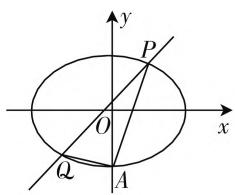
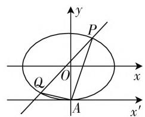
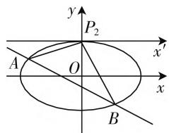
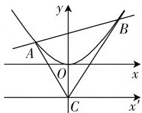

# 圆锥曲线中一类定值问题的创新解法

# ● 甘肃省古浪县第三中学 李永科 窦立群

在适当建立新的平面直角坐标系的基础上,借助“构造齐次式”技巧,可巧妙求解直线与圆锥曲线交汇中,涉及具有公共点的两条直线的斜率之和(或与斜率之积相关的代数式)为定值的有关问题.

典型问题 已知 P 是平面内的一个定点, 圆锥曲线 C 上有两动点 A, B, 证明: 直线 PA 与 PB 的斜率之和(或者斜率之积)为定值.

# 解题步骤：

(1) 在公共点 P 处建立新的平面直角坐标系(横轴与原来的横轴平行或重合, 正方向相同; 纵轴与原来的纵轴平行或重合, 正方向相同), 则可将原问题等价转化为在新坐标系下, 证明直线 PA 与 PB 的斜率之和(或者斜率之积)为定值.  
(2) 在新坐标系下, 先写出圆锥曲线 $C$ 的方程, 并设直线 $AB$ 的方程为 $mx + ny = 1$ , 二者联立可构造形如“ $cx^2 + bxy + ay^2 = 0$ ”的齐次式 (具体变形时, 一次项需要乘以 $mx + ny$ , 常数项需要乘以 $(mx + ny)^2)$ ; 然后等式两边同时除以 $x^2$ , 得到 $a \cdot \left(\frac{y}{x}\right)^2 + b \cdot \frac{y}{x} + c = 0$ .  
(3) 由于点 A, B 的坐标满足上述方程, 所以 $k_{PA}$ , $k_{PB}$ 是关于“t”的一元二次方程 $at^{2} + bt + c = 0$ 的两个实数根, 从而利用韦达定理即得 $k_{PA} + k_{PB} = -\frac{b}{a}$ , $k_{PA} \cdot k_{PB} = \frac{c}{a}$ , 再结合其他题设条件化简即知: 直线 PA 与 PB 斜率之和 (或者斜率之积) 为定值.

# 类型一、证明斜率之和为定值

例 1 如图 1, 椭圆 $E: \frac{x^{2}}{a^{2}} + \frac{y^{2}}{b^{2}} = 1 (a > b > 0)$ 经过点 $A(0, -1)$ , 且离心率为 $\frac{\sqrt{2}}{2}$ .

(1) 求椭圆 E 的方程；  
(2) 经过点 $(1,1)$ , 且斜率为 $k$ 的直线与椭圆 $E$ 交于不同的两点 $P, Q$ (均异于点 $A$ ), 证明: 直线 $AP$ 与 $AQ$ 斜率之和为 2.

text_image

y
P
O
x
Q
A

图1

text_image

y
P
Q
O
x
A
x'

图2

解析:(1) $\frac{x^{2}}{2}+y^{2}=1.$ (具体过程,略)

(2) 当直线 PQ 经过坐标原点时, 易分析知, 直线 AP 与 AQ 斜率之和为 2.

接下来,具体分析直线 PQ 不经过坐标原点的情形.

如图 2, 在点 A 处建立新的直角坐标系 $x^{\prime}Ay$ , 则原问题可等价转化为: 在新坐标系下, 直线 PQ 经过点 (1,2), 椭圆方程为 $\frac{x^{2}}{2} + (y - 1)^{2} = 1$ , 证明直线 AP 与 AQ 斜率之和为 2.

在新坐标系下,设直线 PQ 的方程为 $mx + ny = 1$ , 则根据直线 PQ 经过点(1,2)可得 $m + 2n = 1$ .

椭圆方程 $\frac{x^2}{2} + (y - 1)^2 = 1$ ，可变形为 $\frac{x^2}{2} + y^2 - 2y = 0$ ，即 $\frac{x^2}{2} + y^2 - 2y (mx + ny) = 0$ ，亦即 $\frac{x^2}{2} - 2mxy + (1 - 2n)y^2 = 0$ ，两边同除以 $x^2$ ，得 $(1 - 2n)\frac{y^2}{x^2} - 2m\frac{y}{x} + \frac{1}{2} = 0$ .

因为点 P, Q 的坐标满足上述方程, 所以 $k_{AP}, k_{AQ}$ 是关于“t”的一元二次方程 $(1 - 2n)t^{2} - 2mt + \frac{1}{2} = 0$ 的两个实数根, 从而 $k_{AP} + k_{AQ} = \frac{2m}{1 - 2n} = \frac{2m}{m} = 2$ .

综上,必有直线AP与AQ斜率之和为2.故得证.

# 类型二、根据斜率之和为定值,证明直线过定点

例2 已知椭圆 $C: \frac{x^2}{a^2} + \frac{y^2}{b^2} = 1 (a > b > 0)$ ，四点

$P_{1}(1,1), P_{2}(0,1), P_{3}\left(-1, \frac{\sqrt{3}}{2}\right), P_{4}\left(1, \frac{\sqrt{3}}{2}\right)$ 中恰有三点在椭圆 $C$ 上.

(1) 求 $C$ 的方程；

(2) 设直线 $l$ 不经过 $P_{2}$ 点且与 $C$ 相交于 $A, B$ 两点，若直线 $P_{2}A$ 与直线 $P_{2}B$ 的斜率的和为 $-1$ ，证明： $l$ 过定点.

解析:(1) $\frac{x^{2}}{4}+y^{2}=1.$ (具体过程,略)

(2) 先分析直线 l 不经过坐标原点的情形.

如图3, 在点 $P_{2}$ 处建立新的直角坐标系 $x^{\prime}P_{2}y$ , 则在新坐标系下椭圆方程为 $\frac{x^{2}}{4} + (y + 1)^{2} = 1$ .

text_image

y
P₂
x′
A
O
x
B

图3

在新坐标系下,设直线 l 的方程为 $mx + ny = 1$ .

椭圆方程 $\frac{x^2}{4} + (y + 1)^2 = 1$ ，可变形为 $\frac{x^2}{4} + y^2 + 2y = 0$ ，即 $\frac{x^2}{4} + y^2 + 2y(mx + ny) = 0$ ，亦即 $\frac{x^2}{4} + 2mxy + (1 + 2n)y^2 = 0$ ，两边同除以 $x^2$ ，得 $(1 + 2n)\frac{y^2}{x^2} + 2m\frac{y}{x} + \frac{1}{4} = 0.$

因为点 A, B 的坐标满足上述方程，所以 $k_{P_{2}A}$ ， $k_{P_{2}B}$ 是关于“t”的一元二次方程 $(1+2n)t^{2}+2mt+\frac{1}{4}=0$ 的两个实数根，从而 $k_{P_{2}A}+k_{P_{2}B}=-\frac{2m}{1+2n}$ .

于是，根据题设“直线 $P_{2}A$ 与直线 $P_{2}B$ 的斜率的和为 $-1$ ”，可得 $-\frac{2m}{1 + 2n} = -1$ ，即 $2m - 2n = 1$ ，据此结合直线 $l$ 的方程为 $mx + ny = 1$ 可知，在新系下，直线 $l$ 过定点 $(2, -2)$ 。从而，在 $xOy$ 坐标系下可知，直线 $l$ 过定点 $(2, -1)$ 。

当直线 l 经过坐标原点时, 易知直线 l 的方程为 x = -2y, 显然经过点 $(2, -1)$ .

综上,必有直线 l 过定点 $(2,-1)$ . 故得证.

# 类型三、证明与斜率之积相关的代数式为定值

例 3 （2021·眉山期末卷）已知抛物线的顶点为原点，关于 y 轴对称，且过点 $N\left(-1, \frac{1}{2}\right)$ .

(1) 求抛物线的方程；

(2) 已知 $C(0, -2)$ , 若直线 $y = kx + 2$ 与抛物线交于 $A, B$ 两点, 记直线 $CA, CB$ 的斜率分别为 $k_{1}, k_{2}$ , 求证: $k_{1}k_{2} + k^{2}$ 为定值.

解析:(1) $x^{2}=2y$ .(具体过程,略)

(2) 如图 4, 在点 C 处建立新的直角坐标系 $x^{\prime}Cy$ , 则在新坐标系下抛物线方程为 $x^{2}=2(y-2)$ . 易知直线 AB 不经过坐标原点.

text_image

y
A
O
C
B
x
x'

图4

在新坐标系下,设直线AB的方程为 $mx+ny=1$ .
( \* )

抛物线方程 $x^{2} = 2(y - 2)$ ，可变形为 $x^{2} - 2y + 4$ $= 0$ ，即 $x^{2} - 2y(mx + ny) + 4(mx + ny)^{2} = 0$ ，亦即 $(1 + 4m^{2})x^{2} + (8mn - 2m)xy + (4n^{2} - 2n)y^{2} = 0$ ，两边同除以 $x^{2}$ ，得 $(4n^{2} - 2n)\cdot \frac{y^{2}}{x^{2}} +(8mn - 2m)\cdot \frac{y}{x} +1$ $+4m^2 = 0.$

因为点 $A, B$ 的坐标满足上述方程，所以 $k_{1}, k_{2}$ 是关于“ $t$ ”的一元二次方程 $(4n^{2} - 2n) \cdot t^{2} + (8mn - 2m) \cdot t + 1 + 4m^{2} = 0$ 的两个实数根，从而 $k_{1}k_{2} = \frac{1 + 4m^{2}}{4n^{2} - 2n}$ .

由题设知, $y=kx+2$ 是直线AB的方程,所以考虑(\*)可得 $k=-\frac{m}{n}$ .

由于易知在新坐标系下直线 $AB$ 经过点 $(0,4)$ ，将之代入 $mx + ny = 1$ ，得 $4n = 1$ ，即 $n = \frac{1}{4}$ .

于是， $k_{1}k_{2} + k^{2} = \frac{1 + 4m^{2}}{4n^{2} - 2n} +\left(-\frac{m}{n}\right)^{2} = -4-$ $16m^2 +16m^2 = -4.$ 故 $k_{1}k_{2} + k^{2}$ 为定值.

综上, 结合举例解析可知: 该方法由于在两条直线的公共点 $(x_0, y_0)$ 处建立了新的坐标系, 导致将经过两点 $(x, y), (x_0, y_0)$ 的直线斜率 $\frac{y - y_0}{x - x_0}$ , 变为比较简单的形式 $\frac{y}{x}$ , 从而有利于问题的简捷求解! 显然, 该方法的优点是大大减小了计算量, 提高了解题的准确性; 其缺点是方程 $mx + ny = 1$ 不能表示经过坐标原点的直线, 故解题时需要对特殊情形进行单独分析. 一言以蔽之, 只有创新思维、善于探索, 才能获得新颖别致的解法, 令人细细品味, 从而不断提升数学核心素养! F