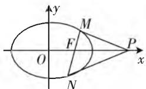
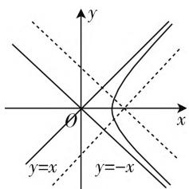
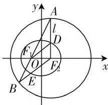

# 圆锥曲线综合题的解题分析与优化运算

# ● 甘肃省白银市第一中学 胡贵平

圆锥曲线综合题涉及知识点多,对逻辑推理和数学运算的数学核心素养要求较高,许多学生对含参代数式的运算缺乏预判,盲目机械地运算,算理存在理解上的偏差.如何从题目中的一些已知条件突破,将结论进行相应的转化,寻找到最简便的解题思路和技巧呢?

# 一、强化逻辑推理

充分理解圆锥曲线图形性质的基础上,从揭示几何规律入手,以几何推理为基础,借助几何直观,建立条件与结论之间可操作的算法,形成解题的思维路线图,通过数值的合理运算探寻到量的关系,从而突破求解.

# (一) 从结论着手, 执果索因

探索结论成立所满足的条件,即结论成立意味着什么,通过等价转化,还可以得出什么,结论与条件之间又有怎样的联系,转变为寻求变量之间的关系,通过逻辑推理找到问题的切入点,把结论和已知条件逐步接近.

例 1 已知椭圆 $C: \frac{x^{2}}{16} + \frac{y^{2}}{12} = 1$ 的右焦点为 F，右顶点为 A，离心率为 e，点 $P(m, 0) (m > 4)$ 满足条件 $\frac{|FA|}{|AP|} = e$ .

(1) 求 $m$ 的值；  
(2) 设过点 $F$ 的直线 $l$ 与椭圆 $C$ 相交于 $M, N$ 两点，记 $\triangle PMF$ 和 $\triangle PNF$ 的面积分别为 $S_1, S_2$ ，求证： $\frac{S_1}{S_2} = \frac{|PM|}{|PN|}$ .

解析:(1)m=8.(过程略)

(2) 先画出图, 如图 1, 着眼于问题, 要证 $\frac{S_{1}}{S_{2}} = \frac{|PM|}{|PN|}$ , 这是一个几何特征, 怎么转化成代数关系？注意到 $\frac{S_{1}}{S_{2}}=\frac{\frac{1}{2}|PF||PM|\sin\angle MPF}{\frac{1}{2}|PF||PN|\sin\angle NPF}$

  
图1

所以只需要证 $\sin \angle MPF = \sin \angle NPF$ ，从而问题转化为只需要证 $k_{MP} = -k_{NP}$ .这样新的目标就是证明 $k_{MP} + k_{NP} = 0.$ 由于直线 $l$ 的方程是 $y = k(x - 2)$ ，变成了证明 $\frac{k(x_M - 2)}{x_M - 8} +\frac{k(x_N - 2)}{x_N - 8} = 0$ ，将式子化简得

$\frac{kx_{M}x_{N}-10k(x_{M}+x_{N})+32k}{(x_{M}-8)(x_{N}-8)}=0.$ 直线 l 与椭圆 C 的方程联立，由韦达定理就可得到 $x_{M}+x_{N}, x_{M}x_{N}$ . 因为直线 l 斜率是否存在不确定，所以还应该考虑斜率不存在的情况.

# (二) 从条件出发,由因导果

准确把握条件中的信息, 即条件意味着什么, 这些条件通过等价转化, 还可以得出什么, 几个条件之间又有怎样的联系, 多角度地用代数运算刻画几何关系, 通过逻辑推理有效提炼整合解题信息.

例2（2018年全国新课标Ⅲ）已知斜率为 $k$ 的直线 $l$ 与椭圆 $C: \frac{x^2}{4} + \frac{y^2}{3} = 1$ 交于 $A, B$ 两点. 线段 $AB$ 的中点为 $M(1, m) (m > 0)$ .

(1) 证明: $k < -\frac{1}{2}$ ;

(2) 设 F 为 C 的右焦点, P 为 C 上一点, 且 $\overrightarrow{FP} + \overrightarrow{FA} + \overrightarrow{FB} = 0$ , 证明: $2 |\overrightarrow{FP}| = |\overrightarrow{FA}| + |\overrightarrow{FB}|$ .

解析:(1)证明:从条件出发,斜率为k的直线l与椭圆 $C:\frac{x^{2}}{4}+\frac{y^{2}}{3}=1$ 交于A,B两点.可以想到联立方程, $\Delta>0$ 以及根据韦达定理得出 $x_{A}+x_{B},x_{A}x_{B}$ ;线段AB的中点为 $M(1,m)$ .很自然得出 $x_{A}+x_{B}=2,y_{A}+y_{B}=2m$ ,转化为斜率k的不等式,从而求得斜率k的范围.挖掘两个条件之间的关系,涉及中点弦问题,很容易想到点差法,根据 $M(1,m)$ 在椭圆内,可求得斜率k的范围.除这两种通法外,还可以应用直线的参数方程.厘清了条件信息,思路就会自然生成.

(2) $\overrightarrow{FP}+\overrightarrow{FA}+\overrightarrow{FB}=0$ 可转化为 $\overrightarrow{FP}+2\overrightarrow{FM}=0$ ，而 $M(1,m), F(1,0)$ ，可得 P 的坐标为 $(1,-2m)$ 。另一个角度看 $\overrightarrow{FP}+\overrightarrow{FA}+\overrightarrow{FB}=0$ ，显然点 F 为 $\triangle ABP$ 的重心，由三角形重心坐标公式亦得 P 的坐标为 $(1,-2m)$ 。由 P 在椭圆上，得出 $m=\frac{3}{4}$ ，进而求得斜率 k，求得直线 l 的方程，联立直线 l 和椭圆方程，求出 A, B 两点的坐标，再由两点间的距离公式求得。

# 二、优化数学运算

学生对运算能力的重要性认识不够,遇到计算复杂的问题,心理脆弱,不敢算、也不愿意去算,选取的方法不得当,会导致计算过程复杂,数学运算一定要明确算什么,怎么算,掌握一些计算技巧,培养学生探究问题的能力.

# (一) 数形结合, 优化数学运算

解析几何的基本思想是用代数的方法研究几何问题,但是解析几何归根结底解决的是几何问题,借助形的几何直观来阐明数之间的某种关系,把抽象的数学语言与直观的几何图形结合起来,不但可以拓宽解题思路,而且还能避免繁杂的计算和推理,简化解题过程.

例 3 直线 $l: y = k(x - \sqrt{2})$ 与双曲线 $x^{2} - y^{2} = 1 (x > 0)$ 的右支交于 A, B 两点，则直线 l 的倾斜角的范围是 \_\_\_\_.

解: 直线 $l: y = k(x - \sqrt{2})$ 恒过定点 $(\sqrt{2}, 0)$ ，但不垂直于 x 轴，双曲线 $x^{2} - y^{2} = 1 (x > 0)$ 渐近线为 $y = \pm x$ ，如图 2，数形结合可得 k > 1 或 k < -1。所以直线 l 的倾斜角的范围是 $\left(\frac{\pi}{4}, \frac{\pi}{2}\right) \cup \left(\frac{\pi}{2}, \frac{3\pi}{4}\right)$ 。

text_image

y
O
x
y=x
y=-x

图2

# (二) 应用定义, 优化数学运算

圆锥曲线的定义不仅是推导圆锥曲线方程及性质的基础,而且也是解题的重要工具,借助定义可以使复杂的问题简单化,提高解题效率.

例 4 （2015 年浙江卷文）椭圆 $\frac{x^{2}}{a^{2}} + \frac{y^{2}}{b^{2}} = 1 (a > b > 0)$ 的右焦点为 $F(c, 0)$ 关于直线 $y = \frac{b}{c} x$ 的对称点 Q 在椭圆上，则椭圆的离心率是 \_\_\_\_.

解:记右焦点为 $F'$ ，因为 Q 是 F 关于直线 $y = \frac{b}{c}x$ 的对称点，所以直线 $y = \frac{b}{c}x$ 垂直平分线段 MF，又因为点 O 是 $FF'$ 的中点，所以直线 MF 平行于直线 $y = \frac{b}{c}x$ ，所以 $\tan \angle QF'F = \frac{b}{c}, \angle F'QF = 90^\circ$ ，不妨设 $|QF| = bt, |QF'| = ct (t > 0)$ ，所以 M 在椭圆上， $2a = |QF| + |QF'| = (b + c)t, 2c = |F'F| = \sqrt{(bt)^2 + (ct)^2} = at$ ，所以 $\frac{c}{a} = \frac{a}{c + b}$ ，即 $a^2 = c^2 + bc, b = c$ ，所以 $e = \frac{\sqrt{2}}{2}$ .

# (三) 二级结论,优化数学运算

圆锥曲线的二级结论很多,灵活运用一些简单的结论,如圆锥曲线中的垂径定理、抛物线焦点弦的性质等等,一方面可以提高分析推理能力,另一方面可以减少运算步骤,使解题思路简明,更加合理化.

例5（2014年全国新课标卷Ⅱ理）设 $F$ 为抛物线$C: y^{2} = 3x$ 的焦点, 过 $F$ 且倾斜角为 $30^{\circ}$ 的直线交 $C$ 于 $A, B$ 两点, $O$ 为坐标原点, 则 $\triangle OAB$ 的面积为( ).

A. $\frac{3\sqrt{3}}{4}$

B. $\frac{9\sqrt{3}}{8}$

C. $\frac{63}{32}$

D. $\frac{9}{4}$

解:根据抛物线焦点弦的性质 $S_{\triangle OAB}=\frac{p^{2}}{2\sin\alpha}$ ，其中 $\alpha$ 为直线 l 的倾斜角， $S_{\triangle OAB}=\frac{\left(\frac{3}{2}\right)^{2}}{2\sin30^{\circ}}=\frac{9}{4}$ . 故选 D.

# (四) 平面几何, 优化数学运算

解析几何的本质特性是“几何性”，要善于捕捉曲线的几何特征，灵活应用平面几何的性质，如三角形的中位线性质、内角平分线性质定理、等腰三角形的判定和性质、圆的有关定理等等，不仅能简化运算，还能充分感受到平面几何的魅力，收到事半功倍的效果。

例6 如图3, 在平面直角坐标系 $xoy$ 中, 椭圆 $C: \frac{x^2}{a^2} + \frac{y^2}{b^2} = 1 (a > b > 0)$ 的焦点为 $F_1(-1, 0), F_2(1, 0)$ . 过 $F_2$ 作 $x$ 轴的垂线 $l$ , 在 $x$ 轴的上方, $l$ 与圆 $F_2: (x - 1)^2 + y^2 = 4a^2$ 交于点 $A$ , 与椭圆C 交于点 D. 连结 $AF_{1}$ 并延长交圆 $F_{2}$ 于点 B, 连结 $BF_{2}$ 交椭圆 C 于点 E, 连结 $DF_{1}$ . 已知 $DF_{1} = \frac{5}{2}$ .

text_image

y
A
l
D
F₁
O
F₂
x
B
E

图3

(1) 求椭圆 C 的标准方程；  
(2) 求点 E 的坐标.

解:(1) 过程略,椭圆 C 的标准方程为: $\frac{x^{2}}{4} + \frac{y^{2}}{3} = 1$ ;

(2) 连接 $EF_{1}$ , 由于 $BF_{2} = 2a$ , $EF_{1} + EF_{2} = 2a$ , 所以 $EF_{1} = EB$ , $\angle B = \angle BF_{1}E$ , 又 $BF_{2} = AF_{2}$ , $\angle B = \angle BAF_{2}$ , 所以 $\angle BF_{1}E = \angle BAF_{2}$ , 所以 $EF_{1} // AF_{2}$ , 所以 $EF_{1} \perp x$ 轴, 因为 $F_{1}(-1,0)$ , 由 $\left\{ \begin{array}{l} x = -1, \\ \frac{x^{2}}{4} + \frac{y^{2}}{3} = 1, \end{array} \right.$ 得 $y = \pm \frac{3}{2}$ . 又因为 $E$ 是线段 $BF_{2}$ 与椭圆的交点, 所以 $y = -\frac{3}{2}$ . 所以 $E\left(-1, -\frac{3}{2}\right)$ .

# 三、结束语

许多学生解决圆锥曲线综合问题信心不足,其中很重要的原因是对问题无从着手,对繁杂的计算恐惧,几何特征转化为代数关系,是坐标法实施的关键,应成为圆锥曲线学习必备的解题经验.课堂教学中普遍重视解题策略的寻找,轻视计算的做法要改变,计算的重要环节必须得到充分的训练,让学生的思维品质和数学运算素养得到相应的提升,实现圆锥曲线综合问题的有效突破.W