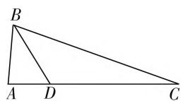
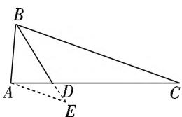

# 多思维切入,妙方法应用

—— 一道解三角形试题的破解

山东省菏泽第一中学 于焕云

以三角形为载体，涉及三角形的边长、角等元素或其相应的代数式，通过合理构造，创新应用，设置成求解定值、最值或取值范围问题，充分体现新课程标准在“知识点交汇处”命题的指导思想，是解三角形问题中的重点与难点之一，一直是历年高考中的基本考点和亮点之一。此类问题往往设置巧妙，形式活泼多样，既有三角形这一“形”的直观，又有边长、角等这一“数”的运算，往往知识交汇点众多，题目难度比较大，破解的思维方式多变，解题方法也多种多样，是考查知识与能力，体现选拔性的一个很好的场所。

# 一、问题呈现

问题 （西南名校联盟2020届高三3月联考数学试卷·15）如图1，点D在 $\triangle ABC$ 的边AC上，且 $CD = 3AD, BD = \sqrt{2}, \cos \frac{\angle ABC}{2} =$ $\frac{\sqrt{10}}{4}$ ，则 $3AB + BC$ 的最大值为 \_\_\_\_.

  
图1

此题以三角形为载体，结合三角形中边长、角等元素之间的关系或数值，进而求解涉及三角形的边长的代数关系式的最值问题。破解此类问题常见的切入思维往往有三种：解三角形思维、平面几何思维以及三角函数思维。在确定最值问题中，往往可以借助几何直观法、函数法、基本不等式法、三角函数的图像与性质法以及导数法等方式来处理，都可能达到确定最值的目的。

# 二、问题破解

解法1:(解三角形法)设AD=t,则CD=3AD=3t,结合二倍角公式,可得 $\cos B=2\cos^{2}\frac{\angle ABC}{2}-1=2\times\left(\frac{\sqrt{10}}{4}\right)^{2}-1=\frac{1}{4}$ ,利用余弦定理,可得 $\cos\angle ABC$ $= \frac{c^2 + a^2 - 16t^2}{2ac} = \frac{1}{4}$ , 整理有

$$
1 6 t ^ {2} = c ^ {2} + a ^ {2} - \frac {1}{2} a c, \quad ①
$$

而由 $\cos\angle ADB + \cos\angle BDC = 0$ ，利用余弦定理可得 $\frac{t^{2} + 2 - c^{2}}{2\sqrt{2}t} + \frac{9t^{2} + 2 - a^{2}}{6\sqrt{2}t} = 0$ ，整理有 $12t^{2} = 3c^{2} + a^{2} - 8.$ ②

由 ①② 消去 $t^2$ ，整理可得 $9c^2 + a^2 = 32 - \frac{3}{2} ac \geqslant 2\sqrt{9c^2a^2} = 6ac$ ，当且仅当 $9c^2 = a^2$ ，即 $3c = a$ 时等号成立，则有 $ac \leqslant \frac{64}{15}$ ，而 $(3AB + BC)^2 = (3c + a)^2 = 9c^2 + a^2 + 6ac = 32 - \frac{3}{2} ac + 6ac = 32 + \frac{9}{2} ac \leqslant 32 + \frac{9}{2} \times \frac{64}{15} = \frac{256}{5}$ ，可得 $3AB + BC \leqslant \sqrt{\frac{256}{5}} = \frac{16\sqrt{5}}{5}$ ，当且仅当 $3c = a$ 时， $3AB + BC$ 取得最大值 $\frac{16\sqrt{5}}{5}$ .

故填答案: $\frac{16\sqrt{5}}{5}$ .

点评:根据题目条件,引入参数AD=t,结合余弦定理的应用以及两个互补的角的余弦值之和为0建立关系式,进而转化为涉及c与a的二次关系式,利用基本不等式加以应用,再结合关系式 $3AB+BC$ 的平方处理,从而得以确定相应的最值问题.抓住解三角形的本质,综合基本不等式来处理,是破解此类问题中比较常见的思维方式.

解法 2: (几何法) 如图 2 所示, 过点 A 作 BC 的平行线交 BD 的延长线于点 E, 则有 $\angle BAE = 180^{\circ} - \angle ABC$ , 可得 $\cos\angle BAE = \cos(180^{\circ} - \angle ABC) = -\cos\angle ABC = 1 -$

text_image

B
A
D
E
C

图2

$2\cos^{2}\frac{\angle ABC}{2}=1-2\times\left(\frac{\sqrt{10}}{4}\right)^{2}=-\frac{1}{4}$ ，易知 $\triangle ADE\sim\triangle CDB$ ，可得 $\frac{DE}{DB}=\frac{AE}{CB}=\frac{AD}{CD}=\frac{1}{3}$ ，即DB=3DE， $CB=3AE$ 。在 $\triangle ABE$ 中，可得 $BE=BD+DE=\frac{4}{3}BD=\frac{4}{3}\sqrt{2}$ ，利用余弦定理，可得 $\frac{32}{9}=AB^{2}+AE^{2}-2AB\cdot AE\cdot\cos\angle BAE=AB^{2}+AE^{2}+\frac{1}{2}AB\cdot AE$ ，结合基本不等式，有 $\frac{32}{9}=AB^{2}+AE^{2}+\frac{1}{2}AB\cdot AE=(AB+AE)^{2}-\frac{3}{2}AB\cdot AE\geqslant(AB+AE)^{2}-\frac{3}{2}\cdot\left(\frac{AB+AE}{2}\right)^{2}=\frac{5}{8}(AB+AE)^{2}$ ，当且仅当AB=AE时等号成立，则有 $AB+AE\leqslant\frac{16\sqrt{5}}{15}$ ，可得 $3AB+BC=3AB+3AE\leqslant\frac{16\sqrt{5}}{5}$ ，当且仅当AB=AE，即3c=a时， $3AB+BC$ 取得最大值 $\frac{16\sqrt{5}}{5}$ 。

故填答案: $\frac{16\sqrt{5}}{5}$ .

点评:根据三角形的背景,利用几何法,通过构造相应的辅助线,结合构建两个相似的三角形的过渡,把所要确定的角和边放在同一个三角形中,进而利用余弦定理,以及基本不等式来确定相应的最值,从而得以确定相应的最值问题.抓住三角形的几何性,通过平面几何的直观与逻辑推理,利用基本不等式来处理,是破解此类解三角形问题中的一个基本思路.

解法3:(三角函数法)如图2所示,过点A作BC的平行线交BD的延长线于点E,则有 $\angle BAE=180^{\circ}-\angle ABC$ ,可得 $\cos\angle BAE=\cos(180^{\circ}-\angle ABC)=-\cos\angle ABC=1-2\cos^{2}\frac{\angle ABC}{2}=1-2\times\left(\frac{\sqrt{10}}{4}\right)^{2}=-\frac{1}{4}$ ,利用同角三角函数基本关系式,可得 $\sin\angle BAE=\frac{\sqrt{15}}{4}$ ,易知 $\triangle ADE\sim\triangle CDB$ ,可得 $\frac{DE}{DB}=\frac{AE}{CB}=\frac{AD}{CD}=\frac{1}{3}$ ,即DB=3DE,CB=3AE.在 $\triangle ABE$ 中,可得 $BE=BD+DE=\frac{4}{3}BD=\frac{4}{3}\sqrt{2}$ ,利用正弦定理,可得 $\frac{AB}{\sin\angle AEB}=\frac{AE}{\sin\angle ABE}=\frac{BE}{\sin\angle BAE}=\frac{\frac{4}{3}\sqrt{2}}{\frac{\sqrt{15}}{4}}=$

$\frac{16\sqrt{30}}{45}.$

设 $\angle ABE = \theta$ ，则 $\angle AEB = 180^{\circ} - \angle BAE - \theta$ ，可得 $\sin \angle AEB = \sin (180^{\circ} - \angle BAE - \theta) = \sin (\angle BAE + \theta) = \frac{\sqrt{15}}{4}\cos \theta - \frac{1}{4}\sin \theta$ ，则有 $AB = \frac{16\sqrt{30}}{45} \cdot \sin \angle AEB = \frac{16\sqrt{30}}{45}\left(\frac{\sqrt{15}}{4}\cos \theta - \frac{1}{4}\sin \theta\right) = \frac{4\sqrt{2}}{3}\cos \theta - \frac{4\sqrt{30}}{45}\sin \theta, AE = \frac{16\sqrt{30}}{45}\sin \angle ABE = \frac{16\sqrt{30}}{45}\sin \theta,$ 那么 $3AB + BC = 3AB + 3AE = 4\sqrt{2}\cos \theta - \frac{4\sqrt{30}}{15}\sin \theta + \frac{16\sqrt{30}}{15}\sin \theta = 4\sqrt{2}\cos \theta + \frac{4\sqrt{30}}{5}\sin \theta = \frac{16\sqrt{5}}{5}\sin (\theta + \varphi) \leqslant \frac{16\sqrt{5}}{5}$ ，其中 $\tan \varphi = \frac{\sqrt{15}}{3}$ ，当且仅当 $\sin (\theta + \varphi) = 1$ ，即 $\theta + \varphi = 90^{\circ}$ ，亦即 $\cos \theta = \sin \varphi = \frac{\sqrt{10}}{4}$ 时，等号成立，所以 $3AB + BC \leqslant \frac{16\sqrt{5}}{5}$ ，当且仅当 $\cos \theta = \sin \varphi = \frac{\sqrt{10}}{4}$ 时， $3AB + BC$ 取得最大值 $\frac{16\sqrt{5}}{5}$ .

故填答案: $\frac{16\sqrt{5}}{5}$ .

点评:根据三角形的背景,利用几何法,通过构造相应的辅助线,结合构建两个相似的三角形的过渡,把所要确定的角和边放在同一个三角形中,进而通过正弦定理的应用确定相应的边长关系式,结合三角恒等变换,以及三角函数的图像与性质来确定相应的最值问题.抓住三角形的几何性,通过平面几何的直观与逻辑推理,综合三角函数的图像与性质是破解最值问题的一个常见策略.

# 三、解后反思

探求三角形中相关边长、角等元素或其相应的代数式的定值、最值或取值范围问题，关键是从三角形这一直观图形中有效发现三角形中的边、角等要素之间的内在联系与变化规律，以及题目条件中相关的关系式，从而结合解三角形中的相关定理、三角函数中的相关公式等加以有效转化，往往可以从解三角形、平面几何以及三角函数等这几个思维角度加以切入。求解过程中充分融合不同的知识点，实现知识点的联系与转化，充分提升学生解题能力与数学应用能力，全面拓展思维，提升应用能力，培养数学核心素养。