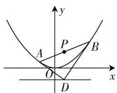
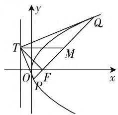
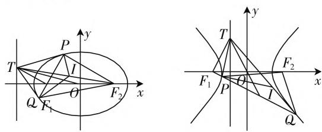

# 多法并举拓展思维,触类旁通提升素养\*

——2019年全国卷Ⅲ压轴题的多解与拓展

# 四川省南充高级中学 蒋敏

2019 年全国卷Ⅲ压轴题, 是一道解析几何试题, 考后学生普遍感觉有点困难, 不容易上手. 实际上, 本题是大家都很熟悉的有关抛物线的一个性质. 此题以定点问题为目标, 考查学生对解析几何常见方法的掌握. 下面笔者从多角度切入, 谈谈该题第(1)问的几种常见处理方法.

题目 已知曲线 $C: y = \frac{x^{2}}{2}$ ，D 为直线 $y = -\frac{1}{2}$ 上的动点，过 D 作 C 的两条切线，切点分别为 A, B.

(1) 证明: 直线 AB 过定点;

(2) 若以点 $E\left(0, \frac{5}{2}\right)$ 为圆心与直线 $AB$ 相切，且切点为线段 $AB$ 的中点，求四边形 $ADBE$ 的面积.

证法 1: (1) 设 $D\left(t, -\frac{1}{2}\right)$ , $A(x_{1}, y_{1})$ , $B(x_{2}, y_{2})$ .

因为 $y' = x$ ，所以 $y' \mid_{x = x_1} = x_1, y' \mid_{x = x_2} = x_2$ .

从而直线 $AD$ 的方程为 $y - y_{1} = x_{1}(x - x_{1})$

即 $y = x_{1}x - y_{1}$

又点 $D$ 在直线 $AD$ 上，于是 $-\frac{1}{2} = x_{1}t - y_{1}$ ①

text_image

y
A
P
B
O
x
D

图1

同理有 $-\frac{1}{2}=x_{2}t-y_{2}.$ ②

①② 表明 $A(x_{1},y_{1}),B(x_{2},y_{2})$ 都在直线 $-\frac{1}{2} = xt - y$ 上，故直线 $AB$ 的方程为 $y = tx + \frac{1}{2}$

所以, 直线 AB 过定点 $\left(0, \frac{1}{2}\right)$ .

证法2: 设 $D\left(t, -\frac{1}{2}\right)$ , $A\left(x_{1}, \frac{x_{1}^{2}}{2}\right)$ , $B\left(x_{2}, \frac{x_{2}^{2}}{2}\right)$ ,
AB 中点坐标为 $P(x_{0}, y_{0})$ .

因为 $y' = x$ ，所以 $y' \mid_{x=x_1} = x_1, y' \mid_{x=x_2} = x_2$ .

又 $k_{AD} = \frac{\frac{x_1^2}{2} + \frac{1}{2}}{x_1 - t} = \frac{x_1^2 + 1}{2(x_1 - t)} = x_1$

即 $x_{1}^{2} - 2tx_{1} - 1 = 0.$

同理有 $x_{2}^{2} - 2tx_{2} - 1 = 0.$

所以， $x_{1}, x_{2}$ 为方程 $x^{2} - 2tx - 1 = 0$ 的两根.

于是 $\left\{ \begin{array}{l} x_{1} + x_{2} = 2t, \\ x_{1}x_{2} = -1. \end{array} \right.$

又 $k_{AB} = \frac{\frac{x_1^2}{2} - \frac{x_2^2}{2}}{x_1 - x_2} = \frac{x_1 + x_2}{2} = t, y_0 = \frac{x_1^2 + x_2^2}{4} = \frac{1}{4}[(x_1 + x_2)^2 - 2x_1x_2] = \frac{1}{2}(2t^2 + 1).$

所以直线 $AB$ 的方程为 $y - \frac{1}{2} (2t^2 + 1) = t(x - t)$ , 即 $y = tx + \frac{1}{2}$ .

故直线 AB 过定点 $\left(0, \frac{1}{2}\right)$ .

证法 3: 由对称性知, 定点必在 y 轴上.

当直线 $AB$ 的斜率为0时，此时 $D\left(0, - \frac{1}{2}\right)$ ，设 $A\left(x_{1},\frac{x_{1}^{2}}{2}\right),B\left(x_{2},\frac{x_{2}^{2}}{2}\right).$

因为 $y' = x$ ，所以 $y' \mid_{x=x_1} = x_1, y' \mid_{x=x_2} = x_2$ .

所以直线 $AD$ 的方程为 $y - \frac{x_1^2}{2} = x_1(x - x_1)$ ，即 $y = x_1x - \frac{x_1^2}{2}$ .

代点 $D\left(0, -\frac{1}{2}\right)$ ，解得 $x_1^2 = 1$ ，所以定点必为 $Q\left(0, \frac{1}{2}\right)$ .

下面证明当直线 $AB$ 的斜率不为0时，直线 $AB$ 依然过点 $Q\left(0, \frac{1}{2}\right)$ .

由 $k_{AD} = x_1$ ，得 $x_1^2 - 2tx_1 - 1 = 0.$

同理有 $x_{2}^{2} - 2tx_{2} - 1 = 0.$

所以， $x_{1}, x_{2}$ 为方程 $x^{2} - 2tx - 1 = 0$ 的两根.

于是 $x_{1}x_{2} = -1$

又 $k_{AB} = \frac{\frac{x_1^2}{2} - \frac{x_2^2}{2}}{x_1 - x_2} = \frac{x_1 - \frac{1}{x_1}}{2} = \frac{x_1^2 - 1}{2x_1}$ , 而 $k_{AQ} = \frac{\frac{x_1^2}{2} - \frac{1}{2}}{x_1} = \frac{x_1^2 - 1}{2x_1}$ .

故 A, B, Q 三点共线，即直线 AB 过定点 $\left(0, \frac{1}{2}\right)$ .

性质1:如图2,抛物线 $y^{2}=2px(p>0)$ 的焦点为F,T是准线上任意一点,过点F作TF的垂线交抛物线于点P,Q,线段PQ的中点为M.则有:(1) $TM\perp y$ 轴;(2)TP,TQ均与抛物线相切;(3) $\angle PTQ$ 为直角.

text_image

y
T
Q
M
O
F
x
P

图2

证明:(1) 设 $T\left(-\frac{p}{2}, t\right)$ , $P(x_{1}, y_{1})$ , $Q(x_{2}, y_{2})$ .

由题易得直线 PQ 的方程为 $x = my + \frac{p}{2}$ ，其中 m = $\frac{t}{p}$ .

联立直线 PQ 的方程和抛物线方程, 消去 x 整理, 得 $y^{2}-2pmy-p^{2}=0$ . 所以 $y_{1}+y_{2}=2pm$ .

从而线段 PQ 中点 M 的纵坐标为 $y_{M}=pm$ ，

所以 $y_{T} = y_{M}$ ，故 $TM\perp y$ 轴.

(2) 易知抛物线在点 $P$ 处的切线方程为 $y_{1}y = p(x_{1} + x)$ .

令 $x = -\frac{p}{2}$ , 得 $y = \frac{(2x_1 - p)p}{2y_1}$ . ①

又点 $P$ 在直线 $PQ$ 上，所以 $x_{1} = my_{1} + \frac{p}{2}$ ，即 $px_{1} = ty_{1} + \frac{p^{2}}{2}$ 。②

由 ①②, 得 $y = \frac{(2x_1 - p)p}{2y_1} = t$ .

所以抛物线在点 P 处的切线过点 T，即 TP 与抛物线相切.

同理可得 $TQ$ 与抛物线相切.

（3）因为 $\overrightarrow{TP} = (x_1 + \frac{p}{2}, y_1 - t), \overrightarrow{TQ} = (x_2 + \frac{p}{2}, y_2 - t)$ ，所以 $\overrightarrow{TP} \cdot \overrightarrow{TQ} = (x_1 + \frac{p}{2}) \cdot (x_2 + \frac{p}{2}) + (y_1 - t) \cdot (y_2 - t) = \left(\frac{t}{p} y_1 + p\right) \cdot \left(\frac{t}{p} y_2 + p\right) + (y_1 - t) \cdot (y_2 - t) = \left(\left(\frac{t}{p}\right)^2 + 1\right) y_1 y_2 + p^2 + t^2 = 0$ ，所以 $\overrightarrow{TP} \perp \overrightarrow{TQ}$ ，即 $\angle PTQ$ 为直角.

性质 1 对于椭圆和双曲线也有相似的性质, 在此就不再赘述. 有兴趣的读者可以证明之.

性质2:如图3,椭圆 $\frac{x^{2}}{a^{2}}+\frac{y^{2}}{b^{2}}=1(a>b>0)$ 的左右焦点分别为 $F_{1},F_{2},T$ 是左准线上任意一点,过点 $F_{1}$ 作 $TF_{1}$ 的垂线交椭圆于点P,Q.则有:(1)OT平分线段PQ;(2)TP,TQ均与椭圆相切;(3)直线 $TF_{2}$ 平分 $\angle PF_{2}Q$ .

text_image

Mathematical diagrams showing coordinate geometry with labeled points and lines in a Cartesian coordinate system

图3   
图4

性质3:如图4,双曲线 $\frac{x^{2}}{a^{2}}-\frac{y^{2}}{b^{2}}=1(a>0,b>0)$ 的左右焦点分别为 $F_{1},F_{2},T$ 是左准线上任意一点，过点 $F_{1}$ 作 $TF_{1}$ 的垂线交双曲线于点P,Q.则有：(1)OT平分线段PQ；(2)TP,TQ均与双曲线相切；(3)直线TQ平分 $\angle PQF_{2}$ .

高考考题很多是将已有的一些结论特殊化,让学生用所学的知识来解决必然成立的问题.只要我们把知识、方法、技巧融为一体,做题时灵活运用,融会贯通,这样我们势必会做到以不变应万变,化冰冷的美丽为火热的思考,解一题而晓一类.因此我们在做题时也应该大胆猜想,合理推广.

# 参考文献：

[1] 刘绍学. 普通高中课程标准试验教科书·数学选修 2-1(选修 A 版)[M]. 北京: 人民教育出版社, 2007.  
[2] 王怀学, 肖斌. 高考数学经典题型与变式 [M]. 拉萨: 西藏人民出版社, 2016. W