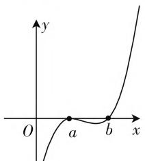
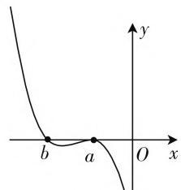
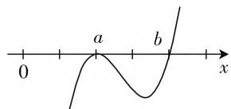
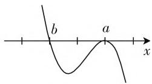
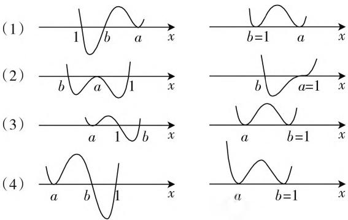

# 多解思维,变式拓展

——以 2021 年高考数学全国乙卷理科 10 题(文科 12 题)为例

# ● 福建省莆田第四中学 潘劲森

# 一、真题呈现

高考真题 （2021年高考数学全国乙卷理科第10题(文·12)）设 $a \neq 0$ ，若 $x = a$ 为函数 $f(x) = a(x - a)^2 (x - b)$ 的极大值点，则（ ）.

$$
\mathrm{A.} a <   b \quad \mathrm{B.} a > b \quad \mathrm{C.} a b <   a ^ {2} \quad \mathrm{D.} a b > a ^ {2}
$$

# 二、真题剖析

该题是函数与导数问题中一类比较常见的热点题型, 设置巧妙, 合理将三次函数、导数及其应用、不等式等问题加以交汇与融合, 充分体现高考“在知识交汇处命题”的指导精神. 其考查的知识点属于高考中的高频考点, 作为选择题中的压轴题, 不偏不怪, 契合了高考出题的“平稳”特征.

该题的题面简洁明了,题目表述直接,处理角度广,可以从多项式函数考虑,题面已从多项式乘法角度做好铺垫,学生若对“奇穿偶回”印象深刻,读完即可入手;亦可从导数角度处理,由于本身是三次函数,一阶导数是二次函数,很快即可判断两个极值点的关系,从而得到突破;还可以结合其他思维方法来解决.

# 三、真题破解

解法1:(导函数性质法)对于函数 $f(x)=a(x-a)^{2}(x-b)$ ，求导可得 $f'(x)=2a(x-a)(x-b)+a(x-a)^{2}=a(x-a)(3x-a-2b)$ .

由 $f^{\prime}(x) = 0$ ，解得 $x = a$ 或 $x = \frac{1}{3} (a + 2b)$

当 $a > 0$ 时，由于 $x = a$ 是函数 $f(x)$ 的极大值点，则导函数 $f'(x)$ 在 $x = a$ 处左增右减，可得 $0 < a < \frac{1}{3}(a + 2b)$ ，解得 $0 < a < b$ ；

当 $a < 0$ 时，由于 $x = a$ 是函数 $f(x)$ 的极大值点，则导函数 $f'(x)$ 在 $x = a$ 处左增右减，可得 $\frac{1}{3} (a + 2b)$

$<a<0$ , 解得 b<a<0.

综上分析,可得 $a^{2}<ab$ .

故选D.

点评:利用三次函数进行求导处理,确定导函数及其导函数的零点,结合极大值点所对应的导函数在零点处的性质,利用二次函数的图像与性质,对二次函数的开口方向进行分类讨论,进而确定参数的大小关系,从而得以判断对应的不等关系式.导函数性质法是破解此类问题最常见的技巧方法之一,巧妙借助二次函数的图像与性质来处理,简单易懂.

解法 2: (三次函数的图像与性质法) 令 $f(x)=a(x-a)^{2}(x-b)=0$ ，解得 x=a 或 x=b，即 x=a 及 x=b 是函数 $f(x)$ 的两个零点，

当 $a > 0$ 时，由三次函数的性质可知，要使 $x = a$ 是 $f(x)$ 的极大值点，则函数 $f(x)$ 的大致图像如图1所示，则 $0 < a < b$ ；

text_image

y
O
a
b
x

图1

text_image

b
a
O
x
y

图2

当 a<0 时，由三次函数的性质可知，要使 x=a 是 $f(x)$ 的极大值点，则函数 $f(x)$ 的大致图像如图 2 所示，则 b<a<0.

综上分析,可得 $ab > a^{2}$ .

故选D.

点评:利用三次函数的零点的确定,结合三次函数的图像及性质,通过参数的正负取值情况的分类讨论,决定对应的三次函数的大致图像,进而得以确定参数的大小关系,从而得以判断对应的不等关系式.三次函数的图像与性质法是数形结合处理此类问题的快捷方式,通过熟练掌握三次函数的图像与性质,做到心中有“图”,用“图”说话,用“图”解题.

解法3: (“奇穿偶回”法) 函数 $f(x)=a(x-a)^{2}(x-b)$ 的大致图像如下 (“奇穿偶回”):

当 $a > 0$ 时，三次函数 $f(x)$ 的图像为“正 $N$ 型”，而 $x = a$ 是 $f(x)$ 的极大值点，则知函数 $f(x)$ 的图像如图3所示，即 $0 < a < b$ ；

text_image

0
a
b
x

图3

  
图4

当 $a < 0$ 时，三次函数数 $f(x)$ 的图像为“倒 $N$ 型”，而 $x = a$ 是 $f(x)$ 的极大值点，则知函数 $f(x)$ 的图像如图4所示，即 $b < a < 0$ .

综上分析,可得 $ab > a^{2}$ .

故选D.

点评：“奇穿偶回”其实就是三次函数的图像与性质法的“技巧版”，结合“奇穿偶回”的规律直接作出简单的草图即可得以合理判断。这是在熟练掌握高次函数的图像与性质的基本规律的情况下，直接利用“奇穿偶回”的性质来分析与破解。“奇穿偶回”作为课外知识的拓展与提升，可以用来简单快捷破解一些选择题或填空题等。

解法 4: (高观点认知法) 极值点在高等数学中的定义: 若 x = a 是函数 $f(x)$ 的极大值点, 则 $f(a)$ 是 $f(x)$ 在 a 的 $\delta$ 邻域 $U(a, \delta)$ 内的最大值, 即对于 $\forall x \in (a - \delta, a + \delta), \delta \to 0_{+} (\delta$ 是比较小的正数), 都有 $f(x) \leqslant f(a)$ , 当且仅当 x = a 时等号成立.

$$
\text {又} \lim _ {\delta \to 0 _ {+}} f (a - \delta) = \lim _ {\delta \to 0 _ {+}} f (a + \delta) = a \cdot \delta^ {2} \cdot (a - b),
$$

由于 $f(a) = 0$ ，则有 $a\cdot \delta^2\cdot (a - b) <   0$ ，即 $a(a-$ $b) <   0$ ，亦即 $ab > a^2$

故选 D.

点评:根据高观点认知下极值点在高等数学中的定义,利用极限思维来分析与处理,只针对一些参加竞赛或是对高等数学有些许了解的考生而言,不具有推广性与应用性,只作为一个辅助了解与应用.

# 四、变式拓展

变式:(2021年浙江省“山水联盟”高考数学联考试卷(4月份))已知 $a,b\in R$ ,若x=a不是函数 $f(x)=(x-a)^{2}(x-b)(e^{x-1}-1)$ 的极小值点,则下列选项符合的是().

A. $1 \leqslant b < a$

B. $b < a \leqslant 1$

C. $a < 1 \leqslant b$

D. $a < b \leqslant 1$

解析: 令 $f(x)=(x-a)^{2}(x-b)(\mathrm{e}^{x-1}-1)=0$ ,
解得 x=a 或 x=b 或 x=1.

根据选项 A, B, C, D 利用穿针引线法作出 $f(x)$ 在各自情形下的大致图像，如图 5，左图是不取等号的图像，右图为取等号的图像.

  
图5

对于选项 A, 如图 5(1), 由图知 x = a 是 $f(x)$ 的极小值点, 不符合题意;

对于选项 B, 如图 5(2), 由图知 x = a 是 $f(x)$ 的极大值点, 符合题意;

对于选项 C, 如图 5(3), 由图知 x = a 是 $f(x)$ 的极小值点, 不符合题意;

对于选项 D, 如图 5(4), 由图知 x = a 是 $f(x)$ 的极小值点, 不符合题意.

综上分析,选项 B 符合题意.

故选 B.

# 五、教学启示

# 1. 厘清题目条件是破解问题的基础

在破解一些较为复杂的数学问题时,若能成功“翻译”题目条件,答案并不难选出;即便不能成功“翻译”题目条件,特殊值法也能巧妙迅速破解.解答一些较为复杂、创新的数学问题时,形象的直觉思维能够绕开抽象推理的鸿沟.

# 2. 合理抽象与逻辑推理是绕不开的话题

在解决一些数学难题时,不以繁杂运算与复杂推理来区分考生的不同层次水平,而是为具有深度的数学思维的考生有意留出一扇可以跳跃且隐藏在题目条件背后的“龙门”,对于那些数学功底扎实、思维层次高的考生,心中有“图”,灵活“运动”,心中有“数”,自由“组合”,合理抽象,巧妙逻辑推理,均能完美破解.

# 3. 重视数学基本功和思维训练

在平时数学教学与学习过程中,要充分重视数学基本功底的训练,重视数学思维层面的提升,做典型题,研究问题的通解通性,将基本功底融入到解题活动中去,将基本方法上升至思维方法的层面. $^{F}$