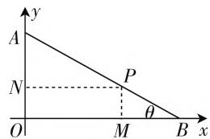
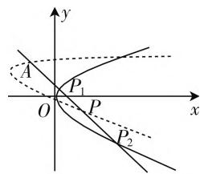
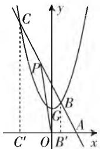

# 如何运用参数法求动点轨迹方程

# ● 甘肃省武威市第七中学 姬成虎

求平面上动点的轨迹方程,既是高中数学“课标”中要求学生掌握的主要内容之一,也是每年高考考查的重点内容之一.轨迹方程是与几何轨迹对应的一种代数描述法,就是把动点的横坐标与纵坐标之间的关系用一个等量关系式直观地表示出来.通常我们把符合一定条件的点的全体所组成的集合,叫做满足该条件的点的轨迹.由于动点运动规律所给出的已知条件各不相同,因此求动点轨迹方程的方法也就不同.

当遇到看不出动点坐标之间的条件、关系或联系等情况时,我们可以借助中间变量(参数),让 x,y 之间建立起联系,然后再从所求式子中消去参数变量,最后得出动点的轨迹方程.这种间接式的求解方法就叫做参数法.下面我们通过典型实例来看参数法的具体运用:

例 1 已知线段 AB 的长为 a, P 点分 AB 为 AP: PB = 2:1 两部分, 当 A 在 y 轴上运动时, B 在 x 轴上运动, 求动点 P 的轨迹方程.

解: 设动点 $P(x, y)$ , AB 和 x 轴的夹角为 $\theta, |\theta| \leqslant \frac{\pi}{2}$ ，作 $PM \perp x$ 轴于 M, $PN \perp y$ 轴于 N.

text_image

y
A
N
P
θ
O
M
B
x

图1

因为 $|AB|=a,\frac{|AP|}{|PB|}=\frac{2}{1},$

所以 $|AP| = \frac{2}{3} a, |PB| = \frac{1}{3} a$ ,

所以动点 P 的参数方程为 $\left\{\begin{aligned}x&=\frac{2}{3}a\cos\theta,\\ y&=\frac{1}{3}a\sin\theta\end{aligned}\right.$ ( $\theta$ 为参数).

根据三角公式 $\sin^2\theta +\cos^2\theta = 1$ ，可消去参数 $\theta$

得 $\left(\frac{3y}{a}\right)^2 +\left(\frac{3x}{2a}\right)^2 = 1,$

即 $\frac{x^2}{\frac{4a^2}{9}} + \frac{y^2}{\frac{a^2}{9}} = 1$ 为所求的轨迹方程.

典例解析:根据题意,结合图形分析,由于AB为定长，A, B 分别在两轴上滑动，点 P 的位置随 AB 与 x 轴的夹角变化而变化，所以可选这个变角为参数，建立轨迹的参数方程。从解答本题可总结出一个规律：当动点随动直线变化时，若动直线与某定直线夹角在变化时，宜选择角 $\theta$ 为参数。

例 2 过点 A(-1,2) 作直线 l 交抛物线 $y^{2}=2x$ 于 $P_{1}, P_{2}$ 两点，当 l 绕点 A 转动时，求弦 $P_{1}P_{2}$ 中点的轨迹.

解: 设弦 $P_{1}P_{2}$ 中点 P 的坐标为 $(x,y)$ ，直线 l 的斜率为 k（参数），则 l 的方程为 $y=k(x+1)+2$ ，代入 $y^{2}=2x$ ，得 $k^{2}(x+1)^{2}+4k(x+1)+4=2x$ ，

即 $k^2 x^2 + 2(k^2 + 2k - 1)x + k^2 + 4k + 4 = 0.$

text_image

y
A
P₁
O
x
P
P₂

图2

此方程的两根 $x_{1}, x_{2}$ 即为 $P_{1}, P_{2}$ 两点的横坐标，

由韦达定理, 可得 $x_{1} + x_{2} = -\frac{2k^{2} + 4k - 2}{k^{2}}$ .

因为 $P(x,y)$ 为 $P_{1}P_{2}$ 的中点，

所以 $x = \frac{1}{2} (x_{1} + x_{2}) = \frac{1 - k^{2} - 2k}{k^{2}}$ ，①

代入 $y = k(x + 1) + 2$ ，得 $y = \frac{1}{k}$ ②

联立 ①② 消去参数 k，得 $(y-1)^{2}=x+2$ .

再由 $l$ 与抛物线相交的条件可知

$$
\frac {1}{k} \leqslant 2 - \sqrt {6} \text {或} \frac {1}{k} \geqslant 2 + \sqrt {6},
$$

即 $y \leqslant 2 - \sqrt{6}$ 或 $y \geqslant 2 + \sqrt{6}$ ,

故所求的轨迹方程为 $(y - 1)^2 = x + 2$ ，其中 $y \leqslant 2 - \sqrt{6}$ 或 $y \geqslant 2 + \sqrt{6}$ ，

其轨迹为抛物线 $(y - 1)^2 = x + 2$ 在抛物线 $y^{2} = 2x$ 内的两段曲线，如图2所示.

典例解析: 在本题中, 当直线 l 绕 A 点转动时, 显然直线 l 的斜率为一变数, 所以我们可以选取斜率作为参数来建立方程. 从解答本题可看出另一个规律:

当动点随着动直线绕某一定点旋转时,选取斜率 k 作参数比较简捷.

例 3 动直线 l 过定点 A(2,0)，且与抛物线 $y = x^{2} + 2$ 相交于不同的两点 B 和 C，点 B 和 C 在 x 轴上的射影分别是 $B'$ 和 $C'$ （如图 3）。P 是线段 BC 上的点，并满足关系式 $|BP| : |PC| = |BB'| : |CC'|$ ，求 $\triangle POA$ 的重心 G 的轨迹方程。

text_image

C
P
B
G
C'
O
B'
A
x
y

图3

解:设直线 l 的斜率为 k, 显然 l 与 x 轴垂直时, l 与抛物线不可能有两个交点, 故 l 的方程为 $y = k(x - 2)$ , 将它与抛物线方程联立, 消去 y, 得 $x^{2} - kx + 2 + 2k = 0$ , 此方程有两个不同实根的充要条件是 $\Delta = k^{2} - 4(2 + 2k) = k^{2} - 8k - 8 > 0$ , 得 $k < 4 - 2\sqrt{6}$ 或 $k > 4 + 2\sqrt{6}$ . ①

设 B, C 两点的坐标为 $(x_{1}, y_{1})$ , $(x_{2}, y_{2})$ ,

则 $x_{1} + x_{2} = k, x_{1}x_{2} = 2 + 2k.$ ②

令 $\lambda=\frac{|BP|}{|PC|}=\frac{|BB'|}{|CC'|}$ ,

则 $\frac{|BB'|}{|CC'|} = \frac{|AB'|}{|AC'|} = \frac{2 - x_1}{2 - x_2},$

则 $\lambda=\frac{2-x_{1}}{2-x_{2}}.$ ③

设 $P(x', y')$ ，根据定比分点公式，得 $x' = \frac{x_1 + \lambda x_2}{1 + \lambda}, y' = \frac{y_1 + \lambda y_2}{1 + \lambda}$ . ④

设动点 G 的坐标为 $(x, y)$ ,

则 $\left\{\begin{aligned}x&=\frac{1}{3}(0+2+x')=\frac{1}{3}(2+x'),\\ y&=\frac{1}{3}(0+0+y')=\frac{1}{3}y'.\end{aligned}\right.$

将 ④③② 分别代入, 化简得重心 G 的轨迹的参数
方程为 $\left\{\begin{aligned}x&=\frac{4-4k}{3(4-k)},\\ y&=\frac{-4k}{4-k},\end{aligned}\right.$ 消去 k, 得 12x-3y-4=0.

由参数方程的第二式得 $k=\frac{4y}{y-4}$ ,

代入 ①, 得 $\frac{4y}{y - 4} < 4 - 2\sqrt{6}$ 或 $\frac{4y}{y - 4} > 4 + 2\sqrt{6}$ ,

并注意 $y \neq 4$ ，解之，得 $4 - \frac{4}{3}\sqrt{6} < y < 4$ 或 $4 < y < 4 + \frac{4}{3}\sqrt{6}$ .

因此 $\triangle POA$ 的重心 $G$ 的轨迹方程为 $12x - 3y - 4 = 0$ ，其中 $y\in \left(4 - \frac{4}{3}\sqrt{6},4\right)\cup \left(4,4 + \frac{4}{3}\sqrt{6}\right),$

它表示一条除去端点及其上一点 $\left(\frac{4}{3},4\right)$ 的线段.

典例解析:从本题的解答过程可以看出:①当用一个参数不能解决问题时,可以考虑引进两个或多个参数来求出动点的轨迹方程,然后分别消去参数而得出轨迹的普通方程;②当动点位置与动线段的比值 $\lambda$ 有关时,常选择线段比 $\lambda$ 较为方便;③当有多种参数可供选择时,应择优选用.

从上面的典型实例及解析中, 我们可以看出, 运用参数法求动点轨迹方程具有间接、迂回、化繁为简的优点, 应用十分广泛. 参数法的常用步骤: ① 选择坐标系, 设动点坐标 $P(x, y)$ ; ② 分析轨迹的已知条件, 选定参数 (选择参数时要考虑, 既要有利于建立方程又要便于消去参数); ③ 建立参数方程; ④ 消去参数得到普通方程; ⑤ 讨论并判断轨迹, 常用的消参方法有: 代入消参, 加减消参, 整体代换法, 三角消参法 $(\sin^2 \theta + \cos^2 \theta = 1, \sec^2 \theta - \tan^2 \theta = 1)$ 等. 要特别注意: 消参前后变量 $x, y$ 的取值范围不能改变.

# 参考文献：

[1] 黄邵华. 用“参数法”求轨迹方程的基本原理 [J]. 中学生数学, 2020(3).

[2] 舒振武. 如何求动点的轨迹方程 [J]. 数学教学通讯, 2010(8).

[3] 刘卓雄. 函数观点在解题中的应用(三)——用函数观点求动点轨迹方程[J]. 福建中学数学, 2002(8).

[4] 陆钧. 浅谈求动点轨迹方程 [J]. 理科考试研究, 2006(11).

[5] 毛志桂. 如何利用参数求动点轨迹方程 [J]. 中学数学教学, 1995(5). F