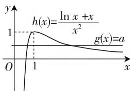
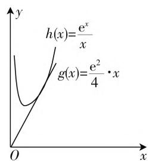

# 探讨函数中的含参问题

# ● 重庆市求精中学校 龚艺军

为考查学生对函数性质的掌握情况,提升学生的逻辑推理能力,培养学生的数学思维品质,在函数中增加参数是常见的题型设计方式.参数在函数的不同位置,对函数性质的影响也是不相同的.当参数出现在常数项,则表示将原函数图像上下平行移动若干个单位,此时最直接的影响是最值和零点,当然也会扰乱原函数的某些对称性质;当参数充当自变量的系数时,则会改变函数的整体性质,此时问题就变得更加复杂了.在长期的解题教学中,我们形成了一些处理参数问题的基本方法,即讨论参数,分离参数,拆分函数.本文将以实例分析的方式进一步对上述方法给出探讨和研究.

# 一、讨论参数

通过问题分析, 找出参数对函数性质的影响方式, 从而确定参数分类讨论的标准, 然后进行分类讨论, 这是解决含参问题的主要思想方法. 这种化整为零各个击破的解题思路, 正是培养学生分析问题和解决问题的能力的关键. 对参数的分类讨论, 难点在于找出分类标准, 重点在于分类做到不重不漏, 这对学生思维的严谨性要求是较高的, 是整个高中数学学习的重难点. 下面以实例探讨来阐述以上观点.

例 1 若函数 $f(x)=\mathrm{e}^{x}-kx$ 在 $(0,2)$ 内存在两个不同的零点，求实数 k 的取值范围.

解析:由 $f'(x)=\mathrm{e}^{x}-k$ 知，

当 $k \leqslant 0$ 时, $f(x)$ 在 $(0,2)$ 上单调递增, 此时 $f(x)$ 在 $(0,2)$ 至多只有一个零点.

当 $k > 0$ 时，由 $f^{\prime}(x) = 0$ ，得 $x = \ln k$

若 $\ln k \leqslant 0$ 或 $\ln k \geqslant 2$ ，即当 $0 < k \leqslant 1$ 或 $k \geqslant \mathrm{e}^2$ 时， $f(x)$ 在 $(0,2)$ 上单调递增或单调递减，此时 $f(x)$ 在 $(0,2)$ 至多只有一个零点；

若 $0 < \ln k < 2$ ，即当 $1 < k < \mathrm{e}^2$ 时， $f(x)$ 在 $(0, \ln k)$ 上单调递减，在 $(\ln k, 2)$ 上单调递增，要使 $f(x)$ 在(0,2)有两个不同的零点必有 $\left\{\begin{aligned}f(0)&>0,\\ f(\ln k)&<0,\Rightarrow e< \\ f(2)&>0\end{aligned}\right.$

$$
k <   \frac {\mathrm{e} ^ {2}}{2}.
$$

点评:解答函数零点的个数问题是函数单调性与零点存在性定理的综合应用.解决此类问题首先是寻找导函数的变号零点,从而确定单调区间,然后在每个单调区间内运用零点存在性定理确定零点是否存在.此题正是在这种解题思想下,先确定一级分类标准:导函数是否存在变号零点 $(k\leqslant0\text{或}k>0)$ ,再给出二级分类标准:导函数的变号零点是否在定义域(0,2)内.此题思路清晰难度中等可作为分类讨论问题的典型例题进行讲解.

# 二、分离参数

分离参数就是将参数和自变量彻底分开, 把问题转化为一个不含参的函数与一个常函数的位置关系来进行研究. 这在数学上称之为转化与化归的数学思想. 其巧妙之处在于将参数对自变量的影响彻底消除了, 是解决含参问题最为常见的一种思想方法.

例 2 若函数 $f(x)=\ln x-ax^{2}+x$ 有两个不同的零点，求实数 a 的取值范围.

解析:由 $f(x)=0\Leftrightarrow a=\frac{\ln x+x}{x^{2}}$ 知, $f(x)$ 在 $(0,+\infty)$ 上的零点等价于函数 $g(x)=$ a 与 $h(x)=\frac{\ln x+x}{x^{2}}$ 在 $(0,$

text_image

h(x)=\frac{\ln x+x}{x^2}
g(x)=a
O
1
1
x
y

图1

$+\infty$ ) 上的图像公共点的横坐标. 如图 1 所示, 当 $a \in (0,1)$ 时, 函数 $g(x) = a$ 与 $h(x) = \frac{\ln x + x}{x^2}$ 的图像在 $(0, +\infty)$ 上有两个不同的交点, 即 $f(x)$ 在 $(0, +\infty)$ 上有两个不同的零点.

点评:如果用分类讨论来解答此题是相当复杂的,因为参数以较复杂的形式出现在导函数的零点,即原函数的极值点中,这不仅对函数的单调区间带来不确定性(需要继续讨论),而且还会影响极值的符号, 从而导致函数零点的讨论变得更加复杂了. 而分离参数, 这些问题就不复存在了, 分离参数的绝妙之处在于参数对自变量的影响完全消除了. 但是分离参数后所产生的新函数的性质又是不确定的, 所以这种方法也不是万能的.

# 三、拆分函数

分离参数的实质就是将原函数拆分成水平直线与一个不含参的新函数的位置关系来进行研究,然而有些时候这种方法也会受到一些制约,比如分离参数的运算过于复杂,或者分离参数后新函数较为复杂以至于我们处理起来仍然很吃力.那么我们是否可以考虑将函数拆分成一条过定点的动直线和一个不含参的新函数的位置关系来进行研究呢,事实证明这种方法是可行的.

例3 若函数 $f(x) = \mathrm{e}^{x} - ax^{2}$ 在 $(0, +\infty)$ 上有且只有一个零点，求实数 $a$ 的值.

解析: 由 $f(x)=0\Leftrightarrow ax=\frac{\mathrm{e}^{x}}{x}$ 知, $f(x)$ 在 $(0,+\infty)$ 上的零点等价于函数 $g(x)=ax$ 与 $h(x)=\frac{\mathrm{e}^{x}}{x}$ 在 $(0,+\infty)$ 上的图像公共点的横坐标.

text_image

h(x)=\frac{e^x}{x}
g(x)=\frac{e^2}{4} \cdot x
O
x
y

图2

如图 2 所示, $g(x)=ax$ 是恒过原点的动直线, 当且仅当 $g(x)$ 与 $h(x)$ 相切时两函数图像有且只有一个公共点, 此时可求得 $a=\frac{e^{2}}{4}$ .

点评:以不同的视角来拆分函数却达到了意想不到的效果,所以变通是数学永恒不变的解题模式.其实对于例1和例2我们也可以尝试这种思路来求解.

# 四、结束语

含参问题是高中数学的重难点,无论分类讨论还是分离参数亦或是拆分函数,对学生能力的要求都是相当高的.由于这类问题对细节要求很高,如果教师在教学中处理不到位,学生容易产生似是而非的感觉,即自认为听懂了,可就是不会解题,甚至下笔都困难.所以,在处理含参问题时无论教还是学都要在“细”字上下功夫.

# 参考文献：

[1] 林建森. 在深度学习中突破数学思维的瓶颈 [J]. 中学数学(上), 2020(2).  
[2] 杨建华. 对一道模拟题多维探究 [J]. 中学数学 (上), 2020(2). W

# (上接第 18 页)

设计意图:在对余弦定理有一定的了解之后,为加深学生理解,设计了两道例题,这两道题的难度由浅入深,例1是巩固公式,例2对余弦定理变形运用,不仅仅要求学生对于公式的掌握,还要有快速判断知识点的能力,同时还培养了逻辑运算能力,从各角度对知识进行巩固.最后对这节课所学的知识点进行梳理,让学生形成新的图式.

教学反思:现场教学过程表明,不同学校的老师,应该结合所教班级的实际情况,在题目设计上应该不同,可以适当降低或增加一定的难度.

# 三、基于 APOS 理论的教学建议

在基于 APOS 理论的教学中, 四个环节是相互联

系、循序渐进的关系，一般不会改变先后顺序，但是也要具体问题具体分析，例如学生建构一些复杂的数学概念时，可能会有阶段间的循环交替，尤其是中间两阶段。因此，在教学过程中，教师不能完全照搬理论，应该结合学生的实际情况，有针对性地进行知识的引入和强化。

APOS 理论虽然是在概念教学中探究出来的,但是它不仅仅只适用于概念教学,也适用于定理教学.学生在经历了操作阶段后,知识也不能仅仅停留在字面,它需要被同化或顺应到原有的知识结构中去,并且形成新的认知图式.在余弦定理的教学中,需要和已学习的向量相结合,在掌握了表面的概念后,更需要学生能够理解与应用.W