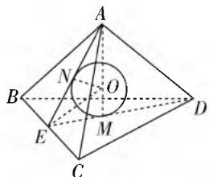
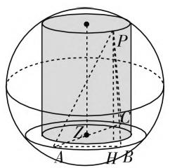
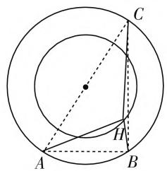

# 核心素养视域下高中数学教学策略分析

——以“和球有关的切与接问题”为例

● 江苏省清浦中学 金 明 吴洪生

在高中数学课程中,几何板块是学生学习的重难点之一,尤其在解决“和球有关的切与接问题”时,由于学生的空间想象能力不足,导致多数学生在该类问题学习与解答过程中遇到较大的障碍.因此教师必须总结相应的教学方法与技巧,帮助学生提升解决此类问题的数学素养.

# 一、注重方法，提升学生直观想象素养

在实际教学过程中,教师要重点关注学生直观想象能力的发展,因此教师可以采取绘图辅助的教学手段进行引导,一方面让学生根据自身的解题思路绘制辅助线,并通过形象化处理的图形展开分析与计算;另一方面可以利用多媒体为学生展现三维动画,并在三维空间中绘制辅助线或面,由此强化学生的想象能力,能够对空间几何拥有更深层的假想思维.

例 1 已知正四面体 A-BCD 的棱长为 12，则其内切球的表面积为（）.

A. $12\pi$

B. $16\pi$

C. $20\pi$

D. $24\pi$

在解决这类问题之前可以让学生先回顾正方体中的内切球半径, 利用类比手段, 解决正四面体中的问题. 回到本题, 求内切球的表面积实际上等同于求内切球的半径, 因此问题回归到最初的教学策略之中, 针对多面体的内切球, 可以采用过球心的对角面为辅助线, 所以学生在解决该问题时, 可以绘制的辅助图如图 1 所示.

根据图 1, 内切球的半径即为 NO, 因此在计算时需要在 $\triangle ANO$ 中进行计算. 首先, 根据等边 $\triangle ABC$ 与等边 $\triangle BCD$ 边长为 12, 可求出 AE 与 DE 的长度均为 $6\sqrt{3}$ .

text_image

Geometric diagram of a tetrahedron with labeled vertices and internal points, including a circle inscribed in the center.

图1

由此可得 $EM = \frac{1}{3} DE = 2\sqrt{3}$ . 同理可得 $AN =$

$\frac{2}{3} AE = 4\sqrt{3}$ , 可知 $\cos \angle AED = \frac{AE^2 + DE^2 - AD^2}{2AE \cdot AD} = \frac{1}{3}$ . 由于 $AM \perp DE$ , 因此 $\sin \angle EAM = \frac{1}{3}, \cos \angle EAM = \sqrt{1 - \sin^2 \angle EAM} = \frac{2\sqrt{2}}{3}$ , 所以可以得到 $\tan \angle EAM = \frac{1}{2\sqrt{2}}$ . 因此, 在 Rt△ANO 中, $NO = AN\tan \angle EAM = \sqrt{6}$ , 所以表面积 $S = 4\pi R^2 = 24\pi$ .

由此该题便实现了解答，在学生完成解答后，再利用多媒体为学生展示另一种辅助线构建方法，通过将 $A, B, C, D$ 与球心 $O$ 连接后，设内切球的半径为 $R$ . 由此可以引导学生进行分析，正四面体 $A - BCD$ 的体积刚好等于四个棱锥 $O - ACD, O - ABD, O - ABC, O - BCD$ 的体积和，结合上述计算过程可以发现： $AM = \sqrt{AE^2 - EM^2} = 4\sqrt{6}$ ，因此 $\frac{1}{3} AM \cdot S_{\triangle BCD} = \frac{1}{3} R \cdot (S_{\triangle ABC} + S_{\triangle ACD} + S_{\triangle ABD} + S_{\triangle BCD}) = \frac{4}{3} RS_{\triangle ABC}$ ，所以半径可求得为 $\sqrt{6}$ ，表面积可得 $24\pi$ .

在教学过程中,采取了两种解法,首先根据学生所学的知识与经验进行总结,将解决内切球的问题根据分类方法设计解决方案,并以此作为本课教学设计的基础所在.其次,以学生自主探究的方式展开,学生可以独立探索,也可以结成小组,提出解题思路,自行绘制辅助线与辅助图,通过一步步推导与计算,最终完成解答.其三,在学生解题的基础上,可以利用多媒体为学生展现一种新的绘制辅助线的技巧,并将规律总结中的特殊情况作为解题方法,引导学生构建方程,通过等量关系找到求解半径的思路,进而同样可以得到最终的结果.在这样的教学设计中,学生先进行自主探究,进而跟随教师拓展新方法,不仅得到了思维、推理等方面能力的发展,更重要的是直观想象素养与辅助线绘图水平得到了训练与提升.

在课堂延展的情况下,让学生小组讨论得出正方体、正四面体外接球的半径，并且找出内切球和外接球半径的比值关系.

# 二、问题变式，深化学生逻辑推理素养

在“和球有关的外接问题”的实际教学环节中，教师则要注重引导学生逻辑推理能力的发散，尤其此类问题存在较多的变式情况，需要学生针对不同的情形，思考不同的解题思路，并寻找各个变式之间的联系，从而能够有效掌握举一反三的解题能力，解决各类外接球问题。因此，在教学过程中，教师宜采取问题链设计的教学思路，以强化学生思维能力的快速变化与反应。

例如,在教学过程中,首先以高考变式题作为考查学生能力基础的第一步.

例 2 设点 A, B, C, P 是一个半径为 5 的球的球面上四点，已知 $AB \perp BC, AC = 8$ ，则三棱锥 P - ABC 的体积最大值为 \_\_\_\_.

学生从问题展开分析,在求三棱锥最大体积的过程中,需要求 $\triangle ABC$ 面积的最大值,而根据题意可以分析该三角形为等腰直角三角形时,其面积有最大值即为 16.由题意可以计算出球心到面 ABC 的距离为 3,因此当点 P 在球上运动时,点 P 到面 ABC 的距离的最大值为 8,从而体积最大值为 $\frac{128}{3}$ .

但显然仅仅通过一道例题对于学生的逻辑推理能力并不能产生有效的培养作用,由此以问题链的方式,依次向学生提出该题的变式,并要求学生结成小组,分别进行解答.

变式 1: 假设点 P 到平面 ABC 的距离为 7, 求 BP 与底面三角形所成角的正切值的最大值.

在修改了题目条件后,根据点P到平面ABC的距离为7,可以发现点P处于距离球心为4的小圆上,如图2,将点P投影于平面ABC上,则其投影点H运动轨迹为与 $\triangle ABC$ 的外接圆为同一个圆心的圆,如图3.教学过程中此处展现的是三维动画.设BP与平面ABC之间的角度为 $\theta$ ,则有 $\tan\theta=\frac{PH}{HB}=\frac{7}{HB}$ ,与此同时,要想求得正切值的最大值,需要求HB的最小值,显然在同心圆之中,HB最小值为1,那么正切值的最大值即为7.

变式 2: 假设点 P 到平面 ABC 的距离为 7, 探究 $\angle APC$ 是否存在最大值, 若存在, 求出最大值时的余弦值; 若不存在, 请说出理由.

结合变式1中的分析可得：

$$
\begin{array}{r l} & \overrightarrow {P A} \cdot \overrightarrow {P C} = (\overrightarrow {P O} + \overrightarrow {O A}) \cdot (\overrightarrow {P O} + \overrightarrow {O C}) = \overrightarrow {P O ^ {2}} \\ & + \overrightarrow {P O} \cdot (\overrightarrow {O A} + \overrightarrow {O C}) + \overrightarrow {O A} \cdot \overrightarrow {O C} = \overrightarrow {P H ^ {2}} + \overrightarrow {H O ^ {2}} - \overrightarrow {O A ^ {2}} \end{array}
$$

text_image

Geometric diagram of a sphere with labeled points and lines, including P, A, H, B, and Z.

图2

text_image

Geometric diagram showing two concentric circles with inscribed points A, B, C and auxiliary lines forming triangles and chords.

图3

=42,(此步骤也可以直接用极化恒等式解决)

再利用 $\overrightarrow{PO} = \frac{1}{2} (\overrightarrow{PA} +\overrightarrow{PC})$ ，两边平方得 $4\overrightarrow{PO}^2$ $= \overrightarrow{PA}^2 +2\overrightarrow{PA}\cdot \overrightarrow{PC} +\overrightarrow{PC^2},\overrightarrow{PA}^2 +\overrightarrow{PC}^2 = 4\times (7^2 +3^2)$ $-2\times 42 = 148.$ 又 $PA^2 +PC^2\geqslant 2PA\cdot PC$ ，所以由余弦定理 $\cos \angle APC = \frac{PA^2 + PC^2 - AC^2}{2PA\cdot PC}\geqslant \frac{21}{37}$ ，所以 $\angle APC$ 存在最大值，且最大值 $\cos \angle APC = \frac{21}{37}.$

在这样的变式问题链设计下,学生可以由浅入深地展开思考与研究,并在不断的推理之中深化外接球问题的解决方法与技巧,训练学生化归与转化思想,降维思想,动静结合思想,以不变应万变,可以真正意义上促进学生直观想象、逻辑推理、数学运算等数学素养的全面落实.

当然还可以继续设问,比如,在点 P 到平面 ABC 的距离为 7 的条件下:

变式 3: 求 $PA^{2} + PB^{2} + PC^{2}$ 的最小值.

变式 4: 求 $\overrightarrow{PA} \cdot \overrightarrow{PB} + \overrightarrow{PB} \cdot \overrightarrow{PC}$ 的最小值.

学生小组合作探究,对变式 1、变式 2 的理解,构建思路,解决问题.

# 三、结语

综上所述，在“和球有关的切与接问题”教学中，学生核心素养与解题能力的培育应注重三个方面的技巧：第一，要坚持回归基础，从掌握通解通法开始，能够了解并激活同一类型题目的基础知识，从而以循序渐进的方式、变式训练的方法，逐步将通解通法深化，建立多元化的应变策略。第二，要坚持综合发展，在内切球与外接球问题中，对学生综合能力的考查更为重要，不仅需要全面加强学生识图、作图、想图、用图的训练，还要培养学生的空间想象能力与逻辑推理能力，甚至还需要提升学生的运算能力与表达能力。第三，要坚持方法创新，结合多媒体在教学时给予学生更多的主动性，让学生自主发现问题并提出思路，能够运用他们掌握的知识、思想以及方法展开分析、探索与研讨，在自主、合作与探究的过程中获得数学核心素养的全面发展。W