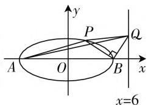
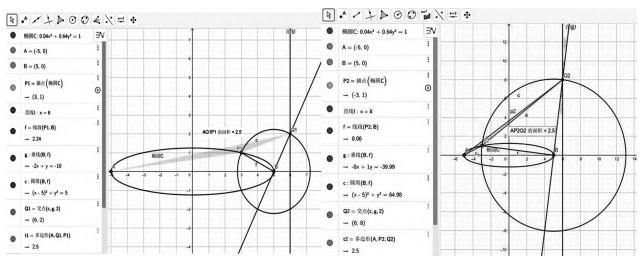
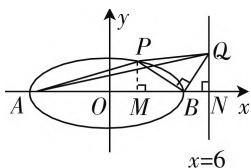

# 注重解题教学,构建良好数学认知结构

——以 2020 年全国卷Ⅲ文科数学第 21 题的解法探析为例

● 西藏军区拉萨八一学校 伍 帅  
● 重庆三峡学院数学与统计学院 程凤娟 陈晓春

要提高数学解题能力就必须有良好的数学认知结构,构建良好的数学认知结构是提高数学解题能力的必要保证.那么,如何在解题教学中构建良好的数学认知结构呢?本文以2020年全国卷Ⅲ文科数学第21题为例来对这一问题加以探索.

# 一、试题呈现

(2020年全国卷Ⅲ文科数学第21题)已知椭圆 $C:\frac{x^{2}}{25}+\frac{y^{2}}{m^{2}}=1(0<m<5)$ 的离心率为 $\frac{\sqrt{15}}{4},A,B$ 分别为C的左、右顶点.

(1) 求 C 的方程;  
(2) 若点 $P$ 在 $C$ 上, 点 $Q$ 在直线 $x = 6$ 上, 且 $|BP| = |BQ|$ , $BP \perp BQ$ , 求 $\triangle APQ$ 的面积.

# 二、问题的探索

数学学习理论认为,数学学习的过程一般包括三个阶段:新知识输入阶段、新旧知识相互作用阶段和新知识操作阶段.在这三个阶段中,为了帮助学生顺利实现构建新的认知结构的目的,常常通过数学问题的形式加以示范或检验,因此数学解题过程中数学思维方法的揭示是解题教学的关键;另一方面从建构主义原理来看,学习者将所学知识重新进行整理、组合与运用都得益于其知识认知结构的圆满构成,学生在数学认知结构上的建构与发展是不断获取新知识、不断同化顺应并再次建构、完善知识体系的过程.

基于以上分析,在解题教学过程中,教师需要加强对目标问题的理解,以数学教材知识间的逻辑结构为主线,以学生的数学认知基础为起点,以学生的数学思维为衔接,在探索求解问题的途径中寻找新旧知识之间最佳的同化或顺应渠道,将数学知识结构转化为学生的数学认知结构.

在本问题中,通过对已知条件的梳理知道:要解决的问题:(1)求出椭圆 C 的方程;(2) $\triangle APQ$ 的面积.问题(1)利用椭圆的离心率、长半轴的长、短半轴的长与半焦距之间的关系,易得 C 的方程为 $\frac{x^{2}}{25} + \frac{y^{2}}{\frac{25}{16}} = 1$ .

而问题(2)综合考查了学生的逻辑推理能力、运算求解能力和几何建构能力,整体难度系数较大.为了强化对目标问题的理解,特设计以下教学逻辑链:利用计算机辅助教学技术建构几何图形,从数学问题的已知条件和要求解的问题的相互关联上寻找联系点,通过对比联想、知识迁移、类比等思维方法帮助学生形成对目标问题的完整认知.

# (一) 直观探路

华罗庚说过:数缺形时少直观,形缺数时难入微.由于问题(2)中涉及的关联点较多,几何关系较为复杂,因此先作一图形.

通过图1,学生容易观察出 $\triangle APQ$ 的大致状况以及P,Q的运动位置,对问题(2)的解决提供了有益的途径.但由于作图的局限性,学生难以完整地

text_image

y
P
Q
A O B x
x=6

图1

抽象出点的运动可能引发的结果变化,很容易造成“漏解”,因此利用软件 GeoGebra 进一步探索.

# (二) 借助 GeoGebra 探索

GeoGebra 作为一个计算机辅助教学软件, 具有良好的交互性, 可以实现动态、高效、翻转等, 是探究数学问题及课堂教学的利器. 由于几何窗口与代数窗口共存以及具有动画演示的功能, 能更好地调动学生的探究兴趣, 辅助学生建构数与形的概念.

问题(2)中 P, Q 两点均为动点，点 P 在椭圆 C 上运动，点 Q 在直线 x = 6 上运动。为方便判断，先将点 P 确定为整个运动过程中的主动点，以点 P 的运动联动点 Q 的运动，当点 Q 的横坐标变为 6 时，即满足题干中“点 Q 在直线 x = 6 上”的条件。利用 GeoGebra 作出相关图形，可得 $P_{1}(3,1)$ ， $Q_{1}(6,2)$ （见图 2）或 $P_{2}(-3,1)$ ， $Q_{2}(6,8)$ （见图 3），两种情况下 $\triangle APQ$ 的面积均为 $\frac{5}{2}$ 。

scatter

| Point | X (deg) | Y (deg) |
|---|---|---|
| Q1 | -7.0 | 2.5 |
| Q2 | -6.0 | 2.5 |
| Q3 | -4.0 | 2.5 |
| Q4 | -3.0 | 2.5 |
| P1 | -8.0 | 2.5 |
| P2 | -6.0 | 2.5 |
| P3 | -4.0 | 2.5 |
| P4 | -3.0 | 2.5 |
| P5 | -2.0 | 2.5 |
| P6 | -1.0 | 2.5 |
| P7 | 0.0 | 2.5 |
| P8 | 1.0 | 2.5 |
| P9 | 2.0 | 2.5 |
| P10 | 3.0 | 2.5 |
| P11 | 4.0 | 2.5 |
| P12 | 5.0 | 2.5 |
| P13 | 6.0 | 2.5 |
| P14 | 7.0 | 2.5 |
| P15 | 8.0 | 2.5 |
| P16 | 9.0 | 2.5 |
| P17 | 10.0 | 2.5 |
| P18 | 11.0 | 2.5 |
| P19 | 12.0 | 2.5 |
| P20 | 13.0 | 2.5 |
| P21 | 14.0 | 2.5 |
| P22 | 15.0 | 2.5 |
| P23 | 16.0 | 2.5 |
| P24 | 17.0 | 2.5 |
| P25 | 18.0 | 2.5 |
| P26 | 19.0 | 2.5 |
| P27 | 20.0 | 2.5 |
| P28 | 21.0 | 2.5 |
| P29 | 22.0 | 2.5 |
| P30 | 23.0 | 2.5 |
| P31 | 24.0 | 2.5 |
| P32 | 25.0 | 2.5 |
| P33 | 26.0 | 2.5 |
| P34 | 27.0 | 2.5 |
| P35 | 28.0 | 2.5 |
| P36 | 29.0 | 2.5 |
| P37 | 30.0 | 2.5 |
| P38 | 31.0 | 2.5 |
| P39 | 32.0 | 2.5 |
| P40 | 33.0 | 2.5 |
| P41 | 34.0 | 2.5 |
| P42 | 35.0 | 2.5 |
| P43 | 36.0 | 2.5 |
| P44 | 37.0 | 2.5 |
| P45 | 38.0 | 2.5 |
| P46 | 39.0 | 2.5 |
| P47 | 40.0 | 2.5 |
| P48 | 41.0 | 2.5 |
| P49 | 42.0 | 2.5 |
| P50 | 43.0 | 2.5 |
| P51 | 44.0 | 2.5 |
| P52 | 45.0 | 2.5 |
| P53 | 46.0 | 2.5 |
| P54 | 47.0 | 2.5 |
| P55 | 48.0 | 2.5 |
| P56 | 49.0 | 2.5 |
| P57 | 50.0 | 2.5 |
| P58 | 51.0 | 2.5 |
| P59 | 52.0 | 2.5 |
| P60 | 53.0 | 2.5 |
| P61 | 54.0 | 2.5 |
| P62 | 55.0 | 2.5 |
| P63 | 56.0 | 2.5 |
| P64 | 57.0 | 2.5 |
| P65 | 58.0 | 2.5 |
| P66 | 59.0 | 2.5 |
| P67 | 60.0 | 2.5 |
| P68 | 61.0 | 2.5 |
| P69 | 62.0 | 2.5 |
| P70 | 63.0 | 2.5 |
| P71 | 64.0 | 2.5 |
| P72 | 65.0 | 2.5 |
| P73 | 66.0 | 2.5 |
| P74 | 67.0 | 2.5 |
| P75 | 68.0 | 2.5 |
| P76 | 69.0 | 2.5 |
| P77 | 70.0 | 2.5 |
| P78 | 71.0 | 2.5 |
| P79 | 72.0 | 2.5 |
| P80 | 73.0 | 2.5 |
| P81 | 74.0 | 2.5 |
| P82 | 75.0 | 2.5 |
| P83 | 76.0 | 2.5 |
| P84 | 77.0 | 2.5 |
| P85 | 78.0 | 2.5 |
| P86 | 79.0 | 2.5 |
| P87 | 80.0 | 2.5 |
| P88 | 81.0 | 2.5 |
| P89 | 82.0 | 2.5 |
| P90 | 83.0 | 2.5 |
| P91 | 84.0 | 2.5 |
| P92 | 85.0 | 2.5 |
| P93 | 86.0 | 2.5 |
| P94 | 87.0 | 2.5 |
| P95 | 88.0 | 2.5 |
| P96 | 89.0 | 2.5 |
| P97 | 90.0 | 2.5 |
| P98 | 91.0 | 2.5 |
| P99 | 92.0 | 2.5 |
| Q1 = -7, Q1 = -6, Q1 = -4, Q1 = -3, Q1 = -1, Q1 = +1, Q1 = +1, Q1 = +3, Q1 = +4, Q1 = +6, Q1 = +8, Q1 = +10, Q1 = +13, Q1 = +16, Q1 = +18, Q1 = +19, Q1 = +16, Q1 = +18, Q1 = +19, Q1 = +18, Q1 = +18, Q1 = +19, Q1 = +19, Q1 = +19, Q1 = +19, Q1 = +19, Q1 = +19, Q1 = +19, Q1 = +19, Q1 = +19, Q1 = +19, Q1 = +19, Q1 = +19, Q1 = +19, Q1 = +19, Q1 = +19, q1 = -7, q1 = -6, q1 = -4, q1 = -3, q1 = -1, q1 = +1, q1 = +3, q1 = +3, q1 = +4, q1 = +4, q1 = +4, q1 = +4, q1 = +4, q1 = +4, q1 = +4, q1 = +4, q1 = +4, q1 = +4, q1 = +4, q1 = +4, q1 = +4, q1 = +4, q1 = +4, q1 = +4, q1 = +4, q1 < -7, q1 < -6, q1 < -4, q1 < -3, q1 < -1, q1 < +1, q1 < +3, q1 < +3, q1 < +3, q1 < +3, q1 < +3, q1 < +3, q1 < +3, q1 < +3, q1 < +3, q1 < +3, q1 < +3, q

图2  
图3

# 三、问题解法

通过上述探究过程, 比较全面地认识了当动点 $P, Q$ 变化时, $\triangle APQ$ 面积的变化情况, 且关联点 $P, Q$ 存在多解和 $\triangle APQ$ 的面积为定值. 在此基础上, 引导学生利用几何直观的性质设出 $P, Q$ 的坐标, 通过直观想象和代数运算求解 (见解法1).

解法 1: 由(1)知, A(-5,0), B(5,0).

设 $P(x_{P},y_{P}),Q(6,y_{Q})$ .由于椭圆具有对称性，不妨设 $y_{Q} > 0$ ，则 $y_{P} > 0$ ，直线 $BP$ 的方程为 $y = -\frac{1}{y_Q}(x - 5),|BP| = y_P\sqrt{1 + y_Q^2},|BQ| = \sqrt{1 + y_Q^2}$ 因为 $|BP| = |BQ|$ ，所以 $y_{P} = 1.$ 将 $y_{P} = 1$ 代入椭圆 $C$ 的方程中，解得 $x_{P} = 3$ 或 $x_{P} = -3$ ，则 $P_{1}(3,1)$ $P_{2}(-3,1)$ .将 $P_{1},P_{2}$ 的坐标分别代入直线 $BP$ 的方程中，得到 $Q_{1}(6,2),Q_{2}(6,8)$

① $|P_{1}Q_{1}|=\sqrt{10}$ ，直线 $P_{1}Q_{1}$ 的方程为 $y=\frac{1}{3}x$ ，点A到直线 $P_{1}Q_{1}$ 的距离为 $\frac{\sqrt{10}}{2}$ ，故 $\triangle AP_{1}Q_{1}$ 的面积为 $\frac{1}{2}\times\frac{\sqrt{10}}{2}\times\sqrt{10}=\frac{5}{2}$ .

② $|P_{2}Q_{2}|=\sqrt{130}$ ，直线 $P_{2}Q_{2}$ 的方程为 $y=\frac{7}{9}x+\frac{10}{3}$ ，点A到直线 $P_{2}Q_{2}$ 的距离为 $\frac{\sqrt{130}}{26}$ ，故 $\triangle AP_{2}Q_{2}$ 的面积为 $\frac{1}{2}\times\frac{\sqrt{130}}{26}\times\sqrt{130}=\frac{5}{2}$ .

综上所述， $\triangle APQ$ 的面积为 $\frac{5}{2}$ .

# 四、解题后的反思

要使学生建立良好的认知结构,解题后的反思是教学过程的重要环节.通常采用以下途径:理解数学的核心概念,引导学生在解题后对题目涉及的知识以及知识间的逻辑结构进行反思、总结,以利于建立新的认知结构;把握问题的本质,引导学生反思解题方法是如何在解题中运用的,它们是否能在其他的题目中运用,以利于学生对解题思维方法的进一步渗透;

明晰数学是一门思维灵活的学科,一道题目往往不止有一种解题方法,引导学生通过深度学习从多视角探究解决问题的方法,增强学生思维的发散性和视野的广阔性.

例如,本题如果利用如下结论,就有新的求解方法(见解法2).

定理:在平面直角坐标系中,已知 $\triangle ABC$ 三个顶点坐标分别为 $A(x_{1},y_{1}), B(x_{2},y_{2}), C(x_{3},y_{3})$ , 则 $\triangle ABC$ 的面积 $S=\left|\frac{1}{2}\left|\begin{matrix}x_{1}&y_{1}&1\\ x_{2}&y_{2}&1\\ x_{3}&y_{3}&1\end{matrix}\right|\right|$ .

解法2:由(1)知, $A(-5,0)$ , $B(5,0)$ .过P作 $PM\perp x$ 轴于M,如图4.设 $P(x_{P},y_{P}),Q(6,y_{Q}),M(x_{P},0)$ , $N(6,0)$ ,其中 $-5<x_{P}<5$ .由于椭圆具有对称性,不妨设$y_{Q} > 0$ ，则 $y_{P} > 0$ ， $\vert PM\vert = y_P,\vert BM\vert = 5 - x_P,$ $\vert QN\vert = y_Q,\vert BN\vert = 1.$ 根据题意 $\triangle PBM\sim \triangle BQN$ 则 $\frac{\vert PM\vert}{\vert BN\vert} = \frac{\vert BM\vert}{\vert QN\vert} = \frac{\vert BP\vert}{\vert BQ\vert}.$ 因为 $\vert BP\vert = \vert BQ\vert$ ，所以 $\frac{y_p}{1} = \frac{5 - x_p}{y_q} = 1$ ，解得 $y_{P} = 1,y_{Q} = 5 - x_{P}.$ 因为 $P(x_{P},$ 1)在椭圆 $C$ 上，所以 $\frac{x_p^2}{25} +\frac{16}{25} = 1$ ，解得 $x_{p} = \pm 3.$

text_image

y
P
Q
A O M B N x
x=6

图4

① 当 $x_{P} = 3$ 时，则 $P(3,1), Q(6,2)$ ，那么 $S_{\triangle APQ} = \left|\frac{1}{2}\right| = \frac{5}{2}$ .

② 当 $x_{P} = -3$ 时，则 $P(-3,1), Q(6,8)$ ，那么 $S_{\triangle APQ} = \left|\frac{1}{2}\left|\begin{array}{ccc} -5 & 0 & 1 \\ -3 & 1 & 1 \\ 6 & 8 & 1 \end{array}\right|\right| = \frac{5}{2}$ .

综上所述， $\triangle APQ$ 的面积为 $\frac{5}{2}$ .

方法评价: 解法1主要基于教材知识体系(点到直线的距离公式和三角形面积公式等), 思维方法具有通性, 学生容易构思, 但计算难度较大. 而解法2相对简捷、巧妙, 但需要学生的数学知识范畴超越教材知识体系, 具有拓展学生数学思维的作用.

本文以 GeoGebra 为媒介,采用数形结合的教学设计,通过直观探路锻炼抽象思维,个性化探究调动学习兴趣,引导学生在较为完整认知目标问题的基础上揭示解题的思维方法,并利用反思性解题教学拓宽学生眼界,帮助学生建立起从教材基础延伸至更深层次的数学知识体系,达到提升学生数学认知水平的目的. W