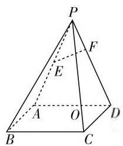
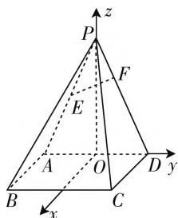
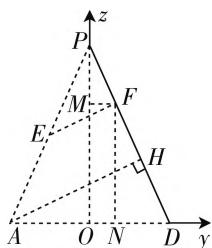
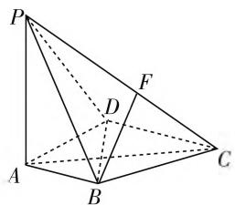
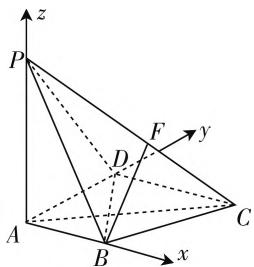
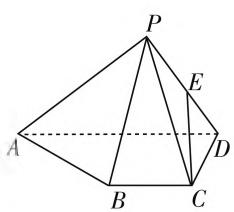
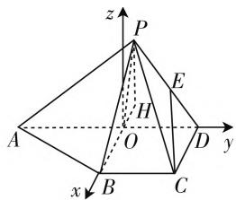

# 浅析建系法求解立体几何题的点坐标求法\*

# ● 福建省莆田第一中学 林敏

立体几何是高中数学的主干内容, 是培养学生逻辑推理、数学运算、数学建模等数学核心素养的重要载体, 更是高考考查的热点内容. 解决立体几何问题既可以用常规的几何法, 也可以用向量法, 但在求解空间角、空间距离或几何体的体积时, 多数学生更倾向于用建系法将几何问题转化为代数问题加以解决. 此时, 建立合理的空间直角坐标系是问题得以顺利解决的基础, 而顺利求出点的坐标是问题得以解决的关键. 通过研究近几年的立体几何高考题, 求点坐标大致可以归纳为以下几种情形.

# 情形一、当点在坐标轴上时

当点在 x 轴、y 轴、z 轴上时，可直接通过题目给定的已知条件求出或先设出点坐标再通过已知条件列方程求解.

# 情形二、当点在坐标平面内时

当点在坐标平面上(平面 $xOy$ 、平面 $xOz$ 或平面 $yOz)$ 且不易求出点的坐标时，我们可先作出二维坐标的平面 $xOy$ 、平面 $xOz$ 或平面 $yOz$ ，再应用平面几何或解析几何的相关知识求出点的坐标.

例 1 如图 1, 在四棱锥 P-ABCD 中, 四边形 ABCD 是边长为 2 的正方形, $PA = PD = \sqrt{17}$ , E 为 PA 的中点, 点 F 在 PD 上, $EF \perp PD$ , 平面 $PAD \perp$ 平面 ABCD. 求直线 EF 与平面 PBC 所成角的正弦值.

text_image

P
F
E
A
O
D
B
C

图1

text_image

z
P
F
E
A
O
B
C
D
y
x

图2

分析:由题意可建立如图2所示的空间直角坐标系O-xyz.为求直线EF与平面PBC所成角的正弦值,只需求出直线EF的方向向量及平面PBC的法向量,为此我们需求出E,F,P,B,C的坐标.由题意,E,P,B,C坐标易求,而点F坐标稍难求,下面我们给出两种求点F坐标的方法.

因点 F 在平面 yOz 内, 我们可在二维平面 yOz 内探求点 F 坐标.

解法1:如图3,过点F分别作y轴,z轴的垂线,再应用平面几何知识求点F坐标,过A作AH⊥PD于

$$
H, E F = \frac {1}{2} A H = \frac {1}{2} \frac {A D \cdot O P}{P D} = \frac {4}{\sqrt {1 7}}, P F =
$$

$$
\sqrt {E P ^ {2} - E F ^ {2}} = \frac {1 5}{2 \sqrt {1 7}}.
$$

由 $\triangle PMF\sim \triangle POD$ ，有 $MF = \frac{PF}{PD}\cdot OD = \frac{15}{34}$ 即 $y_{F} = \frac{15}{34}.$

又由 $\triangle FND\sim \triangle PMF$ ，有 $NF = \frac{ND}{OD}\cdot OP =$ $\frac{38}{17}$ 即 $z_{F} = \frac{38}{17}$ 所以 $F\left(0,\frac{15}{34},\frac{38}{17}\right).$

解法2:应用平面解析几何求解点F坐标,由图3知,在直角坐标系yOz中,A(-1,0),P(0,4), $E\left(-\frac{1}{2},2\right)$ ,直线PD方程为4y+z-4=0.因为 $EF\perp PD$ ,直线EF方程为 $y-4z+\frac{17}{2}=0$ ,联立直线 $PD, EF$ 方程可求出 $F\left(0, \frac{15}{34}, \frac{38}{17}\right)$ .

text_image

z
P
M
F
E
H
A
O
N
D
y

图3

# 情形三、当点落在两端点坐标已知或易求的线段上时

当点为线段的中点时，可直接用中点坐标公式求解；当点不是线段中点，但该点分线段所成比例已知时，可直接应用向量共线理论求出分点的坐标；当点分线段所成比例未知，可先设出该点分线段所成比例为 $\lambda$ ，将分点的坐标转化为 $\lambda$ 形式，再通过题目给定的长度或角度等关系列方程求出点坐标.如例1， $E$ 为 $AP$ 中点，且 $A(0, - 1,0),P(0,0,4)$ ，则易求出 $E\left(0, - \frac{1}{2},2\right)$ ；又如点 $F$ 在 $PD$ 内， $P(0,0,4),D(0,$ $1,0)$ ，且 $\frac{PF}{PD} = \frac{15}{34}$ 即 $\overrightarrow{PF} = \overrightarrow{\frac{15}{34} PD}$ 设 $F(x,y,z)$ ，有 $(x,y,z - 4) = \frac{15}{34}(0,1, - 4)$ ，则 $x = 0,y = \frac{15}{34},z = \frac{38}{17}$ 所以 $F\left(0,\frac{15}{34},\frac{38}{17}\right).$

例2（2014年天津卷节选）如图4，在四棱锥 $P - ABCD$ 中， $PA \perp$ 底面 $ABCD, AD \perp AB, AB \parallel DC, AD = DC = AP = 2, AB = 1$ ，若 $F$ 为棱 $PC$ 上一点，满足 $BF \perp AC$ ，求二面角 $F - AB - P$ 的余弦值.

text_image

Geometric diagram of a triangular pyramid with labeled vertices and internal points

图4

text_image

z
P
F
y
D
A
B
x
C

图 5

分析:由题意可建立如图5所示的空间直角坐标系A-xyz,则 $A(0,0,0)$ , $B(1,0,0)$ , $D(0,2,0)$ , $C(2,2,0)$ , $P(0,0,2)$ ,为求二面角F-AB-P的余弦值,关键在于求出点F坐标,F在PC上,可设 $\overrightarrow{CF}=\lambda\overrightarrow{CP}$ , $(0\leqslant\lambda\leqslant1)$ , $F(x,y,z)$ ,有 $(x-2,y-2,z)=\lambda(-2,-2,2)$ ,即 $F(2-2\lambda,2-2\lambda,2\lambda)$ ,又由 $\overrightarrow{BF}\cdot\overrightarrow{AC}=0$ ,得 $\lambda=\frac{3}{4}$ ,则 $F\left(\frac{1}{2},\frac{1}{2},\frac{3}{2}\right)$ .

# 情形四、当点不在坐标轴或平面内，也不在两端点坐标已知或易求的线段上时

当点在坐标平面 $xOy$ 内的射影点坐标易求时，可先求其射影点坐标，即可得到该点 $x$ 轴， $y$ 轴方向坐标，而 $z$ 轴方向的坐标可通过求该点到 $xOy$ 平面的距离得到.

例 3 如图 6, 已知四棱锥 P-ABCD, $\triangle PAD$ 是以 AD 为斜边的等腰直角三角形, BC // AD, CD ⊥AD, PC = AD = 2DC = 2CB, E 为 PD 的中点, 求直线 CE 与平面 PBC 所成角的正弦值.

分析:采用建系法求解直线 CE 与平面 PBC 所成角的正弦值,关键在于求出点 P 的坐标.求 P 坐标的方法有很多,这里我们采用求点 P 在平面 ABCD 的射影点的坐标,得到 $x_{P}, y_{P}$ 后,再通过求点 P 到平面 ABCD 的距离得到 $z_{P}$ .

text_image

Geometric diagram of a pyramid with labeled vertices and internal points, used for spatial geometry problems.

图6

text_image

z
P
E
H
A
O
D
y
x
B
C

图7

为此，取 $AD$ 的中点 $O$ ，连接 $PO, BO$ ，易证 $BO \perp AD, PO \perp AD$ ，以 $OB$ 为 $x$ 轴， $OD$ 为 $y$ 轴，过点 $O$ 作 $z$ 轴垂直平面ABCD. 设 $BC = 1$ ，则 $A(0, -1, 0), B(1, 0, 0), C(1, 1, 0), D(0, 1, 0)$ . 因为 $BO \perp AD, PO \perp AD$ ，所以 $AD \perp$ 平面 $POB$ . 又因为 $AD \subset$ 平面ABCD，所以平面 $POB \perp$ 平面ABCD. 过 $P$ 作 $PH \perp BO$ 于点 $H$ ，由面面垂直的性质可知， $PH \perp$ 平面ABCD. 又因为 $BC \parallel AD$ ，所以 $BC \perp$ 平面 $POB, BP \subset$ 平面 $POB$ ，所以 $BC \perp BP$ ，在 Rt△CBP 中， $BP = \sqrt{PC^2 - BC^2} = \sqrt{3}$ ，而 $\cos \angle BOP = \frac{OP^2 + OB^2 - BP^2}{2 \cdot OB \cdot OP} = -\frac{1}{2}$ ，则 $\angle BOP = 120^\circ$ ，易知 $H$ 在 $BO$ 延长线上，且 $OH = OP \sin 30^\circ = \frac{1}{2}$ ，所以射影点 $H\left(-\frac{1}{2}, 0, 0\right)$ ，即可知 $x_P = x_H = -\frac{1}{2}, y_P = y_H = 0$ 又因为 $PH = OP \sin 60^\circ = \frac{\sqrt{3}}{2}$ ，所以 $P\left(-\frac{1}{2}, 0, \frac{\sqrt{3}}{2}\right)$ .

应用建系法求解立体几何问题需要学生具备一定的空间想象力及较强的数学运算能力. 在平时的教学中, 教师应有意识引导学生总结建系及求点坐标的方法, 渗透数形结合思想方法, 培育学生的数学运算、逻辑推理等数学素养.

# 参考文献：

[1] 人民教育出版社课程教材研究所. 普通高中课程标准实验教科书数学必修 2[M]. 北京: 人民教育出版社, 2009.  
[2] 人民教育出版社课程教材研究所. 普通高中课程标准实验教科书数学必修 4[M]. 北京: 人民教育出版社, 2009. W