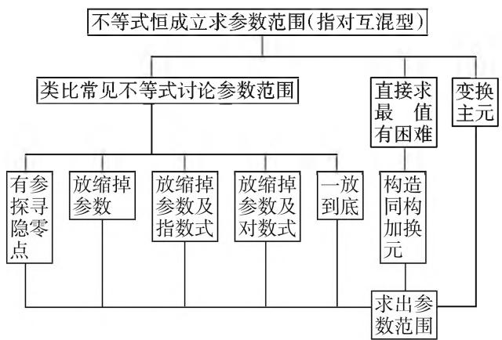
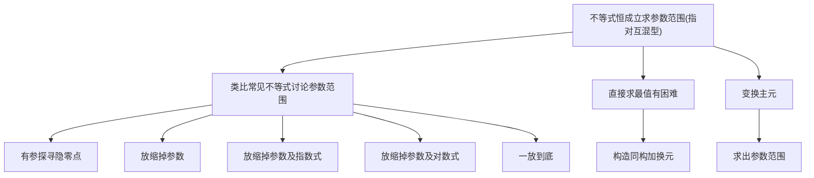
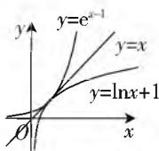
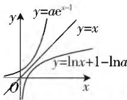
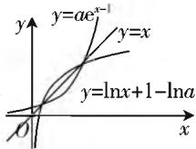

# 用思维导图解答压轴题,先通法后秒杀

—— 用导数求解指数与对数混合型试题的方法研究

# ● 中央民族大学附属中学呼和浩特分校 文卫星数学生态课堂基地 李雪峰

有些高考题就是课本中的定理或者习题改编而成,即使是综合题,也是基础知识的加工、组合和发展,充分体现了课本的魅力.本文仅以2020年新高考数学全国卷(山东卷)的导数压轴题加以说明.

# 一、压轴题呈现

试题 （2020 年新高考数学山东卷）已知函数 $f(x)=ae^{x-1}-\ln x+\ln a.$

(1) 当 $a = \mathrm{e}$ 时, 求曲线 $y = f(x)$ 在点 $(1, f(1))$ 的切线与两坐标轴围成三角形的面积;  
(2) 若 $f(x) \geqslant 1$ , 求 $a$ 的取值范围.

# 二、解法分析及详解

本文只给出第(2)问的三种不同的思考角度和解题方法. 这类指数、对数混合型问题的总体解决思路的思维导图如图1所示:

flowchart

图 1

# 思路(一):有指有对事难办,回归课本思路现

思路分析: $f(x)\geqslant1$ ,

即 $a\mathrm{e}^{x - 1}\geqslant \ln x + 1 - \ln a.$ ①

联想到课本习题如下:证明: $e^{x}\geqslant x+1$ (证明略).

以 $x - 1$ 代 $x$ ，可得 $\mathrm{e}^{x - 1}\geqslant x$ ，两边同时取自然对数可得 $x\geqslant \ln x + 1$ ，这样得到如下不等式链： $\mathrm{e}^{x - 1}\geqslant x\geqslant$ $\ln x + 1.$ ②

比较 ① 和 ②, 不难发现: 当 $a = 1$ 时, 两个不等式相同, $a \neq 1$ 时它们的结构相似, 我们从图像变换的角度分析如下:

在同一坐标系中作出 $y = \mathrm{e}^{x - 1}, y = x, y = \ln x + 1$ 的函数图像，如图2所示，直线 $y = x$ 恰为函数 $y = \mathrm{e}^{x - 1}$ 与函数 $y = \ln x + 1$ 的图像在点(1,1)处的公切线.

  
图 2

  
图3

  
图4

当 $a > 1$ 时，将函数 $y = \mathrm{e}^{x - 1}$ 图像上所有点的纵坐标扩大为原来的 $a$ 倍得到函数 $y = ae^{x - 1}$ 的图像，将函数 $y = \ln x + 1$ 的图像向下平移 $\ln a$ 个单位得到函数 $y = \ln x + 1 - \ln a$ 的图像(如图3)，由图3可知， $ae^{x - 1} \geqslant \ln x + 1 - \ln a$ 恒成立；

当 $0 < a < 1$ 时，将函数 $y = \mathrm{e}^{x - 1}$ 图像上所有点的纵坐标缩小为原来的 $a$ 倍得到函数 $y = ae^{x - 1}$ 的图像，将函数 $y = \ln x + 1$ 的图像向上平移 $\left|\ln a\right|$ 个单位得到函数 $y = \ln x + 1 - \ln a$ 的图像(如图4)，由图4可知，在 $x = 1$ 附近 $ae^{x - 1} < \ln x + 1 - \ln a.$

这样,我们获得如下解题思路:当 $a \geqslant 1$ 时,证明不等式 $f(x) \geqslant 1$ 恒成立;当 0 < a < 1 时,说明 $f(x) \geqslant 1$ 不恒成立.

先通性通法:这里给出三种通常解法如下:

解法 1: (常规解法) 由 a 探出隐零点, 隐零点代换范围现.

由于 $f'(x)=a\mathrm{e}^{x-1}-\frac{1}{x}$ ，且 $f''(x)=a\mathrm{e}^{x-1}+\frac{1}{x^2}>0$ ，所以 $f'(x)$ 在 $(0,+\infty)$ 上是增函数.

当 $a > 1$ 时，因为 $f^{\prime}\left(\frac{1}{a}\right) = a\left(\mathrm{e}^{\frac{1}{a} -1} - 1\right) < 0,$ $f^{\prime}(1) = a - 1 > 0$ ，所以存在 $x_0 \in \left(\frac{1}{a}, 1\right)$ 使得 $f^{\prime}(x_0) = 0$ ，且当 $x \in (0, x_0)$ 时， $f^{\prime}(x) < 0$ ；当 $x \in (x_0, x_0)$

$+\infty)$ 时, $f'(x)>0.$

从而 $f(x)$ 在 $(0, x_0)$ 上是减函数，在 $(x_0, +\infty)$ 上是增函数，故 $f(x)_{\min} = a e^{x_0 - 1} - \ln x_0 + \ln a.$ ①

由 $f^{\prime}(x_0) = a\mathrm{e}^{x_0 - 1} - \frac{1}{x_0} = 0$ 可得 $a\mathrm{e}^{x_0 - 1} = \frac{1}{x_0}$ ，从而有 $\ln a = 1 - x_0 - \ln x_0$ ，代入①式得 $f(x)_{\min} = \frac{1}{x_0} - x_0 - 2\ln x_0 + 1.$ 设 $g(t) = \frac{1}{t} - t - 2\ln t + 1, t \in \left(\frac{1}{a}, 1\right), a \in (1, +\infty)$ ，

因为 $g^{\prime}(t) = -\frac{1}{t^{2}} - 1 - \frac{2}{t} = -\frac{(t + 1)^{2}}{t} < 0$ ，所以 $g(t)$ 在 $\left(\frac{1}{a}, 1\right)$ 上是减函数，则 $g(t) > g(1) = 1$ .

从而 $f(x)_{\min} = g(x_0) > 1$ ，所以 $a > 1$ 符合题意

当 0 < a < 1 时，因为 $f'\left(\frac{1}{a}\right) = a \left(\mathrm{e}^{\frac{1}{a}-1} - 1\right) > 0,$ $f'(1) = a - 1 < 0$ ，所以存在 $x_{1} \in \left(1, \frac{1}{a}\right)$ ，使得 $f'(x_{1}) = 0$ ，且当 $x \in (1, x_{1})$ 时， $f'(x) < 0, f(x)$ 单调递减，所以当 $x \in (1, x_{1})$ 时， $f(x) < f(1) = a + \ln a < a < 1$ ，则 0 < a < 1 不符合题意.

当 a=1 时， $f(x)=\mathrm{e}^{x-1}-\ln x\geqslant1$ 恒成立(证明过程见下文).

综上所述， $a$ 的取值范围为 $[1, +\infty)$

解法 2: (常规解法) 放缩掉 a, 转化为最值问题.

当 $a \geqslant 1$ 时， $f(x) = a \mathrm{e}^{x - 1} - \ln x + \ln a \geqslant \mathrm{e}^{x - 1} - \ln x$ ，下面证明不等式 $\mathrm{e}^{x - 1} - \ln x \geqslant 1$ 恒成立.

设 $g(x) = \mathrm{e}^{x - 1} - \ln x, g'(x) = \mathrm{e}^{x - 1} - \frac{1}{x}$ , 因为 $g''(x) = \mathrm{e}^{x - 1} + \frac{1}{x^2} > 0$ , 所以 $g'(x) = \mathrm{e}^{x - 1} - \frac{1}{x}$ 在 $(0, +\infty)$ 上是增函数.

又有 $g^{\prime}(1) = 0$ 可得，当 $x\in (0,1)$ 时， $g^{\prime}(x) <   0$ 当 $x\in (1, + \infty)$ 时， $g^{\prime}(x) > 0.$

于是 $g(x) = \mathrm{e}^{x - 1} - \ln x$ 在(0,1)上是减函数，在 $(1, + \infty)$ 上是增函数，故 $g(x)\geqslant g(1) = 1$ ，所以 $a\geqslant$ 1符合题意.

当 $0 < a < 1$ 时， $f(1) = a + \ln a < a < 1$ ，所以 $0 < a < 1$ 不符合题意.

综上所述， $a$ 的取值范围是 $[1, +\infty)$ .

点评:对于解析式中既含有指数又含有对数式问题,放缩掉指数式、对数式,隐零点代换,都是一些常见的思路,上面两种解法的关键是选择一定的标准对$a$ 的范围进行讨论. 从已知的课本习题出发, 结合图像, 对 $a$ 讨论直观明了, 水到渠成.

# 思路(二):指对互混有困难,构造同构把元换

解法 3: 构造同构式 1.

由 $f(x) = a\mathrm{e}^{x - 1} - \ln x + \ln a\geqslant 1$ ，得 $\mathrm{e}^{\ln a + x - 1} - \ln x$ $+\ln a\geqslant 1$ ，即 $\mathrm{e}^{\ln a + x - 1} + \ln a + x - 1\geqslant x + \ln x = \mathrm{e}^{\ln x}$ $+\ln x.$

设 $g(t) = \mathrm{e}^t + t$ ，则 $g'(t) = \mathrm{e}^t + 1 > 0, g(t)$ 在 $\mathbf{R}$ 上是增函数，因为 $g(\ln a + x - 1) \geqslant g(\ln x)$ ，所以 $\ln a + x - 1 \geqslant \ln x$ 恒成立，即 $\ln a \geqslant \ln x - x + 1$ 恒成立.

设 $h(x) = \ln x - x + 1$ ，易得 $h(x)_{\max} = 0$ ，从而 $\ln a$ $\geqslant 0$ ，解得 $a\geqslant 1$

故 $a$ 的取值范围为 $[1, +\infty)$ .

点评:先同构再换元或者先换元再同构,解法巧妙,达到了化难为易的效果,但对式子等价变形能力要求较高.

# 思路(三):含参问题思路宽,变换主元角度换

解法 4:(秒杀法) 变换主元.

由 $f(x) = a\mathrm{e}^{x - 1} - \ln x + \ln a\geqslant 1$ ，得 $\mathrm{e}^{x - 1}a + \ln a$ $-\ln x - 1\geqslant 0.$

设 $g(a) = \mathrm{e}^{x - 1}a + \ln a - \ln x - 1$ ，则 $g^{\prime}(a) = \mathrm{e}^{x - 1}+\frac{1}{a} >0$ ，所以 $g(a)$ 在 $(0, + \infty)$ 上是增函数.

因为 $g(1) = \mathrm{e}^{x - 1} - \ln x - 1\geqslant 0$ ，当且仅当 $x = 1$ 时等号成立，又因为 $g(a)$ 在 $(0, + \infty)$ 上是增函数，所以 $a\geqslant 1$

点评:变换主元是解决含参问题的常见策略,通过变换看待问题的角度使问题得到解决.解法4的关键是能够看出 $g(1)=\mathrm{e}^{x-1}-\ln x-1\geqslant0$ 当且仅当x=1时取等号,其实这也是源于课本.

不等式 $\mathrm{e}^x\geqslant x + 1$ 还有很多变式，比如两边同时取自然对数可得 $x\geqslant \ln (x + 1)$ ，从而得到不等式链 $\mathrm{e}^x$ $\geqslant x + 1\geqslant \ln (x + 2)$ ，不难证明直线 $y = x + 1$ 恰为函数 $y = \mathrm{e}^x$ 与函数 $y = \ln (x + 2)$ 图像的公切线.

从以上分析可以看出,课本中的例题、习题蕴含着丰富的知识点、思想方法与解题技巧.我们若能对一些典型的例题、习题进行认真的研究,挖掘其内在潜能,探求到更一般的结论,做到知识点、思想方法源于课本,但又高于课本,如此不仅能提高学生解决似曾相识的问题的能力和速度,同时也能培养学生发现问题、提出问题、解决问题的能力.