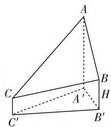
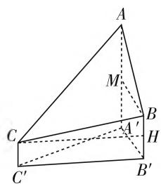

# 聚焦核心,开放创新,关注热点

——2021年高考数学全国甲卷评析

河南省郑州市第九中学 陈 晓

2021年高考数学全国甲卷适用地区是四川、云南、贵州、广西、西藏等五个省份，该试卷很好地落实了立德树人、服务选才、引导教学的高考核心功能，同时突出数学学科特色，充分发挥了高考数学学科的选拔功能，对深化中学数学教学改革发挥了积极的导向作用.

# 一、聚焦核心素养，把握主干知识

# 1. 聚焦核心素养,立足学科能力

2021年高考数学全国甲卷立足实际，稳中求新，聚焦核心素养，强调对数学学科核心素养的考查，体现时代特征和育人导向，力图落实高考评价体系的要求，体现高考数学学科的选拔功能和育人作用，为积极推进高考综合改革和高考考试内容改革及发挥高考对高中数学教学改革的引领作用打下坚实的基础.

以理科试卷来说,数学学科核心素养贯穿整份试卷,渗透到各道试题中,突出考查学生的关键能力与核心素养.例如,第12题是根据抽象函数的奇偶性及给定区间内的函数解析式与函数值,求解对应的函数值问题,考查数学抽象、逻辑推理、数学运算等核心素养;第16题以三角函数的部分图像为背景,确定满足三角函数不等式的最小正整数的值,考查直观想象、逻辑推理、数学运算等核心素养;第17题以两台机床生产同种产品的比较,考查数据分析、数学运算等核心素养.

例 1 （2021 年高考数学全国甲卷理科第 15 题）已知 $F_{1}, F_{2}$ 为椭圆 $C: \frac{x^{2}}{16} + \frac{y^{2}}{4} = 1$ 的两个焦点，P, Q 为 C 上关于坐标原点对称的两点，且 $|PQ| = |F_{1}F_{2}|$ ，则四边形 $PF_{1}QF_{2}$ 的面积为 \_\_\_\_.

分析:根据图形的对称性,判断四边形 $PF_{1}QF_{2}$ 为矩形,再利用椭圆的定义及勾股定理求解即可.

解析: 因为 P, Q 为 C 上关于坐标原点对称的两点，且 $|PQ| = |F_1F_2|$ ，所以四边形 $PF_{1}QF_{2}$ 为矩形.

设 $\left|PF_{1}\right|=m,\left|PF_{2}\right|=n.$

由椭圆的定义, 可得 $\left|PF_{1}\right|+\left|PF_{2}\right|=m+n=2a=8$ , 所以 $m^{2}+2mn+n^{2}=64$ .

又因为 $\left|PF_{1}\right|^{2}+\left|PF_{2}\right|^{2}=\left|F_{1}F_{2}\right|^{2}=4c^{2}=4(a^{2}-b^{2})=48$ ，即 $m^{2}+n^{2}=48$ ，所以mn=8.

所以四边形 $PF_{1}QF_{2}$ 的面积为 $\left|PF_1\right|\left|PF_2\right| = mn = 8.$

故填答案:8.

点评:本题巧妙地将平面几何图形渗透到解析几何中,合理运用数形结合,综合椭圆的定义、方程与几何性质,以及四边形的面积等,很好地考查数学抽象、直观想象及数学运算等核心素养.

# 2. 把握主干知识, 形成知识网络

以理科试卷为例，整份试卷所考查的全部知识点，都围绕高中数学基础知识展开，以基础知识为主，突出对数学知识、数学思想方法和数学能力等的考查。特别是高中数学的主干知识，其中三角函数（含解三角形）、解析几何、函数与导数、立体几何、概率与统计、数列这六大知识板块的试题分别为15分、22分、27分、22分、22分、17分，主干知识考查共占125分，约占全卷前面140分的89.3%，基本维持历年高考对主干知识考查分值的大体比重；剩下的25分分别是集合、复数、平面向量各5分，以及坐标系与参数方程或不等式选讲等知识板块10分。

# 二、注重学科基础，坚持开放创新

# 1. 关注学科基础, 回归教材本源

试题设计严格遵循《高考考试说明》与课标要求，不出偏题、怪题，注重考查对数学概念、定理、公式、法则等数学学科基础的理解；注重考查活用数学原理和方法解决问题的关键能力，注重通性、通法，合理引导高中数学教学回归教材、回归本源，注重数学的学科基础.

# 2. 坚持开放创新，引领改革方向

在《深化新时代教育评价改革总体方案》提出的背景下，构建引导考生德智体美劳全面发展的考试内容体系，改变相对固化的试题形式，增强试题的开放性，减少死记硬背和“机械刷题”现象。命题者既要照顾学生复习的实际情况，又要突出高考改革方向的新变化，实属不易，“重视基础，突出能力，锐意改革”是今年甲卷的基本命题理念。

例 2 （2021 年高考数学全国甲卷理科第 18 题）已知数列 $\{a_{n}\}$ 的各项均为正数，记 $S_{n}$ 为 $\{a_{n}\}$ 的前 n 项和，从下面 ①②③ 中选取两个作为条件，证明另外一个成立.

① 数列 $\{a_{n}\}$ 是等差数列；② 数列 $\{\sqrt{S_{n}}\}$ 是等差数列；③ $a_{2}=3a_{1}$ .

注:若选择不同的组合分别解答,则按第一个解答计分.

分析:认真分析题目条件,首先确定两个条件和一个结论,然后结合等差数列的通项公式和前n项和公式证明结论即可.

解析:选择①③为条件,②为结论.证明过程如下:由题意可得 $a_{2}=a_{1}+d=3a_{1}$ ，则 $d=2a_{1}$ ，则数列 $\{a_{n}\}$ 的前n项和 $S_{n}=na_{1}+\frac{n(n-1)}{2}d=na_{1}+\frac{n(n-1)}{2}\times2a_{1}=n^{2}a_{1}$ ，故 $\sqrt{S_{n}}-\sqrt{S_{n-1}}=n\sqrt{a_{1}}-(n-1)\sqrt{a_{1}}=\sqrt{a_{1}}$ ，据此可得数列 $\{\sqrt{S_{n}}\}$ 是等差数列.

选择 ①② 为条件, ③ 为结论. 证明过程如下:

设数列 $\{a_{n}\}$ 的公差为 $d$ ，则 $\sqrt{S_1} = \sqrt{a_1}$

$$
\begin{array}{r l} \sqrt {S _ {2}} & = \sqrt {a _ {1} + (a _ {1} + d)} = \sqrt {2 a _ {1} + d}, \sqrt {S _ {3}} = \\ \sqrt {a _ {1} + (a _ {1} + d) + (a _ {1} + 2 d)} & = \sqrt {3 (a _ {1} + d)}. \end{array}
$$

由数列 $\{\sqrt{S_n}\}$ 为等差数列，得 $\sqrt{S_1} +\sqrt{S_3}$ $= 2\sqrt{S_2}$ ，则 $(\sqrt{a_1} +\sqrt{3(a_1 + d)})^2 = (2\sqrt{2a_1 + d})^2$ 整理可得 $d = 2a_{1}$ ，则 $a_2 = a_1 + d = 3a_1$

选择 ②③ 为条件, ① 为结论. 证明过程如下:

由题意可得 $S_{2} = a_{1} + a_{2} = 4a_{1}$ ，则 $\sqrt{S_2} = 2\sqrt{a_1}$ 则数列 $\{\sqrt{S_n}\}$ 的公差 $d = \sqrt{S_2} -\sqrt{S_1} = \sqrt{a_1}$ ，通项公式为 $\sqrt{S_n} = \sqrt{S_1} +(n - 1)d = n\sqrt{a_1}$

据此可知，当 $n \geqslant 2$ 时， $a_{n} = S_{n} - S_{n-1} = n^{2}a_{1} - (n - 1)^{2}a_{1} = (2n - 1)a_{1}$ ；当 $n = 1$ 时，上式也成立。

故数列 $\{a_{n}\}$ 的通项公式为 $a_{n}=(2n-1)a_{1}$ .

由 $a_{n + 1} - a_n = [2(n + 1) - 1]a_1 - (2n - 1)a_1 = 2a_1$ ，可知数列 $\{a_n\}$ 是等差数列.

点评:该题的解题方法是常用的通技、通法,引导高中数学教学回归教材,回归数学教学本源.以“结构不良问题”的适度开放来坚持开放创新,引领数学学科的改革方向,通过给出部分已知条件,要求考生根据试题要求构建一个命题,充分考查考生对数学本质的理解,引导中学数学教师在数学概念与数学方法的教学中,重视培养数学学科核心素养,克服“机械刷题”现象.

# 三、关注社会热点，注重身心健康

# 1. 关注社会热点, 解决实践问题

试题关注社会热点,关注社会与经济发展,选材贴近实际,解决实践问题.例如,文、理科第2题以我国在脱贫攻坚工作中取得全面胜利和农村振兴为背景,通过图表给出某地农户家庭收入情况的抽样调查结果,以此设计问题,考查考生分析问题和数据处理的能力.

例 3 （2021 年高考数学全国甲卷理科第 8 题）2020 年 12 月 8 日，中国和尼泊尔联合公布珠穆朗玛峰最新高程为 8848.86（单位：m），三角高程测量法是珠峰高程测量方法之一。图 1 是三角高程测量法的一个示意图，现有 A, B, C 三点，且 A, B, C 在同一水平面上的投影 $A', B', C'$ 满足 $\angle A'C'B'=45^{\circ}, \angle A'B'C'=60^{\circ}$ 。由点 C 测得点 B 的仰角为 $15^{\circ}, BB'$ 与 $CC'$ 的差为 100；由点 B 测得点 A 的仰角为 $45^{\circ}$ ，则 A, C 两点到水平面 $A'B'C'$ 的高度差 $AA'-CC'$ 约为（）( $\sqrt{3}\approx1.732$ )。

A. 346

B. 373

C. 446

D. 473

text_image

Geometric diagram of a triangular pyramid with labeled vertices and internal points, including dashed lines indicating hidden edges.

图1

text_image

Geometric diagram of a triangular pyramid with labeled vertices and internal points, including dashed lines indicating hidden edges.

图2

分析:充分分析并理解题中条件,理解仰角的概念,注意各个三角形不共面,在各个三角形中利用正弦定理求边长,进而找到高度差,作好辅助线是关键.

解析:如图2,过点C作 $CH\perp BB'$ 于点H,过点B作 $BM\perp AA'$ 于点M,则 $\angle BCH=15^{\circ},BH=100,\angle ABM=45^{\circ},CH=C'B',A'B'=BM=AM,BB'=MA',\angle C'A'B'=75^{\circ}.$ (下转第31页)

联立 $\left\{\begin{aligned}x&=my\pm c,\\ b^{2}x^{2}&+a^{2}y^{2}=a^{2}b^{2},\end{aligned}\right.$ 消去x，整理可得

$$
(a ^ {2} + b ^ {2} m ^ {2}) y ^ {2} \pm 2 m c b ^ {2} y - b ^ {4} = 0.
$$

由根与系数关系可得

$$
y _ {1} + y _ {2} = \pm \frac {2 m c b ^ {2}}{a ^ {2} + b ^ {2} m ^ {2}}, y _ {1} y _ {2} = - \frac {b ^ {4}}{a ^ {2} + b ^ {2} m ^ {2}}.
$$

由弦长公式可得

$$
\left| M N \right| = \sqrt {1 + m ^ {2}} \sqrt {\frac {4 b ^ {4} (m ^ {2} c ^ {2} + a ^ {2} + b ^ {2} m ^ {2})}{(a ^ {2} + b ^ {2} m ^ {2}) ^ {2}}}. \tag {⑤}
$$

将 $m^2 = \frac{c^2}{b^2} - 1$ 代入⑤式，可得

$$
\mid M N \mid = \sqrt {\frac {c ^ {2}}{b ^ {2}}} \cdot \frac {2 b ^ {2} c \sqrt {\frac {c ^ {2}}{b ^ {2}} + 1}}{2 c ^ {2}} = a.
$$

再证充分性.

当 $|MN| = a$ 时，设直线 $MN$ 的方程为 $x = ty + m$ ，圆心 $O$ 到直线 $MN$ 的距离为 $d = \frac{|m|}{\sqrt{t^2 + 1}} = b$ ，所以 $m^2 -b^2 t^2 = b^2$

联立 $\left\{\begin{aligned}x&=ty+m,\\ b^{2}x^{2}&+a^{2}y^{2}=a^{2}b^{2},\end{aligned}\right.$ 消去x，整理可得

$$
(a ^ {2} + b ^ {2} t ^ {2}) y ^ {2} + 2 b ^ {2} t m y + b ^ {2} (m ^ {2} - a ^ {2}) = 0,
$$

$$
\begin{array}{r l} \Delta & = 4 b ^ {4} t ^ {2} m ^ {2} + 4 b ^ {2} (a ^ {2} + b ^ {2} t ^ {2}) (a ^ {2} - m ^ {2}) = \\ & 4 a ^ {2} b ^ {2} (a ^ {2} - m ^ {2} + b ^ {2} t ^ {2}). \quad ⑥ \end{array}
$$

将 $m^2 - b^2 t^2 = b^2$ 代入⑥整理可得

$$
\Delta = 4 a ^ {2} b ^ {2} (a ^ {2} - b ^ {2}) = 4 a ^ {2} b ^ {2} c ^ {2},
$$

且 $|MN| = \sqrt{1 + t^2} \cdot \frac{2abc}{a^2 + b^2t^2} = a$

所以 $2bc\sqrt{1 + t^2} = a^2 +b^2 t^2.$ ⑦

将 $t^2 = \frac{m^2}{b^2} - 1$ 代入整理可得

$$
2 b c \sqrt {\frac {m ^ {2}}{b ^ {2}}} = c ^ {2} + m ^ {2},
$$

所以 $c^2 - 2c|m| + m^2 = 0$ .

当 $m > 0$ 时， $(c - m)^2 = 0,m = c$

所以直线 MN 的方程为 $x = ty + c$ ,

所以直线 MN 经过点 $F(c,0)$ ;

当 $m < 0$ 时， $(c + m)^2 = 0$

所以 $m = -c$

所以直线 MN 的方程为 x = ty - c，

所以直线 MN 经过点 $F(-c,0)$ .

所以直线 M, N, F 三点共线.

# 五、结束语

高考试题凝结了命题专家的心血和智慧,以上对2021年新高考Ⅱ卷第20题进行了多解探究和拓展推广,更大地发挥了高考试题的功效.通过多解探究和拓展探究,使学生经历了分析、思考、探索和论证的过程,可以提升学生的核心素养,可以培养学生数学探究能力.F

# (上接第28页)

$$
\begin{array}{l} \frac {\tan 4 5 ^ {\circ} - \tan 3 0 ^ {\circ}}{1 + \tan 4 5 ^ {\circ} \tan 3 0 ^ {\circ}} = 2 - \sqrt {3}, \sin 7 5 ^ {\circ} = \sin (4 5 ^ {\circ} + 3 0 ^ {\circ}) = \\ \sin 4 5 ^ {\circ} \cos 3 0 ^ {\circ} + \cos 4 5 ^ {\circ} \sin 3 0 ^ {\circ} = \frac {\sqrt {2}}{2} \left(\frac {\sqrt {3}}{2} + \frac {1}{2}\right). \\ \end{array}
$$

因此 $\tan \angle BCH = \tan 15^{\circ} = \tan (45^{\circ} - 30^{\circ}) =$

在 Rt△BCH 中， $CH = \frac{BH}{\tan\angle BCH} = 100(2 + \sqrt{3})$ ，则 $C'B' = 100(2 + \sqrt{3})$ .

在 $\triangle A'B'C'$ 中，由正弦定理知， $A'B' = \frac{C'B'}{\sin\angle C'A'B'} \cdot \sin\angle A'C'B' = 100(\sqrt{3} + 1)$ ，则 $AM = 100(\sqrt{3} + 1)$ ，所以 $AA' - CC' = AM + BH = 100(\sqrt{3} + 1) + 100 \approx 373.$

故选B.

点评:该题以测量珠穆朗玛峰高程的方法之一(三角高程测量法)为背景设计,要求考生能正确应用线线关系、线面关系、点面关系等几何知识构建计算模型,情境真实,突出理论联系实际.

# 2. 关注学生生活，注重身心健康

身心健康是素质教育的核心内容,在高考评价体系的核心价值指标体系中,包含有健康情感的指标,要求考生具有健康意识,注重增强体质,健全人格,锻炼意志.甲卷理科第4题(文科第6题),以社会普遍关注的青少年视力问题为背景,重点考查考生的数学理解能力和运算求解能力.F