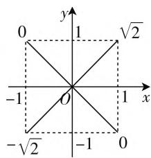

# 谈谈如何确定角的取值范围

# ● 江苏省盱眙中学 张勇

三角函数一直是高考命题的核心考点,三角函数的求值问题是高考中最常见的题型之一,而求解这类问题的关键是确定角的范围,否则无法确定三角函数值的符号,因而就无法保证解题的准确性.那么确定角的范围有哪些常用方法呢?笔者结合具体问题加以说明,供大家参考.

# 一、根据所给角的范围确定所求角的范围

将所求角用已知角的线性表示,可以根据已知所给角的范围来确定所求角的范围.

例1 已知 $\pi < \alpha + \beta < \frac{4\pi}{3}, -\pi < \alpha - \beta < -\frac{\pi}{3}$ , 求 $2\alpha - \beta$ 的取值范围.

解析: 令 $2\alpha - \beta = m(\alpha + \beta) + n(\alpha - \beta)$ ，则 $2\alpha - \beta = (m + n)\alpha + (m - n)\beta$ 。比对两边系数，得 $\left\{\begin{aligned} m + n &= 2, \\ m - n &= -1, \end{aligned}\right.$ 解得 $\left\{\begin{aligned} m &= \frac{1}{2}, \\ n &= \frac{3}{2}. \end{aligned}\right.$ 故 $2\alpha - \beta = \frac{1}{2} (\alpha + \beta) + \frac{3}{2} (\alpha - \beta)$ 。而 $\pi < \alpha + \beta < \frac{4\pi}{3}$ ，且 $-\pi < \alpha - \beta < -\frac{\pi}{3}$ ，可得 $-\pi < 2\alpha - \beta < \frac{\pi}{6}$ 。

点评:本题应用了不等式的基本性质和待定系数法.解题的关键是用 $\alpha+\beta$ 与 $\alpha-\beta$ 的线性表示 $2\alpha-\beta$ ，进而确定 $2\alpha-\beta$ 的取值范围.对于这类问题,学生们往往从已知条件中先求出 $\alpha$ 与 $\beta$ 的范围,以此来确定 $2\alpha-\beta$ 的范围,这种变换是一种不等价变换,会导致 $2\alpha-\beta$ 范围的扩大,因而产生错解.

# 二、根据三角函数值确定所求角的范围

在一个角正弦值、余弦值和正切值中，只要已知其中两个值的正负，就可确定该角所在的象限。依据这个角的正弦值的绝对值和余弦值的绝对值的大小比较，可以进一步缩小角的范围。

例2 已知 $\alpha \in (0, \pi)$ ，且 $\sin \alpha + \cos \alpha = \frac{1}{2}$ ，求 $\cos 2\alpha$ 的值.

解析:由 $\sin\alpha+\cos\alpha=\frac{1}{2}$ ，可得 $\sin2\alpha=-\frac{3}{4}$ ，可知 $\alpha$ 不能是锐角或直角，所以 $\frac{\pi}{2}<\alpha<\pi$ 。由条件易得 $\sin\alpha>|\cos\alpha|$ ，可知 $\frac{\pi}{2}<\alpha<\frac{3\pi}{4}$ ，即 $\pi<2\alpha<\frac{3\pi}{2}$ ，故 $\cos2\alpha=-\frac{\sqrt{7}}{4}$ 。

点评:如图1所示,若 $0\leqslant\alpha$ $\leqslant\frac{\pi}{2}$ ，则 $1\leqslant\sin\alpha+\cos\alpha\leqslant\sqrt{2}$ ;
若 $\frac{\pi}{2}\leqslant\alpha\leqslant\frac{3\pi}{4}$ ，则 $0\leqslant\sin\alpha+$ $\cos\alpha\leqslant1;$ 若 $\frac{3\pi}{4}\leqslant\alpha\leqslant\pi,$ 则 $-1\leqslant$

text_image

y
0
1
√2
-1
O
1
x
-√2
-1
0

图1

$\sin \alpha + \cos \alpha \leqslant 0$ ; 若 $\pi \leqslant \alpha \leqslant \frac{3\pi}{2}$ , 则 $-\sqrt{2} \leqslant \sin \alpha + \cos \alpha \leqslant -1$ ; 若 $\frac{3\pi}{2} \leqslant \alpha \leqslant \frac{7\pi}{4}$ , 则 $-1 \leqslant \sin \alpha + \cos \alpha \leqslant 0$ ; 若 $\frac{7\pi}{4} \leqslant \alpha \leqslant 2\pi$ , 则 $0 \leqslant \sin \alpha + \cos \alpha \leqslant 1$ . 依据上述的结论可快速确定 $\alpha$ 的取值范围.

# 三、根据三角函数的单调性确定所求角的范围

根据三角函数的单调性,可以进一步缩小角的取值范围,有利于确定三角函数值的正负.

例3 已知 $\alpha, \beta \in \left(0, \frac{\pi}{2}\right)$ , 且满足 $\sin \alpha - \sin \beta = -\frac{1}{2}, \cos \alpha - \cos \beta = \frac{\sqrt{3}}{2}$ , 求 $\alpha - \beta$ 的值.

解析:由条件得 $\left\{\begin{aligned}\sin\alpha-\sin\beta&=-\frac{1}{2},\\ \cos\alpha-\cos\beta&=\frac{\sqrt{3}}{2},\end{aligned}\right.$ 将两式左右两边平方后相加，得 $1 + 1 - 2\cos (\alpha -\beta) = 1$ ，故 $\cos (\alpha$ $-\beta) = \frac{1}{2}$ .又由于 $\alpha ,\beta \in \left(0,\frac{\pi}{2}\right)$ ，故 $-\frac{\pi}{2} <  \alpha -\beta <$ $\frac{\pi}{2}$ .于是 $\sin \alpha -\sin \beta = -\frac{1}{2} <  0$ ，知 $\sin \alpha <  \sin \beta$ ，所以

$\alpha < \beta$ ，即 $-\frac{\pi}{2} < \alpha - \beta < 0.$

由上分析可知， $\alpha -\beta = -\frac{\pi}{3}.$

点评:解答本题若从已知条件,只得出 $-\frac{\pi}{2}<\alpha-\beta<\frac{\pi}{2}$ 的结论,往往会得出 $\alpha-\beta=\pm\frac{\pi}{3}$ 的错解,而要避免这种错解的发生,必须进一步利用正弦函数在所给区间上的单调性,得出 $\alpha<\beta$ ,于是将 $\alpha-\beta$ 的范围进一步缩小.

# 四、根据三角形内角和定理确定所求角的范围

三角函数求值问题,有时出现在三角形的背景中,这时三角形的内角和定理可以帮助我们确定角的范围.

例 4 若在锐角 $\triangle ABC$ 中, a, b, c 分别是内角 A, B, C 所对应的边, 且满足 C = 2B, 则 $\frac{c}{b}$ 的取值范围为 \_\_\_\_.

解析:由于C=2B,故根据正弦定理知, $\frac{c}{b}=\frac{\sin C}{\sin B}=\frac{\sin 2B}{\sin B}=2\cos B$ ,因此求 $\frac{c}{b}$ 的范围就是求 $2\cos B$ 的范围,所以解答本题的关键是确定B的取值范围.因为 $\triangle ABC$ 为锐角三角形,故 $0<B<\frac{\pi}{2}$ ,而 $0<C=2B<\frac{\pi}{2}$ ,且 $0<A=\pi-3B<\frac{\pi}{2}$ .不难求得 $\frac{\pi}{6}<B<\frac{\pi}{4}$ .于是 $\frac{c}{b}$ 的取值范围为 $(\sqrt{2},\sqrt{3})$ .

点评:解答本题若只考虑 $0 < B < \frac{\pi}{2}$ ，若忽视 A，B，C 都是锐角，则会扩大 B 的取值范围，由此下去，必然造成错解.

# 五、根据方程解的情况确定角的范围

当已知某个含参的一元二次方程的两个根是某两个角的三角函数值时,我们必须先根据方程的解的情况来确定角的范围,继而解决求值问题

例5 已知方程 $x^{2} + 4ax + 3a + 1 = 0 (a > 1)$ 的两根为 $\tan \alpha, \tan \beta$ ，且 $\alpha, \beta \in \left(-\frac{\pi}{2}, \frac{\pi}{2}\right)$ ，求 $\tan \frac{\alpha + \beta}{2}$ 的值.

解析:由一元二次方程的根与系数的关系,可得 $\tan\alpha + \tan\beta = -4a, \tan\alpha \tan\beta = 3a + 1$ , 所以 $\tan(\alpha +$ $\beta) = \frac{\tan \alpha + \tan \beta}{1 - \tan \alpha \tan \beta} = \frac{-4a}{1 - (3a + 1)} = \frac{4}{3}$ ，所以 $\frac{2\tan\frac{\alpha + \beta}{2}}{1 - \tan^2\frac{\alpha + \beta}{2}} = \frac{4}{3}$ ，解得 $\tan \frac{\alpha + \beta}{2} = -2$ 或 $\tan \frac{\alpha + \beta}{2} = \frac{1}{2}$ . 又 $a > 1$ ，所以 $\tan \alpha, \tan \beta$ 同为负值，则 $\alpha, \beta \in (-\frac{\pi}{2}, 0)$ ，所以 $\alpha + \beta \in (-\pi, 0)$ ，即 $\frac{\alpha + \beta}{2} \in (-\frac{\pi}{2}, 0)$ ，于是 $\tan \frac{\alpha + \beta}{2} < 0$ ，所以 $\tan \frac{\alpha + \beta}{2} = -2$ .

点评:本例根据 a>1, 结合一元二次方程的根与系数的关系来判断两根 $\tan\alpha,\tan\beta$ 的符号, 从而得到 $\alpha,\beta$ 的精确范围. 否则, 不注意对角的范围挖掘, 很容易得出两个答案, 造成错解.

# 六、根据三角形的形状确定角的范围

对于解三角形问题,当题目中已知三角形的形状时,为了求解有关的取值范围,需先确定目标函数中角的范围.

例 6 在锐角 $\triangle ABC$ 中, 已知角 A, B, C 的对边分别为 a, b, c, $C = \frac{\pi}{3}$ , $c = \sqrt{3}$ , 则 $a + b$ 的取值范围是 \_\_\_\_.

解析:由正弦定理,得 $\frac{a}{\sin A}=\frac{b}{\sin B}=\frac{c}{\sin C}=2$ ,所以 $a=2\sin A,b=2\sin B=2\sin\left(\frac{2\pi}{3}-A\right)$ ,所以 $a+b=2\sin A+2\sin\left(\frac{2\pi}{3}-A\right)=3\sin A+\sqrt{3}\cos A=2\sqrt{3}\sin\left(A+\frac{\pi}{6}\right)$ .因为 $\triangle ABC$ 为锐角三角形,故 $\left\{\begin{aligned}&0<A<\frac{\pi}{2},\\ &0<\frac{2\pi}{3}-A<\frac{\pi}{2},\end{aligned}\right.$ 可得 $\frac{\pi}{6}<A<\frac{\pi}{2}$ ,故 $\frac{\pi}{3}<A+\frac{\pi}{6}$ $<\frac{2\pi}{3}$ ,所以 $\frac{\sqrt{3}}{2}<\sin\left(A+\frac{\pi}{6}\right)\leqslant1$ ,可得 $3<a+b<2\sqrt{3}$ ,所以 $a+b$ 的取值范围为 $(3,2\sqrt{3}]$ .

点评:一个三角形是锐角三角形,解题时必须注意每一个内角都是锐角,从而准确定位函数中变量角的取值范围.

解题有规可循,但并非一成不变.本文最后值得一提的是,无论选择哪种方法来确定角的取值范围,都应该遵循具体问题具体分析的原则,必须严格审题,通过审题,发掘隐含条件,并发现解决问题的突破口,只有这样才能找到最合适的方法.