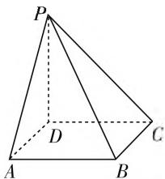
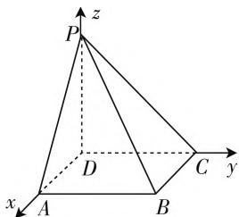

# 高考阅卷支招,启示复习备考

# ● 吉林省白城市第一中学 李铁平

在历年高考结束之后, 都会组织对应的高考阅卷. 高考阅卷老师在评卷之前先进行系统的培训, 明确所评题目对应答案的评分细则, 往往还要进行半天时间的试评, 然后反馈、总结, 寻找问题, 不断改进. 而在正式阅卷中, 阅卷老师都要严格按照相关题目的评分细则阅卷, 只要是评分细则认可的就给分, 坚持“给分有理, 扣分有据”的原则, 同时结合“见点得分”“踩点得分”, 合理寻找得分点, 解答前后、上下不受牵连. 下面结合数学高考阅卷的实际情况, 从高考阅卷的角度来启示与指导高考复习备考.

# 一、落实学生“四基”，注重通性通法

在高考数学试卷中,往往基础题、中档题占80%以上,如果学生得分不高,那么他不是由于难题不会做导致的,更多地是没有充分把握好中等难度的题目.抓基础,抓落实,抓熟练,是高三高考复习备考的基本要求.在复习备考过程中,不要好高骛远,切忌“高起点、高强度、高要求”,因为基础题、中档题通过训练是可以拿足分数的,而压轴题通过训练往往不一定能达到理想的效果.只有熟做基础题,稳做中档题,才能冲击压轴题.

# 二、规范答题训练，提高拿分能力

在高考答题中,经常会出现“会而不对”“对而不全”等现象,这既是数学基础问题,也是答题规范问题.

在高考复习备考过程中,必须注意引导学生“规范”答题:①思路规范——常规题型要很快找到最优解答思路与方法.②运算规范——高考数学历来重视运算能力,虽然近年试题计算量略有降低,但并未削弱对运算能力的要求.运算要熟练、准确、简捷、迅速,代数运算要与逻辑推理相结合,掌握必要的运算技巧,力求一次成功.③表达规范——在以中低档题为主体的高考中,获得正确的思路相对容易,如何准确而规范地表达就显得尤为重要.

数列是高考解答题中的一大基础题目,结合对应的高考题以及对应的步骤要求、规范解答、阅卷细则加以展示.

命题分析:主要考查等差数列、等比数列的基本量和简单的通项及求和问题.

典例 1 （2020·全国卷 I）设 $\{a_{n}\}$ 是公比不为 1 的等比数列， $a_{1}$ 为 $a_{2}, a_{3}$ 的等差中项.

(1) 求 $\{a_{n}\}$ 的公比；  
(2) 若 $a_1 = 1$ , 求数列 $\{na_n\}$ 的前 $n$ 项和.

# 步骤要点：

(1) 根据等比数列中, $a_{1}$ 为 $a_{2}, a_{3}$ 的等差中项列式子求解公比q.  
(2) 利用错位相减法求和即可.

# 规范解答：

(1) 设 $\{a_{n}\}$ 的公比为 $q$ . 因为 $a_{1}$ 为 $a_{2}, a_{3}$ 的等差中项, 所以 $2a_{1} = a_{2} + a_{3}, a_{1} \neq 0$ , 所以 $q^{2} + q - 2 = 0$ , (2分) 因为 $q \neq 1$ , 所以 $q = -2$ . (4分)  
(2) 设 $\{na_{n}\}$ 的前 $n$ 项和为 $S_{n}, a_{1} = 1, a_{n} = (-2)^{n-1}$ , (5分)

$$
\begin{array}{l} \begin{array}{r l} & S _ {n} = 1 \times 1 + 2 \times (- 2) + 3 \times (- 2) ^ {2} + \dots + \\ & n (- 2) ^ {n - 1}, \quad ① \end{array} \\ \begin{array}{r l} & {- 2 S _ {n} = 1 \times (- 2) + 2 \times (- 2) ^ {2} + 3 \times (- 2) ^ {3} + \dots} \\ & {+ (n - 1) (- 2) ^ {n - 1} + n (- 2) ^ {n}. \quad \textcircled {2} (7 \text {分})} \end{array} \\ \end{array}
$$

①-②，得 $3S_{n}=1+(-2)+(-2)^{2}+\cdots+$

$$
\begin{array}{l} {(- 2) ^ {n - 1} - n (- 2) ^ {n} = \frac {1 - (- 2) ^ {n}}{1 - (- 2)} - n (- 2) ^ {n} =} \\ {\frac {1 - (1 + 3 n) (- 2) ^ {n}}{3}, (1 0 \text {分})} \end{array}
$$

所以 $S_{n} = \frac{1 - (1 + 3n)(-2)^{n}}{9}, n \in \mathbf{N}^{*}$ . (12分)

# 阅卷细则：

(1) 列出关于 $q$ 的方程即得 2 分；  
(2) 没有指明 $q \neq 1$ 的扣 1 分；  
(3) 正确写出 $S_{n}$ 即得 1 分；  
(4) 错位相减第一个等号计算正确即得 2 分;  
(5) 最后结果写成通分形式不扣分.

我们不仅要在平时的课堂上常给学生板演示范，更要严格要求学生在日常的作业、练习、考试中做到规范答题(定时练——作业考试化:练规范,练速度,练准确率等).

# 三、引导合理得分，明确关键步骤

高考数学解答题阅卷是“踩得分点”，如果没有过程或跳步严重等，虽然答案对了，但你没“踩到得分点”，仍会被扣分.

所以平时的复习中要引导学生明确题目的得分点,知道哪些步骤可省,哪些不可省,做到步骤清晰整洁、结论醒目突出、过程简明扼要.不会做的题不能空着,也要按步得分、踩点得分、顽强得分.

立体几何解答题是高考解答题的中等难度题目，也是一般学生得分的分水岭. 对应问题的步骤要求、规范解答、阅卷细则如下.

命题分析:主要考查线面平行、垂直的证明以及空间角的计算、最值等.

典例 2 （2020·新高考全国卷 I）如图 1，四棱锥 P-ABCD 的底面为正方形， $PD \perp$ 底面 ABCD。设平面 PAD 与平面 PBC 的交线为 l。

text_image

P
D
A
B
C

图1

(1) 证明: $l \perp$ 平面 $PDC$ ;

(2) 已知 $PD = AD = 1, Q$ 为 $l$ 上的点, 求 $PB$ 与平面 $QCD$ 所成角的正弦值的最大值.

# 步骤要点：

(1) 找垂直: 通过证明垂直关系寻找(或作出)具有公共交点的三条两两互相垂直的直线.  
(2) 写坐标: 建立空间直角坐标系, 写(或设)点的坐标, 求直线的方向向量以及平面的法向量.  
(3) 求关系: 根据已知条件计算夹角或寻找关系.  
(4) 得结论: 根据计算结果得到题目结论.

# 规范解答：

解:(1) 证明: 在正方形 ABCD 中, AD // BC.

因为 $AD \not\subset$ 平面 $PBC, BC \subset$ 平面 $PBC$ , 所以 $AD \parallel$ 平面 $PBC$ .

又因为 $AD \subset$ 平面 $PAD$ , 平面 $PAD \cap$ 平面 $PBC = l$ , 所以 $AD \parallel l$ . (3 分)

因为在四棱锥 P-ABCD 中, 底面 ABCD 是正方形, 所以 $AD \perp DC$ , 所以 $l \perp DC$ , 且 $PD \perp$ 平面ABCD, 所以 $AD \perp PD$ , 所以 $l \perp PD$ .

因为 $CD \cap PD = D$ ，所以 $l \perp$ 平面 PDC.（5 分）

(2) 如图 2, 建立空间直角坐标系 D-xyz.

因为 $PD = AD = 1$ ，则有 $D(0,0,0),C(0,1,0),A(1,$ $0,0),P(0,0,1),B(1,1,0).$ (7分）

text_image

P
z
D
C
y
x
A
B

图2

设 $Q(m,0,1)$ ，则有 $\overrightarrow{DC} = (0,1,0),\overrightarrow{DQ} = (m,0,$ 1)， $\overrightarrow{PB} = (1,1, - 1).$

设平面 QCD 的法向量为 $\boldsymbol{n}=(x,y,z)$ ,

则 $\left\{\begin{aligned}\overrightarrow{DC}\cdot n&=0,\\ \overrightarrow{DQ}\cdot n&=0,\end{aligned}\right.$ 即 $\left\{\begin{aligned}y&=0,\\ mx&+z=0.\end{aligned}\right.$

令 $x = 1$ ，则 $z = -m$ ，所以平面QCD的一个法向量为 $\pmb {n} = (1,0, - m)$ ，(9分）

则 $\cos \langle n, \overrightarrow{PB} \rangle = \frac{n \cdot \overrightarrow{PB}}{|n| |\overrightarrow{PB}|} = \frac{1 + 0 + m}{\sqrt{3} \times \sqrt{m^2 + 1}}.$ (10分)

根据直线的方向向量与平面法向量所成角的余弦值的绝对值即为直线与平面所成角的正弦值,所以直线 PB 与平面 QCD 所成角的正弦值等于

$$
\begin{array}{l} | \cos \langle n, \overrightarrow {P B} \rangle | = \frac {| 1 + m |}{\sqrt {3} \times \sqrt {m ^ {2} + 1}} \\ = \frac {\sqrt {3}}{3} \times \sqrt {\frac {1 + 2 m + m ^ {2}}{m ^ {2} + 1}} = \frac {\sqrt {3}}{3} \times \sqrt {1 + \frac {2 m}{m ^ {2} + 1}} \\ \leqslant \frac {\sqrt {3}}{3} \times \sqrt {1 + \frac {2 | m |}{m ^ {2} + 1}} \leqslant \frac {\sqrt {3}}{3} \times \sqrt {1 + 1} = \frac {\sqrt {6}}{3}, \text {当且} \\ \end{array}
$$

仅当 $m = 1$ 时取等号.

所以直线 $PB$ 与平面 $QCD$ 所成角的正弦值的最大值为 $\frac{\sqrt{6}}{3}$ . (12 分)

# 阅卷细则：

(1) 证明平行、垂直关系条件不严谨扣 1 分；  
(2) 正确建立空间直角坐标系得 1 分;  
(3) 指明直线与平面所成角的正弦值等于 $\left|\cos\langle n, \overrightarrow{PB}\rangle\right|$ ，没有正确求得最值得 1 分；  
(4) 其他方法建立空间直角坐标系计算正确同样给分.

在例1中，列出关于 $q$ 的方程即得2分，正确写出 $S_{n}$ 即得1分，错位相减第一个等号计算正确即得2分.而在以上例2中，正确建立空间直角坐标系得1分等

# 四、加强审题能力，提升心理素质

新高考的一个显著特点就是:应用题增多了(包括数学文化、数学应用等),创新题变活了,阅读量增大了,这对学生的审题能力与阅读理解能力的要求就更高了.

在高考复习备考过程中,合理借助高考阅卷中相应的评分原则与评分细则,有效落实学生数学的“四基”,合理强化规范答题,引导学生合理得分,加强审题能力与阅读理解能力的要求,在此基础上,通过体系化的复习,不断注重通性通法的应用,提高数学得分能力,明确不同题目的关键步骤,提升学生的心理素质,更加科学合理、全面发展地进行复习备考.