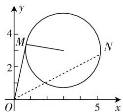

# 一个条件最值问题的思路发现\*

● 内江师范学院数学与信息科学学院 蒋 双  
● 内江师范学院数学与信息科学学院 赵思林

数学解题是数学教学的重要内容. 数学解题教学承担着培养学生分析问题和解决问题能力的重任, 甚至可以说是培养学生“四能”的重要途径. 对于数学解题教学来说, 培养学生分析问题能力的关键是学生学会解题思路如何被发现. 因此, 解题思路的多角度发现是学生学会解题的重要标志.

# 一、问题

已知 $(x - 3)^2 +(y - 3)^2 = 6$ ，求 $\frac{y}{x}$ 的最大值.

此题是一个典型的条件最值问题. 从数学解题思路发现的角度看, 该题具有研究价值. 该题的思路发现, 需要“双基”的灵活运用和数学思想的指引, 可以激发学生的发散思维、形象思维、逻辑思维和创造性思维.

# 二、解题思路的多角度发现

数学解题的思路发现,从宏观层面讲包括“数”、“形”、“数形结合”、“高等数学”等角度.

# (一) 从“数”的角度发现

从“数”的角度发现思路有不少方法，如判别式法，配方法，三角代换法，万能代换法，柯西不等式法等.

# 方法 1: 判别式法

着眼于已知条件是二次方程,可构造关于 x 的一元二次方程,利用判别式建立不等关系.

设 $k=\frac{y}{x}$ ，则 y=kx。将 y=kx 代入方程并整理，
得 $(k^{2}+1)x^{2}-6(k+1)x+12=0.$

因为 $x$ 为实数，所以 $\Delta = 36(k + 1)^2 - 48(k^2 + 1)$ $\geqslant0$ , 即 $k^{2}-6k+1\leqslant0$ . 解得 $3-2\sqrt{2}\leqslant k\leqslant3+2\sqrt{2}$ ,
所以 $k_{最大}=3+2\sqrt{2}$ .

故 $\frac{y}{x}$ 的最大值为 $3+2\sqrt{2}$ .

评注:判别式法初中生能够理解,高中生对判别式法比较熟悉.

# 方法 2: 配方法

着眼于求 $\frac{y}{x}$ 的最大值,可着手先构造出以“ $\frac{y}{x}$ ”为“元”的关系式.

方程两边同除以 $x^{2}$ ，得 $\left(1 - \frac{3}{x}\right)^2 +\left(\frac{y}{x} -\frac{3}{x}\right)^2$ $= \frac{6}{x^2}$ 即 $12\left[\left(\frac{1}{x}\right)^2 -\frac{1}{2}\left(\frac{y}{x} +1\right)\left(\frac{1}{x}\right)\right] + 1 + \left(\frac{y}{x}\right)^2 =$ 0.

配方得 $12\left[\frac{1}{x} - \frac{1}{4}\left(\frac{y}{x} + 1\right)\right]^2 = \frac{3}{4}\left(\frac{y}{x} + 1\right)^2 - \left(\frac{y}{x}\right)^2 - 1 \geqslant 0.$

从而 $\left(\frac{y}{x}\right)^2 - 6\left(\frac{y}{x}\right) + 1 \leqslant 0.$

解得 $3 - 2\sqrt{2} \leqslant \frac{y}{x} \leqslant 3 + 2\sqrt{2}$ .

所以 $\frac{y}{x}$ 的最大值是 $3+2\sqrt{2}$ .

评注:配方法对多数学生来说是一个难点,学生往往不知道何时配方、如何配方、配方的目的是什么.

# 方法 3:三角代换法

令 $\left\{\begin{aligned}x-3&=\sqrt{6}\cos\theta,\\ y-3&=\sqrt{6}\sin\theta\end{aligned}\right.$ (0≤θ<2π),m= $\frac{y}{x}$ ,则m=

$$
\frac {3 + \sqrt {6} \sin \theta}{3 + \sqrt {6} \cos \theta} (0 \leqslant \theta <   2 \pi).
$$

整理得: $\sqrt{6}\sin\theta-\sqrt{6}m\cos\theta=3m-3.$

$$
\sqrt {6 + 6 m ^ {2}} \sin (\theta + \varphi) = 3 m - 3.
$$

$$
\sin (\theta + \varphi) = \frac {3 m - 3}{\sqrt {6 + 6 m ^ {2}}} (0 \leqslant \theta <   2 \pi).
$$

因为 $|\sin (\theta +\varphi)|\leqslant 1$ ，所以 $\frac{|3m - 3|}{\sqrt{6 + 6m^2}}\leqslant 1.$

解得 $3 - 2\sqrt{2} \leqslant m \leqslant 3 + 2\sqrt{2}$ .

所以 $m_{\text{最大}} = 3 + 2\sqrt{2}$ , 即 $\left(\frac{y}{x}\right)_{\text{最大}} = 3 + 2\sqrt{2}$ .

评注:运用三角代换法,实现了“代数”向“三角”的转换.本解答的实质是用到了圆 $(x-a)^{2}+(y-b)^{2}=r^{2}$ 的参数方程 $\left\{\begin{aligned}x=a+r\cos\theta,\\ y=b+r\sin\theta.\end{aligned}\right.$

# （二）从“形”的角度发现

“数”化“形”是数形结合的基本内容, 是解题思路发现的重要途径. 构造几何图形, 经过直观想象, 是激活学生数学形象思维、直觉思维的基本方法.

# 方法 4: 构造斜率

$\frac{y}{x}=\frac{y-0}{x-0}$ 可以看作点 $O(0,0)$ 和 $M(x,y)$ 连线的斜率,如图1.

由题知点 $M$ 在圆 $(x - 3)^2 + (y - 3)^2 = 6$ 上.

点(3,3)到直线 $kx - y = 0$ 的距离 $d = \frac{|3k - 3|}{\sqrt{k^2 + 1}}.$

text_image

y
4
M
2
N
O
x

图1

要使直线斜率最大,则 d=r, 即 $\frac{|3k-3|}{\sqrt{k^{2}+1}}=\sqrt{6}$ .

化简整理, 得 $k^{2}-6k+1=0$ .

解得 $k = 3 \pm 2\sqrt{2}$ , 所以 $k$ 的最大值为 $3 + 2\sqrt{2}$ .

那么 $\frac{y}{x}$ 的最大值为 $3 + 2\sqrt{2}$ .

评注:先把 $\frac{y}{x}=\frac{y-0}{x-0}$ 看成直线的斜率,激活了形象思维;再利用斜率的最大值在直线与圆相切时取得,可激活学生的直觉思维;最后用点到切线的距离公式求得斜率的值,问题简单解决.

# （三）从“高等数学”角度发现

很多初等数学问题, 含有高等数学背景. 用高等数学思考初等数学问题具有居高临下的作用.

# 方法 5: 求导法

本题虽不能直接求导,但可以先用三角代换,然后求导.

由方法3,知 $m = \frac{y}{x} = \frac{3 + \sqrt{6}\sin\theta}{3 + \sqrt{6}\cos\theta} (0\leqslant \theta < 2\pi),$

则 $m^{\prime} = \frac{3\sqrt{6}\sin\theta + 3\sqrt{6}\cos\theta + 6}{(3 + \sqrt{6}\cos\theta)^{2}} = \frac{6\sqrt{3}\cos\left(\theta - \frac{\pi}{4}\right) + 6}{(3 + \sqrt{6}\cos\theta)^{2}}.$

先求 m 的驻点.

令 $m' = 0$ ，解得 $\cos\left(\theta - \frac{\pi}{4}\right) = -\frac{\sqrt{3}}{3}$ .

当 $\theta -\frac{\pi}{4}\in \left(\frac{\pi}{2},\pi\right)$ 时，即 $\tan \left(\theta -\frac{\pi}{4}\right) = -\sqrt{2}$ ，即 $\frac{\tan\theta - 1}{1 + \tan\theta} = -\sqrt{2}$ ，解得 $\tan \theta = 2\sqrt{2} -3 <   0,\theta \in$ $\left(\frac{3}{4}\pi ,\pi\right).$

此时 $\sin \theta = \frac{\sqrt{2} - 1}{\sqrt{6}}, \cos \theta = -\frac{\sqrt{2} + 1}{\sqrt{6}}, m = \frac{3 + \sqrt{6}\sin\theta}{3 + \sqrt{6}\cos\theta} = \frac{2 + \sqrt{2}}{2 - \sqrt{2}} = 3 + 2\sqrt{2}$ .

当 $\theta -\frac{\pi}{4}\in \left(\pi ,\frac{3}{2}\pi\right)$ 时，即 $\tan \left(\theta -\frac{\pi}{4}\right) = \sqrt{2},$ $\frac{\tan\theta - 1}{1 + \tan\theta} = \sqrt{2}$ ，解得 $\tan \theta = -2\sqrt{2} -3 <   0,\theta \in$ $\left(\frac{3}{2}\pi ,\frac{7}{4}\pi\right).$

此时 $\sin \theta = -\frac{\sqrt{2} + 1}{\sqrt{6}},\cos \theta = \frac{\sqrt{2} - 1}{\sqrt{6}},m =$ $\frac{3 + \sqrt{6}\sin\theta}{3 + \sqrt{6}\cos\theta} = \frac{2 - \sqrt{2}}{2 + \sqrt{2}} = 3 - 2\sqrt{2}.$

综上所述, $\frac{y}{x}$ 的最大值为 $3+2\sqrt{2}$ .

评注: 导数法虽是求函数极值(最值)的通性通法, 但其运算量比较大. 降低运算量的方法是掌握一些运算技巧, 如在化简 $\sin\theta=\frac{\sqrt{3-2\sqrt{2}}}{\sqrt{6}}$ 时, 可掌握 $3-2\sqrt{2}=(\sqrt{2}-1)^{2}$ , 计算量自然会减小.

思考问题的角度不同,用到的数学基础知识、数学方法或数学思想也可能不同.因此,面对一个数学问题,从多角度去思考,去发现解题思路,能够让学生在解题过程中巩固基础知识,熟悉基本方法,感悟数学思想,培养创新思维,积累数学解题经验.W