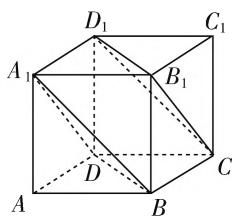
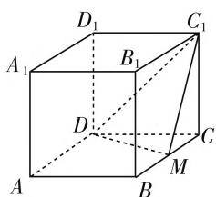
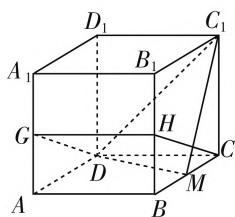
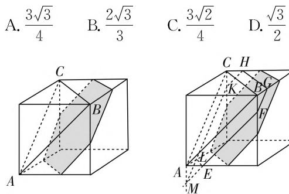
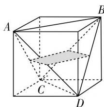
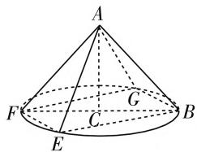
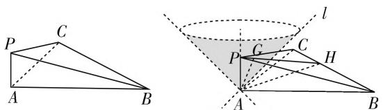

# 一类突破有限空间的立体几何问题

# ● 广东省佛山市顺德区第一中学 魏智

立体几何是培养学生空间想象力、直观想象力的重要章节，也是高考考查数学学科核心素养的重要载体。课本始终围绕构成空间的基本元素——点、线、面构建情境、呈现知识，无限延伸的直线、无厚薄且无边界的平面，呈现给读者的是无限广阔的空间。包括关于点、线、面位置关系及相关定理的介绍都始终贯穿这一理念。然而，在实际对于空间点、线、面及位置关系的考查中，大多没有表现出这一点，而是将空间局限在了一个有限的范围内，比如锥、柱、台、组合体等空间几何体。在某空间几何体中，告诉一些已知，要求考生证明或求解一些问题。

有一类题目没有局限在空间几何体中,比如:

$\alpha, \beta$ 是两个平面， $m, n$ 是两条直线，有下列四个命题：

(1) 如果 $m \perp n, m \perp \alpha, n \parallel \beta$ ，那么 $\alpha \perp \beta$ .  
(2) 如果 $m \perp \alpha, n \parallel \alpha$ , 那么 $m \perp n$ .  
(3) 如果 $\alpha \parallel \beta, m \subset \alpha$ , 那么 $m \parallel \beta$ .  
（4）如果 $m \parallel n, \alpha \parallel \beta$ ，那么 $m$ 与 $\alpha$ 所成的角和 $n$ 与 $\beta$ 所成的角相等.

其中正确的命题有\_\_\_\_。（填写所有正确命题的编号）

这是2016年全国高考卷Ⅱ理科第14题，正确答案是②③④.显然，这类题目存在更多的掣肘及弊端，所以在近年来的高考试题中出现的次数很少.

总结近年来的高考,可以明显看到,试题已经在突破局部空间方面做了一些很好的尝试,比如2016年全国高考卷Ⅰ理科第11题、2017年全国高考卷Ⅲ理科第16题、2018年全国高考卷Ⅰ理科第12题,但从学生解答的情况来看,并不理想.一般地,要解决这类题目,首先要增强识图与作图能力,其次要通过分析与选择将问题转化为具象的、可视的、熟悉的.

# 一、用平面的无限延展性突破空间

例 1 平面 $\alpha$ 过正方体 $ABCD-A_{1}B_{1}C_{1}D_{1}$ 的顶点 $A,\alpha\parallel$ 平面 $CB_{1}D_{1},\alpha\cap$ 平面 ABCD=m, $\alpha\cap$ 平面 $ABB_{1}A_{1}=n$ ，则 m,n 所成角的正弦值为（）.

A. $\frac{\sqrt{3}}{2}$

B. $\frac{\sqrt{2}}{2}$

C. $\frac{\sqrt{3}}{3}$

D. $\frac{1}{3}$

分析:依据面面平行的判定定理,在正方体中可画出与平面 $CB_{1}D_{1}$ 平行,且与平面 ABCD、平面 $ABB_{1}A_{1}$ 都相交的平面.

解:由正方体特点可知,平面 $BDA_{1} \parallel$ 平面 $CB_{1}D_{1}$ ,而平面 $\alpha //$ 平面 $CB_{1}D_{1}$ , 所以平面 $BDA_{1} //$ 平面 $\alpha$ . 又因为平面 $\alpha \cap$ 平面 $ABCD = m$ , 平面 $BDA_{1} \cap$ 平面 $ABCD = BD$ , 所以 $m // BD$ .

text_image

D₁
C₁
A₁
B₁
D
C
A
B

图 1

同理可得 $n \parallel A_{1}B$ .

由等角定理可知，m, n 所成角与 BD, $A_{1}B$ 所成的角相等.

所以直线 m, n 所成角的正弦值为 $\sin\frac{\pi}{3}=\frac{\sqrt{3}}{2}$ .

本题是2016年全国高考卷I理科第11题.这类题目的特点是利用平面的无限延展性将视域从有限的空间几何体突破到无限的广阔虚空中.解答时需要充分理解平面 $\alpha$ 的本质特征，找出其中的具象性与确定性.运用所学的知识进行转化，作出所需要的图形，将问题可视化、具象化，回归具体空间几何体，让问题得到完美的解决.

变式:如图2,在正方体 $ABCD-A_{1}B_{1}C_{1}D_{1}$ 中,点M为棱BC的中点.平面 $\alpha$ 过棱AB且垂直于平面 $DMC_{1}$ ,则 $DC_{1}$ 与平面 $\alpha$ 所成角的正弦是().

A. 1

B. $\frac{\sqrt{6}}{6}$

C. $\frac{\sqrt{3}}{3}$

D. $\frac{\sqrt{10}}{5}$

text_image

D₁
C₁
A₁
B₁
D
C
M
A
B

图2

text_image

D₁
A₁
B₁
C₁
G
H
D
M
A
B

图3

分析:在正方体中,可画出与平面 $DMC_{1}$ 垂直的平面，此平面与平面 $\alpha$ 平行，求出 $DC_{1}$ 与此平面所成角的正弦即可.

解: 取 $BB_{1}, AA_{1}$ 的中点分别记为 H, G, 连接 CH, HG, GD.

则 $CH \perp C_1M$ . 又 $C_1M \perp GH, GH \cap CH = H$ , 所以 $C_1M \perp$ 平面 $CHGD$ . 又 $C_1M \subset$ 平面 $DMC_1$ , 所以平面 $DMC_1 \perp$ 平面 $CHGD$ .

又平面 $\alpha \perp$ 平面 $DMC_{1}$ ，所以平面 $\alpha //$ 平面 $CHGD$ .

所以只需求 $DC_{1}$ 与平面 CHGD 所成角的正弦即可，即求 $\angle DC_{1}M$ 的余弦值.

在 $\triangle DC_{1}M$ 中，由余弦定理可得 $\cos \angle DC_{1}M = \frac{\sqrt{10}}{5}$

所以 $DC_{1}$ 与平面 $\alpha$ 所成角的正弦值是 $\frac{\sqrt{10}}{5}$ .

此题实际上是运用例 1 的原理, 结合正方体中相关线面的关系特点, 建构出一个看不见的平面 $\alpha$ . 解答的关键是要抓住平面 $\alpha$ 的核心特点, 找到其中的确定性, 将看不见的平面实体化, 这样才能清晰地看到要求什么, 进而分析怎么求.

例 2 已知正方体的棱长为 1，每条棱所在直线与平面 $\alpha$ 所成的角相等，则 $\alpha$ 截此正方体所得截面面积的最大值为（）.

  
图4  
图5

分析:由正方体的特点可知,12 条棱分别是三组平行的棱,所以平面 $\alpha$ 只需要与共顶点的 3 条棱所成角相等即可.

可知平面 $\alpha //$ 平面 $ABC$ ，那么为了保证截面面积尽可能大，可平行移动平面 $ABC$ ，平面 $\alpha$ 与正方体的每个面都相交，找出移动过程中面积最大的截面即可.

解:由题可知,平面 $\alpha \parallel$ 平面 ABC,平行移动平面 ABC,记所得截面为平面 EFGHKL.设 AE=t(0<t<1)，则有 $S_{EFGHKL} = \frac{\sqrt{3}}{4} (\sqrt{2} t + \sqrt{2})^2 - 3 \cdot \frac{\sqrt{3}}{4} (\sqrt{2} t)^2 = \frac{\sqrt{3}}{4} (-4t^2 + 4t + 2)$ .

则当 $t = \frac{1}{2}$ 时，截面面积最大，最大值是 $\frac{3\sqrt{3}}{4}$ .

本题是2018年全国高考卷I理科第12题，考试时，学生可凭直观判断出何时截面面积最大.本题所建构的平面 $\alpha$ 虽然看不见，结合正方体的特殊性质，其核心特点比较容易把握.找出看得见的平面ABC以后，何时截面面积最大，是个难点

变式: 正四面体 ABCD 中所有棱长均为 2, 四个面所在平面与平面 $\alpha$ 所成二面角都相等, 则平面 $\alpha$ 截此正四面体所得截面面积的最大值是 \_\_\_\_.

分析: 将正四面体放入正方体中, 正方体的各侧面与正四面体四个面所成二面角均相等, 从而将看不见的平面 $\alpha$ 可视化.

解:如图6,将正四面体放入正方体中,则正方体的上下底面、左右侧面、前后侧面与正四面体四个面所成二面角均相等.不妨以下底面为例来计算截面面积.则平面 $\alpha$ 上下平行移动时,当其与AD的交点为AD的中点时,截面面积最大.此时截面为边长为1的菱形,面积为1.所以平面 $\alpha$ 截正四面体所得截面面积最大值是1.

natural_image

3D geometric diagram of a cube with labeled vertices A, B, C, D and internal diagonals (no text or symbols)

图6

例 2 是在正方体中,建构看不见的平面,考查学生的空间想象力. 此题是在另一特别的几何体——正四面体中建构看不见的平面,继续考查学生对常规的、特殊的空间几何体结构特征的掌握. 只有对正四面体的结构特征及常规处理方法有一定的掌握,才能想到将其与正方体联系起来,从而将看不见的平面可视化,将陌生问题熟悉化.

# 二、以直线的无限延伸性刺破空间

例 3 a, b 为空间中两条互相垂直的直线, 等腰直角三角形 ABC 的直角边 AC 所在直线与 a, b 都垂直, 斜边 AB 以直线 AC 为旋转轴旋转, 有下列结论:

① 当直线 AB 与 a 成 $60^{\circ}$ 角时，AB 与 b 成 $30^{\circ}$ 角；  
② 当直线 AB 与 a 成 $60^{\circ}$ 角时，AB 与 b 成 $60^{\circ}$ 角；  
③ 直线 AB 与 a 所成角的最小值为 $45^{\circ}$ ;  
④ 直线 AB 与 a 所成角的最大值为 $60^{\circ}$ .

其中正确的是\_\_\_\_。（填写所有正确结论的编

号）

分析:容易得到等腰直角三角形 ABC 以直角边 AC 为旋转轴旋转所成的空间几何体为圆锥,母线是 AB,底面圆圆心是点 C,半径是 CB.需要将空间直线 a,b 实体化,才能研究直线所成角问题.分析 a,b 的核心特点:相互垂直,且都与 AC 垂直.因此,a,b 相互垂直且所确定的平面与 AC 垂直.由此,可想办法在圆锥的底面上将直线 a,b 可视化,然后求解相关的角度.

解:由题可知,等腰直角三角形 ABC 以直角边 AC 为旋转轴旋转所成的空间几何体为圆锥,母线是 AB,底面圆圆心是点 C,半径是 CB,而且可认为直线 a,b 在圆锥的底面上.所以,在底面内过点 B 作$BE \parallel a$ , 交底面圆 C 于点 E, 如图 7 所示, 连接 EF, 则 $EF \parallel b$ .

text_image

A
F
C
G
B
E

图 7

不妨设 $AC = BC = 1$ ，则 $AB = \sqrt{2}$

当 AB 与 a 所成角为 $60^{\circ}$ 时， $\angle ABE = 60^{\circ}$ ，则 $BE = \sqrt{2}$ ， $EF = \sqrt{2}$ ，作 $FG \parallel EB$ 交圆 C 于点 G。则 $BG = EF = \sqrt{2}$ ，所以 $\triangle ABG$ 为等边三角形。因此，AB 与 BG，即与直线 b 所成角为 $60^{\circ}$ 。另外由图可知，AB 与 a 所成最小角是 $45^{\circ}$ ，最大角是 $90^{\circ}$ 。因此正确答案是②③。

此题是2017年高考全国卷Ⅲ理科第16题，题目以无限延伸的直线将空间推向无限.解决此问题的关键在于抓住直线 $a, b$ 核心特点，即相互垂直，且都与 $AC$ 垂直.想办法将看不见的直线实体化，将问题转化到圆锥中来.

变式: 如图 8, 三棱锥 P-ABC 中, $PA \perp$ 平面 ABC, $AB \perp AC$ , 二面角 P-BC-A 的大小是 $30^{\circ}$ , 空间有一条直线 l 与平面 ABC 所成角为 $45^{\circ}$ , 则直线 l 与平面 PBC 所成角的取值范围是 \_\_\_\_.

text_image

Geometric diagram showing two 3D shapes with labeled points and lines, including a cone and a quadrilateral.

图8

分析:根据做题常规,可先找到二面角 P-BC-A 的平面角,这里利用线面垂直的原理即可.难点是直线 l 的理解,及其与平面 PBC 所成角的理解.由于 $PA \perp$ 平面 ABC,直线 l 与平面 ABC 所成角为 $45^{\circ}$ ,所以直线 l 与直线 PA 所成角为 $45^{\circ}$ .

可将直线 l 看成绕点 A 旋转的一簇直线. 要分析直线 l 与平面 PBC 所成角, 则需要找到平面 PBC 的垂线, 通过研究直线 l 与平面 PBC 的垂线所成的角, 求出 l 与平面 PBC 所成线面角的范围.

解:如图 9,由题可知直线 l 与直线 PA 所成角为 $45^{\circ}$ ,可将直线 l 看成绕点 A 旋转的一簇直线.

过点 A 作 $AH \perp BC$ 于点 H，则有 $BC \perp PH$ ，所以 $\angle PHA = 30^{\circ}$ .

过点 A 作 $AG \perp PH$ 于点 G，则 AG 为平面 PBC 的垂线，且 $\angle PAG = 30^{\circ}$ .

所以直线 l 与直线 AG 所成角的范围是 $\left[\frac{\pi}{4}-\frac{\pi}{6}, \frac{\pi}{4}+\frac{\pi}{6}\right]$ ，即 $\left[\frac{\pi}{12}, \frac{5\pi}{12}\right]$ .

所以直线 $l$ 与平面 $PBC$ 所成角的范围是 $\left[\frac{\pi}{12}, \frac{5\pi}{12}\right]$ .

此题进行了多方面的转化. 首先需要将二面角 $P - BC - A$ 的平面角呈现出来, 才能运用 $30^{\circ}$ 角; 其次为了将看不见的直线 $l$ 实体化, 需要将线面角转化为线线角, 从而可将直线 $l$ 看成绕着点 $A$ 旋转的一簇直线; 再次, 将直线 $l$ 与平面 $PBC$ 所成的角, 转化为研究直线 $l$ 与 $AG$ 所成角; 三个方面的转化, 难度较大. 这里介绍的重点是如何将看不见的直线 $l$ 实体化、可视化.

总之，近年来的高考的确在做一些新的尝试，这些新的变化带给我们不一样的解题体验，也为我们的教育教学提供了新鲜素材。运用直线的无限延伸性、平面的无限延展性打破固有几何体的空间局限，将眼光放得更远更广，这是高考的一个新动向，更加能考查空间想象力与直观想象力，更加能考查学生对于空间点、线、面位置关系的理解与掌握。解决这类题目的关键是理解看不见的平面或直线的核心特点，运用既有知识将其转化为实体的、可以看得见的线面关系，从而将无限空间有限化，将抽象空间实体化，最终解决问题。

# 参考文献：

[1] 伊波. 2018 年新课标卷 I 理科数学第 12 题的保守与创新 [J]. 数学通讯, 2018(6).  
[2] 叶挺. 动态几何, 以静制动, 克难致胜——例说立体几何“动态”题型解题策略 [J]. 中学教研 (数学), 2018(12).