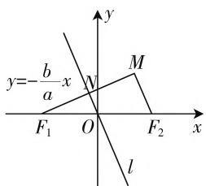
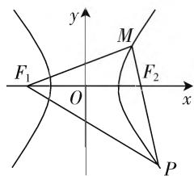

# 两根“拐杖”好走路,坐标几何逞身手

—— 一道双曲线题的探究

● 甘肃省高台县第一中学 王林

圆锥曲线中椭圆或双曲线的离心率问题，一直是学习中的一个热点问题，也是历年高考中比较常见的一类基本题型，常考常新，变化较大。此类问题往往背景新颖，通过多知识板块融合来巧妙设置，根据题设条件可灵活利用圆锥曲线的定义与几何性质、平面几何知识或利用直线、平面向量等相关性质加以分析与处理，思维拓展，方法多样，是创新与素养培养的好场所。

# 一、问题呈现

【问题】(2020届安徽省皖江名校联盟高三第五次联考理科数学·12)已知双曲线 $C:\frac{x^{2}}{a^{2}}-\frac{y^{2}}{b^{2}}=1(a>0,b>0)$ 的左、右焦点分别为 $F_{1}$ 、 $F_{2}$ ，其右支上存在一点M，使得 $\overrightarrow{MF_{1}}\cdot\overrightarrow{MF_{2}}=0$ ，直线 $MF_{2}$ 平行于双曲线C的其中一条渐近线，则双曲线C的离心率为()。

A. $\sqrt{2}$

B. $\sqrt{3}$

C. 2

D. $\sqrt{5}$

此题以双曲线为载体，结合平面向量的数量积的关系式以及两直线的位置关系来巧妙设置，进而求解双曲线的离心率问题。问题较为常规，条件有所创新，巧妙把圆锥曲线、直线、平面几何以及平面向量等相关知识加以合理交汇融合，综合考查相关的数学知识以及数学能力，是高考中比较常见的一类基本题型，要引起重视。

# 二、问题破解

方法 1: (坐标法)

解析:由于 $\overrightarrow{MF_{1}}\cdot\overrightarrow{MF_{2}}=0$ ，则知 $MF_{1}\perp MF_{2}$ ，不失一般性，不妨设与直线 $MF_{2}$ 平行的双曲线C的一条渐近线l的方程为： $y=-\frac{b}{a}x$ ，则有 $MF_{1}\perp l$ ，即直线l为线段

text_image

y=-\frac{b}{a}x
y
M
F₁ O F₂ x
l

图1

$MF_{1}$ 的中垂线，则知直线 $MF_{1}$ 的方程为 $y=\frac{a}{b}(x+c)$ ，设 $MF_{1}$ 与直线 l 的交点为 N，如图 1 所示，联立 $\left\{\begin{aligned}y&=-\frac{b}{a}x,\\ y&=\frac{a}{b}(x+c),\end{aligned}\right.$ 解得 $\left\{\begin{aligned}x&=-\frac{a^{2}}{c},\\ y&=\frac{ab}{c},\end{aligned}\right.$ 即 $N\left(-\frac{a^{2}}{c},\frac{ab}{c}\right)$ ，又 $F_{1}(-c,0)$ ，结合中点坐标公式可得 $M\left(c-\frac{2a^{2}}{c},\frac{2ab}{c}\right)$ ，而点 M 在双曲线 C 的右支上，则有 $\frac{\left(c-\frac{2a^{2}}{c}\right)^{2}}{a^{2}}-\frac{\left(\frac{2ab}{c}\right)^{2}}{b^{2}}=1$ ，化简可得 $c^{2}=5a^{2}$ ，所以双曲线 C 的离心率 $e=\frac{c}{a}=\sqrt{5}$ ，故选择答案 D.

点评:根据坐标法加以代数运算是破解此类问题最常见的方法.利用坐标法处理圆锥曲线中的相关问题时,只要直译题意,充分体现坐标法的特点,思路简单流畅,缺点就是相应的运算量要大一点.

方法 2: (几何法)

解析:由于 $\overrightarrow{MF_{1}}\cdot\overrightarrow{MF_{2}}=0$ ，则知 $MF_{1}\perp MF_{2}$ ，不失一般性，不妨设与直线 $MF_{2}$ 平行的双曲线 C 的一条渐近线 l 的方程为： $y=-\frac{b}{a}x$ ，结合题目条件，可得 $\tan\angle MF_{2}F_{1}=\frac{b}{a}$ ，根据同角三角函数基本关系式，可得 $\sin\angle MF_{2}F_{1}=\frac{b}{\sqrt{a^{2}+b^{2}}}=\frac{b}{c},\cos\angle MF_{2}F_{1}=\frac{a}{\sqrt{a^{2}+b^{2}}}=\frac{a}{c}$ ，在 $Rt\triangle F_{1}MF_{2}$ 中， $|F_{1}F_{2}|=2c$ ，则有 $|MF_{1}|=2c\sin\angle MF_{2}F_{1}=2c\times\frac{b}{c}=2b,|MF_{2}|=2c\cos\angle MF_{2}F_{1}=2c\times\frac{a}{c}=2a$ ，而根据双曲线的定义，

可得 $\left|MF_{1}\right|-\left|MF_{2}\right|=2b-2a=2a$ ，即b=2a，所以双曲线C的离心率 $e=\frac{c}{a}=\sqrt{1+\frac{b^{2}}{a^{2}}}=\sqrt{5}$ ，故选择答案D.

点评:根据几何法结合解三角形处理是破解此类问题的另一种常见的技巧.利用几何法处理圆锥曲线中的相关问题时,要充分理解掌握题目的条件以及所隐含的信息,抓住几何元素之间的关系建立关系式,体现几何法直观形象的特点,要具备较强的数形结合思想和逻辑推理能力.

# 方法 3:(坐标法与几何法的融合交汇)

解析:由于 $\overrightarrow{MF_{1}}\cdot\overrightarrow{MF_{2}}=0$ ，则知 $MF_{1}\perp MF_{2}$ ，不失一般性，不妨设与直线 $MF_{2}$ 平行的双曲线 C 的一条渐近线 l 的方程为： $y=-\frac{b}{a}x$ ，则有 $MF_{1}\perp l$ ，即直线 l 为线段 $MF_{1}$ 的中垂线，设 $MF_{1}$ 与直线 l 的交点为 N，如图所示，那么 $F_{1}(-c,0)$ 到渐近线 l 的距离为 $\left|NF_{1}\right|=\frac{bc}{\sqrt{a^{2}+b^{2}}}=b$ ，可得 $\left|MN\right|=\left|NF_{1}\right|=b$ ，而 $\left|ON\right|=\sqrt{\left|OF_{1}\right|^{2}-\left|NF_{1}\right|^{2}}=\sqrt{c^{2}-b^{2}}=a$ ，可得 $\left|MF_{2}\right|=2\left|ON\right|=2a$ ，而根据双曲线的定义，可得 $\left|MF_{1}\right|-\left|MF_{2}\right|=2b-2a=2a$ ，即 b=2a，所以双曲线 C 的离心率 $e=\frac{c}{a}=\sqrt{1+\frac{b^{2}}{a^{2}}}=\sqrt{5}$ ，故选择答案 D.

点评:融合交汇坐标法与几何法来破解此类问题是两种方法的优点的整合,是比较合适的一种技巧方法.利用坐标法确定相应的直线方程、点的坐标、距离等,利用几何法确定点、线、角等元素之间的关系,综合起来处理问题,既体现坐标法的直译引入思路,又凸现几何法的直观形象,强强联手,巧妙破解.

# 三、变式拓展

探究 1: 保留原来题目的部分条件, 改变条件中的 “直线 $MF_{2}$ 平行于双曲线 C 的其中一条渐近线” 为 “延长 $MF_{2}$ 交双曲线 C 于点 P, 若 $\left|MF_{1}\right|=\left|PF_{2}\right|$ ”, 得到以下变式.

【变式1】已知双曲线 $C: \frac{x^2}{a^2} - \frac{y^2}{b^2} = 1 (a > 0, b > 0)$ 的左、右焦点分别为 $F_1, F_2$ ，其右支上存在一点 $M$ ，使得 $\overrightarrow{MF_1} \cdot \overrightarrow{MF_2} = 0$ ，延长 $MF_2$ 交双曲线 $C$ 于点 $P$ ，若 $|MF_1| = |PF_2|$ ，则双曲线 $C$ 的离心率为（ ）.

A. $\frac{\sqrt{10}}{2}$

B. $\sqrt{3}$

C. 2

D. $\sqrt{5}$

解析: 设 $\left|MF_{1}\right|=\left|PF_{2}\right|=t$ ，如图2所示，而根据双曲线的定义，可得 $\left|MF_{1}\right|-\left|MF_{2}\right|=t-\left|MF_{2}\right|=2a$ ，即 $\left|MF_{2}\right|=t-2a,\quad\left|PF_{1}\right|-\left|PF_{2}\right|=\left|PF_{1}\right|-t=2a$ ，即 $\left|PF_{1}\right|=t+2a$ ，由于 $\overrightarrow{MF_{1}}\cdot\overrightarrow{MF_{2}}=0$ ，则知 $MF_{1} \perp MF_{2}$ ，结合勾股定理，可得 $|MF_{1}|^{2} + |MP|^{2} = |PF_{1}|^{2}$ ，即 $t^{2} + (2t - 2a)^{2} = (t + 2a)^{2}$ ，解得 $t = 3a$ ，在 Rt $\triangle F_{1}MF_{2}$ 中， $|F_{1}F_{2}| = 2c$ ，可得 $|MF_{1}|^{2} + |MF_{2}|^{2} = |F_{1}F_{2}|^{2}$ ，即 $9a^{2} + a^{2} = 4c^{2}$ ，即 $5a^{2} = 2c^{2}$ ，所以双曲线 $C$ 的离心率 $e = \frac{c}{a} = \frac{\sqrt{10}}{2}$ ，故选择答案 A.

text_image

y
M
F₁ O F₂ x
P

图2

探究 2: 保留原来题目的部分条件, 改变条件中的 “直线 $MF_{2}$ 平行于双曲线 C 的其中一条渐近线” 为 “连接 $MF_{1}$ 与 y 轴交于点 P, 若 $\left|OF_{1}\right|=2\left|OP\right|$ ”, 从另一个角度得到以下变式.

【变式2】已知双曲线 $C: \frac{x^2}{a^2} - \frac{y^2}{b^2} = 1 (a > 0, b > 0)$ 的左、右焦点分别为 $F_1, F_2$ ，其右支上存在一点 $M$ ，使得 $\overrightarrow{MF_1} \cdot \overrightarrow{MF_2} = 0$ ，连接 $MF_1$ 与 $y$ 轴交于点 $P$ ，若 $|OF_1| = 2|OP|$ ，则双曲线 $C$ 的离心率为（ ）.

A. $\sqrt{2}$

B. $\sqrt{3}$

C. 2

D. $\sqrt{5}$

解析:由于 $\overrightarrow{MF_{1}}\cdot\overrightarrow{MF_{2}}=0$ ，则知 $MF_{1}\perp MF_{2}$ ，易得 $Rt\triangle F_{1}OP\sim Rt\triangle F_{1}MF_{2}$ ，则有 $\frac{|OF_{1}|}{|OP|}=\frac{|MF_{1}|}{|MF_{2}|}=2$ ，可得 $|MF_{1}|=2|MF_{2}|$ ，而根据双曲线的定义，可得 $|MF_{1}|-|MF_{2}|=|MF_{2}|=2a$ ，即 $|MF_{1}|=4a$ ，在 $Rt\triangle F_{1}MF_{2}$ 中， $|F_{1}F_{2}|=2c$ ，可得 $|MF_{1}|^{2}+|MF_{2}|^{2}=|F_{1}F_{2}|^{2}$ ，即 $16a^{2}+4a^{2}=4c^{2}$ ，即 $5a^{2}=c^{2}$ ，所以双曲线 C 的离心率 $e=\frac{c}{a}=\sqrt{5}$ ，故选择答案 D.

# 四、解后反思

其实,在破解圆锥曲线问题时,特别是选择题与填空题,经常持两根“拐杖”——坐标法和几何法来“走路”,借助其中的一种方法或是两种方法的交汇融合,可以使得问题破解起来更为简单快捷;而处理解答题时则重点考虑利用坐标法来处理,经常也借助几何法的直观形象来辅助解决,优化过程,简化运算. F