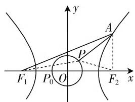

# 优化解析几何运算,提升数学运算素养

● 山东大学附属中学 庄増臣

数学运算是高中数学学科核心素养之一,解析几何问题常常需要比较复杂的数学运算,运算量的大小与选择的解题方法有关,如果能认真审题,寻找题目的条件与结论之间的有机联系,选择更为合适的解题方法,往往可以优化运算过程,提高解题效率,提升数学运算素养.

# 一、回归定义，彰显本质

深刻挖掘题目条件,彰显问题本质,回归定义,结合解析几何中的相关定义来解题,达到巧思妙解,快速破解.

例 1 （2019 年高考数学全国 I 卷理科第 19 题 (1)）已知抛物线 C: $y^{2}=3x$ 的焦点为 F，斜率为 $\frac{3}{2}$ 的直线 l 与 C 的交点为 A, B，与 x 轴的交点为 P。若 $|AF|+|BF|=4$ ，求 l 的方程。

分析:设出直线 l 的方程,结合抛物线的定义与条件加以转化,并联系直线与抛物线方程,从而得以建立相应的关系式,解得相应的参数值,直线方程得以求解.

解析: 设直线 $l: y = \frac{3}{2}x + t, A(x_{1}, y_{1}), B(x_{2}, y_{2})$ .

由题设得 $F\left(\frac{3}{4},0\right)$ ，故结合抛物线的定义可得 $|AF| + |BF| = x_1 + x_2 + \frac{3}{2}$ .由题设可得 $x_{1} + x_{2} =$ $\frac{5}{2}$ ，由 $\left\{y = \frac{3}{2} x + t,\right.$ 可得 $9x^{2} + 12(t - 1)x + 4t^{2} = 0,$ $y^{2} = 3x$ 则 $x_{1} + x_{2} = -\frac{12(t - 1)}{9}$ ，从而 $-\frac{12(t - 1)}{9} = \frac{5}{2}$ 解得 $t = -\frac{7}{8}$ 所以直线 $l$ 的方程为 $y = \frac{3}{2} x - \frac{7}{8}$

点评:与抛物线的焦点弦有关的弦长问题,经常考虑应用抛物线的定义来转化与求解.抓住本质,用定义法处理圆锥曲线问题,是破解圆锥曲线问题中最为常见的思维方式之一.

# 二、设而不求，整体推进

在破解直线与圆锥曲线的相关问题中,通过设出交点坐标,应用“点差法”或借助韦达定理来进行整体处理,设而不求,避免方程组的复杂求解,简化运算,巧妙处理.

例 2 （2020 届湖南省长沙市高三二模试题）已知点 M 到点 $F(3,0)$ 的距离比它到直线 $l: x + 5 = 0$ 的距离小 2.

(1) 求点 M 的轨迹 E 的方程；  
(2) 过点 $P(m,0)(m>0)$ 作互相垂直的两条直线 $l_{1}, l_{2}$ ，它们与(1)中轨迹 E 分别交于点 A, B 及点 C, D，且 G, H 分别是线段 AB, CD 的中点，求 $\triangle PGH$ 面积的最小值.

分析: 在破解三角形面积时, 通过解析几何中的中点弦问题的交汇与综合, 引入点的坐标, 利用“点差法”, 设而不求, 运算量得以有效简化.

解析:(1)由题意知,点M到点 $F(3,0)$ 的距离与到直线 $l^{\prime}:x+3=0$ 的距离相等,结合抛物线的定义,可知轨迹E是以 $F(3,0)$ 为焦点,以直线 $l^{\prime}:x+3=0$ 为准线的抛物线,则知 $\frac{p}{2}=3$ ,解得p=6,故M的轨迹E的方程为 $y^{2}=12x$ ;

(2) 设 $A(x_{1}, y_{1}), B(x_{2}, y_{2})$ ，则有 $y_{1}^{2} = 12x_{1}, y_{2}^{2} = 12x_{2}$ ，以上两式作差，并整理可得 $\frac{y_{1} - y_{2}}{x_{1} - x_{2}} = \frac{12}{y_{1} + y_{2}} = \frac{6}{y_{G}}$ ，即 $k_{AB} = \frac{6}{y_{G}}$ ，同理可得 $k_{CD} = \frac{6}{y_{II}}$ ，易知直线 $l_{1}, l_{2}$ 的斜率存在且均不为0，又由于 $l_{1} \perp l_{2}$ ，可得 $k_{AB} \cdot k_{CD} = \frac{36}{y_{G}y_{II}} = -1$ ，即 $y_{G}y_{II} = -36$ ，所以 $S_{\triangle PGII} = \frac{1}{2}|PG|$ .

$$
\begin{array}{l} \mid P H \mid = \frac {1}{2} \cdot \sqrt {1 + \frac {1}{k _ {\Lambda B} ^ {2}}} \mid y _ {G} \mid \cdot \sqrt {1 + \frac {1}{k _ {C D} ^ {2}}} \mid y _ {I I} \mid = \\ 1 8 \sqrt {2 + \frac {1}{k _ {\Lambda B} ^ {2}} + \frac {1}{k _ {C D} ^ {2}}} \geqslant 1 8 \sqrt {2 + \frac {2}{\left| k _ {\Lambda B} k _ {C D} \right|}} = \end{array}
$$

$18\sqrt{2+2}=36$ ，当且仅当 $|k_{AB}|=|k_{CD}|=1$ 时，等号成立，故 $\triangle PGH$ 面积的最小值为36.

点评:在处理解析几何问题时,通过设出点的坐标,利用中点弦的“点差法”进行处理,设而不求,更加简单快捷,利用斜率把 $\triangle PGH$ 的面积表示出来,进而再通过合理化归与巧妙转化,利用基本不等式即可得到 $\triangle PGH$ 面积的最小值.

# 三、动中求静,数形结合

涉及解析几何的动点、动直线等相关“动态”问题，结合运动变化事物的本质，抓住其中不变的因素，作为问题的突破口，动中求解，数形结合，相得益彰。

例 3 （原创题）设双曲线 $C: \frac{x^{2}}{a^{2}} - \frac{y^{2}}{b^{2}} = 1 (a > 0, b > 0)$ 的左、右焦点分别为 $F_{1}, F_{2}$ ，其焦距为 2c，O 为坐标原点，点 P 满足 $|OP| = \frac{1}{2} a$ ，点 A 是双曲线 C 的右支上的动点，且 $|AF_{1}| - |PA| \geqslant \frac{1}{6} |F_{1}F_{2}|$ 恒成立，则双曲线 C 离心率的取值范围是 \_\_\_\_.

分析:通过图形直观,综合轨迹方程、不等式恒成立以及双曲线的定义加以转化,借助三角形的基本性质加以数形结合,从而得以分析与求解,简化运算,提升效益.

解析: 如图 1 所示, 连接 $AF_{2}, PF_{2}$ , 设 $P_{0}\left(-\frac{1}{2}a,0\right)$ ,
由于点 P 满足 $\left|OP\right|=\frac{1}{2}a$ ,
可得点 P 的轨迹是以坐标原点 O 为圆心、以 $\frac{1}{2}a$ 为半径的圆，由于 $\left|AF_{1}\right|-\left|PA\right|\geqslant\left|F_{1}F_{2}\right|$ 恒成立，可得 $\left(\left|AF_{1}\right|-\left|PA\right|\right)_{\min}\geqslant\frac{1}{6}\left|F_{1}F_{2}\right|=\frac{1}{3}c$ ，根据双曲线的定义可知 $\left|AF_{1}\right|-\left|AF_{2}\right|=2a$ ，结合三角形的基本性质，可得 $\left|AF_{1}\right|-\left|PA\right|=2a+\left|AF_{2}\right|-\left|PA\right|=2a-(\left|PA\right|-\left|AF_{2}\right|\geqslant2a-\left|PF_{2}\right|$ ，当且仅当P、A、 $F_{2}$ 三点共线时等号成立，又 $\left|PF_{2}\right|\leqslant\left|P_{0}F_{2}\right|=c+\frac{1}{2}a$ ，所以 $\left(\left|AF_{1}\right|-\left|PA\right|\right)_{\min}=2a-\left(c+\frac{1}{2}a\right)=\frac{3}{2}a-c$ ，当且仅当P与 $P_{0}$ 重合且A位于双曲线C的右顶点时等号成立，则有 $\frac{3}{2}a-c\geqslant\frac{1}{3}c$ ，即 $e=\frac{c}{a}\leqslant\frac{9}{8}$ ，又由双曲线离心率的性质知e>1，所以 $1<e\leqslant\frac{9}{8}$ ，故填答案： $\left(1,\frac{9}{8}\right]$ .

text_image

y
A
P
F₁ P₀ O F₂ x
x

图1

点评: 涉及双动点问题, 充分利用题目条件中的不等式恒成立转化为相应的最值问题, 再结合双曲线的定义、三角形的基本性质, 分别通过双动点的变化规律加以确定相应的最值, 数形结合, 从而建立对应的不等式来分析与求解.

# 四、换元引参，迂回向前

结合破解问题的需要,根据题目条件引入适当的参数或相应的参数方程,巧妙转化相应的解析几何问题,迂回向前,避开复杂的运算,简化过程,直达目的.

例 4 （安徽省十校联盟 2020 届高三线上自主联合检测数学理科试卷·11）已知抛物线 $C: y^{2} = 2px (p > 0)$ 过点 $(1, -2)$ ，经过焦点 F 的直线 l 与抛物线 C 交于 A、B 两点，A 在 x 轴的上方， $Q(-1, 0)$ ，若以 QF 为直径的圆经过点 B，则 $|AF| - |BF| = (\quad)$ .

A. $2\sqrt{3}$

B. $2\sqrt{5}$

C. 2

D. 4

分析: 引入直线 l 的倾斜角 $\alpha$ 这一相关的参数, 结合焦半径公式并综合圆的相关性质来展开, 通过三角恒等变换来求解对应的焦半径的差的值问题.

解析:由于抛物线 $C: y^{2} = 2px (p > 0)$ 过点 $(1, -2)$ ，则有 4 = 2p，解得 p = 2，设直线 l 的倾斜角为 $\alpha \in \left(0, \frac{\pi}{2}\right)$ ，根据焦半径公式，可得 $|AF| = \frac{2}{1 - \cos\alpha}$ ， $|BF| = \frac{2}{1 + \cos\alpha}$ ，由于以 QF 为直径的圆经过点 B，则有 $BQ \perp BF$ ，在 Rt△QBF 中， $|BF| = 2\cos\alpha$ ，则有 $|BF| = \frac{2}{1 + \cos\alpha} = 2\cos\alpha$ ，即 $1 - \cos^{2}\alpha = \cos\alpha$ ，所以 $|AF| - |BF| = \frac{2}{1 - \cos\alpha} - \frac{2}{1 + \cos\alpha} = \frac{4\cos\alpha}{1 - \cos^{2}\alpha} = \frac{4\cos\alpha}{\cos\alpha} = 4$ ，故选择答案 D.

点评:根据题目条件,通过焦半径法设出直线 l 的倾斜角,引入对应的参数,为进一步确定对应的焦半径的三角关系式,结合直角三角形的边角关系的转化与应用提供条件.合理换元或引参,迂回处理,从而不断靠近结论,有效破解,简化运算.

除了以上几种常见的策略,优化解析几何运算的策略与方法还有很多,不同类型的问题往往有不同的策略与技巧方法.在具体破解问题时,不能只停留在常规思维的计算上,关键是认真审题,分析问题的本质,寻找题目条件与结论之间的有机联系,从而更好地、更简洁地选取相应的策略与技巧方法,以简驭繁,提升数学运算素养.F