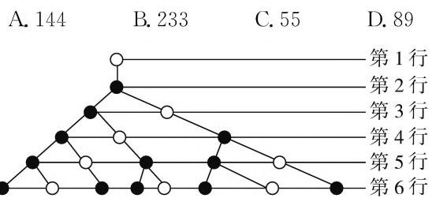
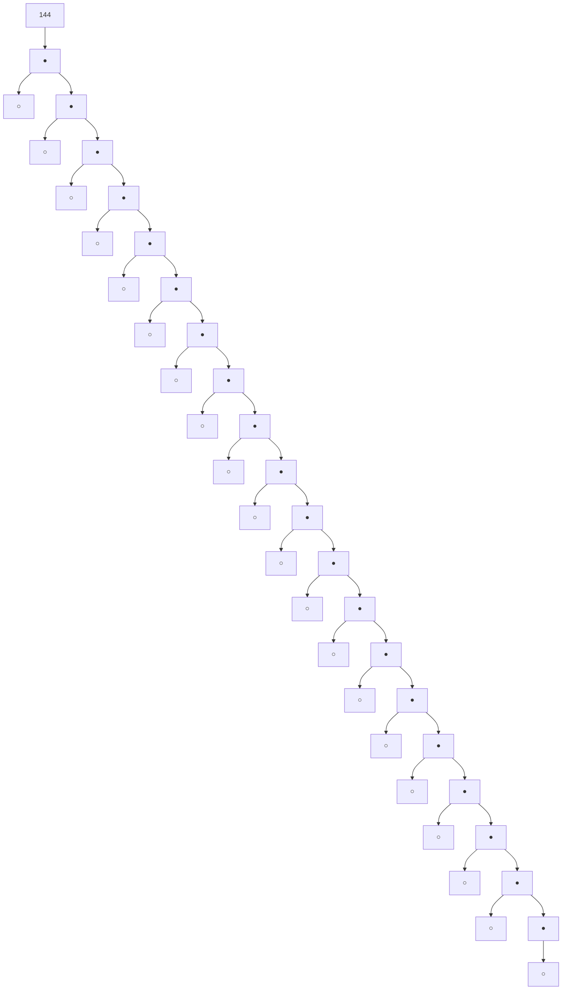
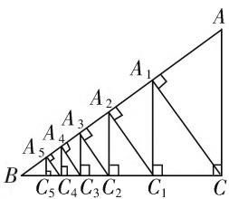
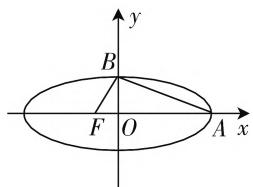

# 关注“推理”与其他知识的交汇

# ● 甘肃省张掖市第四中学 管昊玺

推理是新课标教材新增加的内容,也是近年高考中的高频考点,将推理与其他知识巧妙地融合在一起,既体现了试题设计的亮点,又体现了对所学知识的交汇考查.请结合以下归类解析认真领会,以便逐步提高对所学数学知识、方法的综合运用能力.

# 类型一、考查归纳推理与树形图的交汇

例 1 20 世纪 70 年代, 美籍法国数学家 Benoit B. Mandelbrot 创立了一门新学科——分形几何学, 该学科的创立为解决传统科学众多领域的难题提供了全新的思路. 如果下面的树形图是根据○—● ●○ 的分形规律生长成的, 那么第 12 行的实心圆点的个数是 ( ).

flowchart

图1

解析:根据分形规律知树形图的各行的实心圆点的个数组成一个特殊的数列,其中 $a_{1}=0, a_{2}=1, a_{n+2}=a_{n+1}+a_{n}$ , 即为著名的斐波那契数列, 利用以上数列的规律归纳可知:该数列各项依次分别为 0, 1, 1, 2, 3, 5, 8, 13, 21, 34, 55, 89, 233, …, 所以第 12 项为 89. 故选 D.

评注:本题求解关键是根据图形规律,运用数列观点从中提炼出数列递推式.解法提炼:一般地,与图形有关的归纳推理问题,往往需要充分借助图形的直观明了性以及相关数学知识,具体探究隐藏在其中的规律、特点,以便顺利解决目标问题.

# 类型二、考查归纳推理与平面几何的交汇

例 2 如图 2, 在 Rt△ABC 中, AC = 5, BC = 12, AC ⊥ BC, 过 C 作 CA₁ 垂直 AB, 垂足为 A₁; 再过 A₁作 $A_{1}C_{1}$ 垂直BC，垂足为 $C_{1}$ ；再过 $C_{1}$ 作 $C_{1}A_{2}$ 垂直AB，垂足为 $A_{2}$ ，再过 $A_{2}$ 作 $A_{2}C_{2}$ 垂直BC，垂足为 $C_{2}$ ；…….这样一直作下去，得到了一组线段 $CA_{1},A_{1}C_{1},C_{1}A_{2},\cdots\cdots$ ，则第2n条线段的长 $A_{n}C_{n}=$ 解析: 由勾股定理得 AB = 13, 根据 $\triangle ABC \sim \triangle ACA_{1}$ 得 $\frac{AB}{AC} = \frac{BC}{CA_{1}}$ , 所以 $CA_{1} = 5 \times \frac{12}{13}$ .

text_image

A
A₁
A₂
A₃
A₄
A₅
B
C₅ C₄ C₃ C₂ C₁ C

图2

同理可得 $A_{1}C_{1}=5\times\left(\frac{12}{13}\right)^{2}, C_{1}A_{2}=5\times\left(\frac{12}{13}\right)^{3}$ ， $A_{2}C_{2}=5\times\left(\frac{12}{13}\right)^{4}, \cdots$ . 故依此类推，可知 $A_{n}C_{n}=5\times\left(\frac{12}{13}\right)^{2n}$ .

评注:本题求解切入点是利用三角形相似罗列简单情形(即给出线段 $CA_{1},A_{1}C_{1},C_{1}A_{2},\cdots$ 的长).解法提炼:一般地,处理与平面图形有关的归纳推理问题时,往往需要灵活运用平面几何知识进行适当的分析、计算,以便观察规律,归纳得到一般结论.

# 类型三、考查归纳推理与函数零点的交汇

例 3 已知函数 $f(x)=x^{2}-4x+4$ , $f_{1}(x)=f(x)$ ，且当 $n\geqslant2$ 时有 $f_{n}(x)=f(f_{n-1}(x))$ ，记 $a_{n}$ 为函数 $y=f_{n}(x)$ 的零点个数.

(1) 计算数列 $\{a_{n}\}$ 前 4 项的值，并归纳给该数列的通项公式；(不需证明)  
(2) 设 $b_n = \log_2 a_n \cdot \log_2 a_{n+1} \cdot \log_2 a_{n+2}$ ，若数列 $\{b_n\}$ 的前 $n$ 项和 $T_n = \frac{n(n^2 - 1)(n + 2)}{m} (m$ 是常数， $n \in \mathbf{N}^*)$ ，请利用(1)的结论推测常数 $m$ 的值。（不需证明）

解析:(1) 令 $f_{1}(x)=x^{2}-4x+4=(x-2)^{2}=0$ ，则 x=2，所以函数 $y=f_{1}(x)$ 有 1 个零点，即 $a_{1}=1$ ;

令 $f_{2}(x)=0$ ，则 $f_{1}(x)=2$ ，解得 $x=2+\sqrt{2}$ ，或者 $x=2-\sqrt{2}$ ，所以函数 $y=f_{2}(x)$ 有 2 个零点，即 $a_{2}=2$ ；

令 $f_{3}(x) = 0$ ，则 $f_{2}(x) = 2\Rightarrow (f_{1}(x) - 2)^{2} = 2\Rightarrow f_{1}(x) = 2\pm \sqrt{2}\Rightarrow (x - 2)^{2} = 2\pm \sqrt{2}\Rightarrow x = 2\pm$ $\sqrt{2\pm\sqrt{2}}$ ，所以函数 $y = f_3(x)$ 有4个零点，即 $a_3 = 4$

令 $f_{4}(x) = 0$ ，则 $f_{3}(x) = 2\Rightarrow (f_{2}(x) - 2)^{2} = 2\Rightarrow f_{2}(x) = 2\pm \sqrt{2}\Rightarrow (f_{1}(x) - 2)^{2} = 2\pm \sqrt{2}\Rightarrow f_{1}(x)$ $= 2\pm \sqrt{2\pm\sqrt{2}}\Rightarrow (x - 2)^{2} = 2\pm \sqrt{2\pm\sqrt{2}}\Rightarrow x = 2\pm$ $\sqrt{2\pm\sqrt{2\pm\sqrt{2}}}$ ，所以函数 $y = f_4(x)$ 有8个零点，即 $a_4 = 8.$

综上，归纳可知所求 $a_{n} = 2^{n - 1}$

(2) 因为 $a_{n} = 2^{n - 1}$ , 所以 $b_{n} = \log_{2}a_{n} \cdot \log_{2}a_{n + 1} \cdot \log_{2}a_{n + 2 - n} = (n - 1)n(n + 1) = n^{3} - n$ , 所以 $T_{2} = \frac{2(2^{2} - 1)(2 + 2)}{m} = b_{1} + b_{2} = (1^{3} - 1) + (2^{3} - 2) = 6$ , 解得 $m = 4$ .

故可推测常数 m 的值为 4.

评注:函数的零点与归纳推理这两个知识点是新课标教材新增加的内容,也是近年高考中的高频考点,本题借助数列将二者巧妙地融合在一起,既体现了试题设计的亮点,又体现了对高频考点的综合考查.

# 类型四、考查类比推理与圆锥曲线的交汇

例 4 如图 3, 椭圆中心在坐标原点, F 为左焦点, 当 $\overrightarrow{FB} \perp \overrightarrow{AB}$ 时, 其离心率为 $\frac{\sqrt{5}-1}{2}$ , 此类椭圆被称为 “优美椭圆”. 类比 “优美椭圆”, 可推算出 “优美双曲线” 的离心率 e 等于 ( ).

A. $\frac{\sqrt{5}+1}{2}$

B. $\sqrt{5}+1$

C. $\frac{\sqrt{5} - 1}{2}$ D. $\sqrt{5} - 1$

text_image

y
B
F O A x

图3

解析:对“优美双曲线”而言，当 $\overrightarrow{FB} \perp \overrightarrow{AB}$ 时，由勾股定理得 $|AF|^2 = |BF|^2 + |AB|^2$ ，即 $(a + c)^2 = (b^2 + c^2) + (a^2 + b^2)$ . 又 $b^2 = c^2 - a^2, e = \frac{c}{a}$ ，所以整理得 $e^2 - e - 1 = 0$ ，解得 $e = \frac{\sqrt{5} + 1}{2}$ . 故选A.

评注:本题求解的关键在于通过类比,准确得到

“优美双曲线”满足的约束条件是什么.

# 类型五、考查类比推理与积分、二项式定理的交汇

例5 当 $x \in \mathbf{R}, |x| < 1$ 时，可得等式 $1 + x + x^2 + \cdots + x^n + \cdots = \frac{1}{1 - x}$ . 对该等式两边利用积分变形可得 $\int_{0}^{\frac{1}{2}} 1 \mathrm{~d}x + \int_{0}^{\frac{1}{2}} x \mathrm{~d}x + \int_{0}^{\frac{1}{2}} x^2 \mathrm{~d}x + \cdots + \int_{0}^{\frac{1}{2}} x^n \mathrm{~d}x + \cdots = \int_{0}^{\frac{1}{2}} \frac{1}{1 - x} dx$ ，进而化简可得 $1 \times \frac{1}{2} + \frac{1}{2} \times \left(\frac{1}{2}\right)^2 + \frac{1}{3} \times \left(\frac{1}{2}\right)^3 + \cdots + \frac{1}{n + 1} \times \left(\frac{1}{2}\right)^{n + 1} + \cdots = \ln 2$ .

请根据上述分析过程所蕴含的数学思想方法,计算:

$$
\begin{array}{l} \mathrm{C} _ {n} ^ {0} \times \frac {1}{2} + \frac {1}{2} \mathrm{C} _ {n} ^ {1} \times \left(\frac {1}{2}\right) ^ {2} + \frac {1}{3} \mathrm{C} _ {n} ^ {2} \times \left(\frac {1}{2}\right) ^ {3} + \dots + \\ \frac {1}{n + 1} \mathrm{C} _ {n} ^ {n} \times \left(\frac {1}{2}\right) ^ {n + 1} = \underline {{{\quad}}}. \\ \end{array}
$$

解析:根据二项式定理知 $C_{n}^{0} + C_{n}^{1}x + C_{n}^{2}x^{2} + \cdots + C_{n}^{n}x^{n} = (1 + x)^{n}$ ，利用积分变形得 $\int_{0}^{\frac{1}{2}} C_{n}^{0} dx + \int_{0}^{\frac{1}{2}} C_{n}^{1} x dx + \int_{0}^{\frac{1}{2}} C_{n}^{2} x^{2} dx + \cdots + \int_{0}^{\frac{1}{2}} C_{n}^{n} x^{n} dx = \int_{0}^{\frac{1}{2}} (1 + x)^{n} dx$ ，从而化简得：

$$
\begin{array}{l} \mathrm{C} _ {n} ^ {0} \times \frac {1}{2} + \frac {1}{2} \mathrm{C} _ {n} ^ {1} \times \left(\frac {1}{2}\right) ^ {2} + \frac {1}{3} \mathrm{C} _ {n} ^ {2} \times \left(\frac {1}{2}\right) ^ {3} + \dots + \\ \frac {1}{n + 1} \mathrm{C} _ {n} ^ {n} \times \left(\frac {1}{2}\right) ^ {n + 1} = \frac {1}{n + 1} \left[ \left(\frac {3}{2}\right) ^ {n + 1} - 1 \right]. \\ \end{array}
$$

评注: 对一个等式两边同时积分, 实施这种变形手段的优点是有利于活用微积分基本定理, 巧妙破解有关累加式的化简问题. 本题求解的关键在于, 结合题意厘清解题思路——先对等式两边同时积分(积分上限取 $\frac{1}{2}$ , 下限取 0), 再利用微积分基本定理加以化简.

综上,我们不难看出:推理问题一般涉及对两个知识点的交汇考查,显然对能力的要求较高.其中,归纳推理侧重由“特殊”到“一般”,而类比推理侧重解题思维方法的迁移运用.

# 参考文献：

[1] 景在荣. 归纳推理热点题型展播 [J]. 高中数理化, 2020(3). W