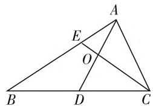

# 学习进阶理论下的 高中数学解题教学策略研究

● 江苏省宜兴市丁蜀高级中学 邵曦

高中数学知识内容具备较强的条理性、结构性与系统性，重点是培养学生分析问题和解决问题的能力。在传统的教学与解题训练中，存在前后不一致、内部缺乏联系性等问题。与此同时，部分教师习惯基于自己的认知让学生进行“填空式”学习，导致学生在学习过程中处于被动接受的地位，不利于学生知识应用与迁移能力的提升。与传统的教学模式不同，基于学习进阶理论的高中数学教学重在指导学生针对某一主题开展由易到难、由浅入深、从粗放到精致、从低层次到高层次的学习过程，基于学生已有的知识经验，以培养并提升学生的数学核心素养为终点，强调学习过程中思维的递进。本文结合实践教学经验，总结基于学习进阶理论指导的高中数学解题教学路径，以期为广大师生提供教学参考。

# 一、学习进阶理论内涵

学习进阶是指在特定的时间跨度范围内,学生学习与探究特定知识的过程中逐渐实现思维的进阶,其基本假设就是学生思维方式的连贯性与深入性.在学习进阶理论的指导下,对某一主题的学习需要注意阶段性,每一阶段的学习都是对前一阶段学习成果的延伸或扩展.从本质上来说,学习进阶理论探讨的是“如何引导学生设定科学的学习路径”这一问题,表现出的是学生在开展某一主题的学习时所遵循的连贯的、递进的思维轨迹,这一轨迹由相互关联、存在逻辑顺序的概念构成,科学指导学生学习的先后顺序,指明先学习的知识是后续学习的重要基础.

# 二、基于学习进阶的解题教学设计

# (一) 案例简析

在 $\triangle ABC$ 中， $D$ 点是 $BC$ 边的中点， $E$ 点在 $AB$ 边上，满足数量关系 $BE = 2EA, AD$ 与 $CE$ 相交于 $O$ 点，如图1所示. 如果 $\overrightarrow{AB} \cdot \overrightarrow{AC} = 6\overrightarrow{AO} \cdot \overrightarrow{EC}$ ，试求解 $\frac{AB}{AC}$ 的值.

本题具备较强的综合性，关联知识点较多，如平面向量基本定理、数量积、向量共线定理等，对学生转化能力要求较高。通过分析，可以发现本

text_image

Geometric diagram of triangle ABC with internal points D, E, O and intersecting lines

图1

题解法多样,具备一定的区分度,符合学习进阶理论所主导的差异性与层次性原则.

# （二）解题进阶教学设计

# 1. 立足基础, 聚焦通法

根据已知条件与图形信息,本题的关键就是确定AD与CE交点O的位置,可以转化为A、O、D以及E、O、C分别满足三点共线条件,将 $\overrightarrow{AB}$ 与 $\overrightarrow{AC}$ 作为基底来表示其他向量,这样的解题思路符合学生的认知习惯,较为常规,在解题时比较容易想到,只要注意运算细节就能准确求出结果.

解析: $\overrightarrow{EC}=\overrightarrow{AC}-\overrightarrow{AE}=-\frac{1}{3}\overrightarrow{AB}+\overrightarrow{AC}$ ，假设 $\overrightarrow{AO}=2\lambda\overrightarrow{AD}=\lambda(\overrightarrow{AB}+\overrightarrow{AC})$ ，因为 BE=2EA，所以可得 $\overrightarrow{AB}=3\overrightarrow{AE}$ ，进而求得 $\overrightarrow{AO}=3\lambda\overrightarrow{AE}+\lambda\overrightarrow{AC}$ 。因为 E、O、C 满足三点共线，所以 $3\lambda+\lambda=1$ ，求得 $\lambda=\frac{1}{4}$ ，即 $\overrightarrow{AO}=\frac{1}{2}\overrightarrow{AD}$ ，那么 $\overrightarrow{AB}\cdot\overrightarrow{AC}-6\overrightarrow{AO}\cdot\overrightarrow{EC}=\overrightarrow{AB}\cdot\overrightarrow{AC}-\frac{1}{2}(\overrightarrow{AB}+\overrightarrow{AC})\cdot(-\overrightarrow{AB}+3\overrightarrow{AC})=\frac{1}{2}\overrightarrow{AB^{2}}-\frac{3}{2}\overrightarrow{AC^{2}}=0$ ，因此 $\frac{AB}{AC}=\sqrt{3}$ 。

# 2. 合理转化,联系已知

数学解题的重要过程就是结合问题与已知条件进行转化，在遇到新的问题情境时，需要善于捕捉条件与信息，结合已经掌握的知识内容或者模型方法，进行匹配与转化，形成完整的思维框架。与通法相比，转化思想是初步的进阶，要求学生在掌握基本思想方法的前提下综合应用所学,完成知识的迁移,具备一定的思维难度.

解析:由上述求解过程可知 $\overrightarrow{AO}=\frac{1}{2}\overrightarrow{AD}$ ，同理可以确定 $\overrightarrow{OC}=\frac{3}{4}\overrightarrow{EC}$ 。取 CD 的中点 F，根据极化恒等式可以得到 $\overrightarrow{AB}\cdot\overrightarrow{AC}=\overrightarrow{AD^{2}}-\overrightarrow{CD^{2}}$ ， $6\overrightarrow{AO}\cdot\overrightarrow{EC}=8\overrightarrow{OD}\cdot\overrightarrow{OC}=8\overrightarrow{OF^{2}}-8\overrightarrow{CF^{2}}=2(\overrightarrow{AC^{2}}-\overrightarrow{CD^{2}})$ 。根据 $\overrightarrow{AB}\cdot\overrightarrow{AC}=6\overrightarrow{AO}\cdot\overrightarrow{EC}$ ，可得 $AD^{2}+CD^{2}=2AC^{2}$ 。根据中线定理可知 $AB^{2}+AC^{2}=2(AD^{2}+CD^{2})=4AC^{2}$ ，解得 $\frac{AB}{AC}=\sqrt{3}$ 。

# 3. 化繁为简, 特殊求解

在不要求完整求解过程或者是作为辅助思维手段的前提下，可以采用特殊的处理方法简化求解过程。当然，这种方法看似简洁，但是要求学生具有较高的知识储备、较好的知识迁移能力以及一定的创新思维能力，对学生的数学核心能力素养要求较高。在使用特殊方法进行求解时，重点不在于求解，因为求解过程是得到简化的，计算以及思维要求较低，重点是如何通过已知条件确定相应的简化思路，要做到有迹可循。

解析:结合本题的设问, 可知是要求解线段长度的比值, 可以理解为结果与 AB 以及 AC 的具体长度无关, 只需要求解相对的比例关系, 由此合理推测结果与 $\triangle ABC$ 的形状也无关, 这样的特殊化处理思路具备较强的合理性. 因此, 可以假设 $\angle BAC = 90^{\circ}$ , 以 A 点为原点, AB 为 x 轴的正方向, AC 为 y 轴的正方向, 建立平面直角坐标系, 那么 E 点的坐标为 $(e, 0)$ , C 点的坐标为 $(0, c)$ , 那么就可以得到 D 点的坐标为 $\left(\frac{3e}{2}, \frac{c}{2}\right)$ . 由已知 $\overrightarrow{AB} \cdot \overrightarrow{AC} = 6\overrightarrow{AO} \cdot \overrightarrow{EC}$ , 可得 $\overrightarrow{AO} \cdot \overrightarrow{EC} = 0$ , 即 $\overrightarrow{AD} \cdot \overrightarrow{EC} = 0$ , 所以 $\left(\frac{3e}{2}, \frac{c}{2}\right) \cdot (-e, c) = \frac{-3e^{2}}{2} + \frac{c^{2}}{2} = 0$ , 求得 $c = \sqrt{3}e$ , 进而求得 $\frac{AB}{AC} = \frac{3e}{c} = \sqrt{3}$ .

# (三) 教学总结

本题主要考查的是向量的基础知识及思想方法，命题背景也较为常规。在求解时，本题解法多样，在常规方法的基础上可以充分进阶，衍生出多种创新方法，内涵多样，因此对学生逻辑推理、运算、思维能力的要求较高，具备较高的训练价值。在高中数学解题教学以及复习过程中，需要从以下两个层面落实学习进阶理论：

# 1. 训练“题组化”，逐层进阶

不同于传统的教学模式,基于学习进阶理论指导的解题教学需要落实“题组化”的教学形式,通过成体系的习题类型或者是一题多解、一题多法训练凸显训练过程的层次性,根据学生的实际学情逐层深入,实现思想与方法的进阶与提升.题组化的教学组织形式表现为一组或者是多组典型问题集,以一题多变、一题多解等变化原则系统提升学生的数学核心思维,有效提升学生分析问题、解决问题、内化迁移的能力,进而促进高阶数学思维的形成.

# 2. 强化学生主体性, 实现师生共育

基于学习进阶理论的解题教学前后关联性较强，注重对学生思辨、质疑能力的培养，因此需要最大程度地避免师生之间产生思维落差，杜绝教学脱节。要保证各阶段学习的完整性与连贯性，就需要强化学生在教学过程中的主体地位，引导学生自主建构，教师适当调整教学逻辑，和学生的思维产生共鸣，以此实现教师学科素养与学生关键能力的共同提升。

# 三、结语

综上所述，学习进阶理论能够为学生的学习构建循序渐进、由浅入深的思维框架，对于教师而言，也是优化教学逻辑的有力抓手。在教学过程中，教师需要在理解教学目标的背景下，梳理清楚教学逻辑与教学内容两者之间的关系，同时将对这种关系的理解转化为现实的教学内容和教学活动次序。在教学时，还需要注意区分“内容进阶”与“学习进阶”的差异性，前者着眼于特定的、有序的学习内容，而后者强调学生思考教学内容的过程与方式。

# 参考文献：

[1] 周军. 引“学习进阶”之清泉 注习题教学以活力 [J]. 数学通讯, 2017(18).  
[2] 赵平, 徐静. 学习进阶: 思维课堂从形式走向本质 [J]. 中学数学(上), 2018(11).  
[3] 周军, 钱军先. 见微知著: 学习进阶还原智慧学习的本真意蕴 [J]. 中学数学 (上), 2019(7).  
[4] 周军. 学习进阶: 从“智学”走向“自慧”的应然之径 [J]. 中学数学研究, 2019(10).  
[5] 许珍. 学习进阶呼唤合乎“逻辑”的教学“创新”[J]. 中学数学(上), 2020(1). F