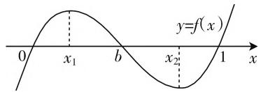

# 对一道高考数学压轴题的几点思考

—— 以 2019 年江苏数学高考卷第 19 题为例

# ● 江苏省南通中学 汪留屿

历年来，高考数学题都是无数师生共同研究的对象。而在所有的高考数学题中，压轴题又起到了“震慑”全卷、举足轻重的作用。对于学生而言，解决高考数学压轴题能拓宽视野，提升思维，提高解题能力；对于教师而言，研究高考数学压轴题能促进自身发展，凸显教学重、难点。因此，无论是教师还是学生，都有必要研究高考压轴题。本文以2019年江苏数学高考卷第19题为例，谈谈解决本题的几点思考以及对教学的几点建议。

# 一、解法探秘

高考原题:(第19题)设函数 $f(x)=(x-a)(x-b)(x-c)$ , $f'(x)$ 为 $f(x)$ 的导函数.

(1) 若 $a = b = c, f(4) = 8$ ，求 $a$ 的值；  
(2) 若 $a \neq b, b = c$ ，且 $f(x)$ 和 $f'(x)$ 的零点均在集合 $\{-3, 1, 3\}$ 中，求 $f(x)$ 的极小值；  
(3) 若 $a = 0, 0 < b \leqslant 1, c = 1$ ，且 $f(x)$ 的极大值为 $M$ ，求证： $M \leqslant \frac{4}{27}$ .

不难发现,前两问比较常规,所以下面我们重点谈谈对于第(3)问的思考.分析问题,我们发现:目标是要证明“ $M \leqslant \frac{4}{27}$ ”,要达到目标,必须先研究函数 $f(x)$ 的极大值;要研究函数 $f(x)$ 的极大值,必须知道函数 $f(x)$ 的单调性;要知道函数 $f(x)$ 的单调性,必须先研究 $f(x)$ 的导函数的零点.接着,我们就执行这个分析思路.

解: 因为 $f(x)=x(x-b)(x-1)=x^{3}-(b+1)x^{2}+bx$ ，所以 $f'(x)=3x^{2}-2(b+1)x+b$ .

因为 $\Delta=4(b+1)^{2}-12b=(2b-1)^{2}+3>0$ ，所以 $f'(x)$ 有 2 个不同的零点，设为 $x_{1}, x_{2}$ ，不妨令 $x_{1}<x_{2}$ .

当 $x < x_{1}$ 时， $f'(x) > 0$ ，当 $x_{1} < x < x_{2}$ 时， $f'(x) < 0$ ，当 $x > x_{2}$ 时， $f'(x) > 0$ 。

所以 $f(x)_{\text{极大值}} = M = f(x_1) = x_1^3 - (b + 1)x_1^2 + bx_1.$

# 1. 利用等量关系直接由 $x_{1}$ 表示 $b$ ，消 $b$

解 1: 因为 $f'(x_{1})=3x_{1}^{2}-2(b+1)x_{1}+b=0$ ，所以 $b=\frac{3x_{1}^{2}-2x_{1}}{2x_{1}-1}$ ，所以 $f(x_{1})=x_{1}^{3}-(b+1)x_{1}^{2}+bx_{1}=\frac{x_{1}^{2}(-x_{1}^{2}+2x_{1}-1)}{2x_{1}-1}$ .

因为 $b = \frac{3x_1^2 - 2x_1}{2x_1 - 1} \in (0,1]$ , 所以 $0 < x_1 \leqslant \frac{1}{3}$ 或 $\frac{2}{3} < x_1 \leqslant 1$ .

又 $2x_{1} < x_{1} + x_{2} = \frac{2(b + 1)}{3} \leqslant \frac{4}{3}$ , 所以 $x_{1} < \frac{2}{3}$ , 所以 $0 < x_{1} \leqslant \frac{1}{3}$ .

令 $g(x) = \frac{x^2(-x^2 + 2x - 1)}{2x - 1}, g'(x) = \frac{-2x(x - 1)(3x^2 + x + 1)}{(2x - 1)^2} > 0.$ 因为 $g(x)$ 在 $\left(0, \frac{1}{3}\right]$ 上单调递增，所以 $f(x_1) \leqslant g\left(\frac{1}{3}\right) = \frac{4}{27}$ .

所以 $M \leqslant \frac{4}{27}$ .

# 2. 利用求根公式由 $b$ 表示 $x_{1}$ , 消 $x_{1}$

解 2: 因为 $f'(x_{1})=3x_{1}^{2}-2(b+1)x_{1}+b=0$ ，所以， $x_{1}=\frac{b+1-\sqrt{b^{2}-b+1}}{3}$ .

$$
\begin{array}{l} = x _ {1} ^ {3} - (b + 1) x _ {1} ^ {2} + b x _ {1} = f ^ {\prime} \left(x _ {1}\right) \left(\frac {x _ {1}}{3} - \frac {b + 1}{9}\right) - \\ \frac {2 \left(b ^ {2} - b + 1\right)}{9} x _ {1} + \frac {b (b + 1)}{9} = \frac {b (b + 1)}{2 7} - \\ \frac {2 (b - 1) ^ {2} (b + 1)}{2 7} + \frac {2}{2 7} (\sqrt {b (b - 1) + 1}). \\ \end{array}
$$

因为 $f(x_{1}) = x_{1}^{3} - (b + 1)x_{1}^{2} + bx_{1}$ ，所以 $f(x_{1})$

因为 $0 < b \leqslant 1$ ，所以 $f(x_{1}) \leqslant \frac{2}{27} + 0 + \frac{2}{27} \leqslant \frac{4}{27}$ .

所以 $M \leqslant \frac{4}{27}$ .

# 3. 利用不等关系 $0 < b \leqslant 1$ 消 $b$

text_image

y=f(x)
0
x₁
b
x₂
1
x

图 1

解 3: 画出 $f(x)$ 的简图, 根据图像可得 $x_{1} \in (0, b)$ .

因为 $b \in (0,1]$ , 所以 $x_{1} - 1 \leqslant x_{1} - b < 0$ , 所以 $f(x_{1}) = x_{1}(x_{1} - b)(x_{1} - 1) \leqslant x_{1}(x_{1} - 1)^{2}$ .

令 $g(x) = x(x - 1)^2, x \in (0,1)$ ，则 $g'(x) = 3\left(x - \frac{1}{3}\right)(x - 1)$ . 令 $g'(x) = 0$ ，则 $x = \frac{1}{3}$ . 当 $0 < x < \frac{1}{3}$ 时， $g'(x) > 0$ ，当 $\frac{1}{3} < x < 1$ 时， $g'(x) < 0$ ，所以 $g(x)_{\text{最大值}} = g\left(\frac{1}{3}\right) = \frac{4}{27}$ . 所以 $M \leqslant \frac{4}{27}$ .

# 二、解法迁移

在解决函数综合问题时往往会遇到多元问题,而消元思想就是解决多元问题的关键所在.那么,如何消元呢?主要是利用等量关系和不等关系.下面通过例题再来诠释一下.

例 设函数 $f(x) = \ln x + \frac{a}{x - 1} (a > 0)$ ，

(1) 当 $a = \frac{1}{30}$ 时, 求函数 $f(x)$ 的单调区间;  
(2) 当 $a \geqslant \frac{1}{2}, x \in (1, +\infty)$ 时，求证： $\ln x + \frac{a}{x - 1} > 1.$

解:(1)略.

(2) 要证 $\ln x + \frac{a}{x - 1} > 1\left(a \geqslant \frac{1}{2}, x > 1\right)$ 成立，（含有 $x$ 和 $a$ 两个未知量，考虑消元）即证 $\ln x + \frac{a}{x - 1} \geqslant \ln x + \frac{1}{2(x - 1)} > 1.$ （利用不等关系消 $a$ ）即证 $2(x - 1)\ln x + 1 > 2(x - 1)$ 当 $x > 1$ 时成立.

设 $g(x)=2(x-1)\ln x-2(x-1)+1(x>1)$ (构造新函数,研究最值解题)……

# 三、教学指导

高考数学压轴题是整个高考数学卷中最具研究性、方向性的问题,研究高考压轴题,能够了解命题方向,把握知识难点,对教师的教学意义重大.

# 1. 理解数学知识

从考查内容上看，高考压轴题大多是综合问题，它考查的不是单个的知识点，而是一些知识点乃至知识模块的综合运用。这就要求学生不但要有丰富的知识储备，还要能够建构知识框架，挖掘知识间的联系。这也说明，在教学中，数学知识始终是第一位的。张奠宙先生认为在当下的数学教育中出现了“去数学化”的现象，包括教师培训课程全是教育学和心理学内容，数学教育硕士入学考试不考数学考教育理论，数学教育论文档次越高数学味越淡等现象。其实在数学课堂上也是如此，很多公开课、评优课关注的都是“情境设置是否恰当”“学习氛围是否融洽”“教学技术是否熟练”“教学方式是否多样”等方面，而对数学概念、公式、命题和定理本质的揭示关注不多。其实，无论是教学情境还是教学方式都只是数学知识呈现的过程与方式，都应该服务于数学知识，更不能脱离数学知识而存在。所以在教学中，在“教什么”与“怎么教”之间，教师要更关注“教什么”，要引导学生理解数学知识的本质，关注数学知识之间的联系。

# 2. 掌握数学方法

从问题解决上看,高考压轴题往往解法众多,可以通过多种途径求解,而其中大多数都可以利用通性通法来解决.现今数学教育中,很多学生盲目崇信“熟能生巧”“做得越多考得越高”等刷题策略.确实,足量做题能够帮助我们巩固方法,强化思路,开阔视野.美国学者波利亚曾把解题看作游泳,先通过模仿教师学会动作,再通过实践操作掌握技能.也正是如此,当解题达到一定量后,其对考试成绩的影响必然趋于平缓,难有成效.所以,学习数学要做题,但不能死做题,要善于总结,善于思考.因此,在教学中,教师要引导学生在解题后学会总结,对解决的某类问题进行分析,从中抛开形式与背景,抽象出本质的思想与方法,并能迁移到其他问题中.

# 3. 培养数学素养

从培养目标上看，在新高考政策下，高考压轴题除了检测学生的知识水平，还要能反映学生的素养水平。《普通高中数学课程标准(2017年版)》中指出，学习数学能够形成人的理性思维和科学精神，同时在促进个人智力发展的过程中发挥着不可替代的作用，数学素养是现代社会每个人都应该具备的基本素养。正因如此，在教学中，教师不能为了解题而解题，也不能只为了考试而解题，要以培养学生的数学素养为使命，在教学中不断探索、努力实践、总结经验，丰富其理论，掌握其精髓。W