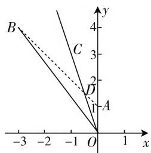

# 巧思维,妙链接,再归纳

—— 一道安徽解几模拟题的高考历程

● 江苏省海头高级中学 王哈莉

历年的高考数学模拟卷中，都有一些历年高考典型真题的影子，是众多教研员在学习、引用、模仿、改编与整合等基础上创造出来的一些非常不错的创新“产品”，具有考点典型，知识融合，立意突出，传承发展，改变创新等特点，有很好的选拔性与区分度。这类创新“产品”极具学习、教学、归纳、探究等价值，成为一线数学教师的教学与学生的数学学习的一个好场所，值得我们认真学习，细细品味，归纳总结，深入探究。

# 一、问题呈现

问题:(2020年安徽省“江南十校”综合素质检测数学理科·15)在直角坐标系xOy中,已知点A(0,1)和点B(-3,4),若点C在 $\angle AOB$ 的平分线上,且 $|\overrightarrow{OC}|=3\sqrt{10}$ ,则向量 $\overrightarrow{OC}$ 的坐标为\_\_\_\_.

此题以平面直角坐标系中相关的点、直线、角为
问题背景,通过点的坐标、角平分线以及平面向量的
模来确定对应的点的坐标. 破解时,可以借助题目条
件中“数”与“形”的不同思维视角,结合解析几何思
维、平面向量思维以及三角函数思维等不同视角来切
入,结合相关的条件来分析与处理,都可以达到有效
分析、正确解决的目的.

# 二、问题破解

思维视角一:解析几何思维

方法 1: (距离转化法)

解析：设 $C(m,n)$ ，易知 $m < 0, n > 0$ ，根据 $\mid \overrightarrow{OC} \mid = 3\sqrt{10}$ ，可得 $m^2 + n^2 = 90$ ，结合 $B(-3,4)$ ，可得直线 $OB$ 的方程为 $y = -\frac{4}{3} x$ ，而直线 $OA$ 的方程为 $x = 0$ ，由于点 $C$ 在 $\angle AOB$ 的平分线上，则知点 $C$ 到直线 $OA, OB$ 的距离相等，所以 $|m| = \frac{|4m + 3n|}{\sqrt{4^2 + 3^2}}$ ，即 $-5m = |4m + 3n|$ ，亦即 $-5m = 4m + 3n$ 或 $-5m = -4m - 3n$ ，可得 $n = -3m$ 或 $3n = m$ （根据 $m < 0$ $n > 0$ ，舍去).将 $n = -3m$ 代入 $m^2 + n^2 = 90$ ，并结合 $m < 0, n > 0$ ，可得 $m = -3, n = 9$ ，所以 $\overrightarrow{OC} = (-3, 9)$ 故填答案： $(-3, 9)$

点评:根据“角平分线上的任意一点到角的两边的距离相等”这一平面几何性质,结合点的坐标与直线方程的确定,设出相应点的坐标,利用点到直线的距离公式加以转化,从而建立相应的关系式,并结合平面向量的模的情况,通过方程思想来求解相应点的坐标,即为对应平面向量的坐标.

# 方法 2: (定比分点公式法)

解析:设直线 AB 与直线 OC 相交于点 $D(x,y)$ ，而 $|OA|=1,|OB|=5$ ，根据三角形内角平分线定理，可得 $\frac{|\overrightarrow{AD}|}{|\overrightarrow{BD}|}=\frac{|\overrightarrow{OA}|}{|\overrightarrow{OB}|}=\frac{1}{5}$ ，则点 D 分有向线段 AB 所成的比为 $\lambda=\frac{1}{5}$ ，根据定比分点坐标公

text_image

B
C
D
A
-3 -2 -1 O 1 x
y
4
3
2
1

图1

式，可得 $\left\{ \begin{array}{l} x = \frac{0 + \frac{1}{5} \times (-3)}{1 + \frac{1}{5}} = -\frac{1}{2}, \\ y = \frac{1 + \frac{1}{5} \times 4}{1 + \frac{1}{5}} = \frac{3}{2}, \end{array} \right.$ 则 $D\left(-\frac{1}{2}, \frac{3}{2}\right)$ ，即 $\overrightarrow{OD} = \left(-\frac{1}{2},\frac{3}{2}\right)$ .而 $|\overrightarrow{OC}| = 3\sqrt{10}$ ，所以 $\overrightarrow{OC}$ $= 3\sqrt{10}\times \frac{\overrightarrow{OD}}{|\overrightarrow{OD}|} = (-3,9)$ ，故填答案： $(-3,9)$

点评:根据平面几何中的三角形内角平分线定理,得以确定相应点分线段所成的定比值,结合条件中已知点的坐标,并利用定比分点坐标公式求出直线AB与直线OC的交点D的坐标,再根据平行向量的坐标关系以及已知平面向量的模的情况,即可确定对应的平面向量的坐标.

# 思维视角二:平面向量思维

# 方法 3: (平面向量坐标运算法)

解析:设直线 AB 与直线 OC 相交于点 $D(x,y)$ ，而 $|OA|=1,|OB|=5$ ，根据三角形内角平分线定理，可得 $\frac{|AD|}{|BD|}=\frac{|OA|}{|OB|}=\frac{1}{5}$ ，即 $|BD|=5|AD|$ ，而 $\overrightarrow{AB}=(-3,4)-(0,1)=(-3,3)$ ，可得 $\overrightarrow{AD}=\frac{1}{6}\overrightarrow{AB}=\left(-\frac{1}{2},\frac{1}{2}\right)$ ，而 $\overrightarrow{OD}=\overrightarrow{OA}+\overrightarrow{AD}=(0,1)+\left(-\frac{1}{2},\frac{1}{2}\right)=\left(-\frac{1}{2},\frac{3}{2}\right)$ ，而 $|\overrightarrow{OC}|=3\sqrt{10}$ ，所以 $\overrightarrow{OC}=3\sqrt{10}\times\frac{\overrightarrow{OD}}{|\overrightarrow{OD}|}=(-3,9)$ ，故填答案： $(-3,9)$ .

点评:根据平面几何中的三角形内角平分线定理,得以确定相应点分线段所成的比值,结合平面向量的线性关系与坐标运算加以转化与应用,再根据平行向量的坐标关系以及已知平面向量的模的情况,即可确定对应的平面向量的坐标.

# 思维视角三:三角函数思维

# 方法 4: (三角函数法)

解析:设直线 OB 的倾斜角为 $\alpha\in\left(\frac{\pi}{2},\pi\right)$ ，则有 $\tan\alpha=-\frac{4}{3}$ ，结合同角三角函数基本关系式，可得 $\cos\alpha=-\frac{3}{5}$ ，利用半角公式可得 $\sin\frac{\alpha}{2}=\sqrt{\frac{1-\cos\alpha}{2}}=\frac{2\sqrt{5}}{5}$ ， $\cos\frac{\alpha}{2}=\sqrt{\frac{1+\cos\alpha}{2}}=\frac{\sqrt{5}}{5}$ ，而点 C 在 $\angle AOB$ 的平分线上，设直线 OC 的倾斜角为 $\beta$ ，可得 $\beta=\alpha-\frac{\alpha-\frac{\pi}{2}}{2}=\frac{\alpha}{2}+\frac{\pi}{4}$ ，则有 $\sin\beta=\sin\left(\frac{\alpha}{2}+\frac{\pi}{4}\right)=\sin\frac{\alpha}{2}\cos\frac{\pi}{4}+\cos\frac{\alpha}{2}\sin\frac{\pi}{4}=\frac{3\sqrt{10}}{10},\cos\beta=-\frac{\sqrt{10}}{10}$ ，而 $|\overrightarrow{OC}|=3\sqrt{10}$ ，所以 $\overrightarrow{OC}=3\sqrt{10}(\cos\beta,\sin\beta)=(-3,9)$ ，故填答案： $(-3,9)$ .

点评:根据条件确定直线 OB 的倾斜角 $\alpha$ 的正切值,结合同角三角函数基本关系式的应用以及半角公式来求解 $\sin\frac{\alpha}{2}$ 与 $\cos\frac{\alpha}{2}$ 的值,通过点 C 在 $\angle AOB$ 的平分线上确定直线 OC 的倾斜角 $\beta$ 与 $\alpha$ 的关系式,利用三角恒等公式加以求解其相应的正弦值与余弦值,再利用对应向量的模来求解对应平面向量的坐标.

# 三、链接高考

以上问题来源于 2005 年高考数学天津卷理科第 14 题, 保留原来高考真题中的相关条件与求解结论, 只是改变 $\left|\overrightarrow{OC}\right|$ 的值, 是在原来高考真题的基础上加以改编:

高考真题：(2005年高考数学天津卷理科第14题)在直角坐标系 $xOy$ 中，已知点 $A(0,1)$ 和点 $B(-3,4)$ ，若点 $C$ 在 $\angle AOB$ 的平分线上且 $|\overrightarrow{OC}| = 2$ ，则 $\overrightarrow{OC} = \underline{\quad}$

涉及三角形的内角平分线问题,可以直观形象地从平面几何角度切入,利用平面几何与平面向量的方法来解决;也可以“形”转“数”,从解析几何或三角函数角度切入来思维,利用解析几何或三角函数的方法来解决.

# 四、规律总结

根据以上问题的破解,可归纳出有关角平分线的平面向量性质公式,可以非常有效地用来简捷破解一些相关的问题.

结论: 在直角坐标系 $xOy$ 中, 若点 C 在 $\angle AOB$ 的平分线上, 则有 $\overrightarrow{OC} = \lambda \left( \frac{\overrightarrow{OA}}{|\overrightarrow{OA}|} + \frac{\overrightarrow{OB}}{|\overrightarrow{OB}|} \right)$ , $\lambda > 0$ .

根据该结论来破解以上高考真题:由题可得 $\overrightarrow{OA}=(0,1)$ , $\left|\overrightarrow{OA}\right|=1$ , $\overrightarrow{OB}=(-3,4)$ , $\left|\overrightarrow{OB}\right|=5$ , 由于点 C 在 $\angle AOB$ 的平分线上，可得 $\overrightarrow{OC}=\lambda\left(\frac{\overrightarrow{OA}}{\left|\overrightarrow{OA}\right|}+\frac{\overrightarrow{OB}}{\left|\overrightarrow{OB}\right|}\right)$ , $\lambda>0$ , 所以 $\overrightarrow{OC}=\lambda\left(\frac{\overrightarrow{OA}}{\left|\overrightarrow{OA}\right|}+\frac{\overrightarrow{OB}}{\left|\overrightarrow{OB}\right|}\right)=\lambda\left[(0,1)+\left(-\frac{3}{5},\frac{4}{5}\right)\right]=\left(-\frac{3}{5}\lambda,\frac{9}{5}\lambda\right)$ , 而 $\left|\overrightarrow{OC}\right|=2$ , 所以 $\left(-\frac{3}{5}\lambda\right)^{2}+\left(\frac{9}{5}\lambda\right)^{2}=4$ , 解得 $\lambda=\frac{\sqrt{10}}{3}$ , 即 $\overrightarrow{OC}=\left(-\frac{\sqrt{10}}{5},\frac{3\sqrt{10}}{5}\right)$ .

# 五、解后反思

历年高考中的一些非常具有代表性的典型高考真题,是众多一线教师的教学体验与数学专家的智慧结晶,有机融合数学知识、数学思想方法和数学能力等,充分展示数学教材、考试大纲与人才选拔目标的有机综合,融会贯通,合理掌握,直击高考,可以有效避免“题海战术”,有效复习,系统归纳,形成体系,提升能力. F