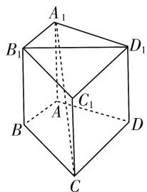
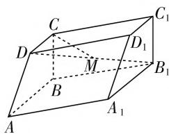
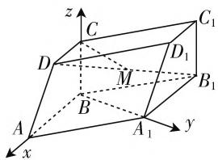

# 探索性问题解法研析\*

● 北京教育学院丰台分院 张琦  
北京市第十二中学 高慧明

数学问题由条件(已知、前提)和结论(求解、求证)两个基本要素构成. 当已知的条件不完备或论证的结论不唯一时, 这样的数学问题就是数学探索性问题. 探索性问题往往具有已知形式新颖、解题方法灵活的特点. 这一类问题的出现, 不仅有利于考查和区分考生的知识技能掌握水平和创新能力, 还可以有效地检测考生的数学素养水平和数学学习潜能, 因而颇受高考命题组重视, 已成为全国高考数学试题命制的一个新亮点.

探索性问题按命题真假可分为两类：

第一类是论证命题为真. 也分为两种情况: 一种情况是论证过程中条件不充足, 需要对所需条件进行探索补充, 我们称其为条件开放型问题; 另一种情况是在论证过程中结论不明确, 需通过类比引申推广、特例归纳等手段得出结论, 我们称其为结论开放型问题.

第二类是论证命题为假. 也分为两种情况: 一种情况是在论证的过程中, 通过反例即可说明命题为假, 我们称其为反例论证型问题; 另一种情况需要通过严密的逻辑推理得出命题为假, 我们称其为一般论证型问题.

如果试题定义一个“探索度”的话,那么作为数学高考题中的探索性问题其实“探索度”是较弱的.如何解答这类问题?以下举例说明.

# 一、条件开放型问题

例 1 如图 1, 在四棱柱 $A_{1}B_{1}C_{1}D_{1}-ABCD$ 中, 侧棱 $AA_{1}\perp$ 平面 ABCD, 当底面四边形 ABCD 满足 \_\_\_\_ 时, 有 $A_{1}C\perp B_{1}D_{1}$ . (注: 填上一种你认为正确的条件即可,不必考虑所有可能的情形)

解析: 解决条件开放型问题, 我们常常采取分析法进行论证. 比如在本题中, 要证 $A_{1}C \perp B_{1}D_{1}$ , 因为在四棱柱 $A_{1}B_{1}C_{1}D_{1} - ABCD$ 中, 侧棱 $AA_{1} \perp$ 平面 ABCD, 已有 $AA_{1} \perp B_{1}D_{1}$ , 所以只需证 $B_{1}D_{1}$ 垂直于 $A_{1}C$ 所在的平面 $A_{1}CC_{1}$ . 所以只需证 $B_{1}D_{1} \perp A_{1}C_{1}$ 即可.

text_image

A₁
B₁
D₁
C₁
A
B
C
D

图 1

点评:本题为条件探索型题目,论证方向明确,寻找使结论成立的充分条件即可.所以本题也可将已知的条件、结论都看作已知条件,然后通过演绎推理推导出所需的条件.证明过程如下:

四棱柱 $A_{1}B_{1}C_{1}D_{1}-ABCD$ 中，侧棱 $AA_{1}\perp$ 平面ABCD，所以 $AA_{1}\perp B_{1}D_{1}$ ，若 $A_{1}C\perp B_{1}D_{1}$ ，则 $B_{1}D_{1}\perp$ 平面 $A_{1}CC_{1}$ ，所以 $B_{1}D_{1}\perp AC.$ 又 $B_{1}D_{1}\parallel BD$ ，所以 $BD\perp AC.$ 反之亦成立.

# 二、结论开放型问题

例2 已知 $l, m$ 是平面 $\alpha$ 外的两条不同直线. 给出下列三个论断：

$$
① l \perp m; ② m / / \alpha ; ③ l \perp \alpha .
$$

以其中的两个论断作为条件,余下的一个论断作为结论,写出一个正确的命题:\_\_\_\_.

解析:本题是2019年北京高考理科卷的第12题,满分5分,北京市平均分为4.55分,属于容易题.由于已经说明“以其中两个论断作为条件,余下的一个论断作为结论”去构造真命题,所以我们可以任意选择两个论断作为条件进行尝试. 本题答案可以是“若②③, 则 ①”.

点评:本题考查点、直线、平面的位置关系.要想判定 $l\perp\alpha$ ,是需要l垂直于平面 $\alpha$ 内两条相交直线的,所以③显然不能作结论,只能是条件,故而易得真命题.

# 三、反例论证型问题

例 3 能说明“若 $f(x) > f(0)$ 对任意的 $x \in (0, 2]$ 都成立，则 $f(x)$ 在 $[0, 2]$ 上是增函数”为假命题的一个函数是 \_\_\_\_.

解析:本题是2018年北京高考理科卷的第13题,满分5分,北京市平均分为2.92分,难度低于0.6,属于中等难度试题.根据题意,我们需要找的是“对任意的 $x\in(0,2)$ ,都有 $f(x)>f(0)$ ,但 $f(x)$ 在 $[0,2]$ 上不是增函数”的函数.所以我们找的函数在 $[0,2]$ 上先增再减,且对任意的 $x\in(0,2]$ ,都有 $f(x)>f(0)$ 就行.比如函数 $f(x)=\sin x,x\in[0,2]$ ,或者函数 $f(x)=-\left(x-\frac{3}{2}\right)^{2},x\in[0,2]$ .

点评:我们都清楚,要想证明一个命题为真,需要严格的论证.但是如果想说明一个命题是假,我们当然可以选择通过逻辑推理进行论证,其实也可以选择找一个反例,直接说明命题为假即可.我们还可以看下面这个例子:

设函数 $f(x)$ 在 $(-\infty, +\infty)$ 上满足 $f(2 - x) = f(2 + x), f(7 - x) = f(7 + x)$ ，且在闭区间[0,7]上，只有 $f(1) = f(3) = 0$ ，试判断函数 $y = f(x)$ 的奇偶性.

解析: 因为 $f(2-x)=f(2+x)$ ,

所以 $f(2-3)=f(2+3)$ ，即 $f(-1)=f(5)$ .

因为在[0,7]上，只有 $f(1) = f(3) = 0$

所以 $f(5) \neq 0$ ，所以 $f(-1) \neq f(1)$ .

因为 $f(1)=0$ ，所以不论函数 $f(x)$ 是奇函数还是偶函数，总要有 $f(-1)=f(1)$ ，与上述结论矛盾，所以 $f(x)$ 是非奇非偶函数.

# 四、一般论证型问题

例 4 如图 2, 四棱柱 $ABCD-A_{1}B_{1}C_{1}D_{1}$ 中, 底面 ABCD 为直角梯形, $AB \parallel CD, AB \perp BC$ , 平面 $ABCD \perp$ 平面 $ABB_{1}A_{1}, \angle BAA_{1}=60^{\circ}, AB=AA_{1}=$ $2BC = 2CD = 2.$

(I) 求证: $BC \perp AA_{1}$ .

(Ⅱ) 求二面角 $D - AA_{1} - B$ 的余弦值.

（Ⅲ）在线段 $DB_{1}$ 上是否存在点 M，使得 $CM \parallel$ 平面 $DAA_{1}$ ？若存在，求 $\frac{DM}{DB_{1}}$ 的值；若不存在，请说明理由.

text_image

Geometric diagram of a parallelepiped with labeled vertices and internal points, used in spatial geometry problems.

图2

text_image

z
C
D
C₁
D₁
M
B₁
A
B
A₁
y
x

图3

解析:(Ⅰ)根据面面垂直的性质,易证 $BC \perp$ 平面 $ABB_{1}A_{1}$ , 从而 $BC \perp AA_{1}$ .

（Ⅱ）建立如图3所示空间直角坐标系 $B - xyz$ 依题意， $A(2,0,0), A_1(1,\sqrt{3},0), D(1,0,1)$ ，得平面 $DAA_{1}$ 的一个法向量为 $\pmb{n} = (\sqrt{3},1,\sqrt{3})$ 。易知平面 $ABB_{1}A_{1}$ 的一个法向量为 $\pmb{m} = (0,0,1)$ ，所以二面角 $D - AA_{1} - B$ 的余弦值为 $\frac{\sqrt{21}}{7}$ 。

（Ⅲ）设 $\overrightarrow{DM} = \lambda \overrightarrow{DB_1},\lambda \in [0,1]$ ，整理得 $\overrightarrow{CM} =$ $(1 - 2\lambda ,\sqrt{3}\lambda , - \lambda)$ .因为 $CM / /$ 平面 $DAA_{1}$ ，所以 $\overrightarrow{CM}\cdot n = 0.$ 即 $\sqrt{3}(1 - 2\lambda) + \sqrt{3}\lambda -\sqrt{3}\lambda = 0$ ，所以 $\lambda = \frac{1}{2}$ .所以存在点 $M$ ，使得 $CM / /$ 平面 $DAA_{1}$ ，此时 $\frac{DM}{DB_1} = \frac{1}{2}.$

点评:本题考查面面垂直的性质,线面平行的性质和面面垂直的性质是证明题中最难的两个定理,也是在高考或模拟考中非常容易考的定理.本题对平面与平面所成二面角的余弦值的求法的考查是常规问题,只是需要注意到平面 $ABB_{1}A_{1}$ 的一个法向量为m=(0,0,1),是可以直接观察出来的.本题第(Ⅲ)问考查满足条件的点是否存在的判断与求法,我们的求解策略基本是假设CM//平面 $DAA_{1}$ 已然成立,之后通过代数运算,看看能否求得满足条件的点M.其实,在求解的过程中,由于要用到 $\overrightarrow{CM}\cdot n=0$ ,所以必须要有 $\overrightarrow{CM}$ 的坐标,本解析提供了一种解法.

其实也可以换个思路，因为 $\overrightarrow{CM} = \overrightarrow{CD} + \overrightarrow{DM} = \overrightarrow{CD} + \lambda \overrightarrow{DB_{1}}$ ，易得结论. W