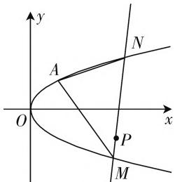
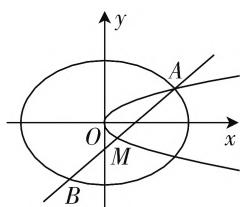
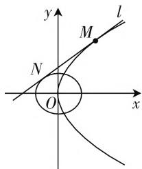

# 数学运算视角下直线与抛物线问题的研究

# ● 浙江省杭州第十四中学 郑国赞

数学运算是中学数学核心素养的一项重要内容，每一个数学运算都蕴含着对运算算理（为什么能这样算，计算的依据）、算法（如何算，计算的步骤或程序）、算力（计算的功力，最终算出正确的结果）的考量。纵观近几年浙江省学考与高考中的圆锥曲线问题，直线与双曲线的问题常见于选填题之中，直线与椭圆的综合问题因有较多的现成结论或进行仿射变换之后就变成了直线与圆的问题，大题中也较少出现，而抛物线由于其定义与性质的特殊性，直线与抛物线的问题显得更具灵活性、开阔性，常见于试卷的综合问题之中。本文结合具体的例题谈谈如何解决直线与抛物线的综合问题。

# 一、直线的形式与性质

对于抛物线 $y^{2}=2px(p>0)$ 与直线的问题，通常要把直线方程代入抛物线方程，再结合方程的根与交点坐标的关系，综合运用函数、不等式、向量等知识来解决。直线常见的设法：① $y=kx+b$ ，② $x=my+n$ ，这两种形式均引入了两个参变量 k、b 或 m、n，相对而言，第二种设法优于第一种设法，它避免了代入时的平方的运算。除了这两种形式的直线设法，笔者发现还有如下性质：

性质1:对于过抛物线 $y^{2}=2px(p>0)$ 上两点 $A(x_{1},y_{1}), B(x_{2},y_{2})$ 的直线，则直线的斜率为： $k_{AB}=\frac{2p}{y_{2}+y_{1}}(y_{1}+y_{2}\neq0)$ ，直线 AB 的方程为： $(y_{2}+y_{1})y=2px+y_{1}y_{2}$ .

略证: 直线 AB 的斜率 $k_{AB}=\frac{y_{2}-y_{1}}{x_{2}-x_{1}}=\frac{y_{2}-y_{1}}{\frac{y_{2}^{2}}{2p}-\frac{y_{1}^{2}}{2p}}=\frac{2p}{y_{2}+y_{1}}(x_{1}\neq x_{2},\text{即 }y_{1}+y_{2}\neq0)$ ，故直线 AB 的方程为： $y=\frac{2p}{y_{2}+y_{1}}(x-x_{1})+y_{1}$ ，即 $(y_{2}+y_{1})y=2px+y_{1}y_{2}$ ，当 $y_{1}+y_{2}=0$ 时，直线方程为 $x=x_{1}$ ，亦满足上述形式.

这种直线方程的形式也是引入了两个参变量 $y_{1}$ 、 $y_{2}$ ，且这两个参变量有着显著的几何特征，即两个交点的纵坐标,我们也可以把 $y_{1} + y_{2}$ 与 $y_{1}y_{2}$ 视为两个整体,亦相当于引入两个参变量.

性质2:对于过抛物线 $x^{2}=2py(p>0)$ 上两点 $A(x_{1},y_{1}), B(x_{2},y_{2})$ 的直线，则直线的斜率为： $k_{AB}=\frac{x_{1}+x_{2}}{2p}$ ，直线 AB 的方程为： $(x_{2}+x_{1})x=2py+x_{1}x_{2}$ .

性质3:对于抛物线 $y^{2}=2px(p>0)$ 在点 $A(x_{0},y_{0})$ 处的切线，可以设其方程为： $y_{0}y=px+\frac{y_{0}^{2}}{2}$ ，即 $y_{0}y=px+px_{0}$ .

略证: 相切可视为相交状态下两交点无限接近的极限状态, 故令 $y_{1}=y_{2}=y_{0}$ , 化简即可得.

# 二、应用

# 1. 过定点问题

解决思路就是根据题意选择恰当的直线方程,寻求直线方程中两个参变量的关系,再求出定点.

例 1 过抛物线 $y^{2}=2x$ 的顶点作互相垂直的两条弦 OA, OB，判断直线 AB 是否过定点。若过定点，则求出定点的坐标。

略解: 设 $A(x_{1}, y_{1})$ , $B(x_{2}, y_{2})$ ，则直线 AB 的方程为 $(y_{2} + y_{1})y = 2px + y_{1}y_{2}$ . 又因为 $OA \perp OB$ ，所以 $k_{OA} \cdot k_{OB} = \frac{1}{y_{1} + 0} \cdot \frac{1}{y_{2} + 0} = -1$ ，所以 $y_{1}y_{2} = -4$ ，故直线 AB 化为 $(y_{2} + y_{1})y = 2x - 4$ ，只需把 $y_{1} + y_{2}$ 视为一个整体参数，令 y = 0，易得直线过定点 $(2, 0)$ .

笔者提供如下同类练习,有兴趣的读者可以尝试解决:

练习: 已知抛物线 $y^{2}=2px(p>0)$ 上的一点 $P(x_{0},y_{0})$ , PA、PB 是抛物线的两条互相垂直的弦. 求证: 直线 AB 过定点 $(x_{0}+2p,-y_{0})$ .

略证：设点 $A, B$ 的坐标分别为 $(x_{1}, y_{1})$ ， $(x_{2}, y_{2})$ ，由性质1可知 $k_{PA} = \frac{2p}{y_{1} + y_{0}}$ ， $k_{PB} = \frac{2p}{y_{2} + y_{0}}$ 。又因为 $PA \perp PB$ ，且 $y_{0}^{2} = 2px_{0}$ ，故 $\frac{2p}{y_{1} + y_{0}} \cdot \frac{2p}{y_{2} + y_{0}} = -1 \Leftrightarrow y_{1}y_{2} + y_{0}(y_{1} + y_{2}) + 2px_{0} = -4p^{2}$ ，即 $-y_{0}(y_{1})$

$+y_{2})=2p(x_{0}+2p)+y_{1}y_{2}$ ，而直线AB的方程为： $(y_{2}+y_{1})y=2px+y_{1}y_{2}$ ，即可得直线过定点 $(x_{0}+2p,-y_{0})$ 。本题若采用直线的另外两种表示方式，本题的计算量较大且不易解决。

# 2. 定值问题

解决思路就是据题意设抛物线上已知点的坐标，引入参变量 $y_{1}, y_{2}$ 与 $x_{1}, x_{2}$ ，根据题意表示出直线方程，再把目标简化成参变量的函数式.

例2（2017年浙江学考）如图1，已知抛物线 $C:y^{2}=2px$ 过点A(1,1).

text_image

y
A
N
O
x
P
M

图1

（Ⅰ）求抛物线的方程；  
（Ⅱ）过点 $P(3, -1)$ 的直线与抛物线交于 $M, N$ 两个不同的点（与 $A$ 不重合），设直线 $AM, AN$ 的斜率分别为 $k_{1}, k_{2}$ ，求证： $k_{1}k_{2}$ 为定值.

略解:(Ⅰ) 易求得抛物线的方程为 $y^{2}=x$ .

（Ⅱ）设点 M、N 的坐标分别为 $(x_{1}, y_{1})$ 、 $(x_{2}, y_{2})$ ，由性质 1 可设直线 MN 的方程为： $(y_{2} + y_{1})y = x + y_{1}y_{2}$ ，因为直线过 P 点，所以 $-(y_{2} + y_{1}) = 3 + y_{1}y_{2}$ ，即 $(y_{2} + y_{1}) + y_{1}y_{2} = -3$ 。故 $k_{1}k_{2} = \frac{1}{y_{1} + 1} \cdot \frac{1}{y_{2} + 1} = \frac{1}{y_{1}y_{2} + (y_{1} + y_{2}) + 1} = \frac{1}{-3 + 1} = -\frac{1}{2}$ 。

# 3. 范围(最值)问题

范围问题与最值问题本质上是一致的,都是要引入参变量建立目标函数,再求出目标函数的范围或最值.

例 3 （2020年浙江21）如图 2，已知椭圆 $C_{1}:\frac{x^{2}}{2}+y^{2}=1$ ，抛物线 $C_{2}:y^{2}=2px(p>0)$ ，点 A 是椭圆 $C_{1}$ 与抛物线 $C_{2}$ 的交点, 过点 A 的直线交椭圆 $C_{1}$ 于点 B, 交抛物线于 $M(M, B$ 不同于 A).

text_image

y
A
O
x
M
B

图2

(1) 略.   
(2) 若存在不过原点的直线 l 使 M 为线段 AB 的中点, 求 p 的最大值.

分析:本题涉及直线与椭圆、直线与抛物线的关系,显然要引入直线 l 的方程,考虑到抛物线的方程形式,直线 l 选择 $x=my+n$ 的方程形式,解题思路即根据已知条件列出参变量 m、n、p 的关系,消元后再构造目标函数,最终求出参数 p 的最值.

略解:本题的解决方法比较多,根据性质1可作如下分析. 设 A, M 的坐标分别为 $(2pt^{2}, 2pt)$ , $(2ps^{2}, 2ps)$ , 则:

直线 AM 的方程为 $(2pt + 2ps)y = 2px + 4p^{2}st$ ，即 $(t + s)y = x + 2pst$ .

代入椭圆方程后可化为 $[(t + s)^2 + 2]y^2 - 4pts(t + s)y + s^2 - 2 = 0$ ，故 $y_A + y_B = \frac{4pts(t + s)}{(t + s)^2 + 2} = 2y_M$ ，化简得 $s^2 + ts + 2 = 0$ 。由 $\Delta = t^2 - 8 \geqslant 0$ ，得到 $t^2 \geqslant 8$ （或由 $t = -\frac{2}{s} + (-s) \geqslant 2\sqrt{2}$ ，亦可得 $t^2 \geqslant 8$ ）。

又 $A(2pt^2, 2pt)$ ，代入椭圆方程后可化得： $p^2 = \frac{1}{2t^4 + 4t^2} \leqslant \frac{1}{160}$ ，当 $t = 2\sqrt{2}$ 时取到等号.

# 4. 切线问题

若条件中出现已知抛物线上某点处的切线,则由性质3可设出切点,表示出直线方程,建立目标函数求解.

例 4 （浙江 2019 年 4 月学考）如图 3，不垂直于坐标轴的直线 l 与抛物线 $y^{2}=2px(p>0)$ 有且只有一个公共点 M.

text_image

y
M
l
N
O
x

图3

（Ⅰ）当 M 的坐标为 $(2,2)$ 时，求 p 的值及直线 l 的方程；  
（Ⅱ）若直线 l 与圆 $x^{2} + y^{2} = 1$ 相切于点 N，求 $|MN|$ 的最小值.

略解:(Ⅱ)设点M坐标为 $(x_{0},y_{0})$ ，由性质3可设直线MN为： $y_{0}y=px+px_{0}$ ，直线与圆相切 $\Leftrightarrow\frac{|px_{0}|}{\sqrt{y_{0}^{2}+p^{2}}}=1\Leftrightarrow p=\frac{2x_{0}}{x_{0}^{2}-1}.$

$$
\begin{array}{r l} & {\text {故} \mid M N \mid = \sqrt {x _ {0} ^ {2} + y _ {0} ^ {2} - 1} = \sqrt {x _ {0} ^ {2} + 2 p x _ {0} - 1} =} \\ & {\sqrt {x _ {0} ^ {2} + \frac {4 x _ {0} ^ {2}}{x _ {0} ^ {2} - 1} - 1} = \sqrt {(x _ {0} ^ {2} - 1) + \frac {4}{x _ {0} ^ {2} - 1} + 4} \geqslant} \\ & {2 \sqrt {2}, \text {当且仅当} x _ {0} ^ {2} = 3 \text {时取到等号}.} \end{array}
$$

# 三、总结

由上述例题及分析可见,直线与抛物线的综合题常见考查位置关系、定值、定点、最值、范围等问题,对数学运算的要求较高,在各类考试中多以高难题、压轴题形式出现.在平时的教学中,教师应引导学生选择合理的直线形式优化运算,要认识运算的目的性,设计恰当的计算程序,训练代数式及多参数计算与转化的能力,培养学生选择简捷运算途径的意识和习惯,只有这样,才能提高教学的有效性与针对性.W