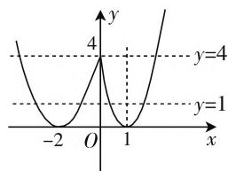
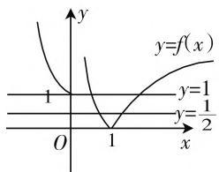
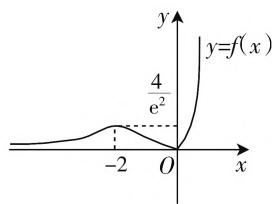

# 浅析复合函数零点的个数问题

# 湖北省武汉市武汉中学 潘良铭

高中零点问题融合了函数与方程思想、等价转化思想、数形结合思想、分类讨论思想，在解决有关问题时要用到这几者的灵活转化，复合函数零点个数问题还需要分析内、外层两个方程，具有一定的复杂性和难度，契合对学生核心素养的考查，所以一直是高考的热点和难点问题.

# 一、复合函数零点问题概述

(1) 函数 $f(x)$ 的零点即方程 $f(x) = 0$ 的根， $f(x)$ 零点个数即方程 $f(x) = 0$ 的根的个数，也即 $f(x)$ 的图像与 $x$ 轴交点的个数，若方程 $f(x) = 0 \Leftrightarrow g(x) = h(x)$ ，即为两函数 $g(x)$ 与 $h(x)$ 图像交点的个数，故函数的零点个数问题往往不需要解出零点的具体值，可结合函数图像判断.  
(2) 复合函数的零点: 设 $y = g(t)$ , $t = f(x)$ ，且函数 $f(x)$ 的值域为 $g(t)$ 定义域的子集，那么 y 通过中间变量 t 的联系而得到自变量 x 的函数，对 x 的每一个取值，都有唯一确定的 y 与之对应，称 y 是 x 的复合函数，记为 $y = g[f(x)]$ ，其中 $t = f(x)$ 为内层函数， $y = g(t)$ 为外层函数； $y = g[f(x)]$ 的零点即方程 $g[f(x)] = 0$ 的根.

# 二、复合函数零点个数分两类问题

一类是判断零点个数,另一类是已知零点个数求参数的取值范围.以下本文通过对典型例题的分析来探究一下复合函数零点问题中求零点个数和求参数的问题.

# 1. 判断复合函数零点的个数

例1 已知函数 $f(x) = \begin{cases} 5^{|x - 1|} - 1 (x \geqslant 0), \\ x^2 + 4x + 4 (x < 0), \end{cases}$ 则关于 $x$ 的方程 $f^2(x) - 5f(x) + 4 = 0$ 的实数根的个数为（ ）.

A. 2

B. 3

C. 6

D. 7

思路分析:“由内向外”讨论 x 的范围从而先确定 $f(x)$ 再代入方程求解, 计算非常复杂, 故考虑“由外向内”逐层求解.

解： $\left\{ \begin{array}{l}t = f(x)$ （内层），\\ y = t^2 - 5t + 4(外层)，先求外层函数零点，由 $t^2 -5t + 4 = 0$ 得 $t = 1$ 或4，即 $f(x) = 1$ 或4.

若 $f(x) = 1$ ，当 $x\geqslant 0$ 时，即 $5^{|x - 1|} - 1 = 1$ ，解得 $x = 1\pm \log_52$ ，当 $x <   0$ 时，即 $x^{2} + 4x + 3 = 0$ ，解得 $x$ $= -1$ 或-3.

若 $f(x) = 4$ ，当 $x\geqslant 0$ 时，即 $5^{|x - 1|} - 1 = 4$ ，解得 $x = 0$ 或2，当 $x <   0$ 时，即 $x^{2} + 4x = 0$ ，解得 $x = -4$

故所求实根个数为 7. 选 D.

解法优化: 函数 $f(x)$ 的零点个数即方程 $f(x)=0$ 的根个数, 也即 $f(x)$ 的图像与 x 轴交点的个数, 若方程 $f(x)=0\Leftrightarrow g(x)=h(x)$ , 即为两函数 $g(x)$ 与 $h(x)$ 图像交点的个数. 该问题只需要确

line

| x | y |
|---|---|
| -2 | 0 |
| 0 | 4 |
| 1 | 0 |
| 2 | 1 |

图1

定零点个数并不需要求出零点，也可画出函数图像，结合图像确定交点的个数，由 $t^2 - 5t + 4 = 0$ ，得 $t = 4$ 或1，所以 $f(x) = 4$ 或1，由函数图像 $f(x)$ 分别与 $y = 1, y = 4$ 有4个交点和3个交点，所以 $f(x) = 1, f(x) = 4$ 分别有4个根和3个根，所以方程 $f^2(x) - 5f(x) + 4 = 0$ 共有7个根.

判断复合函数零点的个数问题方法提炼: 求复合函数零点的个数方法策略: 先分别写出内层、外层对应的方程 $t = f(x)$ 和 $y = g(t)$ ，先分析外层关于 t 的方程 $y = g(t)$ ，观察 t 的取值以及个数，再分析内层关于 x 的方程 $t = f(x)$ ，将第一层 t 的值代入 $t = f(x)$ 求出每一个 $f(x)$ 被几个 x 对应，由外到内逐层拆解直到确定 x 的值（个数），最后将 x 的个数汇总相加即为 $g[f(x)] = 0$ 的根的个数即复合函数零点个数.

反馈练习1:已知 $f(x)=\left\{\begin{aligned}&|\lg x|(x>0),\\ &2^{|x|}(x\leqslant0),\end{aligned}\right.$ 则函数 $y=2f^{2}(x)-3f(x)+1$ 的零点个数是\_\_\_\_.

解: 令 $t = f(x)$ ，由 $2t^{2} - 3t + 1 = 0$ ，得 t = 1 或 $t = \frac{1}{2}$ ，所以 $f(x) = 1$ 或 $f(x) = \frac{1}{2}$ ，在坐标系中分别作出 $y = f(x)$ ， $y_{1} = 1$ ， $y_{2} = \frac{1}{2}$ 的图像，由图可知它们共有 5 个交点，故 $y = 2f^{2}(x) - 3f(x) + 1$ 共有 5 个零点.

line

| x | y = f(x) |
|---|---|
| 1 | 1 |
| 1 | 1/2 |

图2

text_image

y
y=f(x)
4/e²
-2 O x

图3

# 2. 已知复合函数的零点个数求参数的取值范围

例 2 已知函数 $f(x)$ 的图像, 若函数 $g(x)=\left[f(x)\right]^{2}-kf(x)+1$ 恰有 4 个零点, 则实数 k 的取值范围是().

A. $(- \infty, -2) \cup (2, +\infty)$

B. $\left(\frac{8}{\mathrm{e}^{2}},2\right)$

C. $\left(\frac{4}{\mathrm{e}^2} +\frac{\mathrm{e}^2}{4}, + \infty\right)$

D. $\left(2, \frac{4}{\mathrm{e}^2} + \frac{\mathrm{e}^2}{4}\right)$

思路分析:这个问题其实就是研究2个方程,外层的方程为 $t^{2}-kt+1=0$ ,设两根分别为 $t_{1}$ 和 $t_{2}$ ,再研究2个内层方程 $f(x)=t_{1}$ 和 $f(x)=t_{2}(t_{1}\leqslant t_{2})$ ,即已知2个内层方程的根加起来共4个,结合图像,考查 $f(x)$ 的图像与平行于x轴的直线 $y=t_{1}$ 的交点情况,有0个,1个,2个,或3个交点,同理与 $y=t_{2}$ 交点情况同上,那2条直线分别与 $f(x)$ 相交一共是4个交点,4个可以分配成2组, $0+4?3+1?2+2?$ 由上面分析并数形结合知只有 $3+1$ 这一种情况,也就是 $t_{1}\in\left(0,\frac{4}{\mathrm{e}^{2}}\right)$ 得3个交点, $t_{2}\in\left(\frac{4}{\mathrm{e}^{2}},+\infty\right)\cup\{0\}$ 得1个交点. 问题转化为一元二次方程 $t^2 - kt + 1 = 0$ 的根的分布问题：

解: 因为 $g(x) = \left[f(x)\right]^{2} - kf(x) + 1$ 恰有 4 个零点, 所以关于 t 的方程 $t^{2} - kt + 1 = 0$ 在 $\left(0, \frac{4}{\mathrm{e}^{2}}\right)$ 上有 1 个解, 在 $\left(\frac{4}{\mathrm{e}^{2}}, +\infty\right) \cup \{0\}$ 上有 1 个解, 经检验 t = 0 不是方程 $t^{2} - kt + 1 = 0$ 的解. 所以关于 t 的方程 $t^{2} - kt + 1 = 0$ 在 $\left(0, \frac{4}{\mathrm{e}^{2}}\right)$ 和 $\left(\frac{4}{\mathrm{e}^{2}}, +\infty\right)$ 上各有 1 个解, 令 $g(t) = t^{2} - kt + 1$ , 只需 $\left\{\begin{aligned} g(0) & > 0, \\ g\left(\frac{4}{\mathrm{e}^{2}}\right) & < 0, \end{aligned}\right.$ 所以 $\frac{16}{\mathrm{e}^{4}} - \frac{4k}{\mathrm{e}^{2}} + 1 < 0$ , 解得 $k > \frac{4}{\mathrm{e}^{2}} + \frac{\mathrm{e}^{2}}{4}$ . 选 C.

已知复合函数的零点个数求参数的取值范围问题的方法提炼:令 $t=f(x)$ 换元,一般需要作出 $f(x)$ 的图像,则 $g(t)=0$ ,即分别写出内层、外层两个方程,先估计外层方程 $g(t)=0$ 中根的个数,再根据个数与 $f(x)$ 的图像特征,分配每个函数值 $t_{i}$ 即 $f_{i}(x)$ 被几个 x 所对应,从而确定 $t_{i}$ 的取值,再在外层方程中已知根的分布范围求参数的取值范围.

# 参考文献：

[1] 蒋亚军.“巧用组合坐标系”妙解复合函数的零点问题[J].中学数学研究,2019(9).W

(上接第50页) 点 $M(m,n)$ 满足题意,则 $\overrightarrow{MA}\cdot\overrightarrow{MB}=0$ 恒成立.

$$
\begin{array}{r l} & {\overrightarrow {M A} \bullet \overrightarrow {M B} = (x _ {1} - m) (x _ {2} - m) + [ k (x _ {1} - 2) -} \\ & {n ] [ k (x _ {2} - 2) - n ] = (k ^ {2} + 1) x _ {1} x _ {2} - (2 k ^ {2} + k n +} \\ & {m) (x _ {1} + x _ {2}) + m ^ {2} + 4 k ^ {2} + 4 k n + n ^ {2} =} \\ & {\frac {(m ^ {2} + n ^ {2} - 4 m - 5) k ^ {2} - 1 2 n k - 3 (m ^ {2} + n ^ {2} - 1)}{k ^ {2} - 3} = 0, \text {所}} \end{array}
$$

以 $(m^2 + n^2 - 4m - 5)k^2 - 12nk - 3(m^2 + n^2 - 1) = 0$ 对任意的 $k^2 \neq 3$ 恒成立，则 $\left\{ \begin{array}{l} m^2 + n^2 - 4m - 5 = 0, \\ 12n = 0, \\ m^2 + n^2 - 1 = 0, \end{array} \right.$ 解得

$m = -1, n = 0$ , (参变量 k 的系数为零) 所以当直线的斜率不存在时, 易得 $M(-1, 0)$ 也满足题意, 所以存在定点 $M(-1, 0)$ , 使得无论直线如何转动, 以 AB 为直径的圆恒过定点 M.

分析: 法一为通法, 写出含参变量的方程, 然后让参变量的系数为零, 从而得出定点, 这是研究定点问题的一般方法, 缺点是因为含参数, 所以运算量大.

# 2. 法二: 先猜后证

利用 $k = 0$ 和 $k$ 不存在两种情况可以得到交点为 $M(-1,0)$ ，所以接下来只需证明定点 $M(-1,0)$ 对任意 $k^2\neq 3$ ，都有 $\overrightarrow{MA}\cdot \overrightarrow{MB} = 0$ 恒成立即可.

$$
\begin{array}{r l} & {\overrightarrow {M A} \cdot \overrightarrow {M B} = (x _ {1} + 1) (x _ {2} + 1) + [ k (x _ {1} - 2) -} \\ & {0 ] [ k (x _ {2} - 2) - 0 ] = (k ^ {2} + 1) x _ {1} x _ {2} + (1 - 2 k ^ {2}) (x _ {1} +} \\ & {x _ {2}) + 4 k ^ {2} + 1 = \frac {(k ^ {2} + 1) (4 k ^ {2} + 3)}{k ^ {2} - 3} + \frac {4 k ^ {2} (1 - 2 k ^ {2})}{k ^ {2} - 3} +} \\ & {\frac {(4 k ^ {2} + 1) (k ^ {2} - 3)}{k ^ {2} - 3} = \frac {4 k ^ {4} + 7 k ^ {2} + 3 + 4 k ^ {2} - 8 k ^ {4} + 4 k ^ {4} - 1 1 k ^ {2} - 3}{k ^ {2} - 3}} \\ & {= 0.} \end{array}
$$

分析:法二的亮点在于先利用特殊位置把定点求出来,然后证明定点满足条件,因为没有参数,所以此法运算量较少.缺点就是有些题特殊位置也很难算或特殊位置不明显.

总结: 法一: 通法: 引入参变量建立曲线的方程, 再根据对参变量要恒成立, 令参变量系数为零, 即可得出定点. 法二: 根据两种特殊情况, 求出定点, 再证明求出的定点满足条件. W