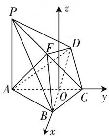
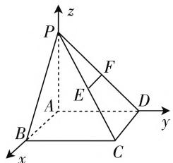
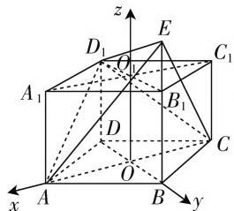

# 立体几何的“助力站”:空间向量

—— 高中数学立体几何试题分析及教学策略

● 江苏省江阴市第二中学 张志刚

立体几何内容不仅考查学生的空间想象能力，对逻辑推理等其他数学素养也有要求，因此属于高中数学中难度较大的内容。对于立体几何的相关问题，掌握课本中的基础知识、拥有较强的立体感才能保障解题的效率，对于学生而言是一个不小的挑战。近年来空间向量作为联系几何和代数的工具，被越来越多的学生运用在立体几何试题中，如何更好地利用空间向量解决立体几何问题成为研究的热门话题。通过对高中数学试题的总结和分析，找到更多的解题技巧，以此提升学生解决类似试题的解题效率。

# 一、巧妙建立空间直角坐标系

使用空间向量处理立体几何问题具有独特的“优越性”，即通过建立空间直角坐标系把几何问题转换成运算问题，其中最关键的环节在于建立合适的空间直角坐标系，也逐渐成为立体几何试题的考查重点。

例 1 如图 1, 四棱锥 P-ABCD, 已知 PA⊥底面 ABCD, BC=CD=2, AC=4, $\angle ACB=\angle ACD=\frac{\pi}{3}$ , 点 F 是 PC 的中点, AF⊥PB.

(1) 求 PA 的长度; (2) 求二面角 B-AF-D 的正弦值.

text_image

P
z
F
D
A
O
C
y
B
x

图 1

思考:本题采用空间向量法

解题,解决问题的关键在于空间直角坐标系的建立,如何利用已知几何关系找到并建立坐标系是其中的难点.在第二问求二面角的正弦值中,利用法向量求解能降低问题的难度.

解析:(1) 连接 AC、BD 相交于点 O, 因为 BC = CD = 2, 所以 $\triangle BCD$ 为等腰三角形.

因为 $\angle ACB = \angle ACD = \frac{\pi}{3}$ ，AC 平分 $\angle BCD$ ，所以 $AC \perp BD$ .

所以 $OC = CD \cos \frac{\pi}{3} = 1, AC = 4, OD = CD \sin \frac{\pi}{3} = \sqrt{3}.$

因为 AO = AC - OC，所以 AO = 3。

如图1所示，以OB为x轴，OC为y轴，平行于AP的直线为z轴，则点A的坐标为 $(0,-3,0)$ ，点B的坐标为 $(\sqrt{3},0,0)$ ，点C的坐标为 $(0,1,0)$ ，点D的坐标为 $(- \sqrt{3},0,0)$ 。

因为 $PA \perp$ 底面ABCD，所以点 $P$ 的坐标可以设为 $(0, -3, z)$ ，点 $F$ 的坐标为 $\left(0, -1, \frac{z}{2}\right)$ ，可得 $\overrightarrow{AF} = \left(0, 2, \frac{z}{2}\right), \overrightarrow{PB} = (\sqrt{3}, 3, -z)$ . 因为 $\overrightarrow{AF} \cdot \overrightarrow{PB} = 0$ ，所以 $6 - \frac{z^2}{2} = 0$ ，则 $z = 2\sqrt{3} (-2\sqrt{3}$ 与题意不符，舍去），所以 $|\overrightarrow{PA}| = 2\sqrt{3}$ .

（2）根据(1)建立的空间直角坐标系可得， $\overrightarrow{AD}=(-\sqrt{3},3,0),\overrightarrow{AB}=(\sqrt{3},3,0),\overrightarrow{AF}=(0,2,\sqrt{3})$ ，设平面FAD的法向量为 $n_{1}=(x_{1},y_{1},z_{1})$ ，平面FAB的法向量 $n_{2}=(x_{2},y_{2},z_{2})$ ，由 $n_{1}\cdot\overrightarrow{AD}=0,n_{1}\cdot\overrightarrow{AF}=0$ ，可得 $\left\{\begin{aligned}-\sqrt{3}x_{1}+3y_{1}&=0,\\ 2y_{1}+\sqrt{3}z_{1}&=0,\end{aligned}\right.$ 所以 $n_{1}=(3,\sqrt{3},-2)$ 。由 $n_{2}\cdot\overrightarrow{AB}=0,n_{2}\cdot\overrightarrow{AF}=0$ ，可得 $\left\{\begin{aligned}\sqrt{3}x_{2}+3y_{2}&=0,\\ 2y_{2}+\sqrt{3}z_{2}&=0,\end{aligned}\right.$ 所以 $n_{2}=(3,-\sqrt{3},2)$ ，所以 $\cos(n_{1},n_{2})=\frac{n_{1}\cdot n_{2}}{|n_{1}|\cdot|n_{2}|}=\frac{1}{8}$ ，所以二面角B-AF-D的正弦值为 $\frac{3}{8}\sqrt{7}$ 。

注意:建立空间直角坐标系需要依靠垂直关系的建立,因此解题时先寻找线段之间的垂直关系,再考虑建系.

# 二、寻找几何与向量等量关系

空间向量与立体几何有着许多联系,其中两线段互相垂直可以表示为向量的乘积等于0，平面之外的线段与平面平行可以表示为平面外向量与平面内任意向量成比例关系，因此解决立体几何的空间关系时，要抓住其中的等量关系，并用向量表示出来，才能提高解题能力.

例 2 如图 2 所示, 在底面是矩形的四棱锥 P-ABCD 中, $PA \perp$ 平面 ABCD, 点 E、F 分别是 PC、PD 的中点, PA = PB = 1, BC = 2.

text_image

z
P
F
A
E
D
y
B
C
x

(1) 求证: $EF \parallel$ 平面 PAB;

图2

(2) 求证: 平面 PAD ⊥ 平面 PDC.

思考:本题采用空间向量法求解.线面平行证明可以有许多办法,证明线段与平面中任意线段平行或线段与平面的法向量垂直,面面垂直证明则可以从线线垂直过渡到面面垂直或利用法向量解答.

解析:以点A为坐标系原点,AB、AD、AP所在直线分别为x轴、y轴和z轴建立空间直角坐标系,如图2所示,则点A为(0,0,0),点B为(1,0,0),点C为(1,2,0),点D为(0,2,0),点E为 $\left(\frac{1}{2},1,\frac{1}{2}\right)$ ,点F为 $\left(0,1,\frac{1}{2}\right)$ ,点P为(0,0,1),所以 $\overrightarrow{EF}=\left(-\frac{1}{2},0,0\right)$ , $\overrightarrow{AP}=(0,0,1)$ , $\overrightarrow{AD}=(0,2,0)$ , $\overrightarrow{AB}=(1,0,0)$ , $\overrightarrow{DC}=(1,0,0)$ .

(1) 因为 $\overrightarrow{EF} = -\frac{1}{2}\overrightarrow{AB}$ ，所以 $\overrightarrow{EF} \parallel \overrightarrow{AB}$ ，即 $EF \parallel AB$ 。因为 $EF \not\subset$ 平面 PAB， $AB \subset$ 平面 PAB，所以 $EF \parallel$ 平面 PAB。  
(2) 因为 $\overrightarrow{AP} \cdot \overrightarrow{DC} = 0, \overrightarrow{AD} \cdot \overrightarrow{DC} = 0$ ，所以 $AD \perp DC, AP \perp DC$ 。因为 $AP \cap AD = A, AP \subset$ 平面 PAD, $AD \subset$ 平面 PAD，所以 $DC \perp$ 平面 PAD。因为 $DC \subset$ 平面 PDC，所以平面 $PAD \perp$ 平面 PDC。

# 三、把握经典与创新立体几何

立体几何与空间向量相结合既有经典的试题,如证明线与线、线与面、面与面之间的几何关系,求两个平面构成的二面角大小,也有创新类试题,如动点存在、恒成立问题.这些试题都在考查的范围内,因此学生要全面把握这些类型的解题技巧与方法.

例 3 直四棱柱 $ABCD - A_{1}B_{1}C_{1}D_{1}$ 中，底面 ABCD 为菱形，且 $\angle BAD = 60^{\circ}, AA_{1} = AB$ ，点 E 为$BB_{1}$ 的延长线上一点， $D_{1}E \perp$ 平面 $D_{1}AC$ ，设 AB = 2，

(1) 求二面角 $E - AC - D_{1}$ 的大小.  
(2) 在 $D_{1}E$ 上是否存在一点 P，使 $A_{1}P \parallel$ 平面 EAC？若存在，求 $D_{1}P : PE$ 的值；若不存在，请说明理由.

思考:本题既求二面角的大小,也要求学生探索点P的存在性,还需要对几何图形有一定的把握,属于一道综合性较强的试题,对学生的数学能力要求较高.该

text_image

z
D₁
E
C₁
O₁
A₁
B₁
D
O
C
A
B
y
x

图 3

题可以采用空间向量法解题, 将试题直观简洁化, 提高解题效率.

解析:(1)设AC、BD相交于点 $O,A_{1}C_{1},B_{1}D_{1}$ 相交于点 $O_{1}$ ，以OA、OB、 $OO_{1}$ 为x、y、z轴建立空间直角坐标系，则点A为 $(\sqrt{3},0,0)$ ，点B为 $(0,1,0)$ ，点C为 $(- \sqrt{3},0,0)$ ，点D为 $(0,-1,0)$ ，点 $D_{1}$ 为 $(0,-1,2)$ ，设点E为 $(0,1,2+h)$ ，则有 $\overrightarrow{D_{1}E}=(0,2,h),\overrightarrow{CA}=(2\sqrt{3},0,0),\overrightarrow{D_{1}A}=(\sqrt{3},1,-2)$ ，因为 $D_{1}E\perp$ 平面 $D_{1}AC$ ，所以 $D_{1}E\perp AC,D_{1}E\perp D_{1}A$ ，所以 $2-2h=0,h=1$ ，点E的坐标为 $(0,1,3)$ ，所以 $\overrightarrow{D_{1}E}=(0,2,1),\overrightarrow{AE}=(-\sqrt{3},1,3)$ .

设平面 EAC 的法向量为 $\boldsymbol{n}=(x,y,z)$ ，则有 $n\cdot\overrightarrow{AC}=0, n\cdot\overrightarrow{AE}=0$ ，可得 $\left\{\begin{aligned}x=0,\\ -\sqrt{3}x+y+3z=0,\end{aligned}\right.$ 令 z=-1，则 $\boldsymbol{n}=(0,3,-1)$ ，因为平面 $ACD_{1}$ 的法向量为 $\overrightarrow{D_{1}E}$ ，所以 $\cos\langle n,\overrightarrow{D_{1}E}\rangle=\frac{\sqrt{2}}{2}$ ，所以二面角 E-AC-D\_{1} 为 $45^{\circ}$ .

(2) 设 $\overrightarrow{D_{1}P} = \lambda \overrightarrow{PE} = \lambda (\overrightarrow{D_{1}E} - \overrightarrow{D_{1}P})$ ，所以 $\overrightarrow{D_{1}P} = \frac{\lambda}{1 + \lambda} \overrightarrow{D_{1}E} = \left(0, \frac{2\lambda}{1 + \lambda}, \frac{\lambda}{1 + \lambda}\right)$ ， $\overrightarrow{A_{1}P} = \overrightarrow{A_{1}D_{1}} + \overrightarrow{D_{1}P} = \left(-\sqrt{3}, \frac{\lambda - 1}{1 + \lambda}, \frac{\lambda}{1 + \lambda}\right)$ ，因为 $A_{1}P \parallel$ 平面 EAC，所以 $\overrightarrow{A_{1}P} \cdot n = 0, \lambda = \frac{3}{2}$ ，所以存在点 P 使 $A_{1}P \parallel$ 平面 EAC，此时 $D_{1}P : PE = 3 : 2$ .

总之,当空间向量成为立体几何的主要解题工具时,建立空间直角坐标系和寻找代数、几何之间的等量关系成为解题的关键.学生只有同时掌握经典和创新题型,才能全面提升解题能力和效率. F