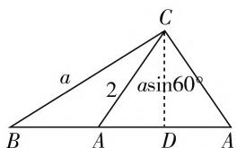
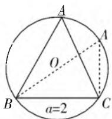

# 聚焦解三角形中“一边一角”求范围问题

# 河南省固始高级中学 李光胜

解三角形是必修5的重要内容，是必修4三角函数的延续，作为高中数学的重点章节，是全国卷必考内容之一。高考主要考查利用正弦定理、余弦定理、面积计算公式等知识点的解题能力。解三角形涉及的题型较为丰富，有些题目灵活多变，但难度适中，属中低档题。高考全国卷解三角命题的一种常见模式：已知“一边一角”求范围的问题。本文对这一常见问题进行分类、归纳和总结，希望对大家以后应对这类问题能有所帮助。

# 一、“一角及其对边”类型

# 1. 已知“一角及其对边”，求其他边的范围

例 1 △ABC 的内角 A, B, C 的对边分别为 a, b, c. 已知 $b = 2, B = 60^{\circ}$ . 如果 △ABC 有两组解, 求 a 的范围.

解法一:代数法(大题)

由正弦定理： $\frac{a}{\sin A} = \frac{b}{\sin B}$ 得 $\frac{a}{\sin A} = \frac{2}{\sin 60^{\circ}}$ ，则 $a = \frac{4\sqrt{3}}{3}\sin A,A\in (0^{\circ},120^{\circ}).$

当 $\sin A = 1$ 时, $A = 90^{\circ}$ , 三角形只有一解, 所以舍去.

当 $\sin A \neq 1$ 时，即 $\sin A \in (0,1)$ ，三角形有两解，则角 A 的两解互补.

所以 $A > B = 60^{\circ}$ （若 $A < B$ ，则三角形只有一解，不适合），所以 $a > b = 2$ .又因为 $a = \frac{4\sqrt{3}}{3}\sin A <   \frac{4\sqrt{3}}{3}$ 所以 $2 <   a <   \frac{4\sqrt{3}}{3}.$

解法二:图形法(小题)

如图 1 所示: CD = a sin60°, 若三角形有两解, 由图 1 得 a sin60° < 2 < a, 所以

$$
2 <   a <   \frac {4 \sqrt {3}}{3}.
$$

text_image

C
a
2 asin60°
B A D A

图1

# 2. 已知“一角及其对边”，求周长或另两边代数式的范围

例 2 △ABC 的内角 A, B, C 的对边分别为 a, b, c. 已知 $a = 2, A = 60^{\circ}$ ,

(1) 求 $\triangle ABC$ 周长的范围；  
(2) 求 c-2b 的范围.

解:(1) 法一, 利用正弦定理与辅助角, 转化三角函数求值域.

因为 $\frac{a}{\sin A} = \frac{b}{\sin B} = \frac{c}{\sin C}$ ，所以 $\frac{2}{\sin 60^\circ} = \frac{b}{\sin B} = \frac{c}{\sin C}$ ，所以 $b = \frac{4\sqrt{3}}{3}\sin B, c = \frac{4\sqrt{3}}{3}\sin C = \frac{4\sqrt{3}}{3}\sin (B + 60^\circ)$ ，所以周长 $l = a + b + c = \frac{4\sqrt{3}}{3}\sin B + \frac{4\sqrt{3}}{3}\sin (B + 60^\circ) + 2 = \frac{4\sqrt{3}}{3}\left(\frac{3}{2}\sin B + \frac{\sqrt{3}}{2}\cos B\right) + 2 = 4\sin (B + 30^\circ) + 2.$

因为 $B \in (0^{\circ}, 120^{\circ})$ ，所以 $B + 30^{\circ} \in (30^{\circ}, 150^{\circ})$ ，所以 $\frac{1}{2} < \sin(B + 30^{\circ}) \leqslant 1$ ，所以 $2 < 4\sin(B + 30^{\circ}) \leqslant 4$ ，所以 $4 < a + b + c \leqslant 6$ ，所以三角形周长的范围为 $(4, 6]$ .

法二,利用余弦定理、基本不等式放缩及三角形性质求出范围.

因为 $a^2 = b^2 + c^2 - 2bc\cos A$ ，所以 $4 = b^2 + c^2 - 2bc\cos 60^\circ$ ，所以 $b^2 + c^2 - bc = 4$ ，所以 $(b + c)^2 = 4 + 3bc \leqslant 4 + 3\left(\frac{b + c}{2}\right)^2$ ，所以 $\frac{1}{4}(b + c)^2 \leqslant 4$ ，所以 $b + c \leqslant 4$ （当且仅当 $b = c$ 时，取“=”）.

又在三角形中， $b+c>a=2$ ，所以 $2<b+c\leqslant4$ ，所以 $4<a+b+c\leqslant6$ ，所以三角形周长的范围为(4,6].

(2) 由(1)可知: $b = \frac{4\sqrt{3}}{3}\sin B, c = \frac{4\sqrt{3}}{3}\sin (B + 60^{\circ})$ , 所以 $c - 2b = \frac{4\sqrt{3}}{3} (\sin (B + 60^{\circ}) - 2\sin B) =$

$$
\frac {4 \sqrt {3}}{3} \left(\frac {\sqrt {3}}{2} \cos B - \frac {3}{2} \sin B\right) = 4 \cos (B + 3 0 ^ {\circ}).
$$

因为 $B \in (0^{\circ}, 120^{\circ})$ ，所以 $B + 60^{\circ} \in (60^{\circ}, 180^{\circ})$ ，所以 $\cos(B + 60^{\circ}) \in \left(-1, \frac{1}{2}\right)$ ，所以 $c - 2b \in (-4, 2)$ ，所以 $c - 2b$ 的范围为 $(-4, 2)$ .

# 3. 已知“一角及其对边”，求面积的范围(最大值)

例 3 （2014·全国Ⅱ卷）已知 a, b, c 分别为 $\triangle ABC$ 的三个内角 A, B, C 的对边，a = 2，且 $(2 + b)(\sin A - \sin B) = (c - b)\sin C$ ,

(1) 求 A;

(2) 求 $\triangle ABC$ 面积的最大值.

分析:(1)由正弦定理角化边,再根据整体代换思想利用余弦定理求角.

(2) 由(1)得一边一角, 求面积方法较多. 方法一, 利用余弦定理、基本不等式放缩求出范围. 方法二, 利用图像及正弦定理. 方法三, 利用正弦定理、二倍角公式及辅助角公式, 转化三角函数求值域.

解:(1)由a=2且 $(2+b)(\sin A-\sin B)=(c-b)\sin C$ ，得 $(a+b)(\sin A-\sin B)=(c-b)\sin C$ ，由正弦定理得 $(a+b)(a-b)=(c-b)c$ ，所以 $b^{2}+c^{2}-a^{2}=bc$ ，故 $\cos A=\frac{b^{2}+c^{2}-a^{2}}{2bc}=\frac{1}{2}$ ，所以 $A=60^{\circ}$ .

(2) 方法一, 由(1)得 $b^{2} + c^{2} - 4 = bc$ , 所以 $4 = b^{2} + c^{2} - bc \geqslant bc$ (当且仅当 $b = c$ 时, 取“=”), 所以 $S_{\triangle ABC} = \frac{1}{2} bc \sin A \leqslant \sqrt{3}$ , 所以 $\triangle ABC$ 面积的最大值为 $\sqrt{3}$ .

方法二,利用图像及正弦定理:

由(1)得 $\triangle ABC$ 中, $A = 60^{\circ}, a = 2$ , 根据正弦定理, $\triangle ABC$ 的外接圆半径为定值, 如图2所示:

在 $\odot O$ 上作两点 B, C, 使 BC = 2, 点 A 在圆周上运动 (除 B, C 两点), 当点 A 平分优弧 BC 时, BC 边上的高最大， $\triangle ABC$ 的面积取得最大值，此时 $\triangle ABC$ 为等边三角形， $\triangle ABC$ 的面积 $\frac{\sqrt{3}}{4} \times 2^2 = \sqrt{3}$ .

方法三，略.

点评:本题考查正弦定理、余弦定理、三角形面积计算公式、二倍角公式、辅助角公式及基本不等式等知识点,熟练掌握并灵活应用定理及公式是解题关键.

  
图 2

# 二、已知斜三角形中“一角及邻边”，求面积和周长的范围

例 4 已知锐角 $\triangle ABC$ 内角 A, B, C 的对边分别为 a, b, c. 若 $B = 60^{\circ}$ 且 c = 1，求 $\triangle ABC$ 面积的取值范围.

解: 方法一: 由余弦定理得 $b^{2}=a^{2}+c^{2}-2ac\cos B$ . 又 $B=60^{\circ}$ 且 c=1, 所以 $b^{2}=a^{2}-a+1$ .

又 $\triangle ABC$ 为锐角三角形，所以 $a^2 + b^2 > c^2$ 且 $a^2 + c^2 > b^2$ 且 $b^2 + c^2 > a^2$ .

将 $b^{2} = a^{2} - a + 1, c = 1$ 代入上式，得 $\frac{1}{2} < a < 2$ ， $S_{\triangle ABC} = \frac{1}{2} ac \sin B = \frac{\sqrt{3}}{4} a$ ，所以 $\frac{\sqrt{3}}{8} < S_{\triangle ABC} < \frac{\sqrt{3}}{2}$ .

所以 $\triangle ABC$ 面积的取值范围为 $\left(\frac{\sqrt{3}}{8},\frac{\sqrt{3}}{2}\right)$ .

方法二：由题意知 $\triangle ABC$ 的面积 $S_{\triangle ABC} = \frac{1}{2} ac\sin B = \frac{\sqrt{3}}{4} a.$

由正弦定理得 $a = \frac{c\sin A}{\sin C} = \frac{\sin(120^{\circ} - C)}{\sin C} = \frac{\sqrt{3}}{2\tan C} +\frac{1}{2}.$

$\triangle ABC$ 为锐角三角形，故 $0^{\circ} < A < 90^{\circ}$ . 由 $B = 60^{\circ}$ ，得 $A + C = 120^{\circ}$ ，所以 $A = 120^{\circ} - C$ ，所以 $0^{\circ} < 120^{\circ} - C < 90^{\circ}$ . 又 $0^{\circ} < C < 90^{\circ}$ ，所以 $30^{\circ} < C < 90^{\circ}$ ，则 $\tan C > \frac{\sqrt{3}}{3}$ ，故 $\frac{1}{2} < a < 2$ ，从而 $\frac{\sqrt{3}}{8} < S_{\triangle ABC} < \frac{\sqrt{3}}{2}$ .

所以 $\triangle ABC$ 面积的取值范围为 $\left(\frac{\sqrt{3}}{8},\frac{\sqrt{3}}{2}\right)$ .

点评: 求三角形中的最值、范围问题需注意两点:

(1) 解三角形问题中, 求解某个量(式子)的最值(范围)的基本思路为: 通过正弦定理、余弦定理、面积计算公式等建立所求量(式子)与角或边的关系, 转化为边或角的函数关系, 进而转化为求函数值域问题. 利用已知条件范围限制, 以及三角形自身范围限制, 找准自变量边或角的范围, 避免结果放大.

(2) 特别注意题目隐含条件及本身性质, 如本例中锐角三角形的条件, 又如 $A + B + C = \pi, 0 < A < \pi, b - c < a < b + c$ , 三角形中大边对大角等三角形的性质. W