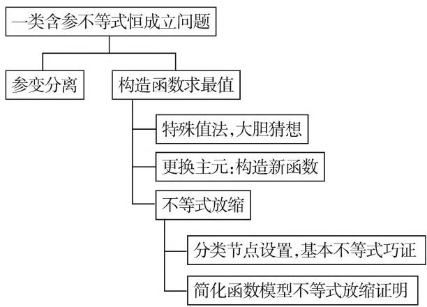
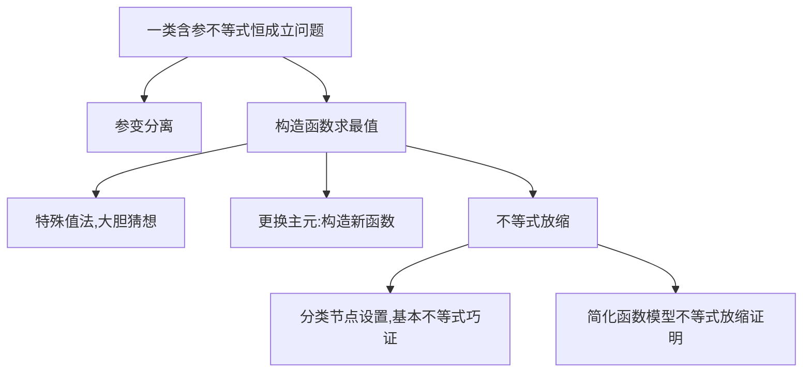
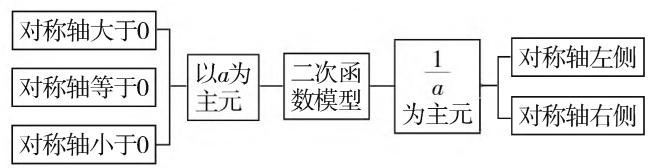
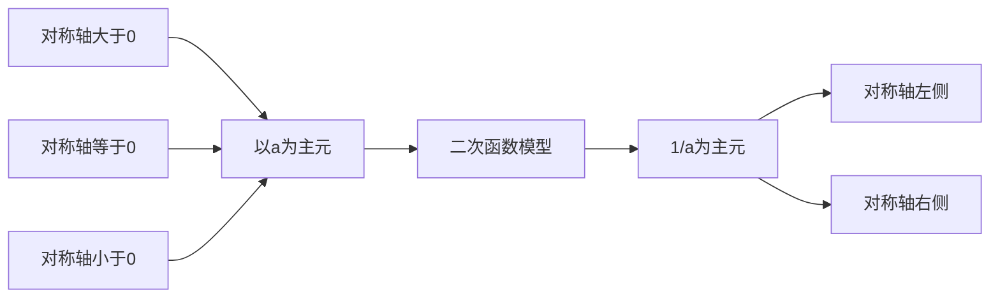

# 解决一类含参不等式恒成立问题的常用方法

——2019年浙江省高考压轴题解决策略探析

● 浙江省杭州第七中学 陈宏  
● 浙江省杭州第七中学 林 杨  
● 浙江省杭州第七中学 邢星

2019年浙江省压轴题表述简洁，立意新颖，知识交汇丰富，多层次多角度地全面考查了学生的数学思维和素养。尤其最后一问对逻辑推理、数学建模、数学运算、直观想象等核心素养要求较高，为高校选拔和学生进一步学习所需掌握的技能、思想、方法创造条件。

# 一、原题

（第22题）已知实数 $a \neq 0$ ，设函数 $f(x) = a \ln x + \sqrt{1 + x}, x > 0$ .

（Ⅰ）当 $a = -\frac{3}{4}$ 时，求函数 $f(x)$ 的单调区间；  
（Ⅱ）对任意 $x \in \left[\frac{1}{\mathrm{e}^2}, +\infty\right)$ 均有 $f(x) \leqslant \frac{\sqrt{x}}{2a}$ ，求 $a$ 的取值范围.

注： $e=2.71828\cdots$ 为自然对数的的底数.

# 二、题目剖析

类似第(Ⅱ)题常用的思路是:直接构造函数,求函数最值;参变分离,求新函数最值问题.但此题不能简单地实现参变分离,也不能通过直接构造关于x的函数求得最值.因此想到先取几个特殊值,通过必要性探路,大胆猜想、小心求证来解决问题.

在研究本题解答过程中,总结这类问题的常见思考途径,如思维导图(如图1),以此探究第(Ⅱ)题的几种解法.

# 三、解法探析

通过对 $x$ 的赋值来缩小 $a$ 的范围，比如： $x = 1$ 可以得到简洁的结果： $f(1) = \sqrt{2} \leqslant \frac{1}{2a}$ ，求解比较容易，

flowchart

图1

解此不等式得: $0 < a \leqslant \frac{\sqrt{2}}{4}$ .

此时也无其他条件去求得 a 的新取值范围, 所以不妨大胆将问题转化为: 当 $0 < a \leqslant \frac{\sqrt{2}}{4}$ 时, $f(x) = a \ln x + \sqrt{1 + x} \leqslant \frac{\sqrt{x}}{2a}$ 对任意 $x \geqslant \frac{1}{e^{2}}$ 是否恒成立?

即将该问题转化成一个二元不等式证明问题，从主元确定的角度出发，考虑到 $x$ 的不等式求最值比较困难，尝试把参数 $a$ 看成主元，构建二次函数模型.

# 思路 1:(主元法)

要证明 $f(x) = a\ln x + \sqrt{1 + x}\leqslant \frac{\sqrt{x}}{2a}$ 即要证 $2\ln x\cdot a^2 +2\sqrt{1 + x}\cdot a - \sqrt{x}\leqslant 0.$

令 $g(a)=2\ln x \cdot a^{2}+2\sqrt{1+x} \cdot a-\sqrt{x}$ ，若以 a 为主元，要分类讨论，若换元，记 $m=\frac{1}{a}(m \geqslant 2\sqrt{2})$ ，则

要讨论对称轴在 $m = 2\sqrt{2}$ 两侧.

思维流程如图 2:

flowchart

图2

解 1: (以 a 为主元)

① 当 $2\ln x > 0$ ，即 $x > 1$ 时，此时对称轴为 $a = -\frac{\sqrt{1 + x}}{2\ln x} < 0, g(a)$ 在 $a \in \left(0, \frac{\sqrt{2}}{4}\right]$ 上单调递增，

所以 $g(a)_{\max} = g\left(\frac{\sqrt{2}}{4}\right) = \frac{1}{4}\ln x + \frac{\sqrt{2}}{2}\sqrt{1 + x} -$ $\sqrt{x} = -\frac{1}{4} h_1(x),$

其中 $h_1(x) = 4\sqrt{x} - 2\sqrt{2}\sqrt{1 + x} - \ln x.$

因为 $h_1'(x) = \frac{2}{\sqrt{x}} - \frac{\sqrt{2}}{\sqrt{1 + x}} - \frac{1}{x}$

$$
\begin{array}{l} = \frac {2 \sqrt {x} \sqrt {1 + x} - \sqrt {2} x - \sqrt {1 + x}}{x \sqrt {1 + x}} \\ = \frac {(x - 1) [ 1 + \sqrt {x} (\sqrt {2 x + 2} - 1) ]}{x \sqrt {1 + x} \cdot (\sqrt {x} + 1) \cdot (\sqrt {1 + x} + \sqrt {2} \sqrt {x})}, \\ \end{array}
$$

所以当 x > 1 时, $h_{1}^{\prime}(x) > 0$ ,

即 $h_1(x)$ 在 $x \in (1, +\infty)$ 上递增，

此时 $h_1(x) > h(1) = 0$

即证 $g(a)\leqslant g\left(\frac{\sqrt{2}}{4}\right) = -\frac{1}{4} h_1(x) <   0$ 显然成立.

注:由于观察出 1 是 $h_{1}^{\prime}(x)$ 的零点,于是对其分子有理化便于判断 $h_{1}^{\prime}(x)$ 的符号.

② $2\ln x=0$ ，即x=1时， $g(a)=2\sqrt{2}\cdot a-1$ 为a的一次函数，当 $0<a\leqslant\frac{\sqrt{2}}{4}$ 时，易证得 $g(a)\leqslant0$ .

③ $2\ln x<0$ ，即 $\frac{1}{e^{2}}\leqslant x<1$ 时，此时对称轴为a $=-\frac{\sqrt{1+x}}{2\ln x}>0,\Delta(x)=4(x+1+2\sqrt{x}\cdot\ln x)$ ，令 $u(x)=x+1+2\sqrt{x}\cdot\ln x$ ，考虑上式符号，若负则结论成立.

因为 $u'(x)=\frac{\sqrt{x}+2+\ln x}{\sqrt{x}}$ ，且 $u'(x)$ 在 $x\in$

$\left[\frac{1}{\mathrm{e}^2},1\right)$ 上单调递增，故 $u^{\prime}(x)\geqslant u^{\prime}\left(\frac{1}{\mathrm{e}^{2}}\right) > 0,$

所以 $\Delta (x)$ 在 $x\in \left[\frac{1}{\mathrm{e}^2},1\right)$ 上单调递增；

而 $\Delta \left(\frac{1}{\mathrm{e}^2}\right) < 0, \Delta (1) > 0$ ，因此存在唯一的 $x_0 \in \left[\frac{1}{\mathrm{e}^2}, 1\right)$ ，使得：

当 $x \in \left[\frac{1}{\mathrm{e}^2}, x_0\right]$ 时， $\Delta(x) \leqslant 0$ ，此时 $g(a) = 2\ln x \cdot a^2 + 2\sqrt{1 + x} \cdot a - \sqrt{x} \leqslant 0$ 恒成立.

当 $x \in (x_0, 1)$ 时， $\Delta(x) > 0$ ，此时证明需要考虑对称轴 $a = -\frac{\sqrt{1 + x}}{2\ln x}$ 与 $\frac{\sqrt{2}}{4}$ 的大小.

试证明 $a = -\frac{\sqrt{1 + x}}{2\ln x} \geqslant \frac{\sqrt{2}}{4}$ ，而且在 $a = \frac{\sqrt{2}}{4}$ 处函数值小于或等于0，则 $g(a)$ 的最大值小于或等于0，即证 $\sqrt{2x + 2} + \ln x \geqslant 0$ ，其中 $x \in (x_0, 1)$ .

令 $\varphi (x) = \sqrt{2x + 2} +\ln x$ ，显然单调递增，则 $\varphi (x)\geqslant \varphi (x_0) = \sqrt{2x_0 + 2} +\ln x_0$ ，而 $x_0 + 1 + 2\sqrt{x_0}$ $\cdot \ln x_0 = 0.$

故 $\varphi (x)\geqslant \varphi (x_0) = \sqrt{2x_0 + 2} -\frac{x_0 + 1}{2\sqrt{x_0}} =$ $\sqrt{x_0 + 1}\bullet \left(\sqrt{2} -\frac{\sqrt{x_0 + 1}}{2\sqrt{x_0}}\right).$

欲使 $\varphi(x_0) \geqslant 0$ , 只需 $x_0 \geqslant \frac{1}{7}$ ,

而 $\Delta\left(\frac{1}{7}\right) \leqslant 0$ 显然成立, 故 $g(a)$ 在 $\left(0, \frac{\sqrt{2}}{4}\right]$ 上递增, 所以 $g(a) \leqslant g\left(\frac{\sqrt{2}}{4}\right) = -\frac{1}{4} h_1(x) \leqslant -\frac{1}{4} h_1(1) = 0$ .

综上，对任意 $a \in \left(0, \frac{\sqrt{2}}{4}\right], g(a) \leqslant 0$ 恒成立.

由于方法1中要讨论开口方向，尝试处理以下式子： $\frac{\sqrt{x}}{a^2} -\frac{2\sqrt{1 + x}}{a} -2\ln x\geqslant 0$ （\*），这样作为 $\frac{1}{a}$ 的二次函数考虑时，开口方向不需要再分类讨论.

# 思路 2: (主元互换)

解 2: 把不等式左边看成关于 a 的函数对 $F(a)$ 讨论, 也可以是基于对勾函数 $y = x + \frac{1}{x}$ 和飘带函数 y =

$x - \frac{1}{x}$ 的理解.

若 $\ln x > 0$ ，即 $x > 1$ ，则 $F(a) = a\ln x - \frac{\sqrt{x}}{2a} +$ $\sqrt{x + 1}$ 为飘带函数，在 $\left(0,\frac{\sqrt{2}}{4}\right]$ 上单调递增，即 $F(a)_{\max} = F\left(\frac{\sqrt{2}}{4}\right) = \frac{\sqrt{2}}{4}\ln x - \sqrt{2x} +\sqrt{x + 1} = G(x),$ $G^{\prime}(x) = \frac{1}{2\sqrt{2}x} -\frac{1}{\sqrt{2x}} +\frac{1}{2\sqrt{x + 1}} =$ $\frac{\sqrt{x + 1} - 2\sqrt{x}\sqrt{x + 1} + \sqrt{2}x}{2\sqrt{2}x\sqrt{x + 1}}.$

此时出现类似 $h_1'(x)$ 的式子，可尝试进行适当的变化再进行运算.由于函数 $G(x)$ 中出现了两个根式，使得求导后得到的结果复杂，因此 $\sqrt{x}$ 用 $x$ 替换，又 $\ln x^{2} = 2\ln x$ ，故 $2a$ 用 $t$ 表示，证：

当 $0 < t \leqslant \frac{\sqrt{2}}{2}, \forall x \geqslant \frac{1}{\mathrm{e}}, h_2(t) = t \ln x - \frac{x}{t} + \sqrt{x^2 + 1} \leqslant 0$ 恒成立.

① 若 $\ln x > 0$ ，即 $x > 1, h_2(t) = t\ln x - \frac{x}{t} + \sqrt{x^2 + 1}$ 为飘带函数，所以 $h_2(t)_{\max} = h_2\left(\frac{\sqrt{2}}{2}\right) = \frac{\sqrt{2}}{2}\ln x - \sqrt{2} x + \sqrt{x^2 + 1} = H(x)$ ，

所以 $H'(x)=\frac{1}{\sqrt{2}x}-\sqrt{2}+\frac{x}{\sqrt{x^{2}+1}}$ ,

所以 $H''(x) = -\frac{1}{\sqrt{2}x^2} + \frac{1}{(x^2 + 1)\sqrt{x^2 + 1}} < 0$

所以 $H'(x)$ 在 $(1, +\infty)$ 上单调递减，即 $H'(x)_{\max} = H'(1) = 0$ ，因此 $H(x)$ 单调递减.

所以 $H(x)_{\max}=H(1)=0.$

② 若 $\ln x < 0$ ，即 $0 < x < 1, h_2(t) = t\ln x - \frac{x}{t} + \sqrt{x^2 + 1}$ 为对勾函数，令 $p(x_0) = 2x_0 + \ln x_0 = 0$ ，则 $x_0 < \frac{1}{2} \Rightarrow x_0 < x < 1, t \in \left(0, \frac{\sqrt{2}}{2}\right], h_2(t)$ 递增。为了进一步优化函数， $\frac{1}{x}$ 用 $x$ 替换表示。

证明函数: $r(x)=-\frac{\sqrt{2}}{2}x\ln x-\sqrt{2}+\sqrt{x^{2}+1}\leqslant$

$0, x \in \left(1, \frac{1}{x_0}\right)$ 恒成立.

因为 $r^{\prime}(x) = -\frac{\sqrt{2}}{2} (\ln x + 1) + \frac{x}{\sqrt{x^{2} + 1}},$

所以 $r''(x) = -\frac{1}{\sqrt{2}x} + \frac{1}{(x^2 + 1)\sqrt{x^2 + 1}} < 0$

所以 $r(x)_{\max} = r(1) = 0.$

若 $\sqrt{-\frac{x}{\ln x}} < \frac{\sqrt{2}}{2} \Rightarrow \frac{1}{\mathrm{e}} < x < x_0, h_2(t)_{\max} = -2\sqrt{-x\ln x} + \sqrt{x^2 + 1}$ ,

即证: $h_{2}(t)_{\max}\leqslant0$ 恒成立 $\Leftrightarrow g_{2}(x)=x^{2}+4x\ln x+1\leqslant0,$

由 $g^{\prime}_{2}(x) = 2x + 4\ln x + 4 \Rightarrow g^{\prime}_{2}(x) > 0$

因为 $x \in \left(\frac{1}{\mathrm{e}}, x_0\right), g_2(x)$ 递增且 $x_0 < \frac{1}{2}$ ,

所以 $g_{2}(x)_{\max} = g_{2}(x_{0}) <   g_{2}\left(\frac{1}{2}\right) <   0.$

# 四、反思总结

2019 年浙江省压轴题用变量分离法有困难,需要先做必要性、后做充分性,较难想到(也是第一次以如此思维方式考查,体现了浙江省题型的灵活多变);必要性中特殊值 x=1 的选择,得出 $0<a\leqslant\frac{\sqrt{2}}{4}$ 恰好满足充分性,即为所求答案;在充分性验证中对变换主元、分类讨论、二阶求导、数形结合、适当放缩以及运算能力都提出较高的要求,因此有如下解题感悟:

不等含参本是难,对数插足不简单;

导数求解难又烦,参变分离可初探;

主元互换试消参,适当放缩繁化简.

这也充分考查了学生的六大核心素养,尤其是对逻辑推理和数学建模、数学运算、直观想象、数据分析等核心素养提出了更高的要求,对学生的创新能力的要求也越来越高.

# 参考文献：

[1] 鲁如明. 从浙江省 2012 年、2013 年理科数学高考压轴题看主元法思想 [J]. 数学学习与研究, 2014(9).

[2] 林国夫. 对 2015 年浙江省高考数列压轴题放缩策略的思维探析 [J]. 中学数学教学, 2015(4). F