# 轴对称图形操作题分类探析

# ● 福建省福鼎市第十七中学 江祥银

美国华盛顿一所大学里写着这样一句名言:我听见了,但我可能忘记;我看见了,就可能记住;我做过了,便真正理解了.新课标指出,以学生的发展为本,动手实践,自主探索,合作交流是学生学习数学的重要手段.可见,动手实践操作的重要性,在学生记忆深处,印象最深的不是书本上的知识,不是别人的思想,而是自己思考创造的活动.在轴对称一章中,这样的实例随处可见,其中剪纸、拼图和折纸试题在培养学生的动手操作能力的同时,也培养了学生的空间想象能力.

# 一、剪切图形

剪纸是一种古老的艺术，中国的大文豪郭沫若对此是这样评价的：一剪之巧夺神功，美在民间永不朽。且通过折叠纸片然后剪纸在日常生活里的应用也很广，在制作玩具模型或装修室内时都会用到这种剪纸工艺，剪纸艺术的根本原理是轴对称，所以剪出的图形基本上都是轴对称图形。

例 1 如图 1 是一张正方形纸片, 将纸片先横向对折, 再纵向对折, 再沿图中的虚线剪裁, 再将余下部分打开辅平, 所得图案是下列图案中的().

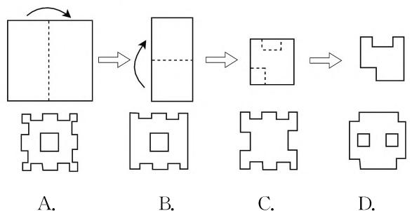

flowchart

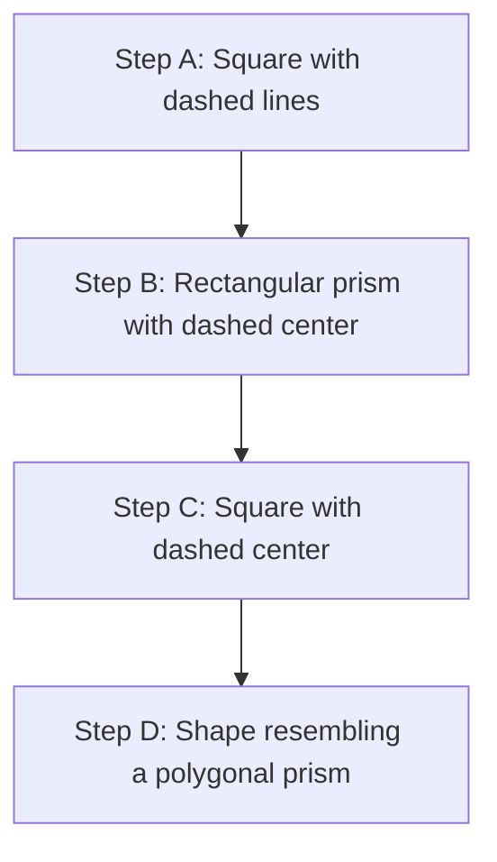

图1

分析: 此问题比较复杂, 可以通过动手操作得到答案, 也可以在头脑中进行思维实验. 把折叠过程倒回去, 即余下部分先沿水平折痕向下翻折, 可得上、下各一个缺口, 右边没缺口; 再沿竖直折痕向左翻折, 可得上、下各有两个缺口, 左、右都没有缺口, 中间会有一个孔. 故选 B.

例 2 如图 2 是一张矩形纸片, 沿两个互相垂直的方向对折后,再剪去一个角,那么剪切线与折痕的夹角应为().

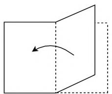

natural_image

Simple 3D diagram showing a rectangular plane with an arrow indicating rotation or direction (no text or symbols)

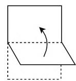

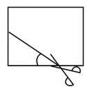  
图2  
A. 22. $5^{\circ}$   
B. $30^{\circ}$   
C. $45^{\circ}$   
D. $60^{\circ}$

分析:一张长方形纸片对折两次后,剪下一个角,因为这个角是直角三角形,而四个全等的直角三角形拼成的图形是菱形,所以剪出的图形是菱形,而菱形的两条对角线分别是两组对角的平分线,所以当剪口线与折痕成 $45^{\circ}$ 角时,菱形就变成了正方形.故选C.

点评:例 1、例 2 都是折叠后剪切,最简单的方法是动手实际操作一下,严格按照题中的折叠顺序进行折叠,在相应的位置剪切,展开后与被选项进行对照即可.也可以将剪后的图形在头脑中依次打开,即将折叠的过程倒回去,一般来说,对折几次,最后的图形就有几条对称轴.

# 二、拼合图形

拼图,作为益智游戏的典型,一直被人们所喜爱着.我国的一种拼图游戏名为七巧板,其有利于培养拼图者的想象力和创造力.而拼图在欧美国家强调的是拼图人的记忆力和逻辑能力,在1760年出现这种拼图游戏,也就是将一幅图画粘在硬纸板上,再剪开成几块不规则的形状,图画后面有文字介绍,它具有一定的教育意义.按一定的要求把几个图形拼成一个完美的图形,叫作图形的拼合,当原来的几个图形面积相等时,称之为等面积拼合.因为轴对称图形在对称轴两旁的部分全等,所以用等面积拼合可以拼出轴对称图形.

例 3 如果有两个全等的三角形,用这两个三角形实际上可以拼出各种各样不同的图案,如图 3 已画出其中一个三角形,请你补出另一个三角形,使所画三角形与原三角形全等,并且使补全的图形是轴对称图形. 当然, 两个三角形可以有重叠部分. (至少画出 5 种不同的方法)

分析:用两个全等三角形拼成一个轴对称图形,两个三角形允许有重叠部分,这样的图形有无数种.因为是拼图,所以两个三角形要有接触才行,我们可以用经过三角形边上任一点的直线为对称轴,画出与原三角形对称的图形,从而组成轴对称图形,现举例如下:

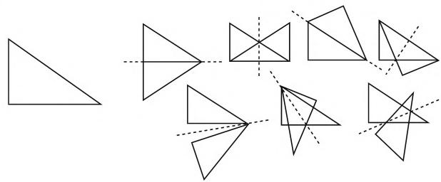

natural_image

Geometric shapes including triangles and polygons with dashed lines indicating hidden edges (no text or symbols)

图3

例4如图4(1)，将平行四边形剪一刀，再拼成一个与其面积相等的矩形；如图4(2)，将菱形剪两刀，再拼成一个与其面积相等的矩形.

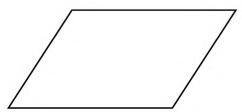  
(1)

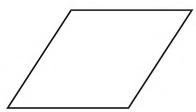  
(2)   
图4

分析:(1) 因为矩形是有一个角是直角的平行四边形, 所以应经过其中一个顶点作对边的垂线, 在左侧剪去一个直角三角形后, 再拼接到右侧, 如图 5 所示;(2) 因为菱形的对角线互相垂直平分, 所以沿菱形的对角线剪切成四个全等的直角三角形, 然后再接拼成矩形, 如图 5 所示.

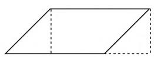

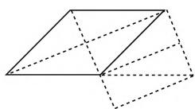  
图5

点评:要把两个图形拼成一个轴对称图形,首先要清楚轴对称图形的概念,如果一个图形沿某条直线对折后,两旁的部分能互相重合,则这个图形是轴对称图形,其次要分类找出可作为对称轴的直线,然后在对称轴相应的位置放上相同的图形.将一个图形剪切后再拼成另一个图形,一方面要了解原图形的性质;另一方面要了解目标图形的性质,然后在原图形中构造目标图形的元素.

# 三、折叠图形

图形的折叠问题是中考的热点,通常是把一个三角形或四边形按一定的条件折叠,折叠后图形的位置关系发生了变化,会出现新的图形,这样的问题可以培养学生的识图能力,同时考查了相关图形的性质.

例 5 如图 6 是一个三角形形状的纸片 ABC，已知两个角的度数， $\angle A = 65^{\circ}$ ， $\angle B = 75^{\circ}$ ，如果将纸片的一个角折起，掀起的角 C 落在 $\triangle ABC$ 内 $C'$ 处，如果 $\angle 1 = 20^{\circ}$ ，那么 $\angle 2$ 的度数为 \_\_\_\_.

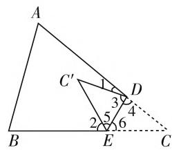

text_image

A
C'
1
3
4
2
5
6
B
E
C

图6

分析: 因为 $\triangle DEC'$ 是由 $\triangle DEC$ 折叠得到的, 所以 $\triangle DEC'$ 与 $\triangle DEC$ 关于 DE 成轴对称, 根据“对应角相等”可得 $\angle3 = \angle4, \angle5 = \angle6$ . 由于 $\angle1 = 20^{\circ}$ , 所以 $\angle3 = \angle4 = 80^{\circ}$ ; 在 $\triangle ABC$ 中, 由三角形内角和为 $180^{\circ}$ 可得 $\angle C = 40^{\circ}$ , 在 $\triangle DEC$ 中, 再利用三角形内角和为 $180^{\circ}$ , 可得 $\angle6 = 60^{\circ}$ , 于是 $\angle5 = 60^{\circ}$ , 这样 $\angle2 = 60^{\circ}$ .

例 6 如图 7 是一块矩形纸片 ABCD，点 E 是边 CD 上任意一点，如果将纸片沿直线 AE 折叠，点 D 的落点 F 恰好在边 BC 上，已知矩形的两邻边的长度 AB = 8, DE = 5，那么折痕 AE 的长为 \_\_\_\_.

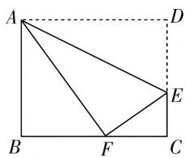

text_image

Geometric diagram of rectangle ABCD with internal triangle AFE and point F on base BC, labeled with vertices A, B, C, D, E, F.

图7

分析: 因为四边形 ABCD 是矩形, 所以 AB = CD = 8, BC = AD, $\angle B = \angle D = \angle C = 90^{\circ}$ , 所以 CE = CD - DE = 8 - 5 = 3, 由折叠的性质得: FE = DE = 5, AF = AD, 所以 $CF = \sqrt{EF^{2} - CE^{2}} = \sqrt{5^{2} - 3^{2}} = 4$ , 设 AD = BC = AF = x, 则 BF = x - 4, 在 Rt△ABF 中, 由勾股定理得: $8^{2} + (x - 4)^{2} = x^{2}$ , 解得: x = 10, 所以 AD = 10, 所以 $AE = \sqrt{AD^{2} + DE^{2}} = \sqrt{10^{2} + 5^{2}} = 5\sqrt{5}$ . 故答案为 $5\sqrt{5}$ .

点评:关于折叠问题,首先要明白“折叠前后的两部分关于折痕成轴对称”,然后要利用轴对称的性质,即“对应线段相等,对应角相等”得到相等的角,相等的线段,也就是将已知数量转化到新图形上,最后要掌握折叠问题中的数学思想,即全等变换思想,转化思想,抓不变量思想等.

轴对称也就是翻折,是图形的运动形式之一,它最重要的特征是对称轴两旁的部分是全等形,无论剪纸、拼合或是折叠,一方面培养了学生的动手操作能力,提高了学生学习数学的兴趣及对数学的认同感,另一方面也加强了学生对轴对称知识的理解和掌握. F