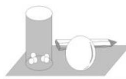

# 三角函数核心考点强化训练

■刘中亮(特级教师)

natural_image

Illustration of a classroom scene with a teacher assisting students (no text or symbols present)

# 一、选择题

1. 下列各角中, 与 $27^{\circ}$ 角终边相同的是 ( )。

A. ${63}^{ \circ  }$

B. ${153}^{ \circ  }$

C. $207^{\circ}$

D. ${387}^{ \circ  }$

2. 如果点 $P(2\sin\theta, \sin\theta \cdot \cos\theta)$ 位于第四象限，那么角 $\theta$ 所在的象限为（）。

A. 第一象限

B. 第二象限

C. 第三象限

D. 第四象限

3. 已知 $\sin \alpha + \cos \alpha = \sin \alpha \cos \alpha = m$ ，则 $m$ 的值为（ ）。

A. $1+\sqrt{2}$

B. $1-\sqrt{2}$

C. $1 \pm \sqrt{2}$

D. 不存在

4. 函数 $f(x)=\sin2x \cdot \tan x$ 是()。

A. 奇函数, 且最小值为 0

B. 奇函数, 且最大值为 2

C. 偶函数, 且最小值为 0

D. 偶函数, 且最大值为 2

5. 若函数 $f(x) = \cos x - \cos 2x$ ，则 $f(x)$ 是（ ）。

A. 奇函数, 最大值为 2

B. 偶函数, 最大值为 2

C. 奇函数, 最大值为 $\frac{9}{8}$

D. 偶函数, 最大值为 $\frac{9}{8}$

6. 将函数 $f(x)=\sin x+\sqrt{3}\cos x-1$ 的图像向右平移 $\frac{\pi}{6}$ 个单位长度, 得到函数 $g(x)$ 的图像, 则下列说法正确的是()。

A. 直线 $x=\frac{2\pi}{3}$ 是 $g(x)$ 图像的一条对称轴

B. $g(x)$ 的最小正周期为 $\frac{2\pi}{3}$

C. $g(x)$ 的图像关于点 $\left(\frac{11\pi}{6}, -1\right)$ 对称

D. $g(x)$ 在 $[\pi, 2\pi]$ 上单调递增

7. (多选题)如果若干个函数的图像经过平移后能够重合,那么这些函数为“互为生成函数”。下列函数中,与 $f(x)=\sin x+\cos x$ 构成“互为生成函数”的是()。

A. $f_{1}(x) = \sqrt{2}\sin x + \sqrt{2}$   
B. $f_{2}(x)=\sqrt{2}(\sin x+\cos x)$   
C. $f_{3}(x)=\sin x$   
D. $f_{4}(x) = 2\cos \frac{x}{2}\left(\sin \frac{x}{2} +\cos \frac{x}{2}\right)$

8.(多选题)下列结论正确的是()。

A. $-\frac{7\pi}{6}$ 是第三象限角  
B. 若角 $\alpha$ 的终边在直线 $y = x$ 上, 则 $\alpha = k\pi + \frac{\pi}{4} (k \in \mathbf{Z})$   
C. 若角 $\alpha$ 的终边过点 $P(-3,4)$ , 则 $\cos \alpha = -\frac{3}{5}$   
D. 若角 $\alpha$ 为锐角, 则角 $2 \alpha$ 为钝角

9.(多选题)已知角 $\theta$ 的终边经过点 $(-2,-\sqrt{3})$ ，且 $\theta$ 与 $\alpha$ 的终边关于 x 轴对称，则下列选项正确的是()。

A. $\sin \theta = -\frac{\sqrt{21}}{7}$   
B. $\alpha$ 为钝角  
C. $\cos \alpha = \frac{2\sqrt{7}}{7}$   
D. 点 $(\tan \theta, \sin \alpha)$ 在第一象限

10.(多选题)下列命题正确的是()。

A. 在与 $530^{\circ}$ 角终边相同的角中, 最小的正角为 $170^{\circ}$

B. 若角 $\alpha$ 的终边过点 $P(-4,3)$ , 则 $\cos \alpha = -\frac{4}{5}$   
C. 已知 $\theta$ 是第二象限角, 则 $\tan (\sin \theta) > \tan (\cos \theta)$   
D. 若一扇形的弧长为 2, 圆心角为 $90^{\circ}$ , 则该扇形的面积为 $\frac{1}{\pi}$

11.(多选题)已知函数 $f(x)=\sin^{2}x-3\cos^{2}x+4\sin x\cos x$ ，则下列说法正确的是()。

A. $f(x)$ 的最小正周期是 $\pi$   
B. $f(x)$ 的最大值是 $2\sqrt{2}-1$   
C. $f(x)$ 在 $\left(0, \frac{\pi}{2}\right)$ 上是增函数  
D. 直线 $x=\frac{\pi}{8}$ 是 $f(x)$ 图像的一条对称轴

12.(多选题)对于函数 $f(x)=|\sin x|+\cos 2x$ ，下列结论正确的是()。

A. $f(x)$ 的值域为 $\left[0, \frac{9}{8}\right]$   
B. $f(x)$ 在 $\left[0, \frac{\pi}{2}\right]$ 上单调递增  
C. $f(x)$ 的图像关于直线 $x=\frac{\pi}{4}$ 对称  
D. $f(x)$ 的最小正周期为 $\pi$

# 二、填空题

13. 在角 $\theta_{1}, \theta_{2}, \theta_{3}, \cdots, \theta_{29}$ 的终边上分别有一点 $P_{1}, P_{2}, P_{3}, \cdots, P_{29}$ ，如果点 $P_{k}$ 的坐标为 $(\sin(15^{\circ}-k^{\circ}), \sin(75^{\circ}+k^{\circ}))$ ， $1 \leqslant k \leqslant 29, k \in N$ ，则 $\cos\theta_{1} + \cos\theta_{2} + \cos\theta_{3} + \cdots + \cos\theta_{29} =$ \_\_\_\_。  
14. 满足等式 $(1 + \tan \alpha)(1 + \tan \beta) = 2$ 的数组 $(\alpha, \beta)$ 有无穷多个，试写出一个这样的数组为 \_\_\_\_。  
15. 已知函数 $y = \sin(\omega x + \varphi) (\omega > 0)$ 的图像与直线 $y = \frac{1}{2}$ 的交点中，距离最近的两点间的距离为 $\frac{\pi}{3}$ ，那么此函数的最小正周期是 \_\_\_\_。  
16. 已知函数 $f(x) = \sin \left[\frac{\pi}{3} (x + 1)\right] - \sqrt{3}\cos \left[\frac{\pi}{3} (x + 1)\right]$ ，则 $f(x)$ 的最小正周期为

\_\_\_\_, $f(1) + f(2) + \cdots + f(2025) =$ \_\_\_\_。

17. 已知函数 $f(x)=2\sin(\omega x+\varphi)$ $\left(\omega>0,0<\varphi<\frac{\pi}{2}\right)$ 的图像的相邻两条对称轴间的距离为 $\frac{\pi}{2}$ ，且 $f\left(\frac{\pi}{12}\right)=2$ ，则 $f\left(\frac{\pi}{8}\right)=$ \_\_\_\_。  
18. 写出一个同时具有下列性质①②③，且定义域为实数集 R 的函数 $f(x)=$ \_\_\_\_。

①最小正周期为 2, ② $f(-x)+f(x)=$ 2, ③无零点。

# 三、解答题

19. 已知 $\frac{1}{|\sin \alpha|} = -\frac{1}{\sin \alpha}$ , 且 $\lg (\cos \alpha)$ 有意义。

(1)试判断角 $\alpha$ 所在的象限。  
(2) 若角 $\alpha$ 的终边上有一点 $M\left(\frac{3}{5}, m\right)$ ，且 $|OM| = 1$ （O 为坐标原点），求 m 的值及 $\sin \alpha$ 的值。  
20. 在① $\tan(\pi+\alpha)=3$ ，② $\sin(\pi-\alpha)-2\sin\left(\frac{\pi}{2}-\alpha\right)=\cos(-\alpha)$ ，③ $3\sin\left(\frac{\pi}{2}+\alpha\right)=\cos\left(\frac{3\pi}{2}+\alpha\right)$ 中任选一个条件，补充在下面问题的空白横线上，并解决问题。已知 $0<\beta<\alpha<\frac{\pi}{2}$ ，\_\_\_\_， $\cos(\alpha+\beta)=-\frac{\sqrt{5}}{5}$ 。

(1) 求 $\sin\left(\alpha-\frac{\pi}{4}\right)$ 的值。

(2) 求 $\beta$ 的值。

21. 已知函数 $f(x) = \sin \left(2x + \frac{\pi}{6}\right) + \sin \left(2x - \frac{\pi}{6}\right) + \cos 2x + a$ 的最大值是 1。

(1)求常数 $a$ 的值。

(2) 求使 $f(x) \geqslant 0$ 成立的 x 的取值集合。

22. 已知函数 $f(x) = \sin \left(2x - \frac{\pi}{3}\right) + \frac{\sqrt{3}}{2}$ 。

(1) 求函数 $f(x)$ 的最小正周期及其图像的对称中心。  
(2) 若 $f(x_0) \leqslant \sqrt{3}$ ，求 $x_0$ 的取值范围。

23. 已知函数 $f(x) = 2\cos^2 \left( x + \frac{\theta}{2} \right) + \sqrt{3}\sin (2x + \theta)$ 。

(1) 若 $0 \leqslant \theta \leqslant \pi$ ，求使函数 $f(x)$ 为偶函数的 $\theta$ 的值。

(2)在(1)成立的条件下,当 $x \in \left[-\frac{\pi}{6}, \frac{\pi}{3}\right]$ 时,求 $f(x)$ 的取值范围。

24. 设函数 $f(x) = \sin \omega x \cos \varphi + \cos \omega x \sin \varphi (\omega > 0, |\varphi| < \frac{\pi}{2})$ 。

(1) 若 $f(0) = -\frac{\sqrt{3}}{2}$ ，求 $\varphi$ 的值。

(2)已知 $f(x)$ 在区间 $\left[-\frac{\pi}{3},\frac{2\pi}{3}\right]$ 上单调递增， $f\left(\frac{2\pi}{3}\right)=1$ ，再从条件①、条件②、条件③这三个条件中选择一个作为已知条件，使函数 $f(x)$ 存在，求 $\omega,\varphi$ 的值。

条件①: $f\left(\frac{\pi}{3}\right)=\sqrt{2}$ 。条件②: $f\left(-\frac{\pi}{3}\right)=-1$ 。条件③: $f(x)$ 在区间 $\left[-\frac{\pi}{2},-\frac{\pi}{3}\right]$ 上单调递减。

25. 已知函数 $f(x) = 2\sin \omega x \cos \varphi + 2\sin \varphi - 4\sin^2 \frac{\omega x}{2} \sin \varphi (\omega > 0, |\varphi| < \pi)$ ，其图像的一条对称轴与相邻对称中心的横坐标相差 $\frac{\pi}{4}$ ，\_\_\_\_，从以下两个条件中任选一个补充在空白横线上。① 函数 $f(x)$ 的图像向左平移 $\frac{\pi}{3}$ 个单位长度后得到的图像关于 $y$ 轴对称，且 $f(0) < 0$ ；② 函数 $f(x)$ 的图像的一个对称中心为 $\left(\frac{\pi}{12}, 0\right)$ ，且 $f\left(\frac{\pi}{6}\right) > 0$ 。

(1)求函数 $f(x)$ 的解析式。

(2) 将函数 $f(x)$ 图像上所有点的横坐标变为原来的 $\frac{1}{t}(t > 0)$ ，纵坐标不变，得到函数 $y = g(x)$ 的图像，若函数 $y = g(x)$ 在区间 $\left[0, \frac{\pi}{3}\right]$ 上恰有 3 个零点，求 t 的取值范围。

# 参考答案与提示

# 一、选择题

1. 提示: 与 $27^{\circ}$ 角终边相同的角构成的集合为 $\{\alpha \mid \alpha = 27^{\circ} + k \cdot 360^{\circ}, k \in Z\}$ ，取 k = 1，可得 $\alpha = 387^{\circ}$ ，故与 $27^{\circ}$ 角终边相同的是 $387^{\circ}$ 。应选 D。

2. 提示: 因为点 $P(2\sin\theta, \sin\theta \cdot \cos\theta)$ 位于第四象限, 所以 $\left\{\begin{aligned}&2\sin\theta>0,\\ &\sin\theta\cdot\cos\theta<0,\end{aligned}\right.$ 所以 $\left\{\begin{aligned}\sin\theta>0,\\ \cos\theta<0,\end{aligned}\right.$ 所以角 $\theta$ 所在的象限是第二象限。
应选 B。

3. 提示: 由 $(\sin \alpha + \cos \alpha)^{2} = \sin^{2} \alpha + \cos^{2} \alpha + 2 \sin \alpha \cos \alpha = 1 + 2 \sin \alpha \cos \alpha$ ，结合 $\sin \alpha + \cos \alpha = \sin \alpha \cos \alpha = m$ ，可得 $m^{2} = 1 + 2m$ ，解得 $m = 1 \pm \sqrt{2}$ 。由三角函数的值域可知， $\sin \alpha + \cos \alpha = 1 + \sqrt{2}$ 不成立，故 $m = 1 - \sqrt{2}$ 。应选 B。

4. 提示: $f(x) = \sin 2x \cdot \tan x$ 的定义域为 $\left\{x \mid x \neq \frac{\pi}{2} + k\pi, k \in \mathbf{Z}\right\}$ , 关于原点对称, 且 $f(x) = \sin 2x \cdot \tan x = 2\sin x \cos x \cdot \frac{\sin x}{\cos x} = 2\sin^2 x$ 。因为 $f(-x) = 2\sin^2 (-x) = 2\sin^2 x = f(x)$ , 所以函数 $f(x)$ 为偶函数, 且 $f(x) = 2\sin^2 x = 1 - \cos 2x, x \neq \frac{\pi}{2} + k\pi, k \in \mathbf{Z}$ 。易得 $\cos 2x \in (-1, 1]$ , 则 $f(x) = 1 - \cos 2x \in [0, 2)$ , 所以函数 $f(x)$ 的最小值为 0, 无最大值。应选 C。

5. 提示: 由 $f(-x) = \cos (-x) - \cos (-2x) = \cos x - \cos 2x = f(x)$ , 可知该函数为偶函数。因为 $f(x) = \cos x - \cos 2x = -2\cos^2 x + \cos x + 1 = -2\left(\cos x - \frac{1}{4}\right)^2 + \frac{9}{8}$ , 所以当 $\cos x = \frac{1}{4}$ 时, $f(x)$ 取得最大值 $\frac{9}{8}$ 。应选 D。

6. 提示: 因为 $f(x)=\sin x+\sqrt{3}\cos x-1=2\left(\frac{1}{2}\sin x+\frac{\sqrt{3}}{2}\cos x\right)-1=2\sin\left(x+\frac{\pi}{3}\right)-$

1, 所以 $f(x)$ 的图像向右平移 $\frac{\pi}{6}$ 个单位长度得 $g(x) = 2\sin \left(x - \frac{\pi}{6} + \frac{\pi}{3}\right) - 1 = 2\sin \left(x + \frac{\pi}{6}\right) - 1$ 。因为 $\frac{2\pi}{3} + \frac{\pi}{6} = \frac{5\pi}{6}$ ，所以 $x = \frac{2\pi}{3}$ 不是 $g(x)$ 图像的一条对称轴，A 错误。由 $\frac{2\pi}{1} = 2\pi$ ，可得 $g(x)$ 的最小正周期为 $2\pi$ ，B 错误。由 $\frac{11\pi}{6} + \frac{\pi}{6} = 2\pi$ ，可得点 $\left(\frac{11\pi}{6}, -1\right)$ 是 $g(x)$ 图像的一个对称中心，C 正确。由 $\pi \leqslant x \leqslant 2\pi$ ，可得 $\frac{7\pi}{6} \leqslant x + \frac{\pi}{6} \leqslant \frac{13\pi}{6}$ ，所以 $g(x)$ 在 $[\pi, 2\pi]$ 上有增有减，D 错误。应选 C。

7. 提示: $f(x) = \sin x + \cos x = \sqrt{2} \sin \left( x + \frac{\pi}{4} \right)$ 。因为 $f_1(x) = \sqrt{2} \sin x + \sqrt{2}$ ，所以将 $f_1(x)$ 的图像向下平移 $\sqrt{2}$ 个单位长度，再向左平移 $\frac{\pi}{4}$ 个单位长度即可与 $f(x)$ 的图像重合。因为 $f_2(x) = \sqrt{2} (\sin x + \cos x) = \sqrt{2} \times \sqrt{2} \sin \left( x + \frac{\pi}{4} \right) = 2 \sin \left( x + \frac{\pi}{4} \right)$ ，所以 $f_2(x)$ 的图像无法经过平移与 $f(x)$ 的图像重合。因为 $f_3(x) = \sin x$ ，所以 $f_3(x)$ 的图像无法经过平移与 $f(x)$ 的图像重合。因为 $f_4(x) = 2 \cos \frac{x}{2} (\sin \frac{x}{2} + \cos \frac{x}{2}) = 2 \cos \frac{x}{2} \sin \frac{x}{2} + 2 \cos^2 \frac{x}{2} = \sin x + \cos x + 1 = \sqrt{2} \sin (x + \frac{\pi}{4}) + 1$ ，所以将 $f_4(x)$ 的图像向下平移 1 个单位长度，与 $f(x)$ 的图像重合。A, D 中的函数与 $f(x)$ “互为生成函数”。应选 AD。

8. 提示: 对于 A, 因为 $-\frac{7\pi}{6} = \frac{5\pi}{6} - 2\pi$ , 且 $\frac{5\pi}{6}$ 为第二象限角, 所以 $-\frac{7\pi}{6}$ 为第二象限角, A 错误。对于 B, 根据终边相同角的表示可知, 角 $\alpha$ 的终边在直线 y = x 上, 则 $\alpha = k\pi + \frac{\pi}{4} (k \in \mathbb{Z})$ , B 正确。对于 C, 由三角函数的定义得 $\cos \alpha = \frac{-3}{\sqrt{(-3)^{2} + 4^{2}}} = -\frac{3}{5}$ , C 正确。对

于 D, 取 $\alpha=\frac{\pi}{6}$ , 则角 $\alpha$ 为锐角, 但 $2\alpha=\frac{\pi}{3}$ , 即角 $2\alpha$ 为锐角, D 错误。应选 BC。

9. 提示: 角 $\theta$ 的终边经过点 $(-2, -\sqrt{3})$ , 则 $\sin \theta = -\frac{\sqrt{21}}{7}$ , A 正确。 $\theta$ 与 $\alpha$ 的终边关于 $x$ 轴对称, 由题意得 $\alpha$ 的终边经过点 $(-2, \sqrt{3})$ , 即 $\alpha$ 为第二象限角, 不一定为钝角, 且 $\cos \alpha = -\frac{2\sqrt{7}}{7}$ , B 错误, C 正确。因为 $\tan \theta = \frac{\sqrt{3}}{2} > 0$ , $\sin \alpha = \frac{\sqrt{21}}{7} > 0$ , 所以点 $(\tan \theta, \sin \alpha)$ 在第一象限, D 正确。应选 ACD。

10. 提示: 由 $0^{\circ} < k \cdot 360^{\circ} + 530^{\circ} < 360^{\circ}$ , $k \in \mathbf{Z}$ , 可得 $k = -1$ , 故所求的最小正角 $\beta = 170^{\circ}$ , A 正确。由三角函数的定义得 $\cos \alpha = \frac{-4}{\sqrt{3^{2} + (-4)^{2}}} = -\frac{4}{5}$ , B 正确。因为 $\theta$ 是第二象限角, 所以 $0 < \sin \theta < 1 < \frac{\pi}{2}, -\frac{\pi}{2} < -1 < \cos \theta < 0$ , 所以 $\tan (\sin \theta) > 0, \tan (\cos \theta) < 0$ , 所以 $\tan (\sin \theta) > \tan (\cos \theta)$ , C 正确。弧长为 2, 圆心角为 $90^{\circ}$ , 则扇形的半径为 $\frac{4}{\pi}$ , 所以扇形的面积为 $\frac{1}{2}rl = \frac{4}{\pi}$ , D 错误。应选 ABC。

11. 提示: 函数 $f(x)=\sin^{2}x-3\cos^{2}x+4\sin x\cos x=-2\cos 2x-1+2\sin 2x=2\sqrt{2}\sin\left(2x-\frac{\pi}{4}\right)-1$ ，其最小正周期 $T=\frac{2\pi}{2}=\pi$ ，A 正确。结合正弦函数的性质可知，当 $\sin\left(2x-\frac{\pi}{4}\right)=1$ 时，函数取得最大值 $2\sqrt{2}-1$ ，B 正确。由 $-\frac{\pi}{2}+2k\pi<2x-\frac{\pi}{4}<\frac{\pi}{2}+2k\pi, k\in\mathbf{Z}$ ，可得 $f(x)$ 的单调递增区间为 $\left(-\frac{\pi}{8}+k\pi,\frac{3\pi}{8}+k\pi\right), k\in\mathbf{Z}, C$ 错误。当 $x=\frac{\pi}{8}$ 时， $2x-\frac{\pi}{4}=0$ ，D 错误。应选 AB。

12. 提示: $f(x) = |\sin x| + \cos 2x = -2|\sin x|^2 + |\sin x| + 1 = -2(|\sin x| - \frac{1}{4})^2 + \frac{9}{8}$ 且 $|\sin x| \in [0, 1]$ , 则 $f(x) \in$ $\left[0, \frac{9}{8}\right]$ , A 正确。当 $x \in \left[0, \frac{\pi}{2}\right]$ 时, $|\sin x| \in [0,1]$ , $y = |\sin x| = \sin x$ 在 $\left[0, \frac{\pi}{2}\right]$ 上单调递增, 结合 $f(x) = -2\left(|\sin x| - \frac{1}{4}\right)^2 + \frac{9}{8}$ 知 $f(x)$ 在 $\left[0, \frac{\pi}{2}\right]$ 上先增后减, B 错误。 $f(0) = |\sin 0| + \cos (2 \times 0) = 1$ , $f\left(\frac{\pi}{2}\right) = \left|\sin \frac{\pi}{2}\right| + \cos \left(2 \times \frac{\pi}{2}\right) = 0$ , $f(0) \neq f\left(\frac{\pi}{2}\right)$ , C 错误。易知 $y = |\sin x|$ 和 $y = \cos 2x$ 的最小正周期均为 $\pi$ , 故 $f(x)$ 的最小正周期为 $\pi$ , D 正确。应选 AD。

# 二、填空题

13. 提示: 因为 $\sin(75^{\circ}+k^{\circ})=\sin[90^{\circ}-(15^{\circ}-k^{\circ})]=\cos(15^{\circ}-k^{\circ})$ ，所以点 $P_{k}(\sin(15^{\circ}-k^{\circ}),\cos(15^{\circ}-k^{\circ}))$ ，所以 $\cos\theta_{k}=\frac{\sin(15^{\circ}-k^{\circ})}{\sqrt{\sin^{2}(15^{\circ}-k^{\circ})+\cos^{2}(15^{\circ}-k^{\circ})}}=\sin(15^{\circ}-k^{\circ})$ ，所以 $\cos\theta_{1}+\cos\theta_{2}+\cos\theta_{3}+\cdots+\cos\theta_{29}=\sin14^{\circ}+\sin13^{\circ}+\sin12^{\circ}+\cdots+\sin(-14^{\circ})$ 。又 $\sin(15^{\circ}-k^{\circ})+\sin(k^{\circ}-15^{\circ})=\sin(15^{\circ}-k^{\circ})-\sin(15^{\circ}-k^{\circ})=0$ ，所以 $\cos\theta_{1}+\cos\theta_{2}+\cos\theta_{3}+\cdots+\cos\theta_{29}=\sin0^{\circ}=0$ 。

14. 提示: 由 $(1 + \tan \alpha)(1 + \tan \beta) = 2$ , 可得 $1 + \tan \beta + \tan \alpha + \tan \alpha \tan \beta = 2$ , 所以 $\tan \beta + \tan \alpha = 1 - \tan \alpha \tan \beta$ , 所以 $\frac{\tan \beta + \tan \alpha}{1 - \tan \alpha \tan \beta} = 1$ , 所以 $\tan (\alpha + \beta) = 1$ , 所以 $\alpha + \beta = k \pi + \frac{\pi}{4}, k \in \mathbf{Z}$ , 所以 $\alpha$ 可以为 $0, \beta$ 可以为 $\frac{\pi}{4}$ , 即数组为 $\left(0, \frac{\pi}{4}\right)$ 。(答案不唯一)

15. 提示: 利用正弦型函数的周期性求解。当 $\sin(\omega x + \varphi) = \frac{1}{2}$ 时, 若 $\omega x_{1} + \varphi = \frac{\pi}{6}$ , 则最近的另一个值为 $\omega x_{2} + \varphi = \frac{5\pi}{6}$ , 所以 $\omega(x_{2} - x_{1}) = \frac{2\pi}{3}$ 。而 $x_{2} - x_{1} = \frac{\pi}{3}$ , 所以 $\omega = 2$ 。故此函数的最小正周期是 $\frac{2\pi}{\omega} = \pi$ 。

16. 提示: 依题意得函数 $f(x) = \sin \left[\frac{\pi}{3}(x + 1)\right] - \sqrt{3} \cos \left[\frac{\pi}{3}(x + 1)\right] = 2\sin \frac{\pi}{3} x$ , 所以 $f(x)$ 的最小正周期 $T = 6$ 。

因为 $f(1)+f(2)+\cdots+f(6)=0$ ，所以 $f(1)+f(2)+\cdots+f(2025)=f(1)+$ $f(2)+f(3)=\sqrt{3}+\sqrt{3}+0=2\sqrt{3}$

17. 提示: 因为函数 $f(x)$ 图像的相邻两条对称轴间的距离为 $\frac{\pi}{2}$ ，所以 $\frac{T}{2} = \frac{\pi}{2}$ ，可得 $T = \pi$ ，即 $\frac{2\pi}{\omega} = \pi$ ，所以 $\omega = 2$ ，这时函数 $f(x) = 2\sin(2x + \varphi)$ 。因为 $f\left(\frac{\pi}{12}\right) = 2$ ，所以 $f\left(\frac{\pi}{12}\right) = 2 = 2\sin\left(\frac{\pi}{6} + \varphi\right)$ ，即 $\sin\left(\frac{\pi}{6} + \varphi\right) = 1$ 。因为 $0 < \varphi < \frac{\pi}{2}$ ，所以 $\frac{\pi}{6} + \varphi = \frac{\pi}{2}$ ，可得 $\varphi = \frac{\pi}{2} - \frac{\pi}{6} = \frac{\pi}{3}$ ，所以 $f(x) = 2\sin\left(2x + \frac{\pi}{3}\right)$ 。故 $f\left(\frac{\pi}{8}\right) = 2\sin\left(2 \times \frac{\pi}{8} + \frac{\pi}{3}\right) = 2\sin\left(\frac{\pi}{4} + \frac{\pi}{3}\right) = 2\left(\sin\frac{\pi}{4}\cos\frac{\pi}{3} + \cos\frac{\pi}{4}\sin\frac{\pi}{3}\right) = \frac{\sqrt{2} + \sqrt{6}}{2}$ 。

18. 提示: 函数 $f(x)=\frac{1}{2}\sin(\pi x)+1$ 的定义域为 R, 最小正周期 $T=\frac{2\pi}{\pi}=2$ 。满足 $f(-x)+f(x)=\frac{1}{2}\sin(-\pi x)+1+$ $\frac{1}{2}\sin(\pi x)+1=-\frac{1}{2}\sin(\pi x)+1+$ $\frac{1}{2}\sin(\pi x)+1=2$ 。因为 $-1\leqslant\sin(\pi x)\leqslant1$ ，
所以 $\frac{1}{2}\leqslant f(x)\leqslant\frac{3}{2}$ ，所以 $f(x)$ 无零点。故函数 $f(x)=\frac{1}{2}\sin(\pi x)+1$ 符合题意。（答案不唯一）

# 三、解答题

19. 提示: (1) 因为 $\frac{1}{|\sin\alpha|} = -\frac{1}{\sin\alpha}$ ，所以 $\sin\alpha < 0$ 。又因为 $\lg(\cos\alpha)$ 有意义，所以 $\cos\alpha > 0$ ，所以 $\alpha$ 是第四象限角。

(2) 因为 $\left|OM\right|=1$ ，所以 $\left(\frac{3}{5}\right)^{2}+m^{2}=1$ ，解得 $m = \pm \frac{4}{5}$ 。又 $\alpha$ 为第四象限角，所以 m < 0，所以 $m = -\frac{4}{5}$ 。故 $\sin \alpha = \frac{y}{r} = \frac{m}{|OM|} = -\frac{4}{5}$ 。

20. 提示: (1) 选条件①, $\tan (\pi + \alpha) = \tan \alpha = \frac{\sin \alpha}{\cos \alpha} = 3$ 。因为 $\sin^2 \alpha + \cos^2 \alpha = 1, 0 < \alpha < \frac{\pi}{2}$ , 所以 $\sin \alpha = \frac{3\sqrt{10}}{10}, \cos \alpha = \frac{\sqrt{10}}{10}$ , 所以 $\sin \left( \alpha - \frac{\pi}{4} \right) = \sin \alpha \cos \frac{\pi}{4} - \cos \alpha \sin \frac{\pi}{4} = \frac{\sqrt{5}}{5}$ 。

选条件②，由 $\sin (\pi -\alpha) - 2\sin \left(\frac{\pi}{2} -\right.$ $\alpha)\equiv \cos (-\alpha)$ 化简得 $\sin \alpha = 3\cos \alpha$ 。因为 $\sin^2\alpha +\cos^2\alpha = 1,0 <   \alpha <  \frac{\pi}{2}$ ，所以 $\sin \alpha =$ $\frac{3\sqrt{10}}{10},\cos \alpha = \frac{\sqrt{10}}{10}$ ，所以 $\sin \left(\alpha -\frac{\pi}{4}\right) =$ $\sin \alpha \cos \frac{\pi}{4} -\cos \alpha \sin \frac{\pi}{4} = \frac{\sqrt{5}}{5}$

选条件③，由 $3\sin \left(\frac{\pi}{2} +\alpha\right) = \cos \left(\frac{3\pi}{2} +\right.$ $\alpha)$ 化简得 $3\cos \alpha = \sin \alpha$ 。因为 $\sin^2\alpha +\cos^2\alpha$ $= 1,0 <   \alpha <  \frac{\pi}{2}$ ，所以 $\sin \alpha = \frac{3\sqrt{10}}{10},\cos \alpha =$ $\frac{\sqrt{10}}{10}$ ，所以 $\sin \left(\alpha -\frac{\pi}{4}\right) = \sin \alpha \cos \frac{\pi}{4}-$ $\cos \alpha \sin \frac{\pi}{4} = \frac{\sqrt{5}}{5}$ 。

(2) 因为 $0 < \beta < \alpha < \frac{\pi}{2}$ , 且 $\cos (\alpha + \beta) = -\frac{\sqrt{5}}{5}$ , 所以 $\frac{\pi}{2} < \alpha + \beta < \pi$ , 所以 $\sin (\alpha + \beta) = \sqrt{1 - \cos^2 (\alpha + \beta)} = \frac{2\sqrt{5}}{5}$ , 所以 $\sin \beta = \sin [(\alpha + \beta) - \alpha] = \sin (\alpha + \beta)\cos \alpha - \cos (\alpha + \beta)\sin \alpha = \frac{\sqrt{2}}{2}$ 。又 $0 < \beta < \frac{\pi}{2}$ , 所以 $\beta = \frac{\pi}{4}$ 。

21. 提示: (1) 根据三角函数的两角和与差公式得 $f(x) = \sin \left(2x + \frac{\pi}{6}\right) + \sin \left(2x - \right.$

$\left.\frac{\pi}{6}\right)+\cos2x+a=\frac{\sqrt{3}}{2}\sin2x+\frac{1}{2}\cos2x+$ $\frac{\sqrt{3}}{2}\sin 2x - \frac{1}{2}\cos 2x + \cos 2x + a = \sqrt{3} \sin 2x + \cos 2x + a = 2\sin\left(2x + \frac{\pi}{6}\right) + a$ 。因为函数 $f(x)$ 的最大值是1，所以 $2+a=1$ ，所以a=-1。

(2)由(1)知 $f(x)=2\sin\left(2x+\frac{\pi}{6}\right)-1$ 。
由 $f(x)\geqslant0$ ，可得 $2\sin\left(2x+\frac{\pi}{6}\right)-1\geqslant0$ ，即 $\sin\left(2x+\frac{\pi}{6}\right)\geqslant\frac{1}{2}$ ，所以 $\frac{\pi}{6}+2k\pi\leqslant2x+\frac{\pi}{6}\leqslant$ $\frac{5\pi}{6}+2k\pi,k\in\mathbf{Z}$ ，即 $k\pi\leqslant x\leqslant\frac{\pi}{3}+k\pi,k\in\mathbf{Z}$ 。

故 $x$ 的取值集合是 $\left\{x \mid k\pi \leqslant x \leqslant \frac{\pi}{3} + k\pi, k \in \mathbf{Z}\right\}$ 。

22. 提示: (1) $f(x)$ 的最小正周期 $T = \pi$ 。

由 $2x - \frac{\pi}{3} = k\pi, k \in \mathbf{Z}$ , 可得 $x = \frac{\pi}{6} + \frac{k\pi}{2}, k \in \mathbf{Z}$ , 故函数 $f(x)$ 图像的对称中心为 $\left(\frac{\pi}{6} + \frac{k\pi}{2}, \frac{\sqrt{3}}{2}\right) (k \in \mathbf{Z})$ 。

(2) 因为 $f(x_0) \leqslant \sqrt{3}$ ，所以 $\sin\left(2x_0 - \frac{\pi}{3}\right) + \frac{\sqrt{3}}{2} \leqslant \sqrt{3}$ ，即 $\sin\left(2x_0 - \frac{\pi}{3}\right) \leqslant \frac{\sqrt{3}}{2}$ ，所以 $-\frac{4\pi}{3} + 2k\pi \leqslant 2x_0 - \frac{\pi}{3} \leqslant \frac{\pi}{3} + 2k\pi, k \in \mathbf{Z}$ ，即 $-\frac{\pi}{2} + k\pi \leqslant x_0 \leqslant \frac{\pi}{3} + k\pi, k \in \mathbf{Z}$ ，所以 $x_0$ 的取值范围为 $\left[-\frac{\pi}{2} + k\pi, \frac{\pi}{3} + k\pi\right] (k \in \mathbf{Z})$ 。

23. 提示: (1) $f(x)=2\times\frac{1+\cos(2x+\theta)}{2}$ $+\sqrt{3}\sin(2x+\theta)=1+2\sin\left(2x+\theta+\frac{\pi}{6}\right)$ 。

因为 $f(x)$ 为偶函数，所以 $\theta + \frac{\pi}{6} = \frac{\pi}{2} + k\pi, k \in \mathbf{Z}$ ，即 $\theta = \frac{\pi}{3} + k\pi, k \in \mathbf{Z}$ 。因为 $0 \leqslant \theta \leqslant \pi$ ，所以 $\theta = \frac{\pi}{3}$ 。

(2)在(1)成立的条件下,函数 $f(x)=2\sin\left(2x+\frac{\pi}{3}+\frac{\pi}{6}\right)+1=2\cos2x+1$ 。因为 $x\in\left[-\frac{\pi}{6},\frac{\pi}{3}\right]$ ，所以 $2x\in\left[-\frac{\pi}{3},\frac{2\pi}{3}\right]$ ，所以 $\cos2x\in\left[-\frac{1}{2},1\right]$ ，所以 $f(x)\in[0,3]$ 。

24. 提示: (1) 因为 $f(x)=\sin \omega x \cos \varphi + \cos \omega x \sin \varphi \left( \omega > 0, |\varphi| < \frac{\pi}{2} \right)$ ，所以 $f(0) = \sin 0 \cos \varphi + \cos 0 \sin \varphi = \sin \varphi = -\frac{\sqrt{3}}{2}$ 。又因为 $|\varphi| < \frac{\pi}{2}$ ，所以 $\varphi = -\frac{\pi}{3}$ 。

(2) 因为 $f(x) = \sin \omega x \cos \varphi + \cos \omega x \sin \varphi$ $\left(\omega > 0, |\varphi| < \frac{\pi}{2}\right)$ ，所以 $f(x) = \sin (\omega x + \varphi)$ $\left(\omega > 0, |\varphi| < \frac{\pi}{2}\right)$ ，所以 $f(x)$ 的最大值为 1，最小值为 -1。

选条件①, 因为 $f(x)=\sin(\omega x+\varphi)$ 的最大值为 1, 最小值为 -1, 所以 $f\left(\frac{\pi}{3}\right)=\sqrt{2}$ 无解, 故条件①不能使函数 $f(x)$ 存在。

选条件②, 因为 $f(x)$ 在 $\left[-\frac{\pi}{3}, \frac{2\pi}{3}\right]$ 上单调递增, 且 $f\left(\frac{2\pi}{3}\right)=1, f\left(-\frac{\pi}{3}\right)=-1$ , 所以 $\frac{T}{2}=\frac{2\pi}{3}-\left(-\frac{\pi}{3}\right)=\pi$ , 所以 $T=2\pi, \omega=\frac{2\pi}{T}=1$ 。所以 $f(x)=\sin(x+\varphi)$ 。因为 $f\left(-\frac{\pi}{3}\right)=-1$ , 所以 $\sin\left(-\frac{\pi}{3}+\varphi\right)=-1$ , 所以 $-\frac{\pi}{3}+\varphi=-\frac{\pi}{2}+2k\pi, k\in\mathbf{Z}$ , 所以 $\varphi=-\frac{\pi}{6}+2k\pi, k\in\mathbf{Z}$ 。因为 $|\varphi|<\frac{\pi}{2}$ , 所以 $\varphi=-\frac{\pi}{6}$ 。

选条件③, 因为 $f(x)$ 在 $\left[-\frac{\pi}{3}, \frac{2\pi}{3}\right]$ 上单调递增, 在 $\left[-\frac{\pi}{2}, -\frac{\pi}{3}\right]$ 上单调递减, 所以 $f(x)$ 在 $x = -\frac{\pi}{3}$ 处取得最小值 -1, 即 $f\left(-\frac{\pi}{3}\right) = -1$ 。以下与条件②相同(略)。

25. 提示: (1) 由题意得 $f(x) = 2 \sin \omega x \cos \varphi + 2 \sin \varphi - 4 \sin^2 \frac{\omega x}{2} \sin \varphi = 2 \sin \omega x \cos \varphi + 2 \sin \varphi - \sin \varphi (2 - 2 \cos \omega x) = 2 \sin \omega x \cos \varphi + 2 \cos \omega x \sin \varphi = 2 \sin (\omega x + \varphi)$ 。因为其图像的一条对称轴与相邻对称中心的横坐标相差 $\frac{\pi}{4}$ , 所以 $T = 4 \times \frac{\pi}{4} = \frac{2\pi}{\omega}$ , 所以 $\omega = 2$ 。则函数 $f(x) = 2 \sin (2x + \varphi)$ 。

选条件①, 函数 $f(x)$ 的图像向左平移 $\frac{\pi}{3}$ 个单位长度后得到的图像对应的函数为 $y = 2\sin\left[2\left(x + \frac{\pi}{3}\right) + \varphi\right]$ 。由题意知该函数为偶函数，所以 $\frac{2\pi}{3} + \varphi = \frac{\pi}{2} + k\pi, k \in Z$ ，即 $\varphi = -\frac{\pi}{6} + k\pi, k \in Z$ 。因为 $|\varphi| < \pi$ 且 $f(0) < 0$ ，即 $\sin\varphi < 0$ ，所以 $\varphi = -\frac{\pi}{6}$ 。故函数 $f(x) = 2\sin\left(2x - \frac{\pi}{6}\right)$ 。

选条件②, 函数 $f(x)$ 图像的一个对称中心为 $\left(\frac{\pi}{12}, 0\right)$ ，则 $\frac{\pi}{6} + \varphi = k\pi, k \in Z$ ，所以 $\varphi = -\frac{\pi}{6} + k\pi, k \in Z$ 。因为 $|\varphi| < \pi$ 且 $f\left(\frac{\pi}{6}\right) > 0$ ，即 $\sin\left(\frac{\pi}{3} + \varphi\right) > 0$ ，所以 $\varphi = -\frac{\pi}{6}$ 。故函数 $f(x) = 2\sin\left(2x - \frac{\pi}{6}\right)$ 。

(2)由题意得函数 $g(x) = 2\sin \left(2tx - \frac{\pi}{6}\right), x \in \left[0, \frac{\pi}{3}\right]$ ，所以 $2tx - \frac{\pi}{6} \in \left[-\frac{\pi}{6}, \frac{2\pi t}{3} - \frac{\pi}{6}\right]$ 。

因为函数 $y = g(x)$ 在区间 $\left[0, \frac{\pi}{3}\right]$ 上恰有 3 个零点，所以 $2\pi \leqslant \frac{2\pi t}{3} - \frac{\pi}{6} < 3\pi$ ，解得 $\frac{13}{4} \leqslant t < \frac{19}{4}$ ，即 $t \in \left[\frac{13}{4}, \frac{19}{4}\right)$ 。

作者单位:河南省开封市第十中学

(责任编辑 郭正华)